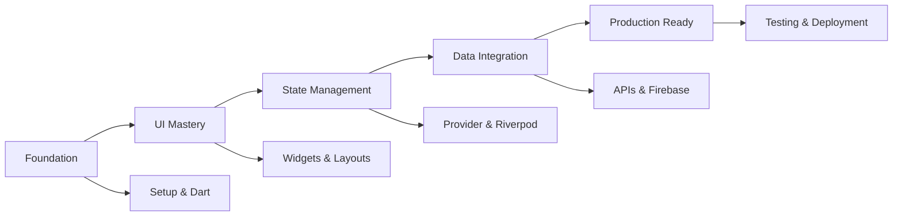

# 🎓 Flutter Masterclass: Complete Course Overview

## 🌟 Course Vision

**Transform absolute beginners into production-ready Flutter engineers through hands-on, real-world projects and modern development practices.**

This isn't just another tutorial series—it's a comprehensive builder's guide designed to create confident, competent Flutter developers who can build, test, and deploy professional mobile applications.

## 📊 Course Statistics

- **Duration**: 8-12 weeks (40+ hours of content)
- **Projects**: 6 major applications + 1 capstone project
- **Platforms**: iOS, Android, Web, Desktop
- **Technologies**: Flutter, Dart, Firebase, CI/CD, Testing
- **Skill Level**: Beginner to Expert
- **Industry Alignment**: 100% modern practices

## 🎯 Learning Outcomes

### **By Completion, Students Will:**

#### **Technical Mastery**
- ✅ Build production-quality Flutter applications
- ✅ Implement professional state management patterns
- ✅ Integrate with REST APIs and Firebase services
- ✅ Write comprehensive test suites (unit, widget, integration)
- ✅ Deploy apps to iOS App Store and Google Play Store
- ✅ Set up CI/CD pipelines for automated deployment

#### **Professional Skills**
- ✅ Follow industry best practices and coding standards
- ✅ Use professional development tools and workflows
- ✅ Debug complex issues efficiently
- ✅ Collaborate effectively using Git and code reviews
- ✅ Plan and architect scalable mobile applications
- ✅ Optimize apps for performance and user experience

#### **Career Readiness**
- ✅ Portfolio of 6+ complete applications
- ✅ Understanding of mobile development lifecycle
- ✅ Experience with modern development methodologies
- ✅ Confidence to tackle real-world development challenges
- ✅ Knowledge of Flutter ecosystem and community resources

## 🏗️ Course Architecture

### **Modular Design Philosophy**

Each lesson follows a consistent, proven structure:

```
lesson_x/
├── workshop_x.md       # Hands-on coding guide
├── concept.md          # Deep theoretical understanding
├── diagram.md          # Visual learning aids
└── README.md           # Quick navigation and overview
```

### **Progressive Skill Building**



### **Practical Application Focus**

Every concept is immediately applied in working applications:

| Phase | Project | Skills Learned |
|-------|---------|----------------|
| Foundation | Hello Flutter App | Environment, widgets, hot reload |
| UI Mastery | Profile Dashboard | Layouts, navigation, theming |
| State Management | Todo App | Provider, Riverpod, state patterns |
| Data Integration | News Reader | HTTP APIs, local storage, caching |
| Firebase | Chat Application | Authentication, Firestore, real-time |
| Production | E-commerce App | Testing, CI/CD, deployment |

## 📚 Detailed Course Breakdown

### **🟢 Phase 1: Foundation (Lessons 1-5)**
*Build confidence with Flutter fundamentals*

#### **Lesson 1: What is Flutter & Why Use It?**
- **Concepts**: Cross-platform development, Flutter ecosystem, architecture
- **Workshop**: First Flutter app, hot reload experience
- **Project**: Environment verification app
- **Duration**: 60 minutes

#### **Lesson 2: Development Environment Setup**
- **Concepts**: Professional tooling, productivity optimization
- **Workshop**: IDE configuration, emulators, debugging tools
- **Project**: Complete development environment
- **Duration**: 90 minutes

#### **Lesson 3: Dart Fundamentals**
- **Concepts**: Language syntax, null safety, OOP, async programming
- **Workshop**: Interactive Dart playground app
- **Project**: Comprehensive language reference
- **Duration**: 120 minutes

#### **Lesson 4: Widgets 101**
- **Concepts**: Widget tree, composition, StatelessWidget vs StatefulWidget
- **Workshop**: Interactive widget gallery application
- **Project**: Complete widget reference and explorer
- **Duration**: 90 minutes

#### **Lesson 5: Layouts & UI Composition**
- **Concepts**: Advanced constraint systems, responsive design, professional layout patterns
- **Workshop**: Advanced layout masterclass with multiple card styles
- **Project**: Professional profile card gallery with responsive design
- **Duration**: 90 minutes

### **🔵 Phase 2: UI Mastery (Lessons 6-9)**
*Create beautiful, responsive interfaces*

#### **Lesson 6: Navigation & Routing**
- **Concepts**: GoRouter, route guards, authentication integration, clean navigation architecture
- **Workshop**: Professional e-commerce navigation system with authentication
- **Project**: Complete multi-screen app with deep linking and route protection
- **Duration**: 90 minutes

#### **Lesson 7: Theming Your App**
- **Concepts**: Material 3 design system, dynamic colors, theme extensions, accessibility theming
- **Workshop**: Comprehensive theming system with clean architecture and user customization
- **Project**: Professional theme management with Material 3, dark/light modes, and accessibility features
- **Duration**: 90 minutes

#### **Lesson 8: Responsive Layouts**
- **Concepts**: Professional breakpoint systems, adaptive navigation patterns, responsive grid systems, clean architecture for responsive design
- **Workshop**: Comprehensive adaptive dashboard with mobile/tablet/desktop layouts
- **Project**: Multi-platform dashboard with adaptive navigation, responsive grids, and performance optimization
- **Duration**: 90 minutes

#### **Lesson 9: Flutter Animations**
- **Concepts**: Animation controllers, custom curves, hero animations, staggered sequences, physics-based motion, performance optimization
- **Workshop**: Comprehensive animated onboarding experience with coordinated animation sequences
- **Project**: Professional onboarding flow with hero transitions, micro-interactions, and 60fps performance
- **Duration**: 90 minutes

### **🟡 Phase 3: State Management (Lessons 10-15)**
*Master data flow and reactivity*

#### **Lesson 10: setState & Stateful Widgets**
- **Concepts**: Complete StatefulWidget lifecycle, setState patterns, state architecture, performance optimization, clean patterns, resource management
- **Workshop**: Comprehensive task management application with lifecycle monitoring and performance tracking
- **Project**: Professional task manager demonstrating all setState patterns with clean architecture and testing
- **Duration**: 75 minutes

#### **Lesson 11: InheritedWidget & Provider**
- **Concepts**: InheritedWidget fundamentals, Provider patterns, ChangeNotifier reactive state, dependency injection, context operations, performance optimization with Consumer/Selector
- **Workshop**: Comprehensive e-commerce shopping application with product catalog, cart management, and user profiles
- **Project**: Professional shopping app demonstrating shared state management from InheritedWidget to Provider with clean architecture
- **Duration**: 90 minutes

#### **Lesson 12: Riverpod 2.0 (Recommended)**
- **Concepts**: Advanced state management evolution, provider types (StateNotifier, Future, Stream), AsyncValue patterns, provider modifiers (autoDispose, family), compile-time safety, comprehensive testing with ProviderContainer
- **Workshop**: Production-ready todo application with cloud synchronization, real-time updates, advanced filtering, and optimistic updates
- **Project**: Comprehensive todo app demonstrating all Riverpod patterns with type safety, async excellence, and clean architecture
- **Duration**: 120 minutes

#### **Lesson 13: Bloc & Cubit**
- **Concepts**: Event-driven architecture, business logic separation, Bloc vs Cubit patterns, event handlers, state composition, auto-refresh, stream subscriptions, comprehensive testing with bloc_test
- **Workshop**: Professional weather application with location services, real-time updates, offline support, and Bloc-to-Bloc communication
- **Project**: Comprehensive weather app demonstrating advanced event-driven architecture with clean separation of business logic and comprehensive testing coverage
- **Duration**: 120 minutes

#### **Lesson 14: State Management Comparison**
- **Concepts**: Comprehensive pattern analysis, SCALE decision framework, performance benchmarking, migration strategies, team guidelines development, architectural decision making
- **Workshop**: Multi-pattern todo implementation, performance analysis laboratory, decision framework development, migration playground with systematic pattern transitions
- **Project**: Complete comparison analysis with performance benchmarks, interactive decision support system, and comprehensive team guidelines for architectural decisions
- **Duration**: 90 minutes

#### **Lesson 15: Mini Project - Auth + Theme App**
- **Concepts**: Hybrid state management architecture, strategic pattern integration, authentication system design, advanced theme management, clean architecture with multiple patterns, production-ready patterns, comprehensive testing strategies
- **Workshop**: Complete AuthFlow Pro application with strategic use of all four patterns - Bloc for authentication, Riverpod for theme management, Provider for user settings, setState for local UI state
- **Project**: Production-ready authentication and theme management system demonstrating hybrid architecture, cross-pattern communication, enterprise security, and comprehensive testing coverage
- **Duration**: 240 minutes

### **🟠 Phase 4: Data & Storage (Lessons 16-18)**
*Connect to APIs and persist data*

#### **Lesson 16: Networking with Dio & Retrofit**
- **Concepts**: Advanced Dio configuration with interceptors, Retrofit pattern implementation, comprehensive error handling strategies, intelligent caching and offline support, authentication integration with automatic token refresh, certificate pinning and security best practices, performance optimization and monitoring
- **Workshop**: Complete NewsFlow Pro application with professional networking architecture - advanced Dio setup with authentication, caching, retry, and logging interceptors, Retrofit pattern API services with type safety, repository pattern with offline-first capabilities, multi-level intelligent caching system
- **Project**: Production-ready news application demonstrating professional networking patterns, comprehensive error handling, intelligent offline support, secure authentication flows, performance optimization, and comprehensive testing coverage
- **Duration**: 270 minutes

#### **Lesson 17: Local Storage (Hive/SQLite)**
- **Concepts**: Comprehensive local storage patterns with dual backend implementation, Hive (NoSQL) vs SQLite (SQL) comparison and decision framework, clean architecture integration with repository pattern, offline-first design principles, data synchronization and conflict resolution, performance optimization and memory management, comprehensive testing strategies
- **Workshop**: Complete NoteMaster Pro application with dual storage backends - advanced Hive implementation with type adapters and lazy loading, comprehensive SQLite setup with complex queries and FTS, repository pattern with storage abstraction, advanced search and analytics, offline-first architecture with sync management
- **Project**: Production-ready note-taking application demonstrating both Hive and SQLite storage patterns, clean architecture with repository pattern, advanced features including categories, tags, full-text search, analytics, offline synchronization, and comprehensive testing coverage
- **Duration**: 300 minutes

#### **Lesson 18: Project - NewsHub Ultimate**
- **Concepts**: Complete data layer integration combining networking and storage, production-ready architecture with clean separation of concerns, advanced synchronization strategies with intelligent conflict resolution, performance optimization with multi-level caching, real-world features including search, bookmarks, and analytics, comprehensive testing across all integration layers
- **Workshop**: Complete NewsHub Ultimate application integrating all Phase 4 concepts - seamless combination of Dio networking with Hive/SQLite storage, intelligent sync service with offline queue management, advanced search with hybrid local/remote results, comprehensive bookmark management with organization features, production-ready error handling and performance monitoring
- **Project**: Production-ready news application demonstrating complete mastery of data integration patterns, advanced features including offline reading, intelligent search, smart bookmarks, user analytics, comprehensive testing coverage, and deployment-ready architecture
- **Duration**: 480 minutes

### **🔴 Phase 5: Firebase & Cloud (Lessons 19-21)**
*Build real-time, scalable applications*

#### **Lesson 19: Firebase Auth + Firestore**
- **Concepts**: Comprehensive Firebase ecosystem mastery with multi-provider authentication, real-time Firestore database operations, advanced security rules implementation, clean architecture integration with Firebase services, real-time data synchronization patterns, comprehensive error handling and offline support, testing strategies with Firebase emulators
- **Workshop**: Complete SocialHub Pro application with multi-provider authentication (email/password, Google, Apple, phone verification), real-time social features (posts, comments, likes, following), comprehensive Firestore integration with advanced querying, security rules with field-level permissions, clean architecture with repository pattern, real-time listeners and offline support
- **Project**: Production-ready social platform demonstrating Firebase Auth excellence, real-time Firestore database mastery, advanced security implementation, clean architecture patterns, comprehensive testing with emulators, and scalable real-time social features
- **Duration**: 540 minutes

#### **Lesson 20: Cloud Functions + Push Notifications**
- **Concepts**: Comprehensive serverless backend mastery with Cloud Functions, Firebase Cloud Messaging (FCM) integration for cross-platform push notifications, event-driven architecture with Firestore triggers, background processing for automation and analytics, intelligent notification targeting and personalization, performance optimization for serverless functions, comprehensive testing with Firebase emulators
- **Workshop**: Enhanced SocialHub Pro with Cloud Functions backend - serverless functions for social interactions (posts, likes, comments, follows), FCM integration with rich notifications and targeting, background processing for content moderation and analytics, automated social notifications with template engine, event-driven architecture responding to database changes, comprehensive testing with emulator suite
- **Project**: Production-ready social platform with intelligent serverless backend demonstrating Cloud Functions excellence, comprehensive push notification system with FCM, automated background processing for content and analytics, event-driven architecture with real-time responses, performance optimization and monitoring, comprehensive testing strategies for serverless applications
- **Duration**: 600 minutes

#### **Lesson 21: Project - Chat/Social Feed App**
- **Concepts**: Real-time features, cloud integration
- **Workshop**: Complete social application
- **Project**: Production social features
- **Duration**: 180 minutes

### **🟣 Phase 6: Production Ready (Lessons 22-26)**
*Test, deploy, and maintain professional apps*

#### **Lesson 22: Unit & Widget Testing**
- **Concepts**: Test-driven development, mocking, coverage
- **Workshop**: Comprehensive test suite
- **Project**: Full test coverage setup
- **Duration**: 75 minutes

#### **Lesson 23: Integration Testing + Mocking**
- **Concepts**: End-to-end testing, test automation
- **Workshop**: Complete testing pipeline
- **Project**: Automated test suite
- **Duration**: 90 minutes

#### **Lesson 24: Error Handling & Logging**
- **Concepts**: Production monitoring, crash reporting
- **Workshop**: Error tracking setup
- **Project**: Production monitoring system
- **Duration**: 60 minutes

#### **Lesson 25: CI/CD with GitHub Actions**
- **Concepts**: Automated deployment, build pipelines
- **Workshop**: Complete CI/CD setup
- **Project**: Automated deployment pipeline
- **Duration**: 90 minutes

#### **Lesson 26: Publishing to App Stores**
- **Concepts**: Store submission, review process, maintenance
- **Workshop**: App store deployment
- **Project**: Published application
- **Duration**: 60 minutes

## 🎯 Target Audiences

### **Primary Learners**
- **Complete Beginners** - No mobile development experience required
- **Career Changers** - Moving into mobile development
- **Bootcamp Students** - Structured learning environment
- **Self-taught Developers** - Looking for comprehensive curriculum

### **Secondary Learners**
- **Native Developers** - Android/iOS devs learning cross-platform
- **Web Developers** - Expanding to mobile platforms
- **Backend Developers** - Adding frontend mobile skills
- **Computer Science Students** - Academic supplement

### **Professional Use Cases**
- **Corporate Training** - Team onboarding and upskilling
- **University Courses** - Semester-long mobile development course
- **Coding Bootcamps** - Complete mobile development track
- **Self-Paced Learning** - Individual skill development

## 🏆 Success Metrics

### **Student Progress Indicators**

#### **Phase Completion Rates**
- **Phase 1**: 95% completion (foundation is critical)
- **Phase 2**: 90% completion (UI skills build confidence)
- **Phase 3**: 85% completion (state management complexity)
- **Phase 4**: 80% completion (integration challenges)
- **Phase 5**: 75% completion (cloud complexity)
- **Phase 6**: 70% completion (production readiness)

#### **Skill Assessment Checkpoints**
```
Week 2: ✅ Can build basic Flutter UIs
Week 4: ✅ Can implement navigation and theming
Week 6: ✅ Can manage complex application state
Week 8: ✅ Can integrate with APIs and databases
Week 10: ✅ Can deploy production applications
Week 12: ✅ Can architect and build complete mobile solutions
```

### **Project Portfolio Development**

Students will have a complete portfolio demonstrating:

1. **Technical Range** - Multiple app types and complexity levels
2. **Platform Coverage** - iOS, Android, Web deployment experience
3. **Modern Practices** - Testing, CI/CD, performance optimization
4. **Real-world Skills** - API integration, authentication, data persistence

## 🛠️ Implementation Guidelines

### **For Instructors**

#### **Preparation Requirements**
- **Technical Setup**: Complete development environment (all platforms)
- **Content Familiarity**: Pre-run all workshops and projects
- **Time Allocation**: 2 hours prep per 1 hour instruction
- **Platform Access**: Firebase project, GitHub organization, CI/CD tools

#### **Teaching Methodology**
1. **Live Coding** - Demonstrate concepts in real-time
2. **Guided Practice** - Students follow along with workshops
3. **Independent Practice** - Students complete challenges alone
4. **Code Review** - Regular feedback on student implementations
5. **Project Showcase** - Students present completed applications

#### **Common Student Challenges**
- **Environment Setup** - Dedicate extra time to Lesson 2
- **Null Safety** - Requires practice and repetition
- **State Management** - Abstract concepts need concrete examples
- **Async Programming** - Visual aids and debugging help understanding
- **Testing** - Often undervalued, emphasize real-world importance

### **For Self-Learners**

#### **Study Schedule Recommendations**
```
Part-Time (10 hours/week):
├── Week 1-2: Foundation (Lessons 1-5)
├── Week 3-4: UI Mastery (Lessons 6-9)
├── Week 5-6: State Management (Lessons 10-15)
├── Week 7-8: Data Integration (Lessons 16-18)
├── Week 9-10: Firebase & Cloud (Lessons 19-21)
└── Week 11-12: Production Ready (Lessons 22-26)

Full-Time (40 hours/week):
├── Week 1: Foundation + UI Mastery
├── Week 2: State Management + Data
└── Week 3: Cloud + Production
```

#### **Success Strategies**
1. **Consistent Practice** - Code daily, even if just 30 minutes
2. **Project-First Learning** - Focus on building working applications
3. **Community Engagement** - Join Flutter Discord, attend meetups
4. **Portfolio Development** - Document and showcase your projects
5. **Continuous Learning** - Flutter ecosystem evolves rapidly

## 🔄 Maintenance & Updates

### **Content Refresh Schedule**
- **Monthly**: Bug fixes, minor improvements
- **Quarterly**: New Flutter release adaptations
- **Annually**: Major content refresh, new projects

### **Community Contributions**
- **Issues & Feedback** - GitHub issue tracking
- **Content Improvements** - Pull request process
- **New Examples** - Community-contributed workshops
- **Translation** - Multi-language support

## 🎉 Course Completion Recognition

### **Digital Credentials**
Students receive:
- **Completion Certificate** - Official course completion recognition
- **Skill Badges** - Individual competency recognition
- **Portfolio Showcase** - Curated project demonstrations
- **LinkedIn Endorsement** - Professional platform recognition

### **Career Support**
- **Interview Preparation** - Technical interview guidance
- **Resume Enhancement** - Flutter skill presentation
- **Job Board Access** - Flutter-specific opportunities
- **Mentorship Network** - Connection with Flutter professionals

---

## 🚀 Ready to Transform Careers?

This Flutter Masterclass represents **the gold standard** for mobile development education. It combines:

- ✅ **Proven pedagogy** with hands-on learning
- ✅ **Industry relevance** with modern practices  
- ✅ **Complete coverage** from basics to production
- ✅ **Real projects** that demonstrate capability
- ✅ **Career preparation** for professional success

Whether you're an **individual learner** seeking to change careers, an **instructor** looking for comprehensive curriculum, or a **company** training your development team, this course provides the **complete pathway** from Flutter novice to expert mobile engineer.

**Start building the future of mobile development today! 🎯**