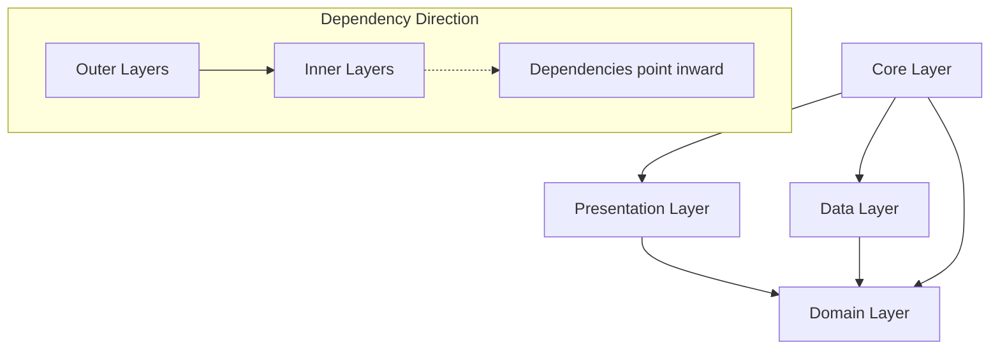

# 🏗️ Clean Architecture Flutter: Lesson 5 Refactored

## 🎯 **Clean Architecture Implementation**

This directory contains a **completely refactored version** of Lesson 5 following **Clean Architecture principles**. This demonstrates how to structure professional Flutter applications for maintainability, testability, and scalability.

## 🚨 **Why Clean Architecture?**

### **❌ Problems with Original Approach:**
- **🗂️ Monolithic Files** - 1,391 lines in a single main.dart file
- **🔄 Mixed Concerns** - UI, business logic, and data all in one place
- **🧪 Hard to Test** - Tightly coupled code with no separation
- **📊 Data in UI** - Hardcoded data mixed with presentation logic
- **🔗 Tight Coupling** - Components depend directly on concrete implementations
- **📱 No Reusability** - Code specific to each lesson without scalable patterns

### **✅ Clean Architecture Benefits:**
- **🎯 Separation of Concerns** - Each layer has a single responsibility
- **🧪 Highly Testable** - Easy to unit test business logic
- **🔄 Maintainable** - Changes in one layer don't affect others
- **🔌 Dependency Inversion** - High-level modules don't depend on low-level modules
- **📈 Scalable** - Easy to add new features and modify existing ones
- **🔁 Reusable** - Components can be reused across different parts of the app

## 🏗️ **Architecture Overview**

```
lib/
├── core/                    # 🔧 Shared utilities and configuration
│   ├── constants/          # App-wide constants and configurations
│   ├── theme/              # Theme and styling definitions
│   └── utils/              # Utility classes and helper functions
├── data/                   # 📊 Data layer - External concerns
│   ├── datasources/        # Data sources (API, Local DB, etc.)
│   ├── models/             # Data models for serialization
│   └── repositories/       # Repository implementations
├── domain/                 # 🎯 Domain layer - Business rules
│   ├── entities/           # Business entities (pure Dart objects)
│   ├── repositories/       # Repository interfaces
│   └── usecases/           # Business use cases
├── presentation/           # 🎨 Presentation layer - UI concerns
│   ├── controllers/        # UI state management
│   ├── screens/            # Full screen widgets
│   └── widgets/            # Reusable UI components
└── main.dart               # 🚀 Application entry point
```

## 📚 **Layer Breakdown**

### **🔧 Core Layer**
Contains shared utilities and configurations used across all layers.

#### **📁 Files:**
- `constants/app_constants.dart` - Design system tokens, breakpoints, animations
- `theme/app_theme.dart` - Material 3 theme configuration
- `utils/spacing.dart` - Consistent spacing utilities and widgets
- `utils/responsive.dart` - Responsive design utilities and breakpoints

#### **🎯 Purpose:**
- Provides consistent design system across the app
- Centralizes configuration and constants
- Offers reusable utility functions

### **🎯 Domain Layer** (Business Logic)
The heart of the application containing business rules and entities.

#### **📁 Files:**
- `entities/business_card.dart` - Core business card entity with validation
- `entities/social_profile.dart` - Social profile entity with business rules
- `repositories/business_card_repository.dart` - Repository interface contracts
- `usecases/get_business_cards_usecase.dart` - Business use cases

#### **🎯 Purpose:**
- Defines business entities and rules
- Contains use cases that orchestrate business logic
- Provides repository interfaces (dependency inversion)
- Independent of frameworks and external concerns

### **📊 Data Layer** (Infrastructure)
Handles data operations and external dependencies.

#### **📁 Files:**
- `models/business_card_model.dart` - Data model with JSON serialization
- `datasources/business_card_datasource.dart` - Data source interfaces and implementations
- `repositories/business_card_repository_impl.dart` - Repository implementation

#### **🎯 Purpose:**
- Implements repository interfaces from domain layer
- Handles data serialization/deserialization
- Manages different data sources (local, remote, cache)
- Abstracts external dependencies

### **🎨 Presentation Layer** (UI)
Manages UI state and user interactions.

#### **📁 Files:**
- `controllers/business_cards_controller.dart` - State management with ChangeNotifier
- `screens/profile_gallery_screen.dart` - Main application screen
- `widgets/business_cards_tab.dart` - Business cards display with filtering
- `widgets/business_card_widget.dart` - Reusable business card component
- `widgets/loading_widget.dart` - Reusable loading indicator
- `widgets/error_widget.dart` - Reusable error display
- `widgets/layout_analysis_sheet.dart` - Educational analysis component

#### **🎯 Purpose:**
- Manages UI state and user interactions
- Coordinates between UI and business logic
- Provides reusable UI components
- Handles user input and navigation

## 🔄 **Dependency Flow**



### **Key Principles:**
1. **📥 Dependencies point inward** - Outer layers depend on inner layers
2. **🚫 Inner layers are independent** - Domain layer has no external dependencies
3. **🔌 Interfaces define contracts** - Dependency inversion through abstractions
4. **🎯 Single Responsibility** - Each layer has one reason to change

## 💡 **Key Design Patterns**

### **🏭 Repository Pattern**
```dart
// Domain layer defines the interface
abstract class BusinessCardRepository {
  Future<List<BusinessCard>> getAllBusinessCards();
  Future<BusinessCard?> getBusinessCardById(String id);
  // ... more methods
}

// Data layer implements the interface
class BusinessCardRepositoryImpl implements BusinessCardRepository {
  final BusinessCardDataSource _dataSource;
  
  @override
  Future<List<BusinessCard>> getAllBusinessCards() async {
    final models = await _dataSource.getAllBusinessCards();
    return models.map((model) => model.toEntity()).toList();
  }
}
```

### **🎯 Use Case Pattern**
```dart
class GetBusinessCardsUseCase {
  final BusinessCardRepository _repository;
  
  Future<GetBusinessCardsResult> getAllCards() async {
    try {
      final cards = await _repository.getAllBusinessCards();
      return GetBusinessCardsResult.success(cards);
    } catch (e) {
      return GetBusinessCardsResult.failure(e.toString());
    }
  }
}
```

### **🎨 MVVM Pattern (Presentation)**
```dart
class BusinessCardsController extends ChangeNotifier {
  final GetBusinessCardsUseCase _getBusinessCardsUseCase;
  
  List<BusinessCard> _businessCards = [];
  bool _isLoading = false;
  
  Future<void> loadBusinessCards() async {
    _isLoading = true;
    notifyListeners();
    
    final result = await _getBusinessCardsUseCase.getAllCards();
    
    if (result.isSuccess) {
      _businessCards = result.cards!;
    }
    
    _isLoading = false;
    notifyListeners();
  }
}
```

### **🏗️ Factory Pattern**
```dart
class BusinessCardFactory {
  static BusinessCard create({
    required String name,
    required String title,
    // ... other parameters
  }) {
    return BusinessCard(
      id: _generateId(),
      name: name,
      title: title,
      // ... other fields
    );
  }
}
```

## 🧪 **Testing Strategy**

### **Domain Layer Testing**
```dart
// Pure unit tests - no external dependencies
test('should create valid business card', () {
  final card = BusinessCard(
    id: '1',
    name: 'John Doe',
    // ... other fields
  );
  
  expect(card.isValid, true);
  expect(card.initials, 'JD');
});
```

### **Use Case Testing**
```dart
// Test business logic with mocked dependencies
test('should return business cards when repository succeeds', () async {
  // Arrange
  final mockRepository = MockBusinessCardRepository();
  final useCase = GetBusinessCardsUseCase(mockRepository);
  
  when(mockRepository.getAllBusinessCards())
      .thenAnswer((_) async => [testBusinessCard]);
  
  // Act
  final result = await useCase.getAllCards();
  
  // Assert
  expect(result.isSuccess, true);
  expect(result.cards, hasLength(1));
});
```

### **Controller Testing**
```dart
// Test presentation logic
test('should load business cards and update state', () async {
  // Arrange
  final mockUseCase = MockGetBusinessCardsUseCase();
  final controller = BusinessCardsController(mockUseCase);
  
  when(mockUseCase.getAllCards())
      .thenAnswer((_) async => GetBusinessCardsResult.success([testCard]));
  
  // Act
  await controller.loadBusinessCards();
  
  // Assert
  expect(controller.businessCards, hasLength(1));
  expect(controller.isLoading, false);
});
```

## 🎨 **Design System Implementation**

### **🎨 Token-Based Design**
```dart
class AppConstants {
  // Spacing scale (4pt grid system)
  static const double spaceXs = 4.0;
  static const double spaceSm = 8.0;
  static const double spaceMd = 12.0;
  // ...
  
  // Border radius scale
  static const double radiusXs = 2.0;
  static const double radiusSm = 4.0;
  // ...
  
  // Breakpoints for responsive design
  static const double breakpointMobile = 480.0;
  static const double breakpointTablet = 768.0;
  // ...
}
```

### **🎯 Responsive Utilities**
```dart
class ResponsiveUtils {
  static int getGridColumns(BuildContext context, {
    int mobile = 1,
    int tablet = 2,
    int desktop = 3,
  }) {
    switch (getScreenSize(context)) {
      case ScreenSize.mobile: return mobile;
      case ScreenSize.tablet: return tablet;
      case ScreenSize.desktop: return desktop;
    }
  }
}
```

### **📏 Spacing Utilities**
```dart
class Spacing {
  static const Widget verticalXs = SizedBox(height: AppConstants.spaceXs);
  static const Widget verticalSm = SizedBox(height: AppConstants.spaceSm);
  // ...
  
  static Widget responsiveVertical(BuildContext context, {
    double mobile = AppConstants.spaceLg,
    double tablet = AppConstants.spaceXl,
  }) {
    // Returns appropriate spacing based on screen size
  }
}
```

## 🚀 **Running the Application**

### **Prerequisites**
```bash
# Ensure Flutter is installed
flutter --version

# Ensure compatible version
# Flutter >=3.10.0
# Dart >=3.0.0
```

### **Setup**
```bash
# Navigate to the clean architecture directory
cd class/answer/lesson_05_clean

# Get dependencies
flutter pub get

# Run the application
flutter run
```

### **Dependencies**
```yaml
dependencies:
  flutter:
    sdk: flutter
  provider: ^6.1.1      # State management
  equatable: ^2.0.5     # Value equality
  cupertino_icons: ^1.0.6
```

## 📈 **Benefits Demonstrated**

### **✅ Maintainability**
- **Single Responsibility** - Each class has one reason to change
- **Dependency Inversion** - Easy to swap implementations
- **Modular Structure** - Changes isolated to specific layers

### **✅ Testability**
- **Pure Domain Logic** - Easy to unit test business rules
- **Mocked Dependencies** - Can test each layer in isolation
- **Clear Interfaces** - Easy to create test doubles

### **✅ Scalability**
- **Layer Independence** - Can add features without affecting other layers
- **Repository Pattern** - Easy to add new data sources
- **Use Case Pattern** - Easy to add new business operations

### **✅ Code Quality**
- **SOLID Principles** - Follows all five SOLID principles
- **Design Patterns** - Uses proven architectural patterns
- **Type Safety** - Strong typing throughout the application

## 🎓 **Learning Outcomes**

### **Architecture Understanding**
- ✅ **Clean Architecture principles** and layer responsibilities
- ✅ **Dependency inversion** and interface-based design
- ✅ **Separation of concerns** across different layers
- ✅ **SOLID principles** in practical application

### **Flutter Best Practices**
- ✅ **Proper project structure** for large applications
- ✅ **State management** with Provider and ChangeNotifier
- ✅ **Repository pattern** for data access abstraction
- ✅ **Use case pattern** for business logic encapsulation

### **Professional Development**
- ✅ **Testable code** structure and practices
- ✅ **Design system** implementation and consistency
- ✅ **Responsive design** patterns and utilities
- ✅ **Code organization** for team collaboration

## 🔮 **Further Enhancements**

### **Advanced Patterns**
- **BLoC Pattern** - Event-driven state management
- **GetIt** - Service locator for dependency injection
- **Freezed** - Immutable data classes with code generation
- **Auto Route** - Type-safe route generation

### **Testing Improvements**
- **Widget Testing** - Test UI components in isolation
- **Integration Testing** - Test complete user flows
- **Golden Testing** - Visual regression testing
- **Code Coverage** - Ensure comprehensive test coverage

### **Performance Optimizations**
- **Riverpod** - More performant state management
- **Image Caching** - Efficient image loading and caching
- **Lazy Loading** - Load data only when needed
- **Memory Management** - Proper disposal of resources

## 🎯 **Key Takeaways**

### **Professional Flutter Development**
1. **Architecture First** - Plan your architecture before writing code
2. **Layer Separation** - Keep business logic separate from UI
3. **Interface-Based Design** - Program to interfaces, not implementations
4. **Testing Strategy** - Design for testability from the beginning
5. **Consistency** - Use design systems and consistent patterns

### **Clean Architecture Benefits**
1. **Maintainable** - Easy to modify and extend
2. **Testable** - Each layer can be tested independently
3. **Scalable** - Can grow with your application needs
4. **Team-Friendly** - Clear structure for team collaboration
5. **Future-Proof** - Easy to adapt to changing requirements

## 🌟 **Excellence Achieved**

This clean architecture implementation demonstrates:

- **✅ Professional Structure** - Industry-standard architecture patterns
- **✅ Best Practices** - SOLID principles and design patterns
- **✅ Maintainable Code** - Clear separation of concerns
- **✅ Testable Design** - Easy to unit test and mock dependencies
- **✅ Scalable Foundation** - Ready for complex feature development

**This is how professional Flutter applications should be structured for real-world development! 🚀**

---

**📚 Study Guide**: Compare this clean architecture implementation with the original monolithic version to understand the dramatic improvements in code organization, testability, and maintainability. This represents the difference between hobbyist and professional Flutter development.