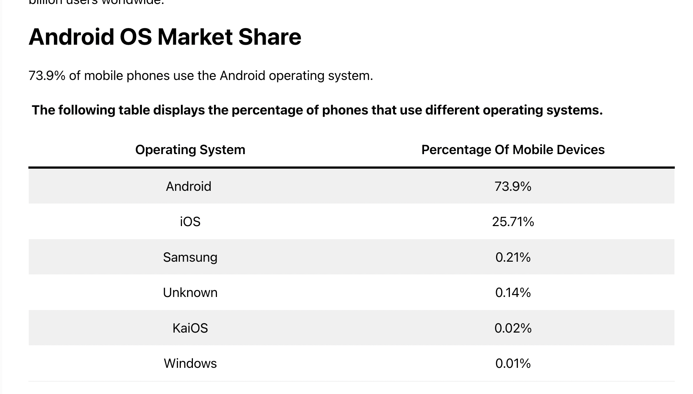

# 🚀 Concepts

## 🎯 **Learning Objectives**

By the end of this lesson, you will understand:
- **🌟 What Flutter is** and why it's revolutionary for mobile development
- **🏗️ Flutter Architecture** and how it differs from other frameworks
- **🎨 Widget-Based UI** and the composition over inheritance approach
- **⚡ Hot Reload** and how it transforms the development experience
- **📱 Cross-Platform Development** and code reuse strategies
- **🔧 Development Workflow** from setup to app store deployment

## 📚 **What is Flutter?**

Flutter is **Google's UI toolkit** for building natively compiled applications for mobile, web, desktop, and embedded devices from a single codebase. It represents a paradigm shift in how we think about cross-platform development.



Flutter follows these fundamental principles:
- **Everything is a Widget** - UI components, layouts, animations, gestures
- **Composition over Inheritance** - Build complex UIs by combining simple widgets
- **Reactive Programming** - UI automatically updates when data changes
- **Single Codebase** - Write once, run everywhere with native performance

### **🌟 Why Flutter is Revolutionary**

#### **1. True Native Performance**
```
Traditional Cross-Platform:
JavaScript ➜ Bridge ➜ Native Components
(Performance bottleneck at bridge)

Flutter:
Dart ➜ Compiled to Native ARM Code
(Direct native execution, no bridge)
```

#### **2. Consistent UI Across Platforms**
Unlike other frameworks that rely on platform-specific UI components, Flutter draws its own UI, ensuring **pixel-perfect consistency** across all platforms.

#### **3. Hot Reload Development Experience**
```
Traditional Development Cycle:
Edit ➜ Compile ➜ Deploy ➜ Navigate ➜ Test
(30 seconds to 2 minutes per iteration)

Flutter Development Cycle:
Edit ➜ Hot Reload ➜ Test
(Sub-second iteration cycles)
```

## 🏗️ **Flutter Architecture Deep Dive**

### **The Flutter Framework Stack**

```
┌─────────────────────────────────────┐
│          Your Flutter App           │ ← Your Code
├─────────────────────────────────────┤
│        Material & Cupertino         │ ← Design Languages
├─────────────────────────────────────┤
│           Widgets Layer             │ ← UI Components
├─────────────────────────────────────┤
│          Rendering Layer            │ ← Layout & Painting
├─────────────────────────────────────┤
│           Dart Platform             │ ← Language Runtime
├─────────────────────────────────────┤
│          Flutter Engine             │ ← Core C++ Engine
├─────────────────────────────────────┤
│    Platform-Specific Embedder       │ ← OS Integration
└─────────────────────────────────────┘
```

### **🎨 Widget-Based Architecture**

Everything in Flutter is a widget, organized in a tree structure:

```dart
// Widget tree example
MaterialApp(                    // Root widget
  home: Scaffold(              // Structure widget
    appBar: AppBar(            // UI component widget
      title: Text('My App'),   // Content widget
    ),
    body: Column(              // Layout widget
      children: [
        Container(             // Container widget
          child: Text('Hello'), // Content widget
        ),
        ElevatedButton(        // Interactive widget
          onPressed: () {},    // Behavior
          child: Text('Tap'),  // Content
        ),
      ],
    ),
  ),
)
```

### **🔄 Widget Lifecycle & State Management**

Flutter widgets come in two main types:

#### **StatelessWidget - Immutable UI Components**
```dart
class GreetingWidget extends StatelessWidget {
  final String name;
  
  const GreetingWidget({Key? key, required this.name}) : super(key: key);
  
  @override
  Widget build(BuildContext context) {
    return Text('Hello, $name!');
  }
}
```

**Characteristics:**
- Immutable - cannot change after creation
- No internal state management
- Perfect for static UI components
- Optimized performance due to immutability

#### **StatefulWidget - Dynamic UI Components**
```dart
class CounterWidget extends StatefulWidget {
  @override
  _CounterWidgetState createState() => _CounterWidgetState();
}

class _CounterWidgetState extends State<CounterWidget> {
  int _counter = 0;
  
  void _incrementCounter() {
    setState(() {
      _counter++;
    });
  }
  
  @override
  Widget build(BuildContext context) {
    return Column(
      children: [
        Text('Count: $_counter'),
        ElevatedButton(
          onPressed: _incrementCounter,
          child: Text('Increment'),
        ),
      ],
    );
  }
}
```

**Characteristics:**
- Mutable - can change over time
- Internal state management with `setState()`
- Perfect for interactive UI components
- Automatic UI updates when state changes

## ⚡ **Hot Reload: The Game Changer**

Hot Reload is Flutter's **secret weapon** for developer productivity:

### **How Hot Reload Works**

```
1. Developer saves file
2. Flutter detects changes
3. Injects updated code into running Dart VM
4. Rebuilds widget tree with new code
5. Preserves application state
6. Updates UI in <1 second
```

### **What Hot Reload Can Do**
- ✅ Update UI layouts and styling
- ✅ Add new widgets and components
- ✅ Modify widget properties and parameters
- ✅ Change colors, fonts, and themes
- ✅ Update business logic in build methods
- ✅ Preserve application state and navigation

### **What Requires Hot Restart**
- ❌ Changes to `main()` function
- ❌ Global variable initializers
- ❌ Static field initializers
- ❌ Adding new dependencies
- ❌ Changing app configuration

### **Development Workflow Impact**

```
Before Hot Reload:
┌─ Edit Code ─┐    ┌─ Compile ─┐    ┌─ Deploy ─┐    ┌─ Navigate ─┐    ┌─ Test ─┐
│   30s       │    │   60s     │    │   15s    │    │    10s    │    │   5s   │
└─────────────┘    └───────────┘    └──────────┘    └───────────┘    └────────┘
Total: ~2 minutes per iteration

With Hot Reload:
┌─ Edit Code ─┐    ┌─ Hot Reload ─┐    ┌─ Test ─┐
│   30s       │    │    <1s       │    │   5s   │
└─────────────┘    └──────────────┘    └────────┘
Total: ~35 seconds per iteration

Productivity Increase: 300-400%
```

## 📱 **Cross-Platform Excellence**

### **Single Codebase, Multiple Platforms**

Flutter enables true code reuse across platforms:

```dart
// One codebase runs on:
class MyApp extends StatelessWidget {
  @override
  Widget build(BuildContext context) {
    return MaterialApp(
      home: Scaffold(
        appBar: AppBar(title: Text('Cross-Platform App')),
        body: Center(
          child: Column(
            mainAxisAlignment: MainAxisAlignment.center,
            children: [
              Text('Running on: ${Platform.operatingSystem}'),
              ElevatedButton(
                onPressed: () => print('Hello from Flutter!'),
                child: Text('Tap me!'),
              ),
            ],
          ),
        ),
      ),
    );
  }
}

// This same code runs natively on:
// 📱 iOS (iPhone, iPad)
// 🤖 Android (phones, tablets)
// 🌐 Web (Chrome, Firefox, Safari, Edge)
// 🖥️ Desktop (Windows, macOS, Linux)
// 🚗 Embedded (automotive, IoT devices)
```

### **Platform-Specific Adaptations**

Flutter allows platform-specific customizations when needed:

```dart
// Adaptive design patterns
Widget buildAppBar() {
  if (Platform.isIOS) {
    return CupertinoNavigationBar(
      middle: Text('iOS Style'),
    );
  } else {
    return AppBar(
      title: Text('Android Style'),
    );
  }
}

// Or use adaptive widgets
Widget buildButton() {
  return Platform.isIOS 
    ? CupertinoButton(
        child: Text('iOS Button'),
        onPressed: () {},
      )
    : ElevatedButton(
        child: Text('Material Button'),
        onPressed: () {},
      );
}
```

## 🎨 **Design System Integration**

Flutter provides two comprehensive design systems:

### **Material Design (Google)**
```dart
// Material Design components
MaterialApp(
  theme: ThemeData(
    primarySwatch: Colors.blue,
    visualDensity: VisualDensity.adaptivePlatformDensity,
  ),
  home: Scaffold(
    appBar: AppBar(title: Text('Material Design')),
    body: Column(
      children: [
        Card(
          child: ListTile(
            leading: Icon(Icons.person),
            title: Text('Material List Item'),
            trailing: Icon(Icons.arrow_forward),
          ),
        ),
        FloatingActionButton(
          onPressed: () {},
          child: Icon(Icons.add),
        ),
      ],
    ),
  ),
)
```

### **Cupertino Design (Apple)**
```dart
// Cupertino (iOS) design components
CupertinoApp(
  theme: CupertinoThemeData(
    primaryColor: CupertinoColors.systemBlue,
  ),
  home: CupertinoPageScaffold(
    navigationBar: CupertinoNavigationBar(
      middle: Text('Cupertino Design'),
    ),
    child: Column(
      children: [
        CupertinoListTile(
          leading: Icon(CupertinoIcons.person),
          title: Text('iOS List Item'),
          trailing: Icon(CupertinoIcons.arrow_right),
        ),
        CupertinoButton.filled(
          onPressed: () {},
          child: Text('iOS Button'),
        ),
      ],
    ),
  ),
)
```

## 🔧 **Development Workflow & Tooling**

### **Flutter CLI - Command Line Power**

Flutter provides a comprehensive CLI for all development tasks:

```bash
# Project management
flutter create my_app          # Create new project
flutter analyze               # Code analysis
flutter test                  # Run tests
flutter format               # Format code

# Development
flutter run                   # Run app in debug mode
flutter run --release        # Run in release mode
flutter run -d chrome        # Run on web browser
flutter devices              # List available devices

# Building & Deployment
flutter build apk            # Build Android APK
flutter build ios            # Build iOS app
flutter build web            # Build web app
flutter build windows        # Build Windows app

# Package management
flutter pub get              # Get dependencies
flutter pub upgrade          # Upgrade packages
flutter pub publish          # Publish package
```

### **IDE Integration**

Flutter works seamlessly with multiple IDEs:

#### **Visual Studio Code**
- Lightweight and fast
- Excellent Dart/Flutter extensions
- Integrated debugging and hot reload
- Git integration and extensions ecosystem

#### **Android Studio / IntelliJ**
- Full-featured IDE
- Advanced debugging capabilities
- Built-in Android emulator
- Comprehensive project management

#### **Essential Features Across IDEs**
- **Syntax Highlighting** - Dart language support
- **Code Completion** - Intelligent autocomplete
- **Hot Reload** - One-click UI updates
- **Widget Inspector** - Visual widget tree exploration
- **Debugging** - Breakpoints, variable inspection, call stack
- **Testing** - Integrated test runner and coverage

### **Flutter DevTools**

Professional debugging and profiling suite:

```dart
// DevTools provides:
class FlutterDevTools {
  static const features = [
    'Widget Inspector',      // Visual widget tree exploration
    'Timeline View',         // Performance profiling
    'Memory View',          // Memory usage analysis
    'Network View',         // HTTP request monitoring
    'Logging View',         // Console and debug output
    'App Size Tool',        // Bundle size analysis
  ];
}
```

## 🌍 **Flutter Ecosystem**

### **Package Repository (pub.dev)**

Flutter's package ecosystem provides thousands of ready-to-use packages:

```yaml
# pubspec.yaml - Package management
dependencies:
  flutter:
    sdk: flutter
  
  # Popular packages
  http: ^0.13.5              # HTTP networking
  provider: ^6.0.3           # State management
  shared_preferences: ^2.0.15 # Local storage
  cached_network_image: ^3.2.1 # Image caching
  firebase_core: ^2.1.1      # Firebase integration
  google_fonts: ^3.0.1       # Google Fonts
  animations: ^2.0.7         # Advanced animations
```

### **Popular Package Categories**

#### **State Management**
- **Provider** - Simple and flexible state management
- **Riverpod** - Compile-safe Provider with advanced features
- **Bloc** - Business Logic Component pattern
- **GetX** - High-performance state management

#### **UI Components**
- **Flutter Staggered Grid View** - Pinterest-style grids
- **Carousel Slider** - Image carousels and sliders
- **Shimmer** - Loading skeleton animations
- **Lottie** - After Effects animations

#### **Networking & Data**
- **Dio** - Powerful HTTP client
- **Retrofit** - Type-safe HTTP client
- **Hive** - Lightweight NoSQL database
- **Sqflite** - SQLite database

#### **Platform Integration**
- **Camera** - Camera access and image capture
- **Geolocator** - GPS and location services
- **Permission Handler** - Runtime permission management
- **Device Info** - Device information access

# 🟦 Why Flutter?

## 1. 🌍 The Mobile World: iOS & Android
- **iOS (Apple)** → controlled ecosystem, premium user base, polished UI standards.
- **Android (Google)** → dominant market share globally, diverse devices, fragmented ecosystem.
- **The challenge** → building for both platforms usually means **double the work**  
  (Swift/Objective-C for iOS, Kotlin/Java for Android).

---

## 2. 💡 Enter Flutter
- Open-source UI toolkit by **Google**.
- Goal: *“Write once, run anywhere”* for mobile (and now desktop & web).
- Uses **Dart language** (optimized for UI, fast compile times).
- Renders its own **UI engine (Skia)** → doesn’t rely on native UI widgets.

---

## 3. 🚀 Key Superpowers of Flutter
- **Hot Reload** → see code changes instantly, without restarting the app.
- **Single Codebase** → one project for iOS + Android (plus web & desktop).
- **Custom UI freedom** → Flutter draws pixels directly → highly branded, unique designs.
- **Performance** → near-native speed, not just a web wrapper.
- **Growing ecosystem** → huge package library on [pub.dev](https://pub.dev).

---

## 4. 👍 What Makes Flutter Good (vs Others)
- **Faster dev cycle** → thanks to hot reload.
- **Consistent UI** → looks the same across iOS and Android.
- **Community & support** → backed by Google + strong open-source community.
- **Future-ready** → expanding to **Web, Desktop, and embedded devices**.

---

## 5. ⚔️ Competitors & Alternatives
### React Native (Meta/Facebook)
- JavaScript + React.
- Leverages native components.
- Larger ecosystem, but may suffer from performance issues & dependency chaos.

### Xamarin / .NET MAUI (Microsoft)
- Uses **C#**, tightly integrated with Microsoft ecosystem.
- Great for enterprises, less popular in startups.

### Native Development
- Best performance, full platform control.
- But → **2 codebases = 2x cost**, slower time-to-market.

### Others
- **Ionic** (web tech)
- **Kotlin Multiplatform**
- And more...

---

## 6. 🏆 Why Flutter Stands Out
- **Speed of iteration** (hot reload + single codebase).
- **High performance** (compiled, not interpreted like JS).
- **Pixel-perfect UI** across devices.
- Backed by **Google** + trusted by big companies  
  (*Alibaba, eBay, BMW, Toyota, etc.*).

---

## 7. 📌 Summary
- **World** = iOS + Android split.
- **Pain** = double work, inconsistent experience.
- **Flutter** = solves with one codebase, fast dev cycle, great UI control.
- Competes with React Native, Xamarin, and native.
- **Strengths** = hot reload, performance, flexibility.  
