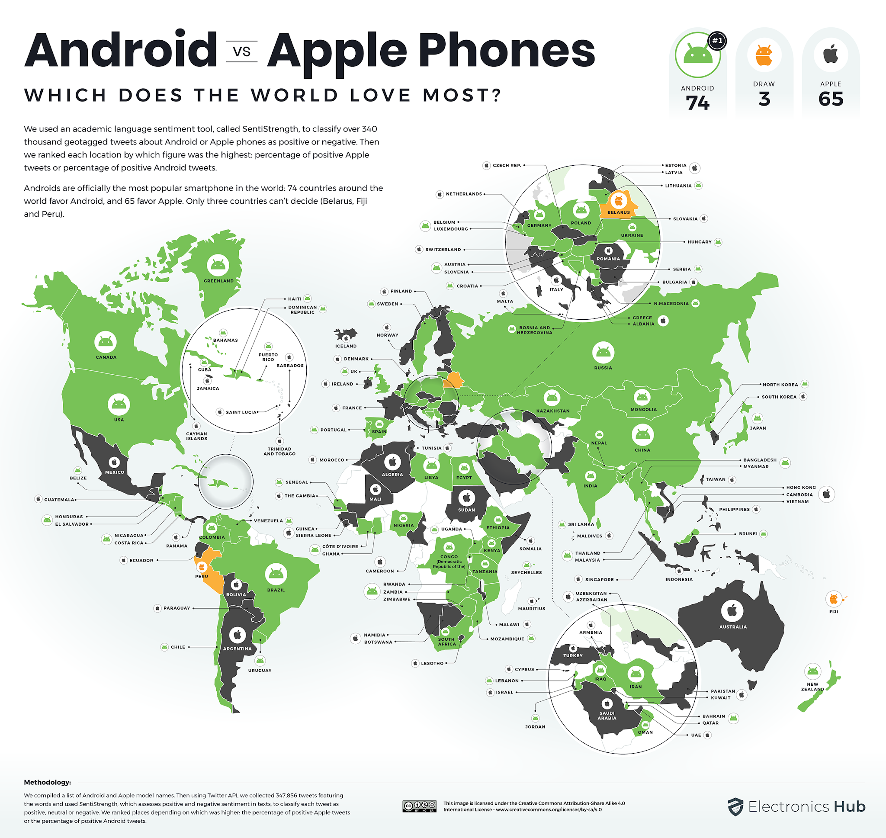
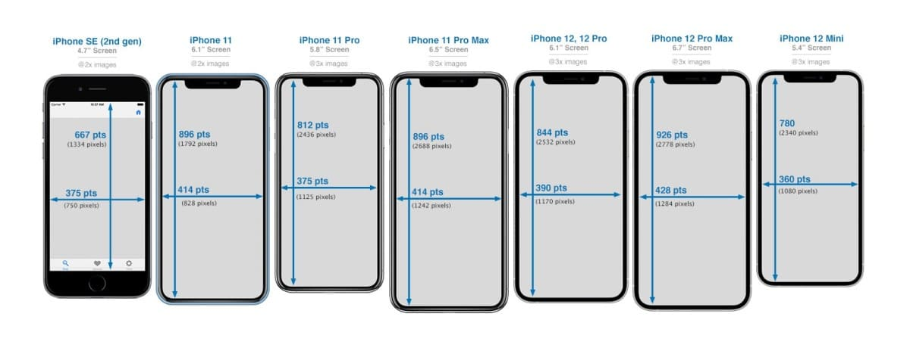
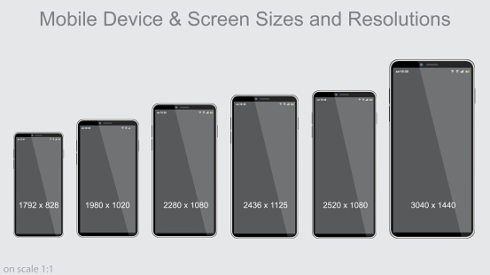
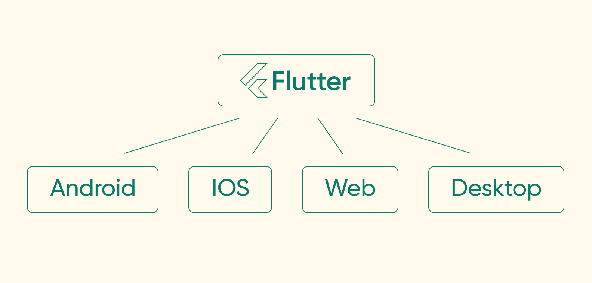
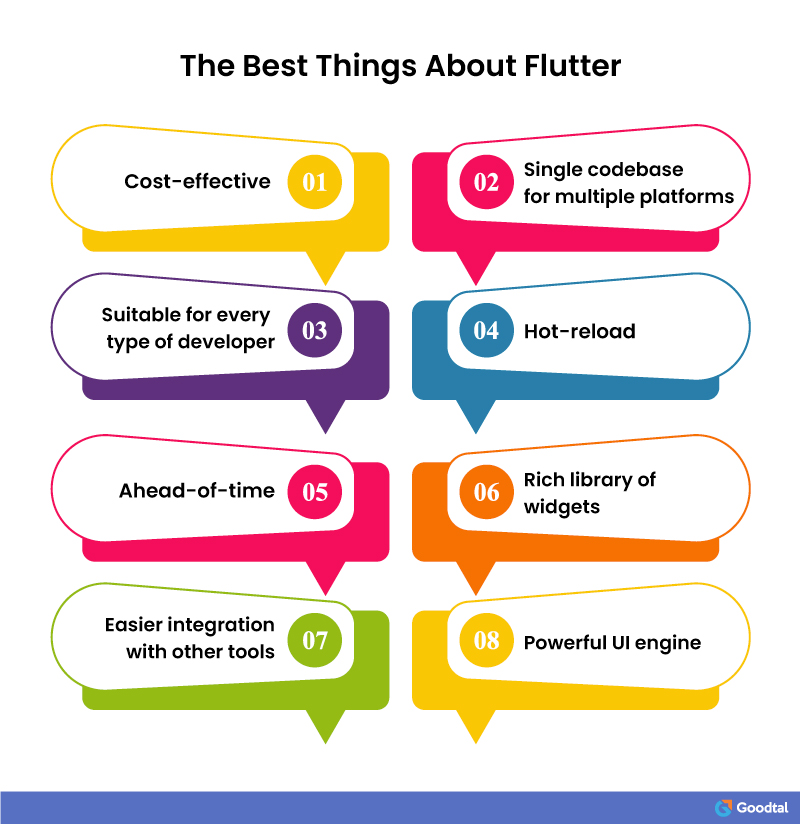
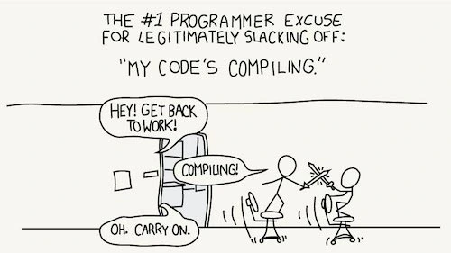
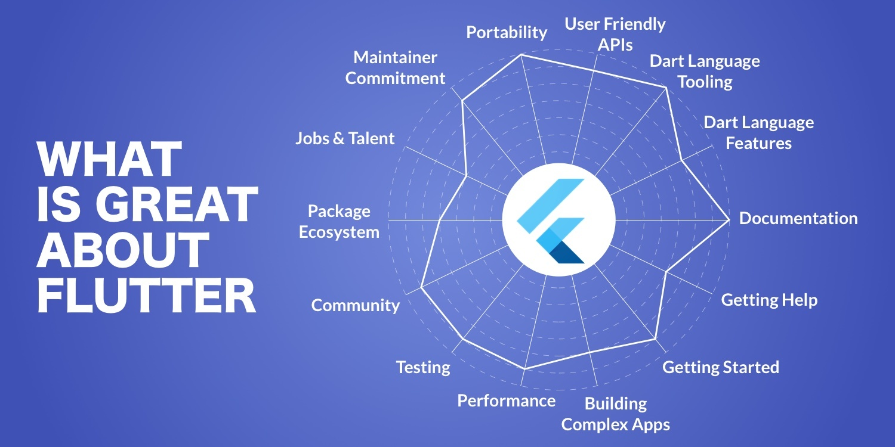

# 🚀 Flutter Introduction - Your Gateway to Cross-Platform Development

By the end of this lesson, you'll understand:
1. **🌟 What Flutter is** and why it's a game-changer
2. **⚡ Hot Reload magic** that transforms development
3. **🎨 Widget-based architecture** - everything is a widget!
4. **📱 Cross-platform power** - write once, run everywhere
5. **🔧 Development workflow** that boosts productivity

---

## 1. 🌍 **The Mobile Development Challenge**

### The Market Reality


**Global Split:**
- 🤖 **Android**: 72.72% worldwide
- 🍎 **iOS**: 26.92% worldwide
- 💰 **BUT**: iOS users spend more money!

### The Developer Dilemma



**Traditional Mobile Development = Double Work:**
- 📱 iOS → Swift/Objective-C → Xcode → Apple ecosystem
- 🤖 Android → Kotlin/Java → Android Studio → Google ecosystem
- 🧑‍💻 Result: **2 teams, 2 codebases, 2x cost, 2x time**

---

## 2. 💡 **Meet Flutter - The Game Changer**



Flutter is **Google's open-source UI toolkit** that lets you build beautiful, natively compiled applications for multiple platforms from a **single codebase**.

### Core Philosophy:
- ✨ **Everything is a Widget**  
- 🔄 **Composition over Inheritance**  
- ⚡ **Reactive Programming**  
- 🎯 **Single Codebase, Multiple Platforms**
---

## 3. 🚀 **Why Flutter Rocks - Key Superpowers**



### ⚡ **1. Hot Reload Magic**
```
❌ Traditional: Edit → Compile → Deploy → Test (2+ minutes)
✅ Flutter: Edit → Hot Reload → Test (<1 second)
```
**Result: 300-400% faster development!**

### 🎯 **2. True Native Performance** 
```
❌ React Native: JavaScript → Bridge → Native (bottleneck)
✅ Flutter: Dart → Direct ARM compilation (blazing fast)
```

### 🎨 **3. Pixel-Perfect Consistency**
- Flutter draws **every pixel itself**
- Same beautiful UI on **all platforms**
- No platform-specific quirks or inconsistencies

### 📱 **4. Cross-Platform Mastery**


**One codebase runs on:**
- 📱 **Mobile**: iOS + Android
- 🌐 **Web**: Chrome, Firefox, Safari, Edge  
- 🖥️ **Desktop**: Windows, macOS, Linux
- 🚗 **Embedded**: Cars, IoT devices

---

## 4. 🏗️ **How Flutter Works - The Magic Behind**

### **Flutter Architecture Stack**
```
┌─────────────────┐
│   Your App      │ ← Your beautiful UI code
├─────────────────┤
│   Widgets       │ ← Material + Cupertino components  
├─────────────────┤
│   Dart Engine   │ ← Fast compilation & execution
├─────────────────┤
│ Flutter Engine  │ ← C++ rendering powerhouse
├─────────────────┤
│   iOS/Android   │ ← Native platform integration
└─────────────────┘
```

### **🎨 Everything is a Widget**
```dart
// Simple Flutter app structure
MaterialApp(
  home: Scaffold(
    appBar: AppBar(title: Text('My App')),
    body: Column(
      children: [
        Text('Hello Flutter!'),
        ElevatedButton(
          onPressed: () => print('Tapped!'),
          child: Text('Tap Me'),
        ),
      ],
    ),
  ),
)
```

**Two Widget Types:**
1. **StatelessWidget** → Static content (like Text, Images)
2. **StatefulWidget** → Dynamic content (like counters, forms)

---

## 5. 🥊 **Flutter vs The Competition**



| Framework | Language | Performance | Learning | Community |
|-----------|----------|------------|-----------|-----------|
| **🚀 Flutter** | Dart | ⭐⭐⭐⭐⭐ | ⭐⭐⭐⭐ | ⭐⭐⭐⭐⭐ |
| **⚛️ React Native** | JavaScript | ⭐⭐⭐ | ⭐⭐⭐⭐⭐ | ⭐⭐⭐⭐⭐ |
| **📱 Native iOS/Android** | Swift/Kotlin | ⭐⭐⭐⭐⭐ | ⭐⭐ | ⭐⭐⭐⭐ |
| **🔷 Xamarin** | C# | ⭐⭐⭐⭐ | ⭐⭐⭐ | ⭐⭐⭐ |

### **Why Choose Flutter?**
✅ **Single codebase** for all platforms  
✅ **Hot reload** for instant development  
✅ **Pixel-perfect UI** across devices  
✅ **Growing fast** - backed by Google  
✅ **Great performance** - near native speed

---

## 6. 🔧 **Development Workflow - From Idea to App Store**



### **Essential Flutter Commands**
```bash
# Get started
flutter create my_app          # Create new project
flutter run                    # Run app with hot reload

# Development
flutter analyze               # Check code quality
flutter test                  # Run all tests
flutter build apk            # Build for Android
flutter build ios           # Build for iOS
```

### **IDE Options**
- **📝 VS Code** → Lightweight, great extensions
- **🎯 Android Studio** → Full-featured, built-in emulator
- **💡 IntelliJ** → Advanced debugging tools

### **Essential Tools**
- **🔍 Flutter Inspector** → Visual widget tree
- **📊 DevTools** → Performance profiling  
- **🧪 Hot Reload** → Instant UI updates

---

## 7. 🎯 **Key Takeaways - Why Flutter Wins**

### **Perfect for:**
✅ **Startups** → Fast MVP development  
✅ **Prototypes** → Quick idea validation  
✅ **Cross-platform apps** → Consistent design everywhere  
✅ **Custom UI** → Pixel-perfect control  

### **Flutter = Success Formula:**
```
Single Codebase + Hot Reload + Beautiful UI + Native Performance = 🚀
```

### **The Bottom Line:**
> **Flutter lets you build beautiful, fast apps for every platform from a single codebase. It's the future of app development, and you're about to master it!**

---

## 🚀 **Ready to Start Building?**

You've learned why Flutter is revolutionary. Now it's time to build your first app and experience the magic yourself!

**Next up:** Setting up your development environment and creating your first Flutter masterpiece! 🎉  
