# 📜 Diagram

This diagram illustrates the Flutter ecosystem, architecture, and development workflow.

```mermaid
flowchart TD
    A[🚀 Flutter Framework] --> B{🎯 Core Philosophy}
    
    B --> C[📱 Everything is a Widget]
    B --> D[🔧 Composition over Inheritance]
    B --> E[⚡ Reactive Programming]
    B --> F[🌍 Single Codebase]
    
    C --> G[📦 Widget Tree]
    D --> H[🏗️ Component Composition]
    E --> I[🔄 State Management]
    F --> J[📱 Platform Targets]
    
    G --> K[📦 StatelessWidget]
    G --> L[🔄 StatefulWidget]
    
    K --> M[🎯 Immutable UI]
    L --> N[🔄 Dynamic UI]
    
    J --> O[📱 Mobile]
    J --> P[🌐 Web]
    J --> Q[🖥️ Desktop]
    
    O --> R[🤖 Android]
    O --> S[🍎 iOS]
    
    P --> T[🌐 Browsers]
    P --> U[📱 PWA]
    
    Q --> V[🖥️ Windows]
    Q --> W[🍎 macOS]
    Q --> X[🐧 Linux]
    
    A --> Y{🏗️ Architecture Stack}
    
    Y --> Z[👨‍💻 Your App]
    Y --> AA[🎨 Framework]
    Y --> BB[⚙️ Engine]
    Y --> CC[🔧 Platform]
    
    Z --> DD[💻 Business Logic]
    AA --> EE[📦 Widgets]
    BB --> FF[🎨 Rendering]
    CC --> GG[🔧 OS Integration]
    
    A --> HH{⚡ Development Experience}
    
    HH --> II[🔥 Hot Reload]
    HH --> JJ[🛠️ DevTools]
    HH --> KK[📦 Packages]
    
    II --> LL[⚡ Instant Updates]
    JJ --> MM[🕵️ Inspector]
    KK --> NN[📦 pub.dev]
    
    LL --> OO[🚀 Flutter Success]
    MM --> OO
    NN --> OO
    
    OO --> PP[💼 Career Growth]
    OO --> QQ[🌟 Technical Skills]
    OO --> RR[🌍 Global Impact]
    
    style A fill:#e1f5fe
    style OO fill:#c8e6c9
    style PP fill:#fff3e0
    style QQ fill:#f3e5f5
    style RR fill:#fce4ec
    
    classDef core fill:#e3f2fd
    classDef platform fill:#f1f8e9
    classDef development fill:#fff8e1
    classDef success fill:#e8f5e8
    
    class A,B,Y,HH core
    class O,P,Q,R,S,T,U,V,W,X platform
    class II,JJ,KK,LL,MM,NN development
    class OO,PP,QQ,RR success
```

## 🎯 **Diagram Explanation**

### **Core Philosophy** 🚀
Flutter's revolutionary approach centers on four key principles:
- **Everything is a Widget**: All UI elements are widgets in a tree structure
- **Composition over Inheritance**: Build complex UIs by combining simple widgets
- **Reactive Programming**: UI automatically updates when state changes
- **Single Codebase**: Write once, deploy everywhere

### **Widget Architecture** 📱
Flutter's widget system provides two main types:
- **StatelessWidget**: Immutable components for static UI elements
- **StatefulWidget**: Dynamic components that manage changing state

### **Platform Targets** 🌍
From a single codebase, Flutter targets:
- **Mobile**: Android and iOS with native performance
- **Web**: Modern browsers and Progressive Web Apps
- **Desktop**: Windows, macOS, and Linux applications

### **Architecture Stack** 🏗️
Flutter's layered architecture ensures optimal performance:
- **Your App**: Business logic and application code
- **Framework**: Widget library and Material/Cupertino design
- **Engine**: Dart runtime, rendering, and animation systems
- **Platform**: OS-specific integration and native APIs

### **Development Experience** ⚡
Flutter revolutionizes development through:
- **Hot Reload**: Instant code changes without losing app state
- **DevTools**: Comprehensive debugging and profiling suite
- **Package Ecosystem**: Thousands of ready-to-use packages

### **Success Outcomes** 🚀
Mastering Flutter leads to:
- **Career Growth**: High-demand skills and competitive salaries
- **Technical Skills**: Cross-platform development expertise
- **Global Impact**: Reach millions of users across all platforms

This foundation prepares you for an exciting journey into Flutter development!