# 📊 Diagrams 01: Flutter Architecture & Ecosystem

## 🏗️ Flutter Architecture Stack

### High-Level Architecture


### Widget Tree Structure


## 🔄 Flutter vs. Other Frameworks

### Development Approach Comparison


### Performance Comparison

```mermaid
graph LR
    A[Native Apps] --> A1[Direct Native APIs<br/>🏃‍♂️ Fastest]
    B[Flutter] --> B1[Compiled to Native<br/>🏃‍♂️ Near Native]
    C[React Native] --> C1[JavaScript Bridge<br/>🚶‍♂️ Good]
    D[Ionic/Cordova] --> D1[WebView Based<br/>🐌 Slower]
    
    style A1 fill:#4CAF50
    style B1 fill:#8BC34A
    style C1 fill:#FFC107
    style D1 fill:#FF9800
```


## 🎯 Flutter Development Workflow

### Hot Reload Process

```mermaid
sequenceDiagram
    participant Dev as Developer
    participant IDE as IDE/Editor
    participant VM as Dart VM
    participant App as Running App
    
    Dev->>IDE: Save code changes
    IDE->>VM: Send updated code
    VM->>VM: Update changed functions
    VM->>App: Trigger rebuild
    App->>App: Update UI (preserve state)
    App->>Dev: Show changes instantly
    
    Note over Dev,App: ⚡ Typically under 1 second!
```


### Build Process


## 🌐 Platform Support Matrix

### Current Platform Support


## 🔧 Development Environment Setup

### Required Tools


## 📱 App Lifecycle

### Flutter App Lifecycle States


### Widget Lifecycle


## 🎨 UI Composition Patterns

### Widget Composition Tree


### State Management Flow
```mermaid
graph LR
    A[User Action] --> B[setState()]
    B --> C[Widget Rebuild]
    C --> D[build() method called]
    D --> E[New Widget Tree]
    E --> F[Flutter Framework]
    F --> G[Render Tree Update]
    G --> H[Screen Update]
    
    style A fill:#e3f2fd
    style B fill:#fff3e0
    style C fill:#f3e5f5
    style D fill:#e8f5e8
    style E fill:#fce4ec
    style F fill:#e0f2f1
    style G fill:#ffebee
    style H fill:#e1f5fe
```

## 🚀 Learning Journey Map

### Course Progress Visualization


### Skill Development Timeline


---

**💡 Visual Learning Note**: These diagrams are designed to help you visualize complex concepts. Refer back to them as you progress through the course to reinforce your understanding of Flutter's architecture and development patterns.