# 📜 Diagram

This diagram illustrates the complete Flutter development environment ecosystem and the relationships between different tools and processes.

```mermaid
flowchart TD
    A[👨‍💻 Developer] --> B{🛠️ IDE/Editor Choice}
    
    B -->|Lightweight & Fast| C[📝 VS Code]
    B -->|Full Featured| D[🏗️ Android Studio]
    
    C --> E[🎨 VS Code Extensions]
    D --> F[🔧 Android Studio Plugins]
    
    E --> G[📱 Flutter/Dart Extension]
    E --> H[🔍 Error Lens]
    E --> I[📊 GitLens]
    E --> J[🎨 Bracket Colorizer]
    
    F --> K[📱 Flutter Plugin]
    F --> L[🔧 Dart Plugin]
    F --> M[📊 Profiler Tools]
    
    G --> N[⚡ Hot Reload System]
    K --> N
    
    N --> O{🔄 Development Cycle}
    
    O --> P[✍️ Code Changes]
    P --> Q[💾 File Save]
    Q --> R[🔄 Hot Reload Trigger]
    R --> S[📱 App Update]
    S --> T[👁️ Visual Feedback]
    T --> P
    
    O --> U[🚀 Flutter SDK]
    
    U --> V[📦 Dart SDK]
    U --> W[🛠️ Flutter Tools]
    U --> X[📚 Framework Packages]
    
    W --> Y[⚙️ Flutter CLI Commands]
    
    Y --> Z[🩺 flutter doctor]
    Y --> AA[🆕 flutter create]
    Y --> BB[▶️ flutter run]
    Y --> CC[🏗️ flutter build]
    Y --> DD[🧪 flutter test]
    Y --> EE[🔍 flutter analyze]
    
    Z --> FF{🔍 Environment Health Check}
    FF -->|✅ All Good| GG[🎯 Ready for Development]
    FF -->|❌ Issues Found| HH[🛠️ Fix Issues]
    HH --> Z
    
    GG --> II[📱 Target Platforms]
    
    II --> JJ[🤖 Android Platform]
    II --> KK[🍎 iOS Platform]
    II --> LL[🌐 Web Platform]
    II --> MM[🖥️ Desktop Platforms]
    
    JJ --> NN[📱 Android SDK]
    JJ --> OO[📲 Android Emulators]
    JJ --> PP[🔌 Physical Devices]
    
    KK --> QQ[⚙️ Xcode Tools]
    KK --> RR[📱 iOS Simulators]
    KK --> SS[📱 Physical iDevices]
    
    LL --> TT[🌐 Chrome Browser]
    LL --> UU[🦊 Firefox Browser]
    LL --> VV[🌍 Safari Browser]
    
    MM --> WW[🖥️ Windows Apps]
    MM --> XX[🍎 macOS Apps]
    MM --> YY[🐧 Linux Apps]
    
    GG --> ZZ[🔧 Development Tools]
    
    ZZ --> AAA[🛠️ Flutter DevTools]
    ZZ --> BBB[📊 Performance Monitor]
    ZZ --> CCC[🐛 Debugger]
    ZZ --> DDD[🔍 Inspector]
    
    AAA --> EEE[🎯 Widget Inspector]
    AAA --> FFF[📈 Performance View]
    AAA --> GGG[💾 Memory View]
    AAA --> HHH[🌐 Network View]
    
    GG --> III[🔄 Code Quality Tools]
    
    III --> JJJ[📝 Dart Analyzer]
    III --> KKK[🎨 Dart Formatter]
    III --> LLL[🧪 Test Runner]
    III --> MMM[📊 Coverage Reporter]
    
    JJJ --> NNN{🔍 Code Analysis}
    NNN -->|✅ Clean| OOO[🎯 Production Ready]
    NNN -->|❌ Issues| PPP[🛠️ Fix Code Issues]
    PPP --> JJJ
    
    GG --> QQQ[⚡ Productivity Features]
    
    QQQ --> RRR[🔥 Hot Reload]
    QQQ --> SSS[🔄 Hot Restart]
    QQQ --> TTT[📝 Code Snippets]
    QQQ --> UUU[🚀 Auto-complete]
    QQQ --> VVV[🔍 Go to Definition]
    
    RRR --> WWW[⚡ Sub-second Updates]
    SSS --> XXX[🔄 Full App Restart]
    
    WWW --> YYY[🚀 Maximum Productivity]
    XXX --> YYY
    TTT --> YYY
    UUU --> YYY
    VVV --> YYY
    
    YYY --> ZZZ[🎯 Professional Development]
    
    ZZZ --> AAAA[📚 Version Control]
    ZZZ --> BBBB[👥 Team Collaboration]
    ZZZ --> CCCC[🔄 CI/CD Integration]
    ZZZ --> DDDD[📦 Package Management]
    
    AAAA --> EEEE[📝 Git Integration]
    BBBB --> FFFF[⚙️ Shared Configurations]
    CCCC --> GGGG[🤖 Automated Testing]
    DDDD --> HHHH[📦 Dependency Management]
    
    EEEE --> IIII[🌟 Professional Flutter Developer]
    FFFF --> IIII
    GGGG --> IIII
    HHHH --> IIII
    OOO --> IIII
    
    style A fill:#e1f5fe
    style IIII fill:#c8e6c9
    style YYY fill:#fff3e0
    style GG fill:#f3e5f5
    style N fill:#fce4ec
    
    classDef tool fill:#e3f2fd
    classDef platform fill:#f1f8e9
    classDef process fill:#fff8e1
    classDef output fill:#e8f5e8
    
    class C,D,U,ZZ,III tool
    class JJ,KK,LL,MM platform
    class O,N,FF,NNN process
    class YYY,OOO,IIII output
```

## 🎯 **Diagram Explanation**

### **Phase 1: Tool Selection & Setup** 🛠️
The journey begins with choosing the right IDE/Editor:
- **VS Code**: Lightweight, fast, with excellent extension support
- **Android Studio**: Full-featured IDE with comprehensive debugging tools

Both paths lead to essential extensions and plugins that enhance Flutter development capabilities.

### **Phase 2: Hot Reload Ecosystem** ⚡
The diagram highlights the revolutionary hot reload system that makes Flutter development so productive:
- **Code Changes** → **File Save** → **Hot Reload Trigger** → **App Update** → **Visual Feedback**
- This creates a sub-second feedback loop that dramatically accelerates development

### **Phase 3: Flutter SDK Foundation** 🚀
The Flutter SDK forms the core of the development environment:
- **Dart SDK**: Language runtime and tools
- **Flutter Tools**: CLI commands and utilities
- **Framework Packages**: UI widgets and core functionality

### **Phase 4: CLI Command Mastery** ⚙️
Essential Flutter commands that every developer must master:
- `flutter doctor`: Environment health check
- `flutter create`: Project initialization
- `flutter run`: Development server
- `flutter build`: Production builds
- `flutter test`: Test execution
- `flutter analyze`: Code quality checks

### **Phase 5: Multi-Platform Targeting** 📱
Flutter's strength lies in its ability to target multiple platforms from a single codebase:
- **Android**: SDK, emulators, and physical devices
- **iOS**: Xcode tools, simulators, and physical devices  
- **Web**: Modern browsers for web deployment
- **Desktop**: Windows, macOS, and Linux applications

### **Phase 6: Advanced Development Tools** 🔧
Professional development requires sophisticated tools:
- **Flutter DevTools**: Widget inspector, performance monitoring, debugging
- **Code Quality Tools**: Analyzer, formatter, test runner, coverage reporter
- **Productivity Features**: Hot reload, code snippets, auto-complete

### **Phase 7: Professional Development Practices** 🎯
The environment culminates in professional development capabilities:
- **Version Control**: Git integration for code management
- **Team Collaboration**: Shared configurations and standards
- **CI/CD Integration**: Automated testing and deployment
- **Package Management**: Dependency handling and updates

## 🔄 **Key Process Flows**

### **Development Cycle Flow**
The central hot reload cycle shows how Flutter enables rapid iteration:
1. Developer makes code changes
2. File save triggers hot reload
3. App updates instantly without losing state
4. Developer sees immediate visual feedback
5. Cycle repeats for maximum productivity

### **Environment Health Flow**
The `flutter doctor` command creates a verification flow:
1. Check environment health
2. Identify missing components or issues
3. Fix problems as needed
4. Verify setup is complete
5. Ready for productive development

### **Quality Assurance Flow**
Code quality tools create a continuous improvement cycle:
1. Dart analyzer checks code quality
2. Issues are identified and flagged
3. Developer fixes problems
4. Clean code enables production deployment

## 📊 **Tool Integration Points**

### **IDE Extensions → Flutter SDK**
Extensions and plugins integrate directly with the Flutter SDK to provide:
- Syntax highlighting and code completion
- Error detection and debugging
- Project templates and scaffolding
- Testing and deployment automation

### **Platform Tools → Development Workflow**
Platform-specific tools integrate seamlessly:
- Android SDK provides device access and debugging
- Xcode enables iOS development and testing
- Web browsers support web development and testing
- Desktop tools enable native app development

### **Development Tools → Professional Output**
Advanced tools enable professional development:
- DevTools provide performance insights
- Code quality tools ensure maintainable code
- Version control enables team collaboration
- CI/CD integration automates deployment

This comprehensive development environment creates a **force multiplier effect** where the sum of all tools working together enables extraordinary productivity and professional-quality Flutter development.
