# 📜 Diagram for Lesson 03: Dart Fundamentals for Flutter

This diagram illustrates the comprehensive Dart language ecosystem and how different concepts build upon each other to create powerful Flutter applications.

```mermaid
flowchart TD
    A[🎯 Dart Language Foundation] --> B{📚 Core Language Features}
    
    B --> C[🔤 Type System]
    B --> D[⚡ Functions & Methods]
    B --> E[🏗️ Object-Oriented Programming]
    B --> F[📦 Collections & Iterables]
    B --> G[🔄 Asynchronous Programming]
    
    C --> H[💎 Basic Types]
    C --> I[🛡️ Null Safety]
    C --> J[🔧 Type Inference]
    C --> K[✨ Advanced Types]
    
    H --> L[🔢 Numbers: int, double, num]
    H --> M[📝 Strings & Interpolation]
    H --> N[✅ Booleans & Logic]
    H --> O[📋 Lists, Maps, Sets]
    
    I --> P[❓ Nullable Types: String?]
    I --> Q[🔒 Non-nullable: String]
    I --> R[🛠️ Null-aware Operators]
    I --> S[⏰ Late Variables]
    
    R --> T[?. Safe Navigation]
    R --> U[?? Null Coalescing]
    R --> V[??= Null Assignment]
    R --> W[! Null Assertion]
    
    D --> X[📝 Function Declaration]
    D --> Y[🎯 Parameters & Arguments]
    D --> Z[🔄 Higher-Order Functions]
    D --> AA[🏹 Arrow Functions]
    
    Y --> BB[🔧 Positional Parameters]
    Y --> CC[🏷️ Named Parameters]
    Y --> DD[📦 Optional Parameters]
    Y --> EE[⚡ Required Parameters]
    
    Z --> FF[🔄 Callbacks & Closures]
    Z --> GG[🎭 Function Composition]
    Z --> HH[📈 Functional Programming]
    
    E --> II[🏛️ Classes & Objects]
    E --> JJ[🔗 Inheritance & Polymorphism]
    E --> KK[🧩 Mixins & Interfaces]
    E --> LL[🎭 Abstract Classes]
    
    II --> MM[🏗️ Constructors]
    II --> NN[🔧 Methods & Properties]
    II --> OO[📊 Getters & Setters]
    II --> PP[🔄 Operator Overloading]
    
    JJ --> QQ[⬆️ extends Inheritance]
    JJ --> RR[🎯 Override Methods]
    JJ --> SS[🌟 Polymorphic Behavior]
    
    KK --> TT[🧩 with Mixins]
    KK --> UU[📋 implements Interfaces]
    KK --> VV[🔧 Multiple Inheritance]
    
    F --> WW[📋 List Operations]
    F --> XX[🗺️ Map Operations]
    F --> YY[🎯 Set Operations]
    F --> ZZ[🔄 Iterable Methods]
    
    WW --> AAA[➕ Add, Insert, Remove]
    WW --> BBB[🔍 Search & Filter]
    WW --> CCC[🔄 Map, Where, Reduce]
    
    XX --> DDD[🔑 Key-Value Pairs]
    XX --> EEE[🔄 Iteration & Updates]
    XX --> FFF[🔍 Lookup & Search]
    
    YY --> GGG[🎯 Unique Elements]
    YY --> HHH[🔄 Union, Intersection]
    YY --> III[➖ Difference Operations]
    
    G --> JJJ[🔮 Futures & async/await]
    G --> KKK[🌊 Streams & Controllers]
    G --> LLL[⚠️ Error Handling]
    G --> MMM[🔄 Concurrency Patterns]
    
    JJJ --> NNN[⏳ Future.delayed]
    JJJ --> OOO[⚡ async Functions]
    JJJ --> PPP[🔄 await Expressions]
    JJJ --> QQQ[🎯 Future.wait]
    
    KKK --> RRR[🌊 Stream Generators]
    KKK --> SSS[🎛️ StreamController]
    KKK --> TTT[🔄 Stream Operations]
    KKK --> UUU[📡 Broadcast Streams]
    
    LLL --> VVV[🛡️ try-catch Blocks]
    LLL --> WWW[🎯 Custom Exceptions]
    LLL --> XXX[🔄 Error Propagation]
    LLL --> YYY[🛠️ Error Recovery]
    
    T --> ZZZ[📱 Flutter Integration]
    U --> ZZZ
    V --> ZZZ
    W --> ZZZ
    
    AA --> ZZZ
    FF --> ZZZ
    GG --> ZZZ
    HH --> ZZZ
    
    MM --> ZZZ
    QQ --> ZZZ
    TT --> ZZZ
    UU --> ZZZ
    
    CCC --> ZZZ
    EEE --> ZZZ
    HHH --> ZZZ
    
    OOO --> ZZZ
    PPP --> ZZZ
    RRR --> ZZZ
    TTT --> ZZZ
    
    ZZZ --> AAAA[🏗️ Widget Architecture]
    ZZZ --> BBBB[🔄 State Management]
    ZZZ --> CCCC[⚡ Hot Reload]
    ZZZ --> DDDD[🎯 Event Handling]
    ZZZ --> EEEE[🌐 Network Operations]
    ZZZ --> FFFF[💾 Data Persistence]
    
    AAAA --> GGGG[🎯 Flutter Application]
    BBBB --> GGGG
    CCCC --> GGGG
    DDDD --> GGGG
    EEEE --> GGGG
    FFFF --> GGGG
    
    GGGG --> HHHH[📱 Production App]
    GGGG --> IIII[🚀 Cross-Platform]
    GGGG --> JJJJ[⚡ High Performance]
    GGGG --> KKKK[🔧 Maintainable Code]
    
    style A fill:#e1f5fe
    style GGGG fill:#c8e6c9
    style HHHH fill:#fff3e0
    style IIII fill:#f3e5f5
    style JJJJ fill:#fce4ec
    style KKKK fill:#e8f5e8
    
    classDef foundation fill:#e3f2fd
    classDef language fill:#f1f8e9
    classDef advanced fill:#fff8e1
    classDef integration fill:#e8f5e8
    classDef output fill:#ffebee
    
    class A,B foundation
    class C,D,E,F,G language
    class I,K,Z,KK,ZZ,MMM advanced
    class ZZZ,AAAA,BBBB,CCCC,DDDD,EEEE,FFFF integration
    class GGGG,HHHH,IIII,JJJJ,KKKK output
```

## 🎯 **Diagram Explanation**

### **Foundation Layer: Dart Language Core** 🎯
The diagram begins with Dart's foundational concepts that form the bedrock of all Flutter development. These core language features provide the essential tools needed for building robust applications.

### **Type System Architecture** 🔤
The type system branch shows Dart's powerful type safety features:

#### **Basic Types** 💎
- **Numbers**: `int`, `double`, `num` for mathematical operations
- **Strings**: Text manipulation with interpolation capabilities
- **Booleans**: Logic operations and control flow
- **Collections**: Lists, Maps, Sets for data organization

#### **Null Safety Revolution** 🛡️
- **Nullable Types** (`String?`): Explicitly allow null values
- **Non-nullable Types** (`String`): Guaranteed to have values
- **Null-aware Operators**: Safe navigation and default value handling
- **Late Variables**: Delayed initialization with compile-time safety

#### **Advanced Type Features** ✨
- **Type Inference**: Automatic type detection
- **Generics**: Type-safe collections and functions
- **Extension Methods**: Add functionality to existing types

### **Function Ecosystem** ⚡
Functions in Dart are first-class citizens with powerful capabilities:

#### **Declaration Patterns** 📝
- **Standard Functions**: Traditional function syntax
- **Arrow Functions**: Concise single-expression functions
- **Anonymous Functions**: Inline function definitions

#### **Parameter Systems** 🎯
- **Positional Parameters**: Order-dependent arguments
- **Named Parameters**: Self-documenting function calls
- **Optional Parameters**: Flexible function signatures
- **Required Parameters**: Enforced argument provision

#### **Higher-Order Programming** 🔄
- **Callbacks & Closures**: Functions that capture their environment
- **Function Composition**: Building complex operations from simple functions
- **Functional Programming**: Immutable operations and transformations

### **Object-Oriented Architecture** 🏗️
Dart's OOP features enable scalable application architecture:

#### **Class Foundation** 🏛️
- **Constructors**: Object initialization patterns
- **Methods & Properties**: Object behavior and state
- **Getters & Setters**: Controlled property access
- **Operator Overloading**: Custom operator behavior

#### **Inheritance System** 🔗
- **Class Extension**: Code reuse through inheritance
- **Method Override**: Specialized behavior in subclasses
- **Polymorphism**: Dynamic method dispatch

#### **Composition Patterns** 🧩
- **Mixins**: Multiple inheritance-like capabilities
- **Interfaces**: Contract-based programming
- **Abstract Classes**: Template and contract definition

### **Collections Mastery** 📦
Powerful data manipulation capabilities:

#### **List Operations** 📋
- **Modification**: Add, insert, remove operations
- **Search & Filter**: Finding and filtering elements
- **Functional Operations**: Map, where, reduce transformations

#### **Map Operations** 🗺️
- **Key-Value Management**: Efficient data lookup
- **Iteration**: Processing map entries
- **Dynamic Updates**: Real-time data modification

#### **Set Operations** 🎯
- **Uniqueness**: Automatic duplicate elimination
- **Set Mathematics**: Union, intersection, difference
- **Membership Testing**: Efficient contains operations

### **Asynchronous Programming Excellence** 🔄
Modern async capabilities for responsive applications:

#### **Future System** 🔮
- **Delayed Execution**: Non-blocking operations
- **Async Functions**: Clean asynchronous syntax
- **Await Expressions**: Sequential async code
- **Parallel Execution**: Concurrent operation management

#### **Stream Architecture** 🌊
- **Stream Generators**: Creating data sequences
- **Stream Controllers**: Managing data flow
- **Stream Operations**: Transforming and filtering data
- **Broadcast Streams**: Multiple listener support

#### **Error Management** ⚠️
- **Try-Catch Blocks**: Exception handling
- **Custom Exceptions**: Application-specific errors
- **Error Propagation**: Async error handling
- **Recovery Patterns**: Graceful failure handling

### **Flutter Integration Bridge** 📱
The diagram shows how Dart concepts integrate into Flutter development:

#### **Core Integration Points** 🔗
- **Widget Architecture**: OOP principles for UI components
- **State Management**: Reactive programming patterns
- **Hot Reload**: Development-time code updates
- **Event Handling**: Async programming for user interactions
- **Network Operations**: Future-based API communication
- **Data Persistence**: Collection operations for local storage

### **Production Application Outcomes** 🚀
The mastery of Dart fundamentals leads to:

#### **Application Characteristics** ✨
- **Production Ready**: Robust, tested applications
- **Cross-Platform**: Write once, run everywhere
- **High Performance**: Compiled native code execution
- **Maintainable**: Clean, organized code structure

## 🔄 **Key Learning Progression**

### **Beginner Path** 🌱
1. **Basic Types** → **Simple Functions** → **Basic Classes**
2. **Collections** → **Simple Async** → **Basic Flutter Widgets**

### **Intermediate Path** 🌿
1. **Null Safety** → **Advanced Functions** → **Inheritance**
2. **Stream Basics** → **Error Handling** → **State Management**

### **Advanced Path** 🌳
1. **Generics & Extensions** → **Complex Async Patterns** → **Architecture Patterns**
2. **Performance Optimization** → **Testing Strategies** → **Production Deployment**

## 📊 **Concept Interconnections**

### **Type Safety → Flutter Reliability**
Dart's null safety system prevents runtime crashes in Flutter applications, making them more reliable and user-friendly.

### **Async Programming → Responsive UI**
Future and Stream concepts enable non-blocking operations, keeping Flutter UIs responsive during data loading and processing.

### **OOP → Widget Architecture**
Dart's class system directly maps to Flutter's widget architecture, enabling composition and inheritance patterns.

### **Collections → Data Management**
Powerful collection operations enable efficient data manipulation in Flutter applications, from simple lists to complex data transformations.

This comprehensive Dart foundation provides the essential skills needed to build sophisticated, maintainable, and performant Flutter applications across all platforms.
