# 📜 Diagram

## 🏗️ Widget Tree Architecture

### Flutter Widget Tree Structure


### Three Trees in Flutter
```mermaid
graph LR
    subgraph "Widget Tree"
        A1[Text<br/>'Hello World']
        A2[Container<br/>width: 100]
        A3[Column<br/>children: [...]]
    end
    
    subgraph "Element Tree"
        B1[StatelessElement<br/>Text]
        B2[SingleChildRenderElement<br/>Container]
        B3[MultiChildRenderElement<br/>Column]
    end
    
    subgraph "Render Tree"
        C1[RenderParagraph<br/>Paint text]
        C2[RenderDecoratedBox<br/>Paint container]
        C3[RenderFlex<br/>Layout children]
    end
    
    A1 --> B1
    A2 --> B2
    A3 --> B3
    
    B1 --> C1
    B2 --> C2
    B3 --> C3
    
    style A1 fill:#e3f2fd
    style A2 fill:#e3f2fd
    style A3 fill:#e3f2fd
    style B1 fill:#fff3e0
    style B2 fill:#fff3e0
    style B3 fill:#fff3e0
    style C1 fill:#e8f5e8
    style C2 fill:#e8f5e8
    style C3 fill:#e8f5e8
```

## 🔄 Widget Lifecycle

### StatelessWidget Lifecycle


### StatefulWidget Lifecycle


### State Lifecycle Methods


## 🎨 Widget Composition Patterns

### Basic Widget Composition


### Layout Widget Relationships


## 🔧 Interactive Widget Flow

### Button Interaction Flow


### Form Input Flow
```mermaid
graph LR
    A[User Input] --> B[TextField]
    B --> C[TextEditingController]
    C --> D[onChanged Callback]
    D --> E[State Update]
    E --> F[setState()]
    F --> G[Widget Rebuild]
    G --> H[UI Update]
    
    style A fill:#e3f2fd
    style B fill:#fff3e0
    style C fill:#f3e5f5
    style D fill:#e8f5e8
    style E fill:#fce4ec
    style F fill:#e0f2f1
    style G fill:#fff8e1
    style H fill:#f1f8e9
```

## 📱 Layout Algorithm Visualization

### Row Layout Algorithm
```mermaid
graph TD
    A[Row Widget] --> B[Measure Children]
    B --> C[Determine Main Axis Size]
    C --> D[Distribute Space]
    D --> E[Position Children]
    
    B --> F[Child 1<br/>Intrinsic Width]
    B --> G[Child 2<br/>Expanded - Flex: 2]
    B --> H[Child 3<br/>Flexible - Flex: 1]
    
    D --> I[Remaining Space<br/>= Total - Intrinsic]
    I --> J[Expanded gets<br/>2/3 of remaining]
    I --> K[Flexible gets<br/>min(intrinsic, 1/3)]
    
    style A fill:#e1f5fe
    style B fill:#f3e5f5
    style C fill:#e8eaf6
    style D fill:#e0f2f1
    style E fill:#fff8e1
```

### Stack Positioning


## 🎭 Custom Widget Patterns

### Widget Composition Strategy


### Widget Parameter Flow
```mermaid
graph TD
    A[Parent Widget] --> B[CustomCard]
    
    A --> C[title: 'Welcome']
    A --> D[subtitle: 'Hello User']
    A --> E[onTap: () => navigate()]
    A --> F[backgroundColor: Colors.blue]
    
    B --> G[build method]
    
    C --> G
    D --> G
    E --> G
    F --> G
    
    G --> H[Card Widget Tree]
    
    style A fill:#e1f5fe
    style B fill:#f3e5f5
    style G fill:#e8f5e8
    style H fill:#fff3e0
```

## 🚀 Performance Optimization Patterns

### Widget Rebuild Optimization
```mermaid
graph TD
    A[Parent State Change] --> B[setState() called]
    B --> C[Parent rebuild]
    C --> D[Child widgets]
    
    D --> E[const Widget]
    D --> F[StatelessWidget]
    D --> G[StatefulWidget]
    
    E --> H[No Rebuild ✅]
    F --> I[Rebuild if params change]
    G --> J[Always rebuild ❌]
    
    I --> K[Same params?]
    K --> L[No Rebuild ✅]
    K --> M[Rebuild ⚠️]
    
    style A fill:#e1f5fe
    style B fill:#f3e5f5
    style C fill:#e8eaf6
    style E fill:#e8f5e8
    style F fill:#fff3e0
    style G fill:#ffebee
    style H fill:#e8f5e8
    style L fill:#e8f5e8
```

### Widget Tree Optimization

```mermaid
graph LR
    subgraph "Unoptimized"
        A1[StatefulWidget] --> B1[build method]
        B1 --> C1[Heavy Widget]
        B1 --> D1[Heavy Widget]
        B1 --> E1[Heavy Widget]
    end
    
    subgraph "Optimized"
        A2[StatefulWidget] --> B2[build method]
        B2 --> C2[const Heavy Widget]
        B2 --> D2[const Heavy Widget]
        B2 --> E2[Extracted Widget]
    end
    
    F[State Change] --> A1
    F --> A2
    
    A1 --> G[Rebuilds Everything ❌]
    A2 --> H[Minimal Rebuilds ✅]
    
    style A1 fill:#ffebee
    style A2 fill:#e8f5e8
    style G fill:#ffcdd2
    style H fill:#c8e6c9
```


## 🎯 Widget Selection Guide

### When to Use Which Widget Type


### Layout Widget Decision Tree


## 🧪 Widget Testing Architecture

### Widget Test Structure


---

**💡 Visual Learning Note**: These diagrams illustrate the fundamental concepts of Flutter widgets. Use them as reference when building your own widgets and understanding how Flutter's widget system works under the hood. The visual representations help cement the theoretical knowledge gained in the concept documentation.