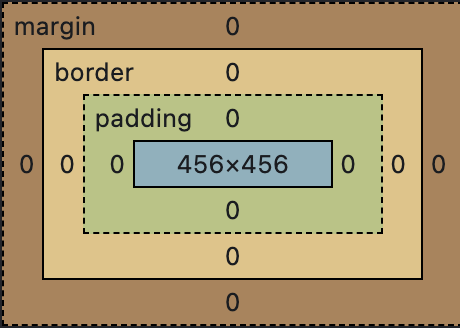
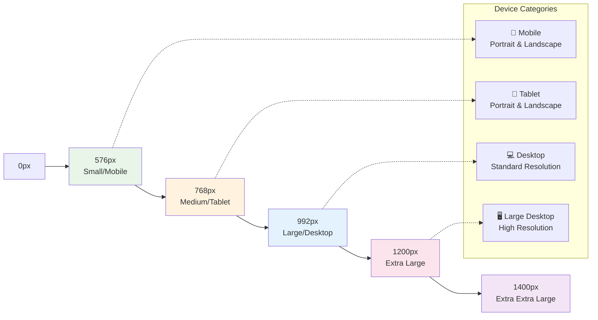
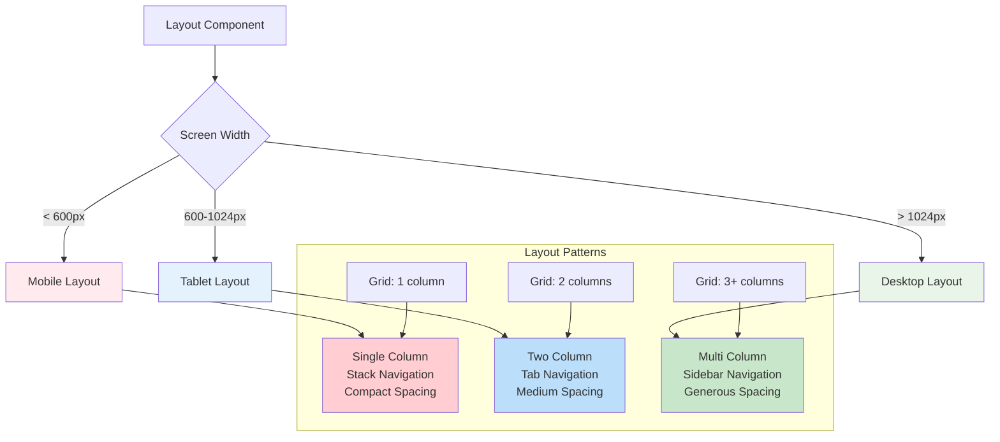
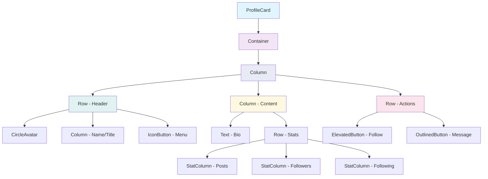
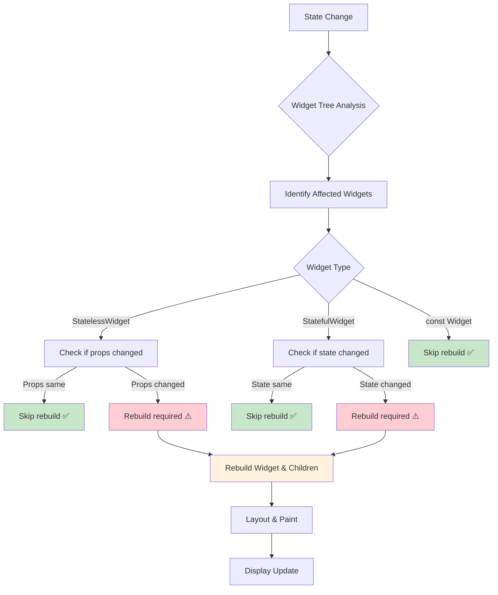
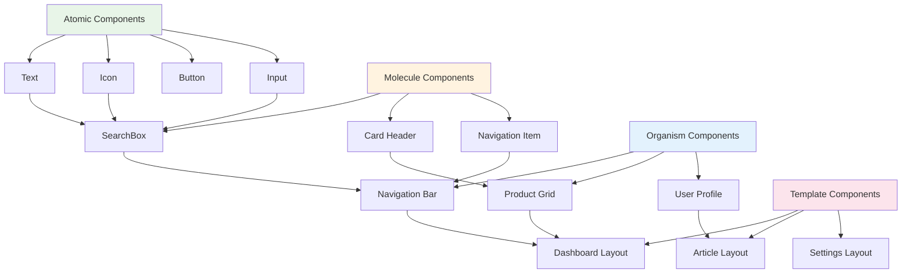

# 📜 Diagram

## 🏗️ Flutter Layout System Architecture

### Constraint-Based Layout Flow

## 📱 Responsive Design Breakpoints

### Screen Size Categories

### Responsive Layout Adaptation

## 🔄 Widget Composition Patterns

### Complex Widget Hierarchy

## 📊 Performance Optimization Flow

### Widget Rebuild Optimization

## 🎨 Example of Design System Architecture

### Component Hierarchy

