# 📊 Diagrams 05: Advanced Layout Architecture

## 🏗️ Flutter Layout System Architecture

### Constraint-Based Layout Flow
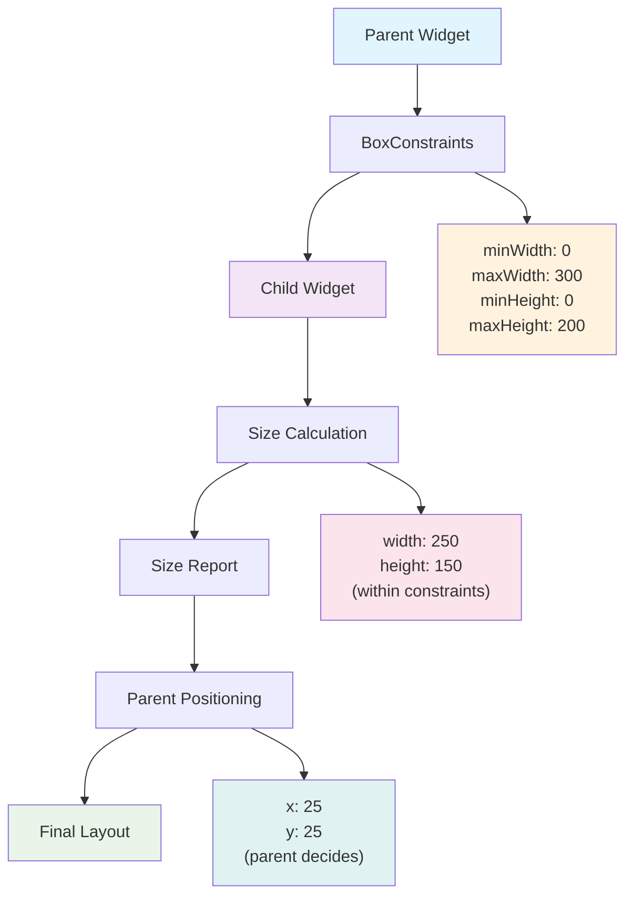

### Three-Pass Layout Algorithm
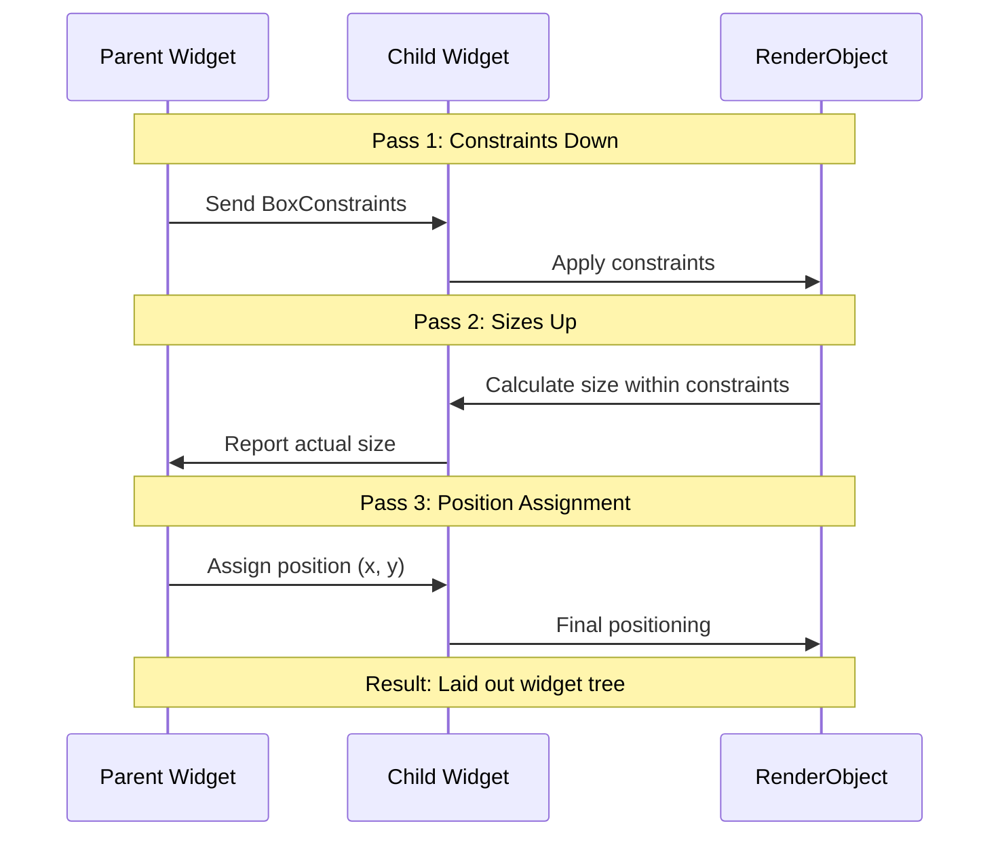

## 📐 Flex Layout System

### Row/Column Layout Algorithm
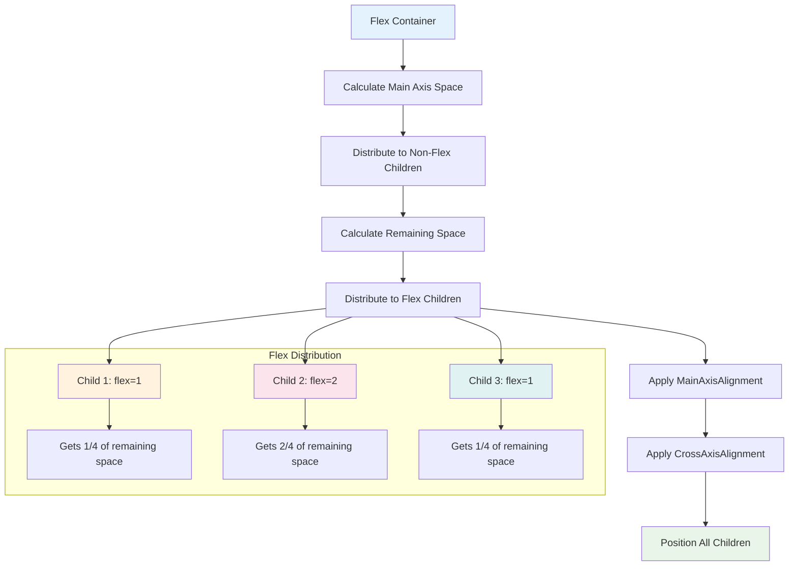

### MainAxisAlignment Visualization
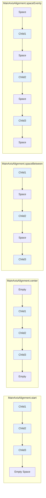

## 📱 Responsive Design Breakpoints

### Screen Size Categories
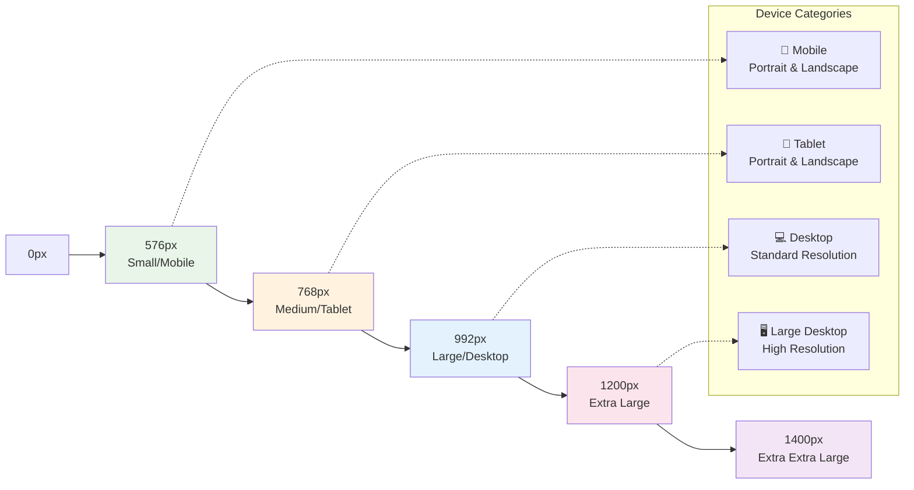

### Responsive Layout Adaptation
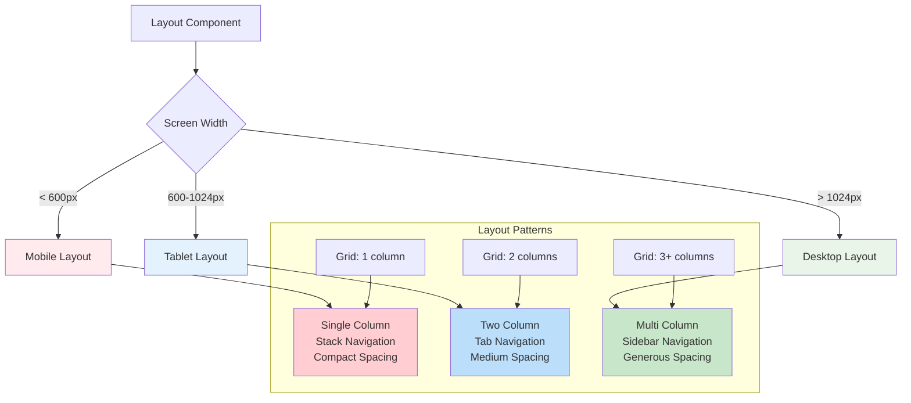

## 🎯 Stack & Positioning System

### Stack Layout Architecture
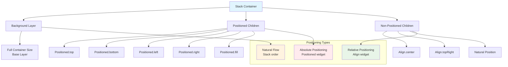

### Z-Index Layering
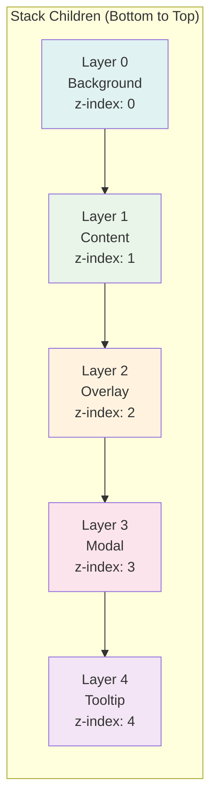

## 🔄 Widget Composition Patterns

### Complex Widget Hierarchy
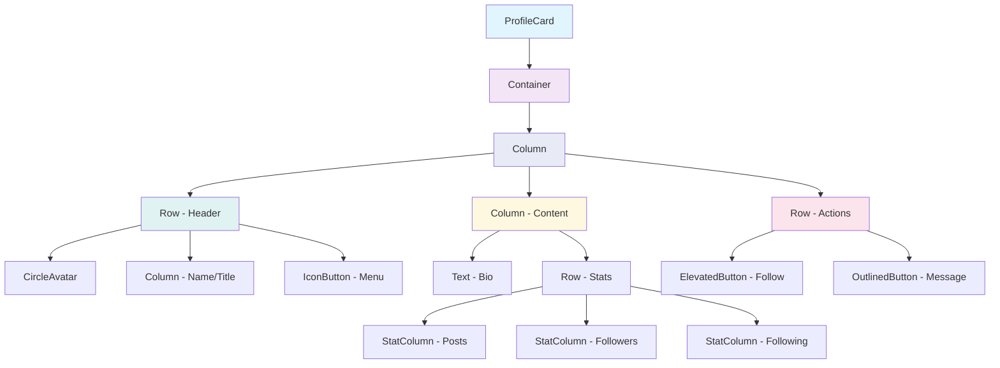

### Reusable Component Architecture
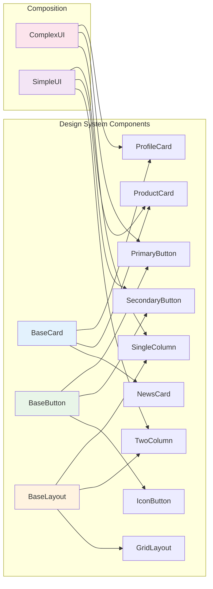

## 📊 Performance Optimization Flow

### Widget Rebuild Optimization
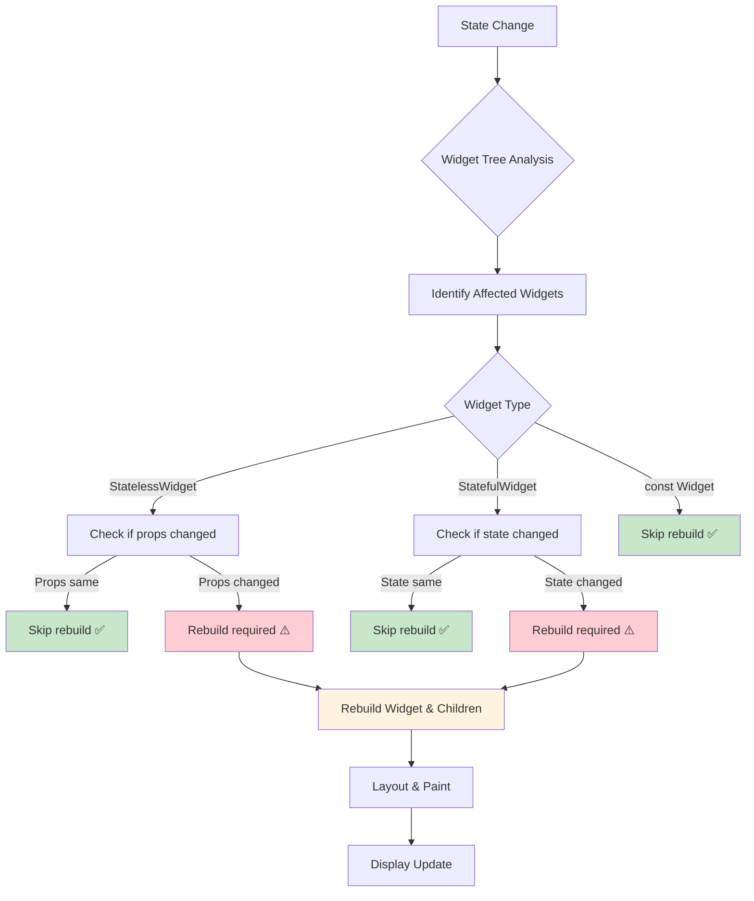

### Layout Performance Metrics
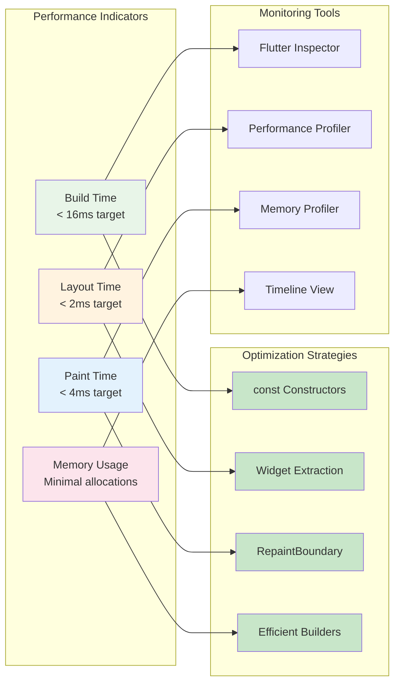

## 🎨 Design System Architecture

### Token-Based Design System
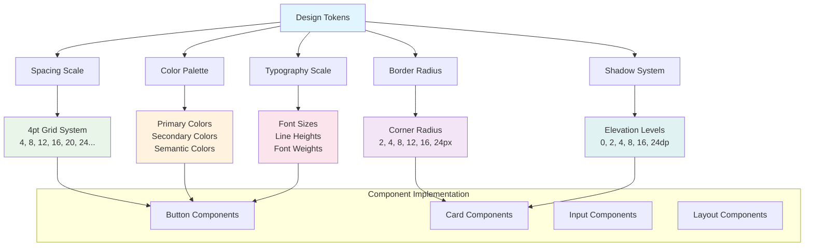

### Component Hierarchy
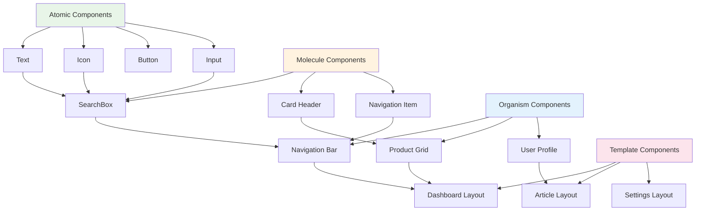

## 🔧 Debugging Layout Flow

### Layout Debugging Process
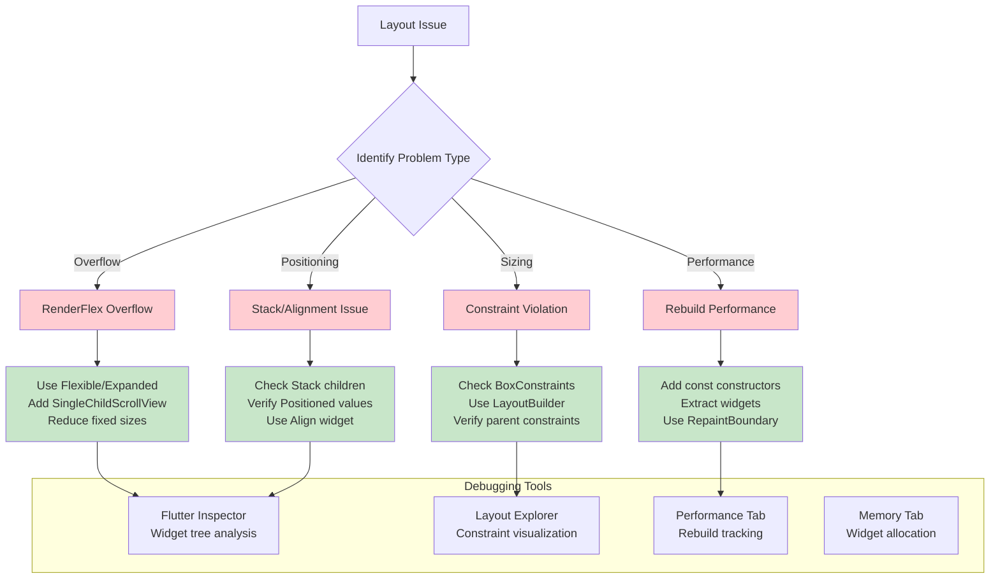

### Common Layout Problems & Solutions
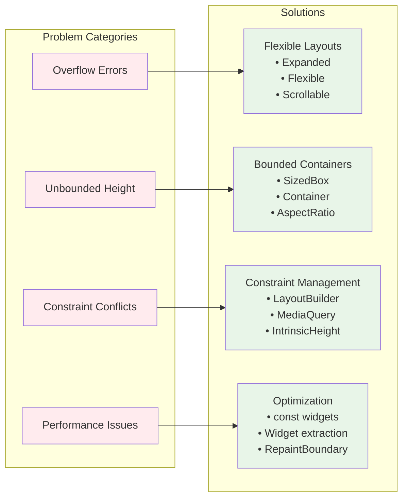

---

**💡 Visual Learning Note**: These diagrams illustrate the complex relationships and algorithms that power Flutter's layout system. Understanding these visual patterns will help you reason about layout behavior and debug issues more effectively. Use them as reference when implementing advanced layout patterns in your applications.