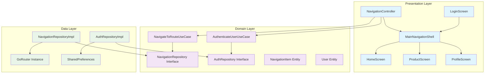
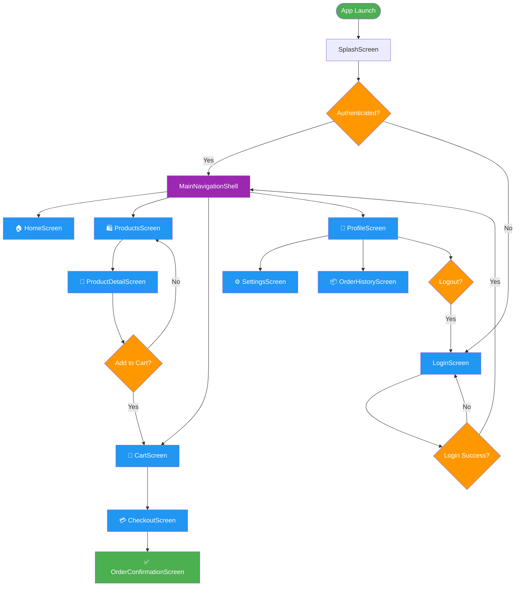
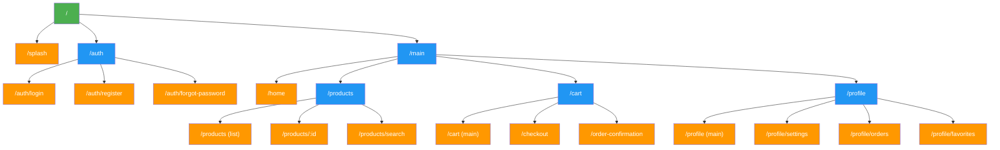
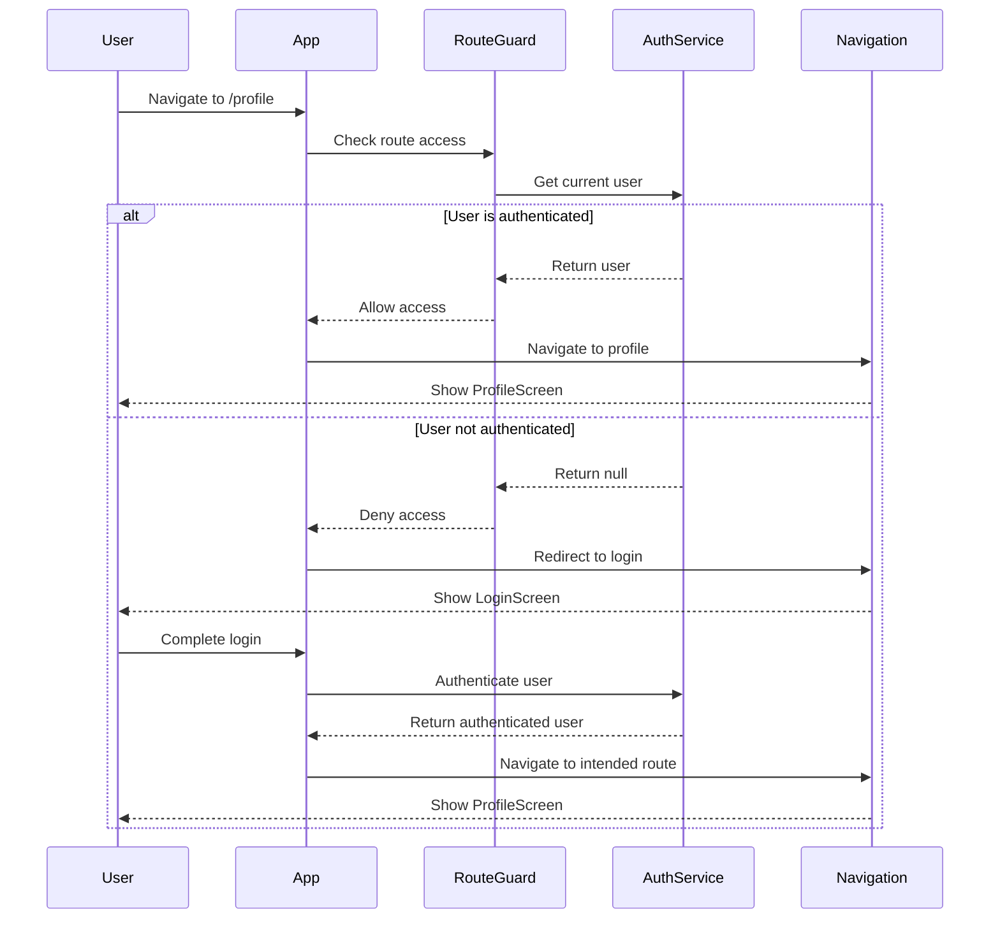
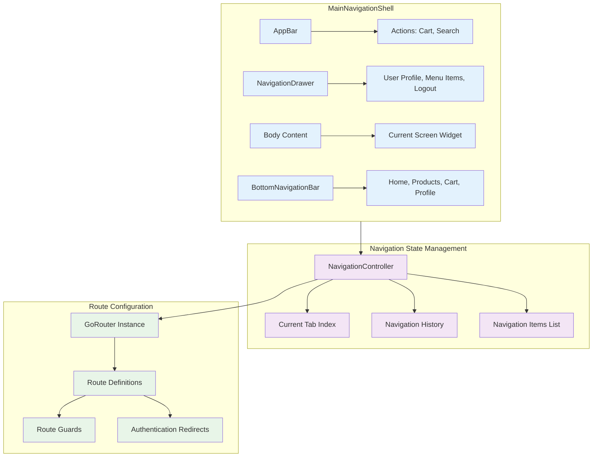
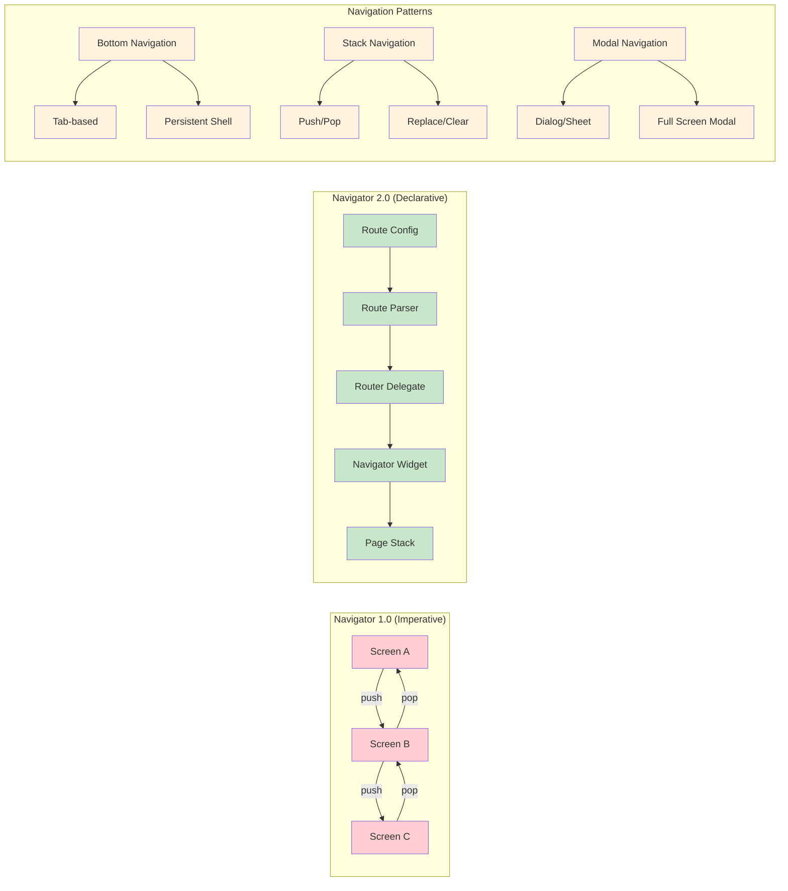
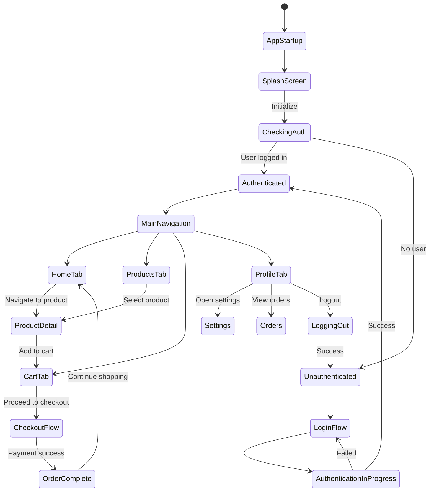
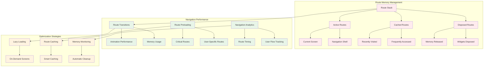
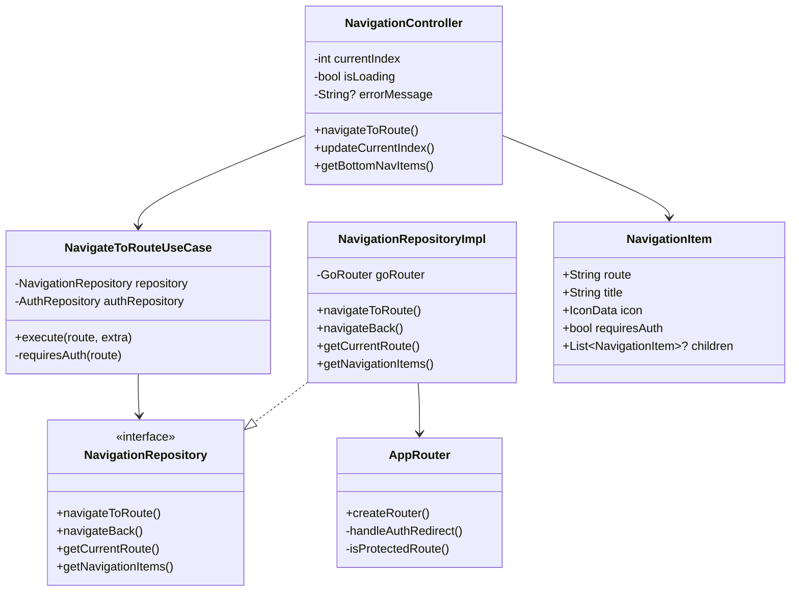

# 📜 Diagram

## 🎯 **Navigation Architecture Overview**

## 🧭 **Navigation Flow Diagram**

## 🏗️ **Route Structure Hierarchy**

## 🔒 **Authentication & Route Guards Flow**

## 📱 **Navigation UI Components Structure**

## 🎨 **Navigation Patterns Comparison**

## 🔄 **Navigation State Lifecycle**

## 📊 **Performance & Memory Management**

## 🧪 **Testing Strategy Diagram**

```mermaid
graph TB
    subgraph "Unit Tests"
        A[Navigation Use Cases] --> A1[Route Validation]
        A --> A2[Authentication Logic]
        A --> A3[Parameter Parsing]
        
        B[Navigation Entities] --> B1[Route Objects]
        B --> B2[User Models]
        B --> B3[Navigation Items]
    end
    
    subgraph "Widget Tests"
        C[Navigation Components] --> C1[Bottom Navigation]
        C --> C2[Navigation Drawer]
        C --> C3[AppBar Actions]
        
        D[Screen Tests] --> D1[Screen Rendering]
        D --> D2[Navigation Triggers]
        D --> D3[State Updates]
    end
    
    subgraph "Integration Tests"
        E[Navigation Flows] --> E1[Authentication Flow]
        E --> E2[Shopping Flow]
        E --> E3[Profile Management]
        
        F[Route Tests] --> F1[Deep Link Handling]
        F --> F2[Route Guards]
        F --> F3[Route Parameters]
    end
    
    subgraph "Test Doubles"
        G[Mock Services] --> G1[Mock Navigation Repository]
        G --> G2[Mock Auth Service]
        G --> G3[Mock Route Parser]
    end
    
    A --> G
    C --> G
    E --> G
    
    classDef unit fill:#e3f2fd
    classDef widget fill:#f3e5f5
    classDef integration fill:#e8f5e8
    classDef mocks fill:#fff3e0
    
    class A,B,A1,A2,A3,B1,B2,B3 unit
    class C,D,C1,C2,C3,D1,D2,D3 widget
    class E,F,E1,E2,E3,F1,F2,F3 integration
    class G,G1,G2,G3 mocks
```

## 🔧 **Implementation Architecture**

---

## 🎓 **Key Visual Learning Points**

### **🧭 Navigation Architecture**
- **Clean Separation**: Clear boundaries between presentation, domain, and data layers
- **Dependency Direction**: Dependencies point inward following clean architecture principles
- **Repository Pattern**: Navigation operations abstracted through interfaces

### **🔄 Navigation Flow**
- **Authentication Integration**: Route guards protect authenticated routes
- **State Management**: Centralized navigation state with proper lifecycle management
- **Error Handling**: Graceful handling of navigation failures and redirects

### **📱 UI Structure**
- **Shell Pattern**: Persistent navigation shell with tab-based navigation
- **Hierarchical Routes**: Proper parent-child route relationships
- **Component Separation**: Clear separation between navigation UI components

### **🎯 Performance Optimization**
- **Memory Management**: Proper disposal of navigation resources
- **Route Caching**: Smart caching of frequently accessed routes
- **Lazy Loading**: On-demand loading of navigation screens

These diagrams provide visual guidance for understanding the complex navigation patterns and architecture principles covered in this lesson. Use them as reference while implementing the navigation system in your Flutter application.

**Continue to:** [Workshop 6](workshop_06.md) to implement these concepts in practice!