# 📜 Diagram

## 🎨 **Material 3 Theming Architecture**

This lesson demonstrates a comprehensive theming system built with clean architecture principles and Material 3 design standards.

---

## **Theme Architecture Overview**


---

## **Theme Settings Data Flow**


---

## **Material 3 Color System Architecture**

```mermaid
graph TB
    subgraph "Seed Color Input"
        SC[Seed Color: #6750A4]
    end
    
    subgraph "HCT Color Space"
        H[Hue: 270°]
        C[Chroma: 36]
        T[Tone: 0-100]
    end
    
    SC --> H
    SC --> C
    SC --> T
    
    subgraph "Light Color Scheme"
        LP[Primary: Tone 40]
        LOL[OnPrimary: Tone 100]
        LPC[PrimaryContainer: Tone 90]
        LOPC[OnPrimaryContainer: Tone 10]
        LS[Secondary: Tone 40]
        LOS[OnSecondary: Tone 100]
        LSC[SecondaryContainer: Tone 90]
        LOSC[OnSecondaryContainer: Tone 10]
    end
    
    subgraph "Dark Color Scheme"
        DP[Primary: Tone 80]
        DOL[OnPrimary: Tone 20]
        DPC[PrimaryContainer: Tone 30]
        DOPC[OnPrimaryContainer: Tone 90]
        DS[Secondary: Tone 80]
        DOS[OnSecondary: Tone 20]
        DSC[SecondaryContainer: Tone 30]
        DOSC[OnSecondaryContainer: Tone 90]
    end
    
    H --> LP
    C --> LP
    T --> LP
    
    H --> DP
    C --> DP
    T --> DP
    
    style SC fill:#6750A4,color:#fff
    style LP fill:#6750A4,color:#fff
    style DP fill:#D0BCFF,color:#000
    style LPC fill:#EADDFF,color:#000
    style DPC fill:#4F378B,color:#fff
```



---

## **Theme Component Hierarchy**

```mermaid
graph TD
    subgraph "App Theme"
        AT[AppTheme.light() / AppTheme.dark()]
    end
    
    subgraph "Core Systems"
        CS[ColorScheme]
        TS[TextTheme]
        CE[Custom Extensions]
    end
    
    subgraph "Component Themes"
        AB[AppBarTheme]
        BN[BottomNavigationBarTheme]
        EB[ElevatedButtonTheme]
        OB[OutlinedButtonTheme]
        TB[TextButtonTheme]
        IT[InputDecorationTheme]
        CT[CardTheme]
        DT[DialogTheme]
        ST[SnackBarTheme]
    end
    
    subgraph "Custom Extensions"
        SP[SpacingThemeExtension]
        RT[RadiusThemeExtension]
        ET[EcommerceThemeExtension]
    end
    
    AT --> CS
    AT --> TS
    AT --> CE
    
    CS --> AB
    CS --> BN
    CS --> EB
    CS --> OB
    CS --> TB
    CS --> IT
    CS --> CT
    CS --> DT
    CS --> ST
    
    CE --> SP
    CE --> RT
    CE --> ET
    
    style AT fill:#e8f5e8
    style CS fill:#fff3e0
    style TS fill:#f3e5f5
    style CE fill:#e1f5fe
```

---

## **Theme State Management Pattern**


---

## **Accessibility Theme Considerations**


---

## **Performance Optimization Strategy**


---

## **Theme Testing Architecture**


---

## **Key Architecture Benefits**

### **🏗️ Clean Architecture**
- **Separation of Concerns**: Theme logic isolated from UI
- **Dependency Inversion**: Repository pattern enables testing
- **Single Responsibility**: Each class has one clear purpose
- **Testability**: Easy to mock dependencies and test logic

### **🎨 Material 3 Integration**
- **Dynamic Colors**: Generate harmonious color schemes
- **Accessibility**: WCAG compliant contrast ratios
- **Platform Integration**: System wallpaper color adaptation
- **Modern Design**: Latest Material Design specifications

### **⚡ Performance Optimization**
- **Efficient Caching**: Minimize theme generation overhead
- **Lazy Loading**: Generate themes only when needed
- **Minimal Rebuilds**: Update only affected widgets
- **Memory Management**: Proper disposal of resources

### **♿ Accessibility Excellence**
- **High Contrast**: Enhanced visibility for low vision users
- **Text Scaling**: Flexible font size adaptation
- **Color Independence**: Information not dependent on color alone
- **Screen Reader Support**: Semantic markup and navigation

**This theming architecture provides a solid foundation for creating beautiful, accessible, and maintainable Flutter applications! 🎨✨**