# 📜 Diagram

## 📱 **Responsive Layout Architecture**

This lesson demonstrates a comprehensive responsive design system that adapts beautifully to any screen size, from mobile phones to ultrawide displays.

---

## **Responsive Breakpoint System**

```mermaid
graph LR
    subgraph "Screen Sizes"
        Mobile[📱 Mobile<br/>0-767px<br/>1 Column]
        Tablet[📱 Tablet<br/>768-1023px<br/>2 Columns]
        Desktop[🖥️ Desktop<br/>1024-1439px<br/>3 Columns]
        Ultra[🖥️ Ultrawide<br/>1440px+<br/>4 Columns]
    end
    
    subgraph "Adaptive Navigation"
        BottomNav[Bottom Navigation<br/>Mobile]
        NavRail[Navigation Rail<br/>Tablet]
        NavDrawer[Navigation Drawer<br/>Desktop/Ultra]
    end
    
    Mobile --> BottomNav
    Tablet --> NavRail
    Desktop --> NavDrawer
    Ultra --> NavDrawer
    
    style Mobile fill:#e1f5fe
    style Tablet fill:#f3e5f5
    style Desktop fill:#e8f5e8
    style Ultra fill:#fff3e0
```

---

## **Responsive Layout Flow**

---

## **Adaptive Component Architecture**

---

## **Dashboard State Management Flow**

---

## **Responsive Grid System**

---

## **Adaptive Navigation Patterns**

```mermaid
stateDiagram-v2
    [*] --> DetectScreenSize
    
    DetectScreenSize --> Mobile : width < 768px
    DetectScreenSize --> Tablet : 768px ≤ width < 1024px
    DetectScreenSize --> Desktop : width ≥ 1024px
    
    Mobile --> BottomNavigation
    BottomNavigation --> ShowFAB
    BottomNavigation --> LimitNavItems : Max 5 items
    
    Tablet --> NavigationRail
    NavigationRail --> CompactMode
    NavigationRail --> SideLayout
    
    Desktop --> NavigationDrawer
    NavigationDrawer --> ExtendedMode
    NavigationDrawer --> FullLabels
    
    ShowFAB --> ResponsiveContent
    LimitNavItems --> ResponsiveContent
    CompactMode --> ResponsiveContent
    SideLayout --> ResponsiveContent
    ExtendedMode --> ResponsiveContent
    FullLabels --> ResponsiveContent
```

---

## **Typography Scaling System**

```mermaid
graph LR
    subgraph "Font Size Scaling"
        Mobile_Font[Mobile<br/>Base × 0.9]
        Tablet_Font[Tablet<br/>Base × 1.0]
        Desktop_Font[Desktop<br/>Base × 1.1]
        Ultra_Font[Ultrawide<br/>Base × 1.2]
    end
    
    subgraph "Line Height Scaling"
        Mobile_LH[Mobile<br/>1.2]
        Tablet_LH[Tablet<br/>1.3]
        Desktop_LH[Desktop<br/>1.4]
        Ultra_LH[Ultrawide<br/>1.4]
    end
    
    Mobile_Font --> Mobile_LH
    Tablet_Font --> Tablet_LH
    Desktop_Font --> Desktop_LH
    Ultra_Font --> Ultra_LH
    
    style Mobile_Font fill:#ffcdd2
    style Tablet_Font fill:#dcedc8
    style Desktop_Font fill:#c8e6c9
    style Ultra_Font fill:#b2dfdb
```

---

## **Content Adaptation Strategy**

---

## **Responsive Testing Matrix**

```mermaid
graph TB
    subgraph "Device Testing"
        Phone[📱 Phone<br/>320-480px]
        LargePhone[📱 Large Phone<br/>480-768px]
        SmallTablet[📱 Small Tablet<br/>768-1024px]
        LargeTablet[📱 Large Tablet<br/>1024-1366px]
        Laptop[💻 Laptop<br/>1366-1920px]
        Desktop[🖥️ Desktop<br/>1920px+]
    end
    
    subgraph "Test Scenarios"
        Portrait[📱 Portrait]
        Landscape[📱 Landscape]
        WindowResize[🖥️ Window Resize]
        ZoomLevels[🔍 Zoom Levels]
    end
    
    subgraph "Validation Points"
        Navigation[✅ Navigation Works]
        Content[✅ Content Readable]
        Interaction[✅ Touch Targets]
        Performance[✅ Smooth Transitions]
    end
    
    Phone --> Portrait
    LargePhone --> Landscape
    SmallTablet --> WindowResize
    Desktop --> ZoomLevels
    
    Portrait --> Navigation
    Landscape --> Content
    WindowResize --> Interaction
    ZoomLevels --> Performance
```

---

## **Performance Optimization Flow**

---

## **Key Architecture Benefits**

### **🏗️ Responsive Foundation**
- **Universal Compatibility**: Works perfectly on any screen size
- **Future-Proof Design**: Adapts to new device form factors automatically
- **Performance Optimized**: Minimal rebuilds and efficient rendering
- **Developer Friendly**: Simple API with powerful customization options

### **📱 Adaptive User Experience**
- **Platform Native Feel**: Follows platform conventions on each device
- **Context Aware Navigation**: Appropriate navigation patterns for each screen
- **Content Prioritization**: Most important content always visible
- **Smooth Transitions**: Seamless layout changes during resize

### **🎨 Design System Integration**
- **Consistent Spacing**: Harmonious spacing across all breakpoints
- **Scalable Typography**: Readable text at every screen size
- **Flexible Grid System**: Adapts content layout intelligently
- **Theme Integration**: Responsive theming with Material 3 support

### **🚀 Developer Experience**
- **Clean Architecture**: Separated concerns for responsive logic
- **Reusable Components**: Adaptive widgets for consistent behavior
- **Easy Testing**: Comprehensive testing strategies for responsive layouts
- **Documentation**: Clear patterns and usage guidelines

**This responsive architecture provides a solid foundation for creating universally excellent user experiences across all devices and screen sizes! 📱💻🖥️✨**