# 📜 Diagram

## 🎬 **Flutter Animation Architecture**

This lesson demonstrates Flutter's comprehensive animation system, from basic implicit animations to complex coordinated sequences for professional onboarding experiences.

---

## **Animation System Hierarchy**

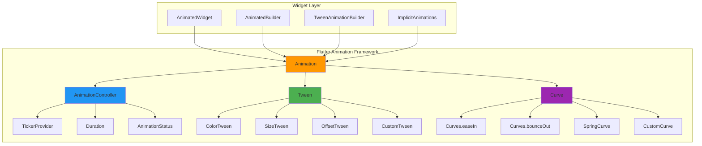

---

## **Animation Lifecycle Management**

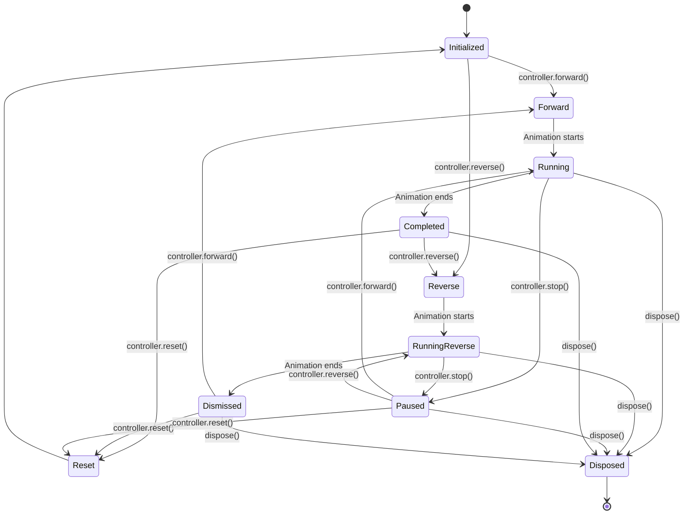

---

## **Onboarding Animation Flow**

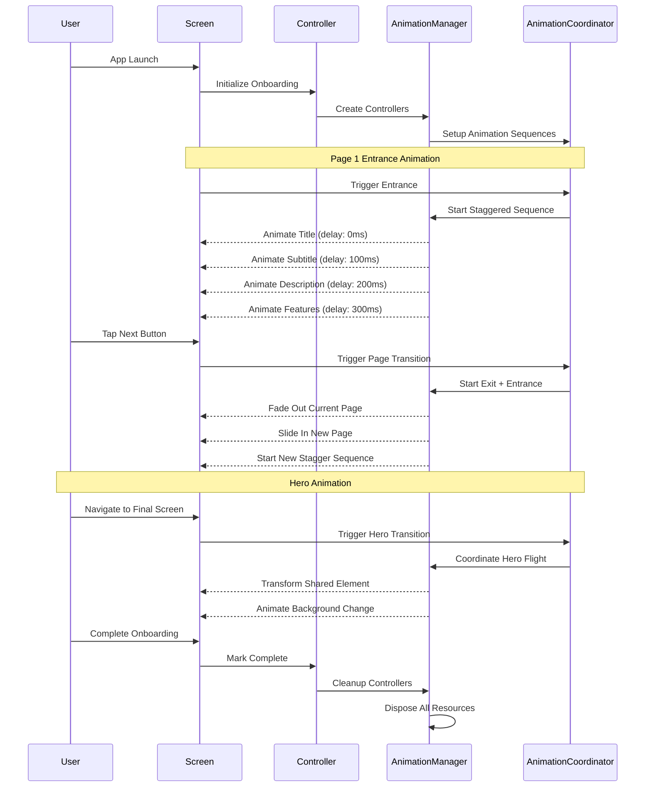

---

## **Staggered Animation Pattern**

```mermaid
gantt
    title Staggered Animation Timeline
    dateFormat X
    axisFormat %L ms
    
    section Content Reveal
    Title Animation         :active, title, 0, 600
    Subtitle Animation      :active, subtitle, 100, 700
    Description Animation   :active, desc, 200, 800
    Feature 1 Animation     :active, f1, 300, 900
    Feature 2 Animation     :active, f2, 400, 1000
    Feature 3 Animation     :active, f3, 500, 1100
    
    section Entrance Effects
    Fade In                 :fade, 0, 600
    Slide Up                :slide, 100, 700
    Scale In                :scale, 200, 800
    
    section User Interaction
    Button Ready            :button, 1100, 1200
```

---

## **Animation Controller Management**

```mermaid
classDiagram
    class AnimationControllerManager {
        +TickerProvider tickerProvider
        +List~AnimationController~ controllers
        +createController() AnimationController
        +createAnimation() Animation~T~
        +createStaggeredAnimations() List~Animation~
        +dispose() void
    }
    
    class AnimationCoordinator {
        +AnimationController pageTransitionController
        +AnimationController contentController
        +AnimationController buttonController
        +AnimationController progressController
        +animatePageEntrance() Future~void~
        +animateContent() Future~void~
        +updateProgress() Future~void~
    }
    
    class OnboardingController {
        +List~OnboardingPage~ pages
        +int currentPageIndex
        +bool isAnimating
        +nextPage() Future~void~
        +previousPage() Future~void~
        +completeOnboarding() void
    }
    
    class AnimationMixins {
        <<mixin>>
        +AnimationManagerMixin
        +EntranceAnimationMixin
        +buildWithEntranceAnimation() Widget
    }
    
    AnimationControllerManager --> AnimationCoordinator
    AnimationCoordinator --> OnboardingController
    AnimationMixins -.-> AnimationControllerManager
```

---

## **Hero Animation Architecture**

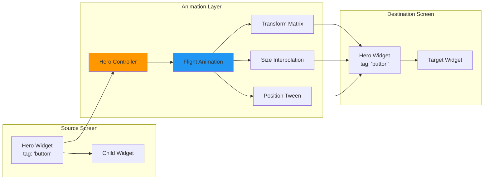

---

## **Performance Optimization Flow**

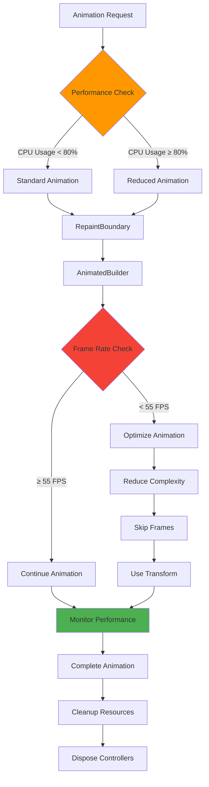

---

## **Custom Curve Visualization**

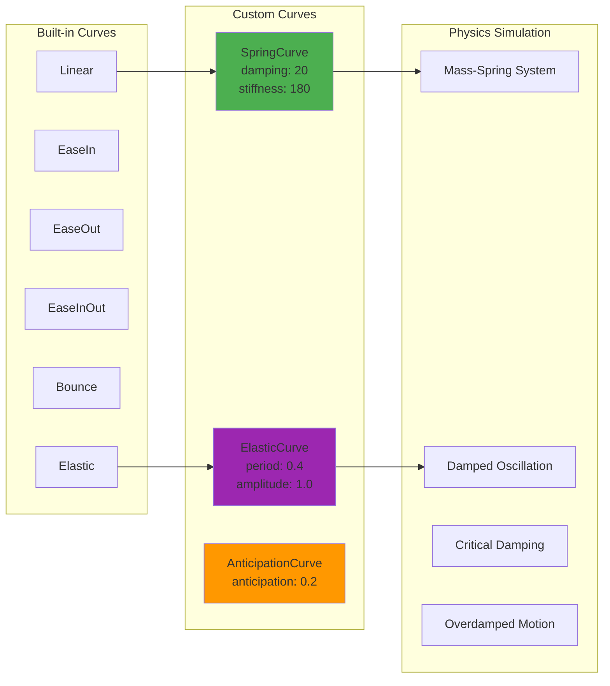

---

## **Memory Management Pattern**

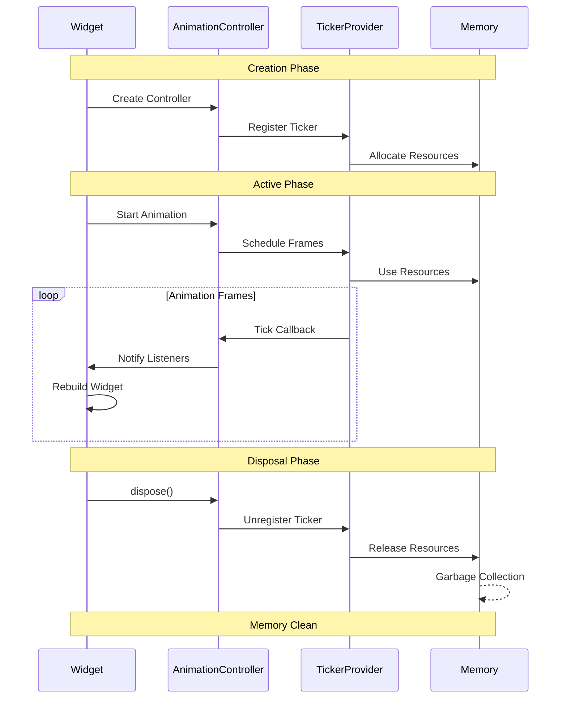

---

## **Animation Types Comparison**

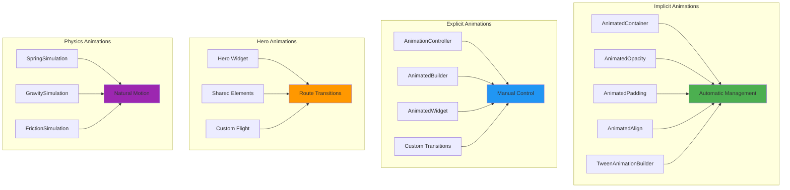

---

## **Onboarding User Journey**

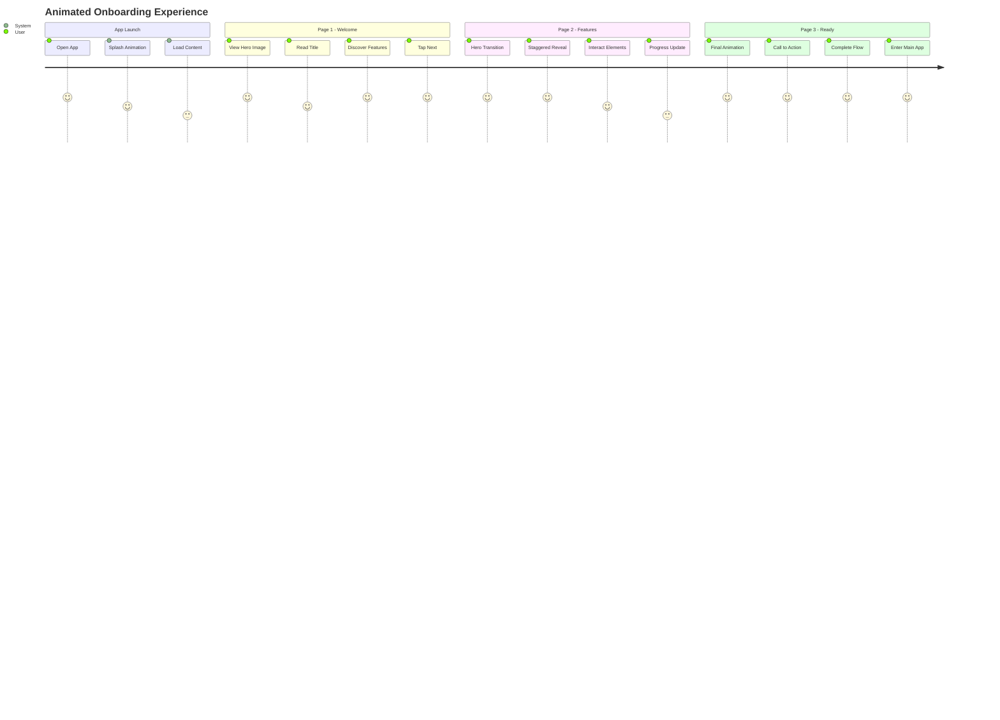

---

## **Performance Metrics**

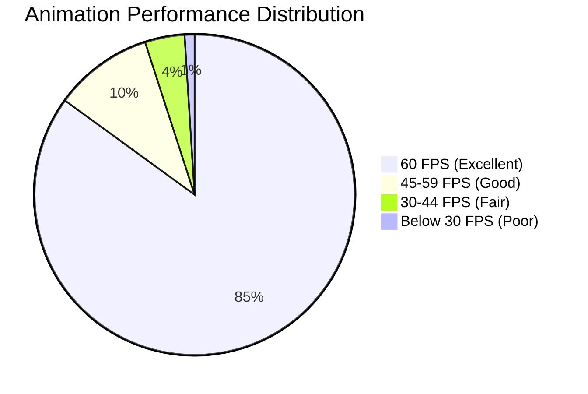

---

## **Animation Debugging Flow**

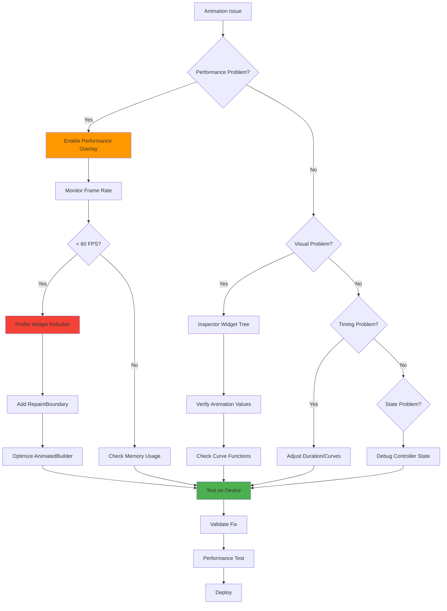

---

## **Key Architecture Benefits**

### **🎬 Animation Excellence**
- **Smooth Motion**: 60fps animations with proper easing curves
- **Natural Physics**: Spring and elastic curves for realistic motion
- **Coordinated Sequences**: Staggered animations for professional polish
- **Hero Transitions**: Seamless shared element animations

### **🚀 Performance Optimization**
- **Efficient Rendering**: RepaintBoundary and AnimatedBuilder patterns
- **Memory Management**: Proper controller lifecycle and disposal
- **Frame Rate Monitoring**: Real-time performance validation
- **Battery Efficiency**: Optimized animation scheduling

### **🏗️ Clean Architecture**
- **Separation of Concerns**: Animation logic separated from business logic
- **Reusable Components**: Animation mixins and utility classes
- **Testable Code**: Mockable animation controllers for unit tests
- **Maintainable Patterns**: Consistent animation management across the app

### **🎯 Developer Experience**
- **Type Safety**: Strongly typed animation configurations
- **Easy Integration**: Mixin-based animation setup
- **Debug Support**: Comprehensive animation debugging tools
- **Documentation**: Clear patterns and usage examples

### **📱 User Experience**
- **Delightful Interactions**: Micro-animations that provide feedback
- **Visual Continuity**: Hero animations maintain context
- **Professional Polish**: Staggered reveals and smooth transitions
- **Accessibility**: Respects user motion preferences

**This animation architecture provides the foundation for creating world-class animated experiences that delight users while maintaining excellent performance! 🎬✨🚀**