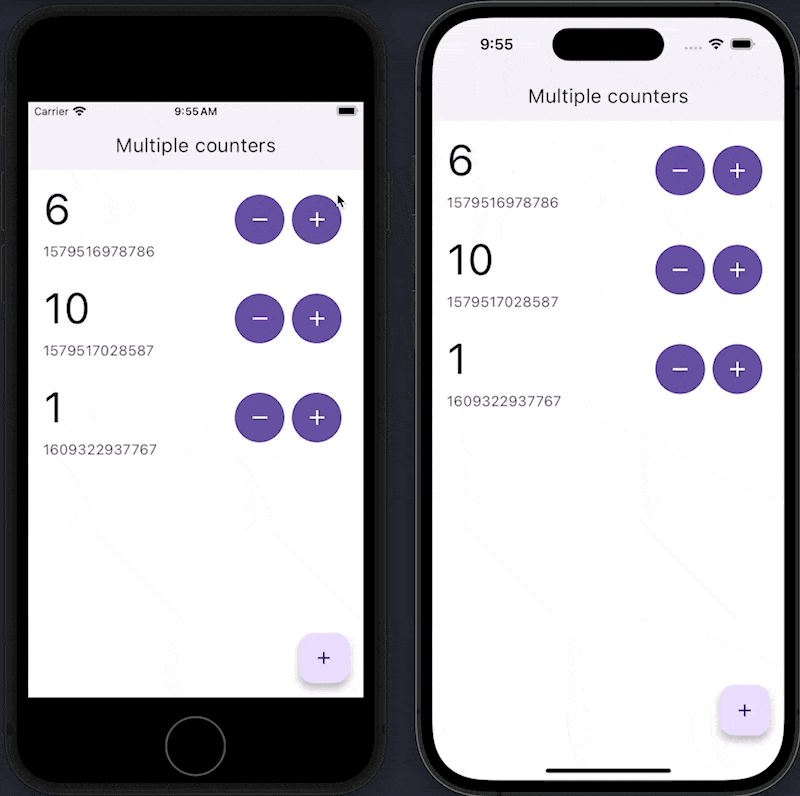
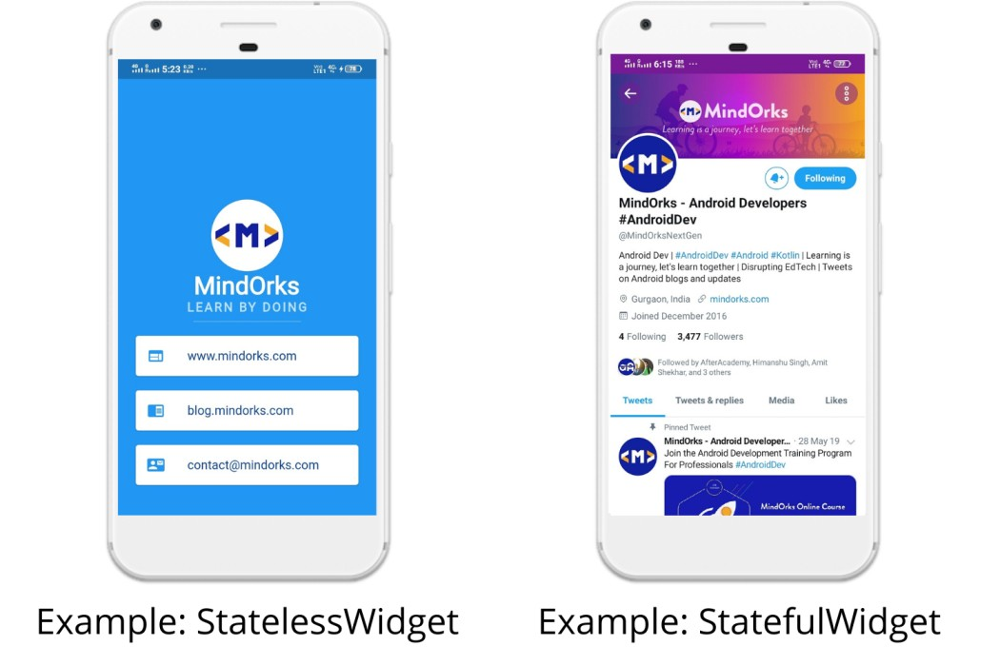
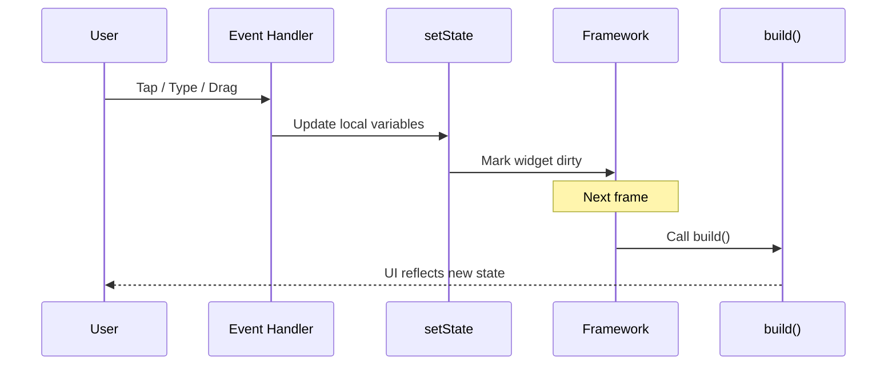
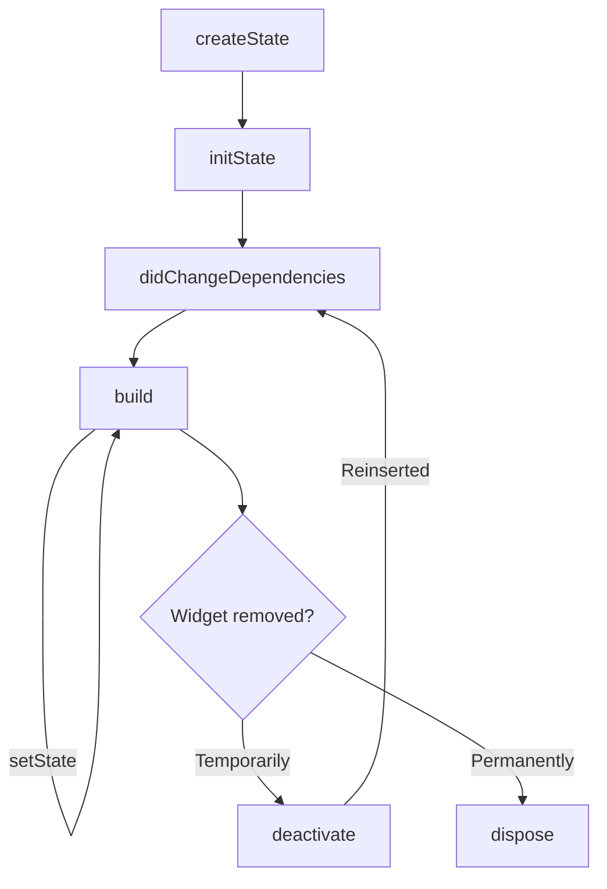

<!-- import { StatefulDemo } from '../lesson_04/components/StatefulDemo.jsx'; -->

# 🎯 Concepts

### Introduce: What is state in Flutter?




State is data that can change after the UI is first built.

In simple terms: when your app loads, some data stays the same, but some data can change because of time, user actions, or API responses → that’s called State.

---
### Snapshot from the Flutter docs
The official [Flutter state management fundamentals](https://docs.flutter.dev/get-started/fundamentals/state-management) break state into two buckets:
- **Ephemeral State (Local State)** – short-lived UI details owned by a single widget (for example a checkbox toggle). Manage this with `setState()` and keep the widget small.
- **App State (Shared State)** – data that spans many widgets or survives navigation (authentication status, user settings, cart contents). This usually lives above the UI tree and is exposed with an inherited widget or a dedicated package.


### When do we use a StatefulWidget?
- The UI reacts to user input (buttons, text fields, gestures)
- You listen to timers, streams, or API responses
- You manage controllers (animation, text) that must be disposed

> ⚡️ Memory hook: *If the UI changes without navigating away, you’re managing state.*



---
## Core Pattern Demo
Walk through a minimal counter to highlight the moving pieces.

```dart
class CounterScreen extends StatefulWidget {
  const CounterScreen({super.key});

  @override
  State<CounterScreen> createState() => _CounterScreenState();
}

class _CounterScreenState extends State<CounterScreen> {
  int _count = 0;

  void _increment() {
    setState(() {
      _count++;
    });
  }

  @override
  Widget build(BuildContext context) {
    return Scaffold(
      appBar: AppBar(title: const Text('Counter')),
      body: Center(
        child: Text('$_count', style: const TextStyle(fontSize: 48)),
      ),
      floatingActionButton: FloatingActionButton(
        onPressed: _increment,
        child: const Icon(Icons.add),
      ),
    );
  }
}
```

---

## `setState` Under the Hood
Use this simple flow to demystify what happens after `setState`.


---

## Lifecycle Tour
Highlight the four methods beginners must memorize:
- `initState()` → one-time setup (controllers, analytics, initial fetch)
- `didChangeDependencies()` → respond when inherited data (like theme) changes
- `build()` → describe the UI; keep it pure and fast
- `dispose()` → clean up controllers, streams, timers

Show the diagram first, then open the code snippet.



### Quick demo idea
Add print statements to each lifecycle method and hot reload the widget. Have learners predict which message appears first when navigating away from the screen.

```dart
class LifecycleLogger extends StatefulWidget {
  const LifecycleLogger({super.key});

  @override
  State<LifecycleLogger> createState() => _LifecycleLoggerState();
}

class _LifecycleLoggerState extends State<LifecycleLogger> {
  @override
  void initState() { //*
    super.initState();
    debugPrint('initState');
  }

  @override
  void didChangeDependencies() {
    super.didChangeDependencies();
    debugPrint('didChangeDependencies');
  }

  @override
  Widget build(BuildContext context) {
    debugPrint('build');
    return const Placeholder();
  }

  @override
  void dispose() {
    debugPrint('dispose');
    super.dispose();
  }
}
```
