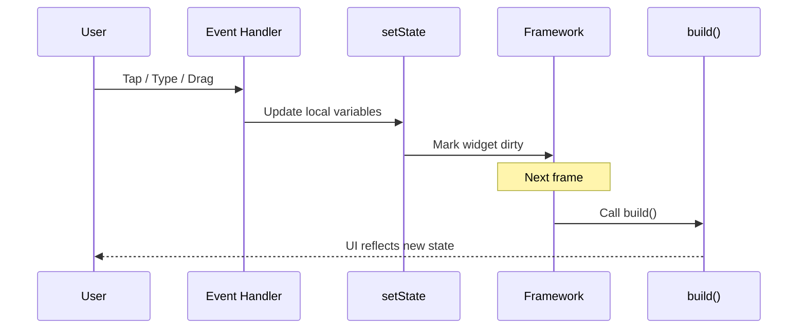
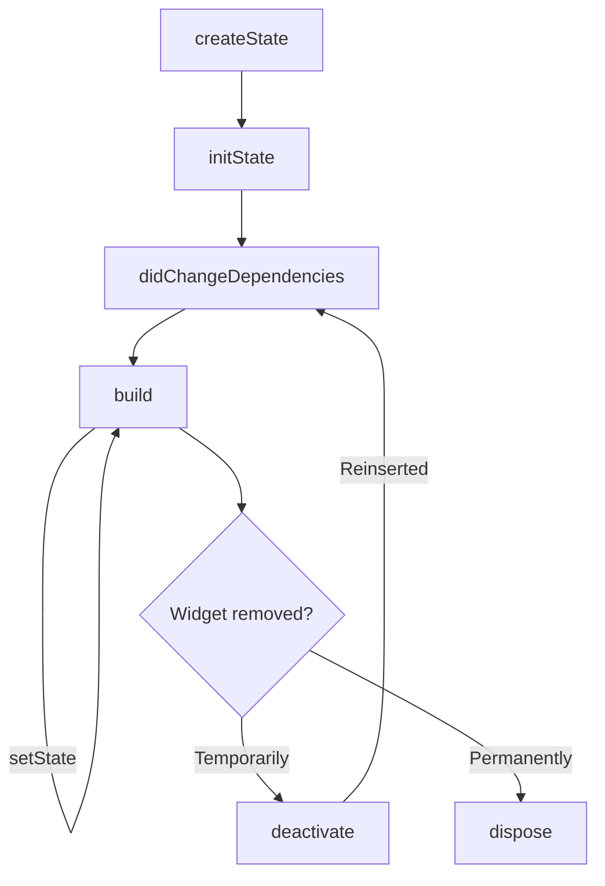

# 🎯 Concepts

## Stateful Widgets (Minimal)

## 🎯 Learning Goals
- Know when to reach for `StatefulWidget`
- Explain the `setState()` → rebuild loop with confidence
- Use the core lifecycle methods (`initState`, `build`, `dispose`)

---

## 1. Introduce: Why State Matters? 
### [WIP] ตามหารูปมาใส่
State is **data that changes after the first frame**. Reach for a `StatefulWidget` when:
- The UI reacts to user input (buttons, text fields, gestures)
- You listen to timers, streams, or API responses
- You manage controllers (animation, text) that must be disposed

> ⚡️ Memory hook: *If the UI changes without navigating away, you’re managing state.*

### Snapshot from the Flutter docs
The official [Flutter state management fundamentals](https://docs.flutter.dev/get-started/fundamentals/state-management) break state into two buckets:
- **Ephemeral (local) state** – short-lived UI details owned by a single widget (for example a checkbox toggle). Manage this with `setState()` and keep the widget small.
- **App state** – data that spans many widgets or survives navigation (authentication status, user settings, cart contents). This usually lives above the UI tree and is exposed with an inherited widget or a dedicated package.

Questions encouraged by the docs:
- *Who needs this data?* → Lift the state up to the nearest common ancestor.
- *How long should it live?* → If it must survive app restarts or deep navigation, plan for a shared manager.
- *How complex is the mutation?* → Start with `setState`, introduce tooling like Provider/Riverpod/Bloc only when the surface area grows.

---

## 2. Core Pattern Demo
Walk through a minimal counter to highlight the moving pieces.

```dart
class CounterScreen extends StatefulWidget {
  const CounterScreen({super.key});

  @override
  State<CounterScreen> createState() => _CounterScreenState();
}

class _CounterScreenState extends State<CounterScreen> {
  int _count = 0;

  void _increment() {
    setState(() {
      _count++;
    });
  }

  @override
  Widget build(BuildContext context) {
    return Scaffold(
      appBar: AppBar(title: const Text('Counter')),
      body: Center(
        child: Text('$_count', style: const TextStyle(fontSize: 48)),
      ),
      floatingActionButton: FloatingActionButton(
        onPressed: _increment,
        child: const Icon(Icons.add),
      ),
    );
  }
}
```

### Talking points
- Mutable fields live in `_CounterScreenState`
- Related changes stay inside one `setState`
- `build()` re-runs after **every** `setState`
- You can add `setState(() => _count = 0);` for a reset button as a mini challenge

---

## 3. `setState` Under the Hood
Use this simple flow to demystify what happens after `setState`.

### [WIP] ตามหารูปมาใส่แทน


---

## 4. Lifecycle Tour
Highlight the four methods beginners must memorize:
- `initState()` → one-time setup (controllers, analytics, initial fetch)
- `didChangeDependencies()` → respond when inherited data (like theme) changes
- `build()` → describe the UI; keep it pure and fast
- `dispose()` → clean up controllers, streams, timers

Show the diagram first, then open the code snippet.

### [WIP] ตามหารูปมาใส่แทน




### Quick demo idea
Add print statements to each lifecycle method and hot reload the widget. Have learners predict which message appears first when navigating away from the screen.

```dart
class LifecycleLogger extends StatefulWidget {
  const LifecycleLogger({super.key});

  @override
  State<LifecycleLogger> createState() => _LifecycleLoggerState();
}

class _LifecycleLoggerState extends State<LifecycleLogger> {
  @override
  void initState() {
    super.initState();
    debugPrint('initState');
  }

  @override
  void didChangeDependencies() {
    super.didChangeDependencies();
    debugPrint('didChangeDependencies');
  }

  @override
  Widget build(BuildContext context) {
    debugPrint('build');
    return const Placeholder();
  }

  @override
  void dispose() {
    debugPrint('dispose');
    super.dispose();
  }
}
```

Ask: “Which hook runs when you pop the screen? What about when you hot reload?”

---
<!-- 
## 5. Async Safety Pattern (20‒26 min)
Demonstrate how to handle async updates without leaking resources using a debounced search.

```dart
class DebouncedSearch extends StatefulWidget {
  const DebouncedSearch({super.key});

  @override
  State<DebouncedSearch> createState() => _DebouncedSearchState();
}

class _DebouncedSearchState extends State<DebouncedSearch> {
  final List<String> _source = const ['Pikachu', 'Charmander', 'Eevee'];
  List<String> _results = const [];
  String _query = '';
  Timer? _debounce;

  @override
  void initState() {
    super.initState();
    _results = _source;
  }

  void _onChanged(String value) {
    _debounce?.cancel();
    _query = value;

    _debounce = Timer(const Duration(milliseconds: 300), () {
      if (!mounted) return;
      final filtered = value.isEmpty
          ? _source
          : _source.where((item) => item.toLowerCase().contains(value.toLowerCase())).toList();

      setState(() {
        _results = filtered;
      });
    });
  }

  @override
  void dispose() {
    _debounce?.cancel();
    super.dispose();
  }

  @override
  Widget build(BuildContext context) {
    return Column(
      crossAxisAlignment: CrossAxisAlignment.start,
      children: [
        TextField(
          onChanged: _onChanged,
          decoration: const InputDecoration(labelText: 'Search Pokémon'),
        ),
        const SizedBox(height: 12),
        Text(_query.isEmpty ? 'All results' : 'Matches for "$_query"'),
        const SizedBox(height: 8),
        ..._results.map(Text.new),
      ],
    );
  }
}
``` -->

### Discussion prompts
- Why cancel the timer in `dispose()`?
- What happens if you remove the `mounted` guard?
- How would you show a loading spinner while the timer waits?

📝 **Flutter docs call-out**
- The docs note that asynchronous work belongs in the state object, not in the widget class. This pattern keeps the widget immutable and the `State` responsible for changes.
- They also stress that widgets are cheap but state objects are persistent: always dispose long-lived handles (text controllers, animation controllers, stream subscriptions) inside `dispose()`.

---

## 6. Quick Dos and Don'ts
- ✅ Batch related changes inside a single `setState`
- ✅ Keep `build()` pure; compute heavy work beforehand
- ✅ Dispose controllers, streams, and timers
- ❌ Avoid calling `setState` during `build()` or `initState`
- ❌ Never mutate state from outside the `State` class

Invite learners to add one more “do” based on what they just watched.

---

## 7. Practice & Wrap-up 
**Mini challenge:** Ask learners to add a “Reset” button to `CounterScreen` that sets `_count` to zero and shows a `SnackBar`. Give them two minutes, then walkthrough.

**Recap checklist**
1. Explain when state is required
2. Trace the `setState` → rebuild flow
3. Memorize the lifecycle hotspots
4. Guard async code with `mounted` and clean up in `dispose`

**Next steps**
- Try a toggle button that swaps icons when tapped
- Add a countdown timer using `Timer.periodic`
- Introduce `InheritedWidget` or Provider for shared state once this foundation is solid

Encourage learners to practice by refactoring a stateless screen from their project into a `StatefulWidget` and note what changes.

---

## 8. Instructor Notes: Extending Beyond 30 Minutes
Pulling directly from the Flutter documentation can help you answer “what’s next?” when students are curious about bigger apps:

- **Start simple**: Flutter suggests beginning every feature with `setState` so you understand the data flow before extracting it.
- **Evolve deliberately**: When state must be shared broadly, lift it into an inherited widget or reach for a package that builds on those APIs (Provider is the doc’s baseline recommendation because it stays close to Flutter’s core patterns).
- **Other popular options**: Riverpod and Bloc use the same underlying principles but add tooling like compile-time safety or stream-based events. Frame them as natural progressions, not replacements.
- **Persistence & undo**: Anything that must survive app restarts or allow undo/redo is “app state”—the docs recommend dedicated state holders or services for this tier.
- **Testing mindset**: The docs emphasise that separating state from presentation makes it easier to write unit tests for business rules while keeping widgets focused on rendering.

Use these notes to spin follow-up lessons or to point learners at the official guide for self-study.
