# 📜 Diagram

## 🔄 **StatefulWidget Lifecycle & State Management**

This lesson demonstrates the complete StatefulWidget lifecycle, setState patterns, and clean architecture approaches to local state management through a comprehensive task management application.

---

## **StatefulWidget Lifecycle Flow**


---

## **setState Execution Pattern**


---

## **State Lifting Architecture**


---

## **Task Management State Flow**


---

## **setState Performance Optimization**

```mermaid
flowchart TD
    A[User Interaction] --> B{Multiple setState calls?}
    B -->|Yes| C[Batch setState Calls]
    B -->|No| D[Single setState Call]
    
    C --> E[Single build() Execution]
    D --> E
    
    E --> F{Expensive Operations?}
    F -->|Yes| G[Move to Separate Method]
    F -->|No| H[Keep in setState Block]
    
    G --> I[Call Method Before setState]
    I --> J[Minimal setState Block]
    
    H --> K[Execute setState]
    J --> K
    
    K --> L[Framework Schedules Build]
    L --> M{RepaintBoundary Used?}
    
    M -->|Yes| N[Isolated Rebuilds]
    M -->|No| O[Widget Tree Rebuild]
    
    N --> P[Optimized Performance]
    O --> Q[Check for Optimization]
    
    Q --> R{const Constructors?}
    R -->|Yes| S[Cached Widgets]
    R -->|No| T[Add const Where Possible]
    
    S --> P
    T --> P
    
    style C fill:#4caf50
    style G fill:#ff9800
    style N fill:#2196f3
    style P fill:#9c27b0
```

---

## **Clean Architecture with setState**

```mermaid
classDiagram
    class Task {
        +String id
        +String title
        +String description
        +TaskPriority priority
        +TaskStatus status
        +DateTime createdAt
        +DateTime? dueDate
        +List~String~ tags
        
        +copyWith() Task
        +markCompleted() Task
        +isOverdue bool
        +priorityColor Color
    }
    
    class AppState {
        +List~Task~ tasks
        +TaskFilter currentFilter
        +bool isLoading
        +String? errorMessage
        
        +copyWith() AppState
        +filteredTasks List~Task~
        +taskStats Map~String,int~
        +clearError() AppState
        +setLoading() AppState
    }
    
    class TaskController {
        -AppState _appState
        -LifecycleLogger logger
        -AnimationController controller
        
        +addTask(Task) Future~void~
        +updateTask(Task) Future~void~
        +deleteTask(String) Future~void~
        +toggleTaskCompletion(String) void
        +applyFilter(TaskFilter) void
        +refresh() Future~void~
    }
    
    class LifecycleMixin {
        <<mixin>>
        +setStateWithLogging(VoidCallback, String) void
        +buildWithLogging(BuildContext) Widget
        +logger LifecycleLogger
    }
    
    class ValidationMixin {
        <<mixin>>
        +validateRequired(String?) String?
        +validateEmail(String?) String?
        +validateMinLength(String?, int) String?
        +validateMaxLength(String?, int) String?
    }
    
    AppState --> Task : contains
    TaskController --> AppState : manages
    TaskController -.-> LifecycleMixin : uses
    TaskController -.-> ValidationMixin : uses
```

---

## **Memory Management & Resource Cleanup**


---

## **Task Management Application Architecture**


---

## **Error Handling & Validation Flow**


---

## **Performance Monitoring Dashboard**


---

## **Testing Strategy Pyramid**


---

## **Best Practices Checklist**

```mermaid
mindmap
  root((setState Best Practices))
    Lifecycle
      ✅ Proper initState setup
      ✅ Resource cleanup in dispose
      ✅ Check mounted before setState
      ✅ Handle didUpdateWidget changes
    
    Performance
      ✅ Batch multiple setState calls
      ✅ Keep setState blocks minimal
      ✅ Use const constructors
      ✅ RepaintBoundary for expensive widgets
    
    State Management
      ✅ Immutable state objects
      ✅ Lift state up appropriately
      ✅ Clear separation of concerns
      ✅ Validate input early
    
    Error Handling
      ✅ Async operation safety
      ✅ User-friendly error messages
      ✅ Graceful error recovery
      ✅ Loading state management
    
    Testing
      ✅ Test state changes
      ✅ Mock dependencies
      ✅ Test lifecycle methods
      ✅ Performance regression tests
```



---

## **Common Anti-Patterns to Avoid**

```mermaid
graph LR
    subgraph "❌ Anti-Patterns"
        A[setState in build]
        B[Not checking mounted]
        C[Memory leaks]
        D[Expensive operations in setState]
        E[Mutable state objects]
    end
    
    subgraph "✅ Solutions"
        F[Use lifecycle methods]
        G[Always check mounted]
        H[Proper disposal]
        I[Pre-calculate outside setState]
        J[Immutable objects with copyWith]
    end
    
    A --> F
    B --> G
    C --> H
    D --> I
    E --> J
    
    style A fill:#f44336
    style B fill:#f44336
    style C fill:#f44336
    style D fill:#f44336
    style E fill:#f44336
    
    style F fill:#4caf50
    style G fill:#4caf50
    style H fill:#4caf50
    style I fill:#4caf50
    style J fill:#4caf50
```



---

## **Key Architecture Benefits**

### **🔄 State Management Excellence**
- **Complete Lifecycle Control**: Proper management of all StatefulWidget lifecycle methods
- **Performance Optimization**: Efficient setState patterns with monitoring and batching
- **Resource Management**: Comprehensive cleanup to prevent memory leaks
- **Error Resilience**: Robust error handling with recovery mechanisms

### **🏗️ Clean Architecture**
- **Separation of Concerns**: Clear boundaries between UI, state, and business logic
- **Immutable State**: Predictable state changes with copyWith patterns
- **Testable Code**: Well-structured code that's easy to test and maintain
- **Reusable Components**: Mixins and utilities for consistent behavior

### **⚡ Performance Excellence**
- **Efficient Rebuilds**: Minimized widget rebuilds with RepaintBoundary
- **Performance Monitoring**: Real-time tracking of setState operations
- **Memory Efficiency**: Proper disposal of controllers and listeners
- **Frame Rate Optimization**: Smooth 60fps performance

### **🧪 Quality Assurance**
- **Comprehensive Testing**: Unit, widget, and integration test coverage
- **Lifecycle Logging**: Detailed debugging information for development
- **Validation Framework**: Robust input validation with user feedback
- **Error Recovery**: Graceful handling of edge cases and failures

### **👥 Developer Experience**
- **Clear Patterns**: Consistent approaches to common state management scenarios
- **Debugging Tools**: Lifecycle logging and performance monitoring
- **Type Safety**: Strongly typed state objects and validation
- **Documentation**: Clear examples and usage patterns

**This setState foundation provides the essential knowledge for mastering all Flutter state management patterns! 🔄✨🚀**