# 📜 Diagram for Lesson 11: InheritedWidget & Provider

## 🌳 **InheritedWidget & Provider State Management**

This lesson demonstrates the evolution from local state to shared state management, showing how InheritedWidget provides Flutter's built-in dependency injection and how Provider simplifies this pattern while adding powerful reactive features.

---

## **State Management Evolution**

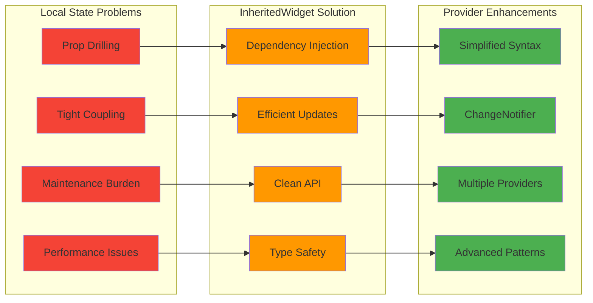

---

## **InheritedWidget Architecture**

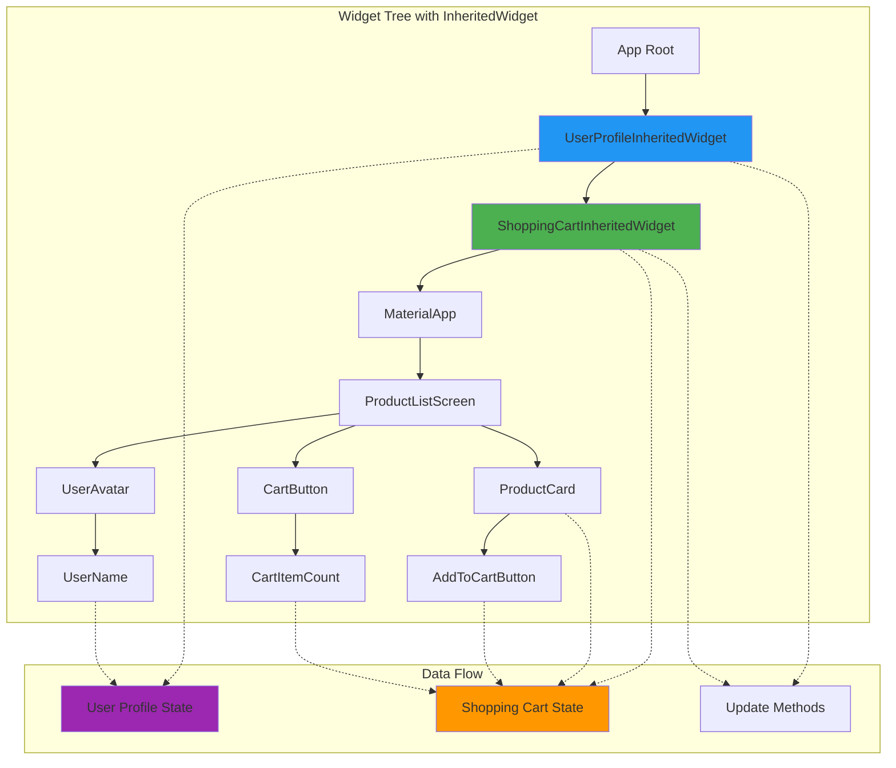

---

## **Provider Architecture & Data Flow**

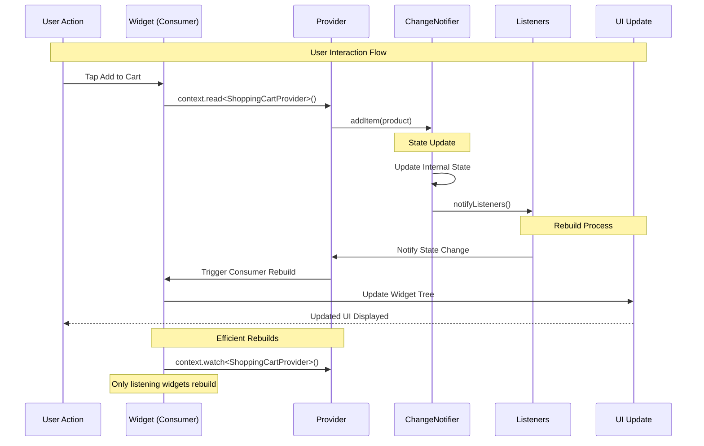

---

## **ChangeNotifier Pattern**

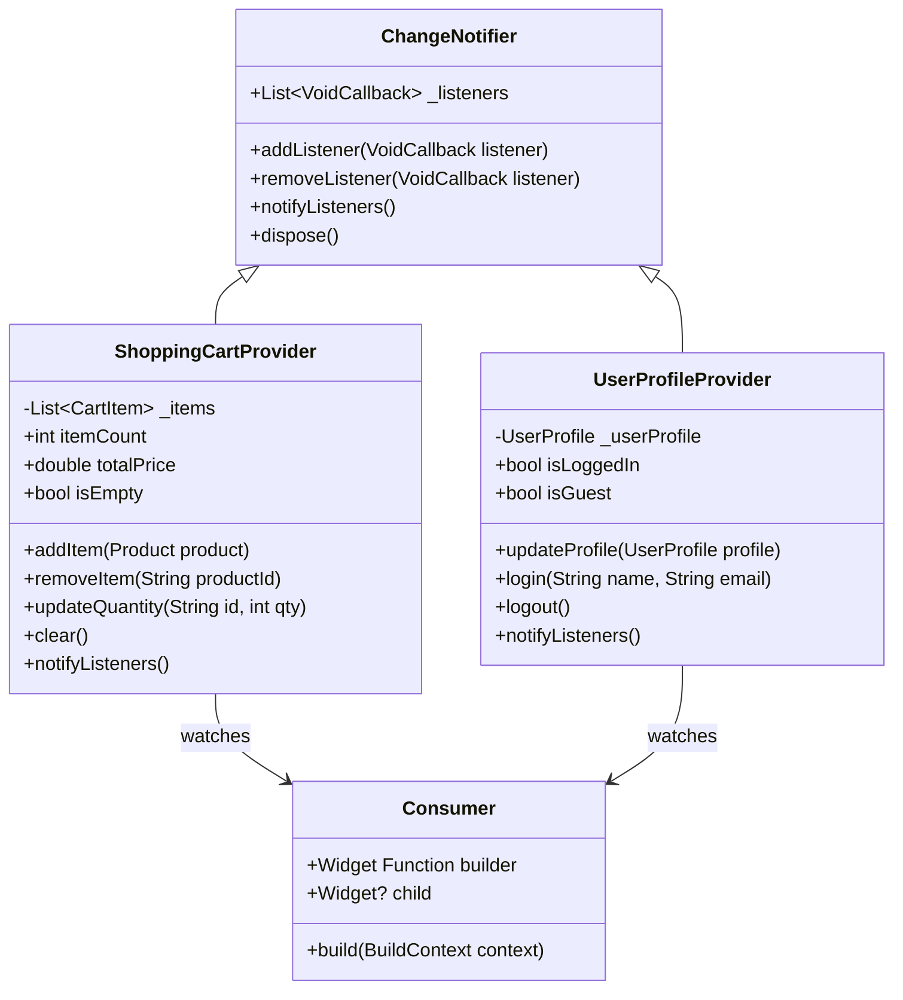

---

## **Provider Context Operations**

```mermaid
graph TD
    subgraph "Context.read() - No Rebuilds"
        A[context.read<Provider>()] --> B[Get Current Value]
        B --> C[Perform Action]
        C --> D[No Widget Rebuild]
    end
    
    subgraph "Context.watch() - Auto Rebuilds"
        E[context.watch<Provider>()] --> F[Listen to Changes]
        F --> G[Auto Rebuild on Change]
    end
    
    subgraph "Consumer Widget - Selective Rebuilds"
        H[Consumer<Provider>] --> I[Builder Function]
        I --> J[Only Consumer Rebuilds]
    end
    
    subgraph "Selector Widget - Precise Rebuilds"
        K[Selector<Provider, T>] --> L[Select Specific Property]
        L --> M[Rebuild Only on Property Change]
    end
    
    style A fill:#ff9800
    style E fill:#4caf50
    style H fill:#2196f3
    style K fill:#9c27b0
```

---

## **Shopping Cart Application Architecture**

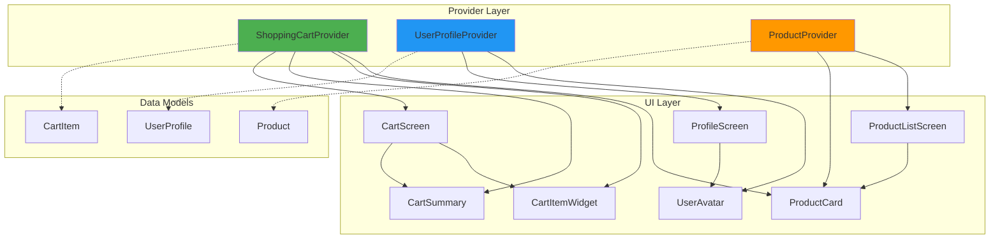

---

## **State Sharing Patterns**

```mermaid
flowchart TD
    A[App Start] --> B[MultiProvider Setup]
    B --> C{User Interaction}
    
    C -->|Browse Products| D[ProductProvider.loadProducts()]
    C -->|Add to Cart| E[CartProvider.addItem()]
    C -->|Update Profile| F[UserProvider.updateProfile()]
    
    D --> G[Products UI Update]
    E --> H[Cart UI Update]
    F --> I[Profile UI Update]
    
    G --> J{Cross-Widget Impact}
    H --> J
    I --> J
    
    J -->|Cart Count| K[AppBar Badge Update]
    J -->|User Favorites| L[Product Heart Icons]
    J -->|User Status| M[Profile Display Update]
    
    K --> N[Automatic UI Sync]
    L --> N
    M --> N
    
    N --> O[Consistent State Across App]
    
    style B fill:#4caf50
    style J fill:#ff9800
    style O fill:#2196f3
```

---

## **Performance Optimization Patterns**

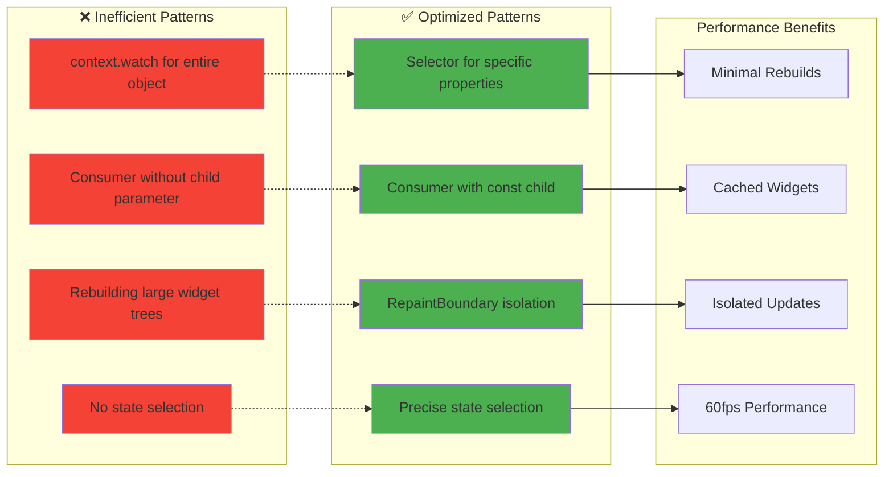

---

## **Consumer vs Selector Performance**

```mermaid
gantt
    title Widget Rebuild Performance Comparison
    dateFormat X
    axisFormat %s
    
    section Consumer<ShoppingCart>
    Full Object Watch    :active, consumer-full, 0, 100
    Every Property Change:active, consumer-change, 100, 200
    Unnecessary Rebuilds :crit, consumer-waste, 200, 300
    
    section Selector<ShoppingCart, int>
    Specific Property    :done, selector-prop, 0, 50
    Only When Changed    :done, selector-change, 150, 200
    Minimal Rebuilds     :done, selector-minimal, 250, 270
    
    section Performance Impact
    Consumer Overhead    :crit, perf-consumer, 0, 300
    Selector Efficiency  :done, perf-selector, 0, 270
```

---

## **Testing Strategy Architecture**

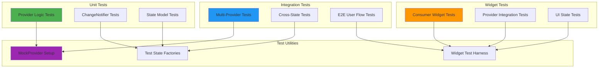

---

## **Shopping Cart State Flow**

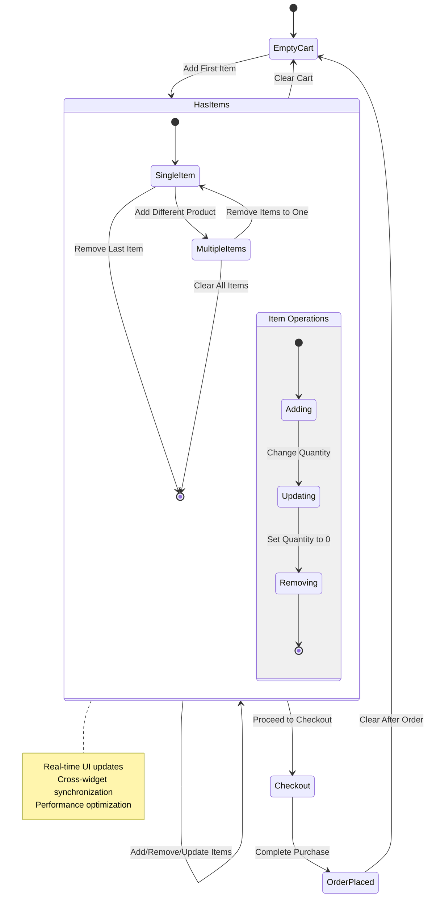

---

## **Provider vs InheritedWidget Comparison**

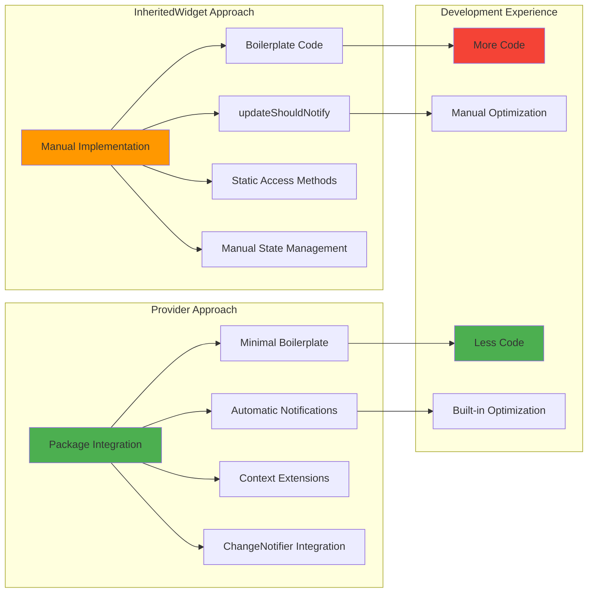

---

## **Multi-Provider Setup Pattern**

```mermaid
graph TD
    A[main()] --> B[MaterialApp Root]
    B --> C[MultiProvider]
    
    C --> D[ShoppingCartProvider]
    C --> E[UserProfileProvider]
    C --> F[ProductProvider]
    C --> G[AppSettingsProvider]
    
    D --> H[ChangeNotifier Auto-Disposal]
    E --> H
    F --> H
    G --> H
    
    C --> I[Child Widget Tree]
    I --> J[Any Widget Can Access Providers]
    
    J --> K[context.read<Provider>()]
    J --> L[context.watch<Provider>()]
    J --> M[Consumer<Provider>]
    J --> N[Selector<Provider, T>]
    
    style C fill:#4caf50
    style H fill:#ff9800
    style J fill:#2196f3
```

---

## **Error Handling & Edge Cases**

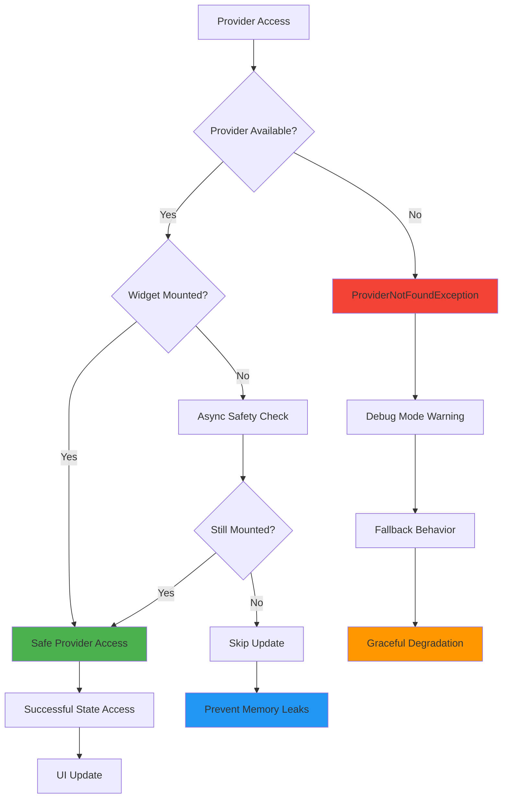

---

## **Key Architecture Benefits**

### **🌳 Shared State Excellence**
- **Dependency Injection**: Automatic propagation of data down widget trees
- **Efficient Updates**: Only dependent widgets rebuild when data changes
- **Type Safety**: Compile-time guarantees for state access
- **Performance Optimization**: Selective rebuilds with Consumer and Selector

### **🔄 Provider Advantages**
- **Simplified Syntax**: Minimal boilerplate compared to InheritedWidget
- **ChangeNotifier Integration**: Built-in reactive state management
- **Advanced Patterns**: MultiProvider, ProxyProvider, and more
- **Developer Experience**: Excellent debugging and development tools

### **⚡ Performance Benefits**
- **Selective Rebuilds**: Only widgets that need updates are rebuilt
- **Cached Widgets**: const child parameters prevent unnecessary rebuilds
- **Memory Efficiency**: Automatic disposal of ChangeNotifier instances
- **Optimized Access**: context.read vs context.watch for different use cases

### **🧪 Testing Excellence**
- **Mockable Providers**: Easy to create test doubles for state objects
- **Isolated Testing**: Test state logic separately from UI components
- **Widget Integration**: Test Provider integration with widget tests
- **Comprehensive Coverage**: Unit, widget, and integration test strategies

### **👥 Developer Experience**
- **Clean API**: Intuitive context extensions for state access
- **Error Handling**: Clear error messages for common mistakes
- **IDE Support**: Excellent code completion and refactoring support
- **Community**: Large ecosystem and community support

### **🎯 Production Ready**
- **Proven Patterns**: Used in thousands of production Flutter apps
- **Scalable Architecture**: Supports complex state management needs
- **Performance Tested**: Optimized for 60fps performance
- **Maintainable Code**: Clean separation of concerns and testable architecture

**This Provider foundation enables building scalable Flutter applications with shared state management that's both powerful and maintainable! 🌳✨🚀**