# 📜 Diagram for Lesson 12: Riverpod 2.0

## 🚀 **Riverpod 2.0 - Advanced State Management**

This lesson demonstrates the evolution from Provider to Riverpod 2.0, showcasing advanced state management patterns including type safety, async operations, provider modifiers, and comprehensive testing strategies through building a production-ready todo application.

---

## **Provider vs Riverpod Evolution**

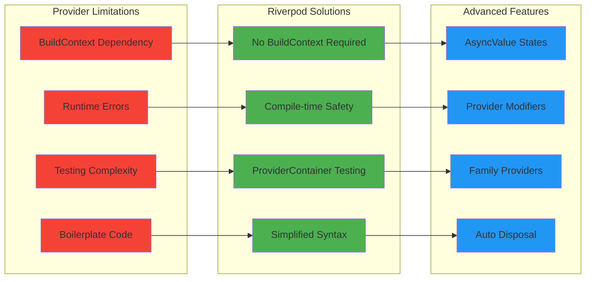

---

## **Riverpod Provider Types Architecture**

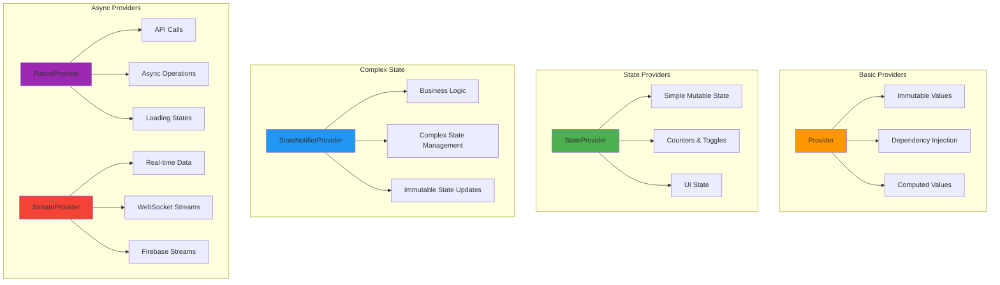

---

## **AsyncValue State Machine**

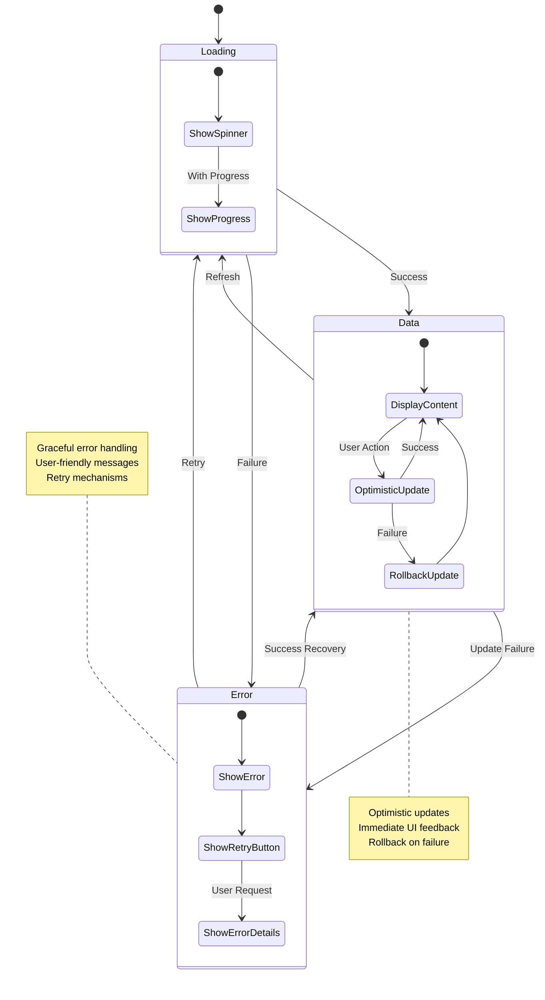

---

## **Todo App Riverpod Architecture**

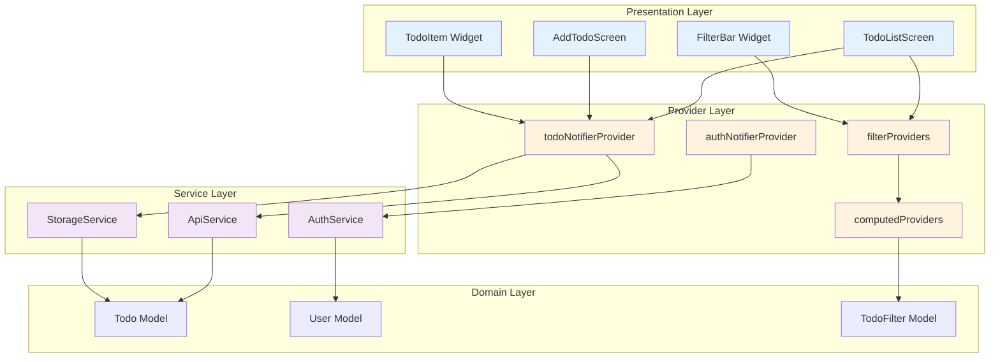

---

## **Provider Modifiers in Action**

```mermaid
graph LR
    subgraph "autoDispose Pattern"
        A[Provider Created]
        A --> B{Listeners?}
        B -->|Yes| C[Keep Alive]
        B -->|No| D[Auto Dispose]
        D --> E[Resources Cleaned]
        C --> F[Widget Unmounted]
        F --> B
    end
    
    subgraph "family Pattern"
        G[Provider.family]
        G --> H[Parameter: todoId]
        G --> I[Parameter: userId]
        G --> J[Parameter: filter]
        
        H --> K[todoProvider('123')]
        I --> L[userTodosProvider('user1')]
        J --> M[filteredTodosProvider(filter)]
    end
    
    subgraph "Combined Modifiers"
        N[FutureProvider.autoDispose.family]
        N --> O[Auto cleanup when unused]
        N --> P[Parameterized providers]
        N --> Q[Memory efficient]
    end
    
    style A fill:#4caf50
    style D fill:#ff9800
    style G fill:#2196f3
    style N fill:#9c27b0
```

---

## **Async Operations Flow**

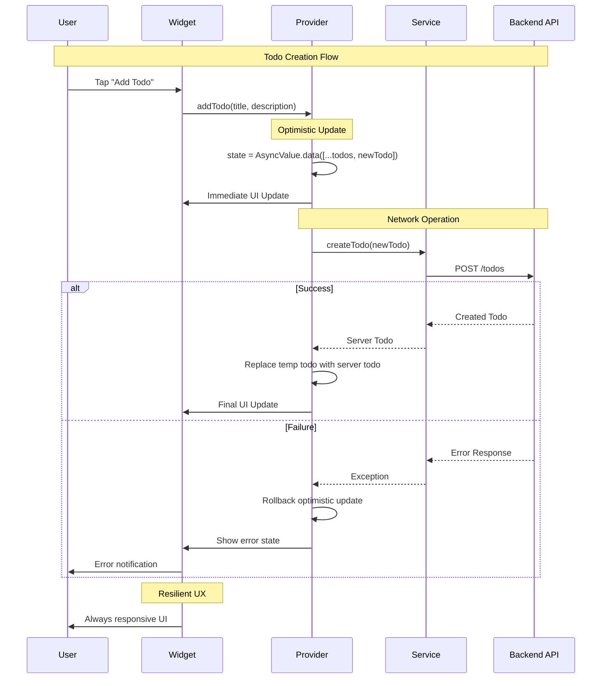

---

## **Filter System Architecture**

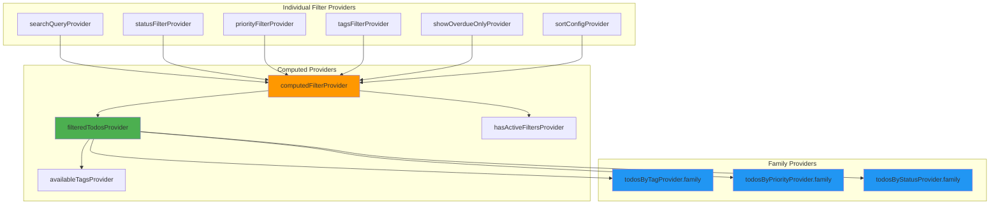

---

## **Testing Architecture with ProviderContainer**

```mermaid
graph TB
    subgraph "Test Setup"
        A[ProviderContainer]
        B[Mock Services]
        C[Override Providers]
        D[Test Data]
    end
    
    subgraph "Unit Tests"
        E[Provider Logic Tests]
        F[State Notifier Tests]
        G[Async Provider Tests]
        H[Filter Logic Tests]
    end
    
    subgraph "Widget Tests"
        I[Consumer Widget Tests]
        J[UI Integration Tests]
        K[User Interaction Tests]
        L[Error Handling Tests]
    end
    
    subgraph "Integration Tests"
        M[End-to-End Flows]
        N[Service Integration]
        O[State Persistence]
        P[Real-time Updates]
    end
    
    A --> E
    B --> F
    C --> G
    D --> H
    
    A --> I
    B --> J
    C --> K
    D --> L
    
    A --> M
    B --> N
    C --> O
    D --> P
    
    style A fill:#4caf50
    style E fill:#ff9800
    style I fill:#2196f3
    style M fill:#9c27b0
```

---

## **State Management Patterns Comparison**

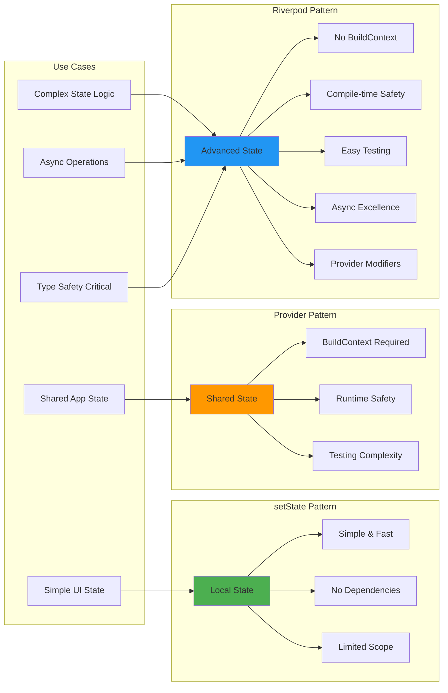

---

## **Performance Optimization Patterns**

```mermaid
flowchart TD
    A[Provider Access] --> B{Read or Watch?}
    
    B -->|Read| C[context.read()]
    B -->|Watch| D[ref.watch()]
    
    C --> E[No Rebuilds]
    D --> F[Automatic Rebuilds]
    
    F --> G{Selective Updates?}
    G -->|Yes| H[Selector Pattern]
    G -->|No| I[Consumer Pattern]
    
    H --> J[Minimal Rebuilds]
    I --> K[Full Widget Rebuilds]
    
    subgraph "Optimization Techniques"
        L[autoDispose Modifier]
        M[family Caching]
        N[Computed Providers]
        O[AsyncValue Handling]
    end
    
    E --> L
    J --> M
    K --> N
    F --> O
    
    style C fill:#4caf50
    style H fill:#4caf50
    style L fill:#4caf50
    style M fill:#4caf50
    
    style I fill:#ff9800
    style K fill:#ff9800
```

---

## **Real-time Data Synchronization**

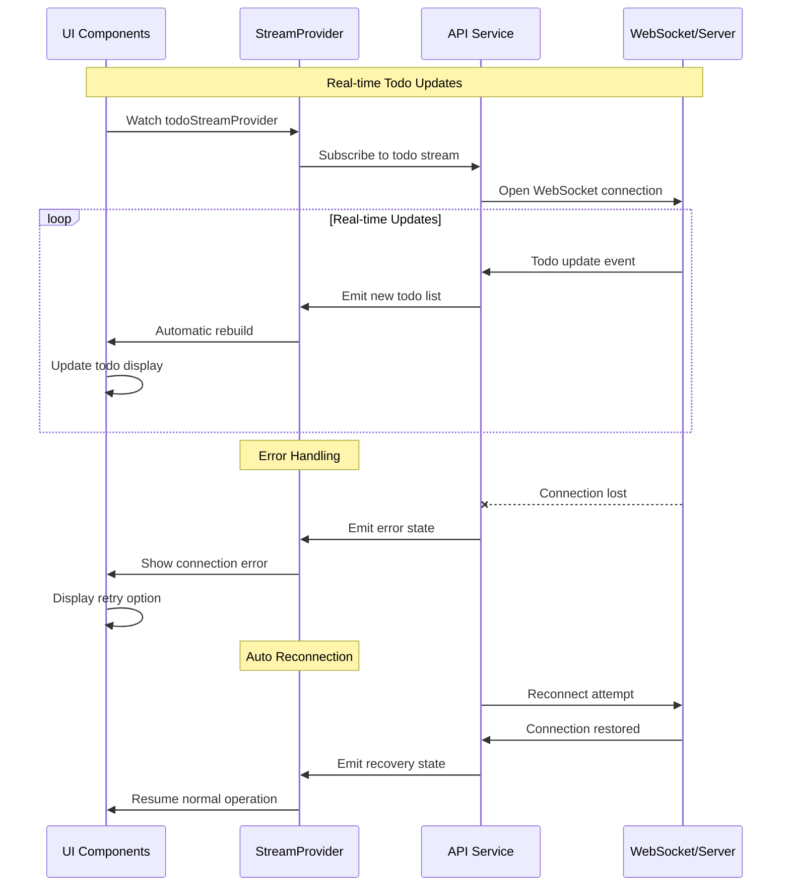

---

## **Provider Lifecycle Management**

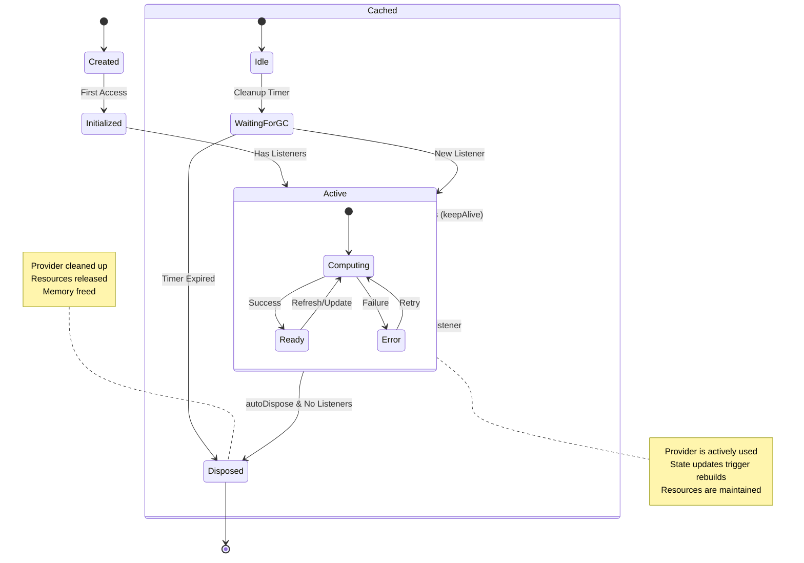

---

## **Complex State Composition**

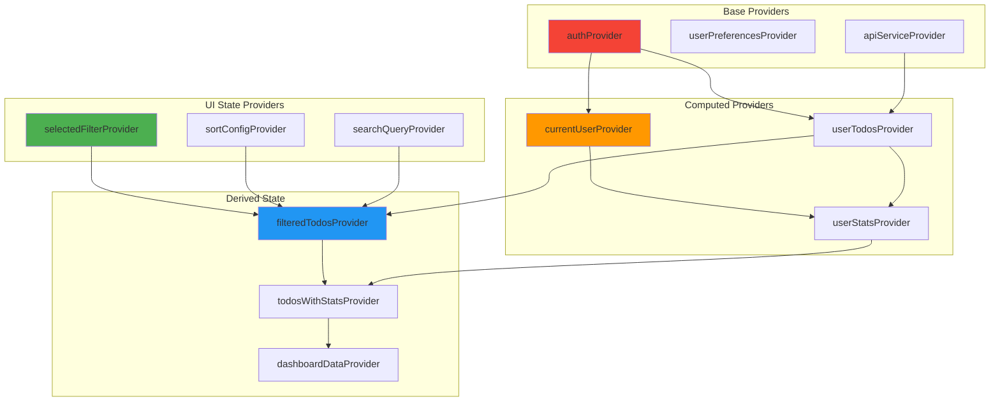

---

## **Error Handling & Recovery Patterns**

```mermaid
flowchart TD
    A[Async Operation] --> B{Success?}
    
    B -->|Yes| C[AsyncValue.data()]
    B -->|No| D[AsyncValue.error()]
    
    C --> E[Update UI with Data]
    D --> F[Show Error State]
    
    F --> G{Retry Available?}
    G -->|Yes| H[Show Retry Button]
    G -->|No| I[Show Fallback Content]
    
    H --> J[User Taps Retry]
    J --> A
    
    I --> K[Graceful Degradation]
    K --> L[Offline Mode]
    K --> M[Cached Data]
    K --> N[Alternative Flow]
    
    subgraph "Error Recovery Strategies"
        O[Exponential Backoff]
        P[Circuit Breaker]
        Q[Fallback Data]
        R[User Notification]
    end
    
    H --> O
    J --> P
    I --> Q
    F --> R
    
    style D fill:#f44336
    style F fill:#ff9800
    style K fill:#4caf50
```

---

## **Todo App Data Flow**

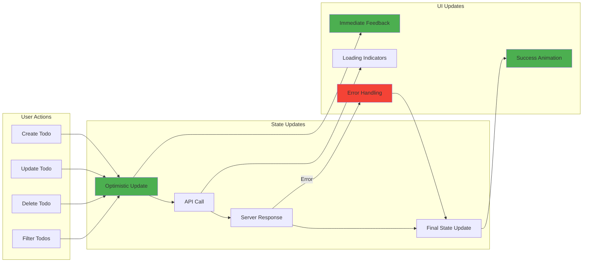

---

## **Advanced Provider Patterns Summary**

### **🚀 Riverpod Advantages**
- **Compile-time Safety**: Provider existence verified at build time
- **No BuildContext Dependency**: Access providers anywhere in the application
- **Superior Async Support**: Built-in AsyncValue for comprehensive state handling
- **Advanced Testing**: ProviderContainer enables isolated provider testing
- **Memory Efficiency**: Automatic disposal with autoDispose modifier
- **Type Safety**: Full type inference and compile-time guarantees

### **📊 Provider Types & Use Cases**
- **Provider**: Immutable values, dependency injection, computed values
- **StateProvider**: Simple mutable state like counters and toggles
- **StateNotifierProvider**: Complex business logic with immutable state updates
- **FutureProvider**: Async operations with loading, data, and error states
- **StreamProvider**: Real-time data streams and live updates

### **⚡ Performance Optimizations**
- **autoDispose**: Automatic resource cleanup when providers are no longer used
- **family**: Parameterized providers with efficient caching
- **Computed Providers**: Derived state that updates only when dependencies change
- **Selective Watching**: Watch only specific parts of state to minimize rebuilds

### **🧪 Testing Excellence**
- **ProviderContainer**: Isolated testing environment for providers
- **Mock Overrides**: Easy mocking of dependencies for unit tests
- **Widget Testing**: Integration testing with provider overrides
- **Async Testing**: Comprehensive testing of async operations and error handling

### **🏗️ Clean Architecture Integration**
- **Dependency Injection**: Service providers for clean layer separation
- **Use Case Providers**: Business logic encapsulation with provider access
- **Repository Patterns**: Data layer providers with clean interfaces
- **Presentation Logic**: UI state management with domain layer integration

### **🎯 Production Ready Features**
- **Error Resilience**: Graceful error handling with recovery mechanisms
- **Optimistic Updates**: Immediate UI feedback with rollback capabilities
- **Real-time Sync**: Stream providers for live data updates
- **Offline Support**: Cached data with sync when connection restored

**This Riverpod foundation enables building scalable, type-safe Flutter applications with advanced state management that's both powerful and maintainable! 🚀✨🔥**