# 📜 Diagram for Lesson 13: Bloc & Cubit

## 🎯 **Bloc & Cubit - Event-Driven Architecture**

This lesson demonstrates event-driven architecture patterns through Bloc and Cubit, showcasing business logic separation, complex state management, and comprehensive testing strategies through building a professional weather application with real-time updates and location services.

---

## **Bloc Pattern Architecture Overview**

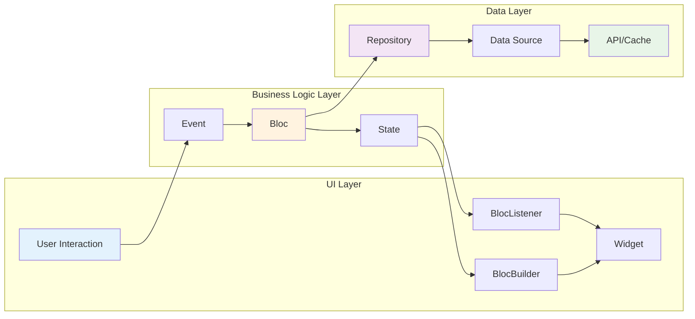

---

## **Bloc vs Cubit Comparison**

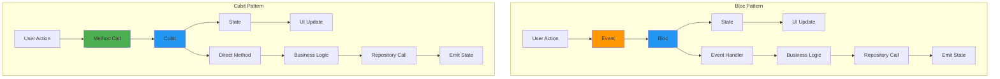

---

## **Weather App Bloc Architecture**

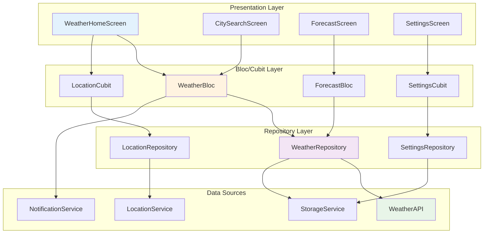

---

## **WeatherBloc Event Flow**

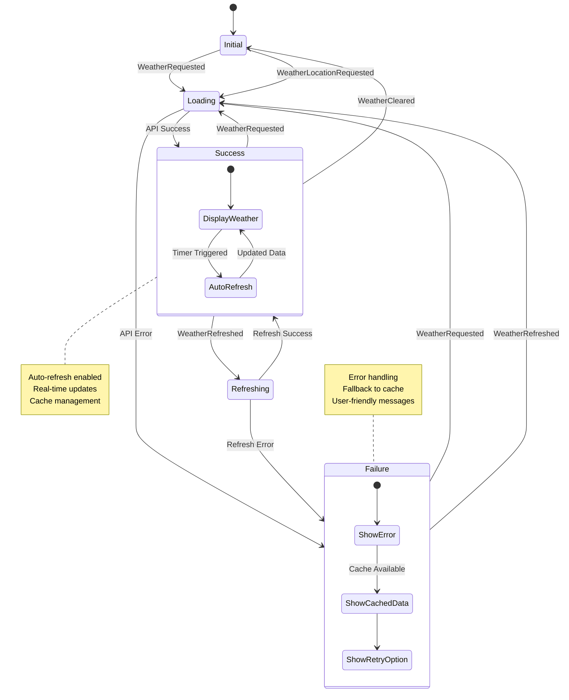

---

## **Event-Driven Data Flow**

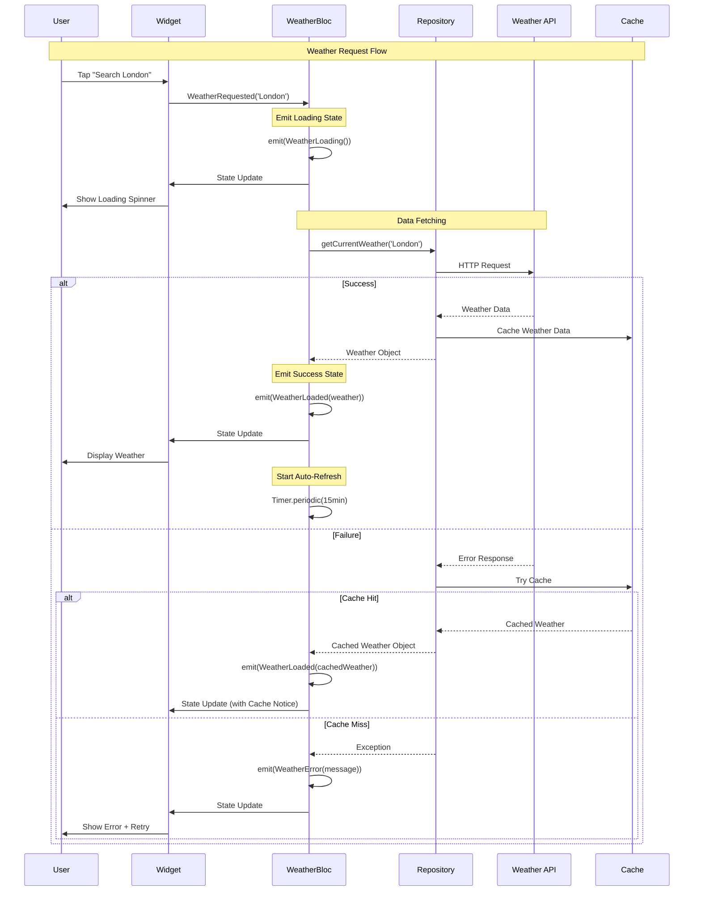

---

## **Cubit State Management Pattern**

```mermaid
flowchart TD
    A[User Interaction] --> B{Cubit Method}
    
    B --> C[emit(LoadingState)]
    C --> D[Repository Call]
    
    D --> E{Success?}
    E -->|Yes| F[emit(SuccessState)]
    E -->|No| G[emit(ErrorState)]
    
    F --> H[UI Rebuilds]
    G --> I[Show Error + Retry]
    
    I --> J[User Retries]
    J --> B
    
    subgraph "LocationCubit Example"
        K[getCurrentLocation()]
        K --> L[emit(LocationLoading)]
        L --> M[locationRepository.getCurrentLocation()]
        M --> N{Permission?}
        N -->|Granted| O[emit(LocationSuccess)]
        N -->|Denied| P[emit(LocationDisabled)]
    end
    
    subgraph "SettingsCubit Example"
        Q[updateTemperatureUnit()]
        Q --> R[settingsRepository.saveSettings()]
        R --> S[emit(updated settings)]
        S --> T[UI Updates Immediately]
    end
    
    style F fill:#4caf50
    style G fill:#f44336
    style O fill:#4caf50
    style P fill:#ff9800
```

---

## **Bloc-to-Bloc Communication**

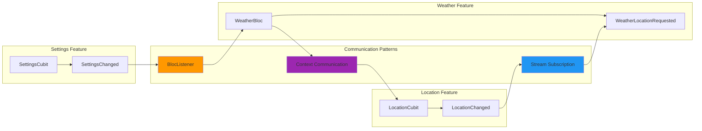

---

## **Advanced State Composition**

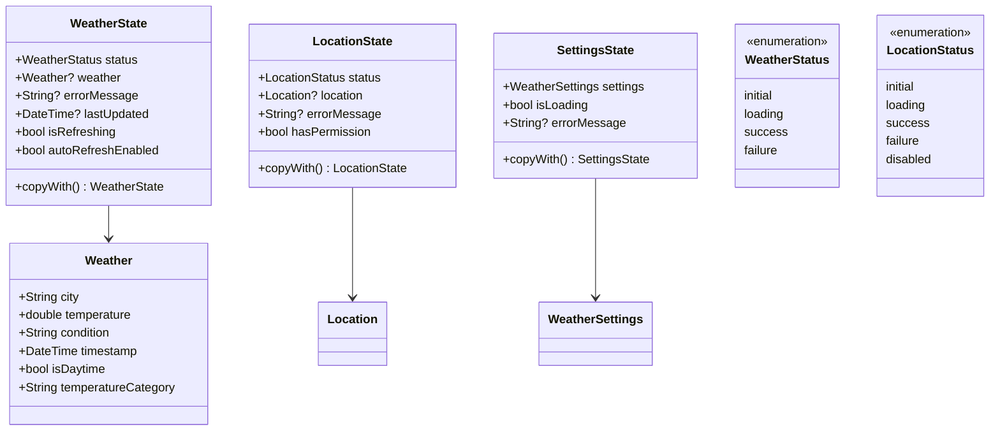

---

## **Testing Architecture with bloc_test**

```mermaid
graph TB
    subgraph "Test Setup"
        A[MockRepository]
        B[Test Data]
        C[Bloc Instance]
        D[Expected States]
    end
    
    subgraph "bloc_test Pattern"
        E[build: () => bloc]
        F[act: (bloc) => bloc.add(event)]
        G[expect: () => [states]]
        H[verify: (_) => verify(mock)]
    end
    
    subgraph "Test Categories"
        I[Unit Tests]
        J[Integration Tests]
        K[Widget Tests]
        L[Golden Tests]
    end
    
    A --> E
    B --> F
    C --> G
    D --> H
    
    E --> I
    F --> J
    G --> K
    H --> L
    
    style A fill:#ff9800
    style E fill:#4caf50
    style I fill:#2196f3
```

---

## **Weather App Event System**

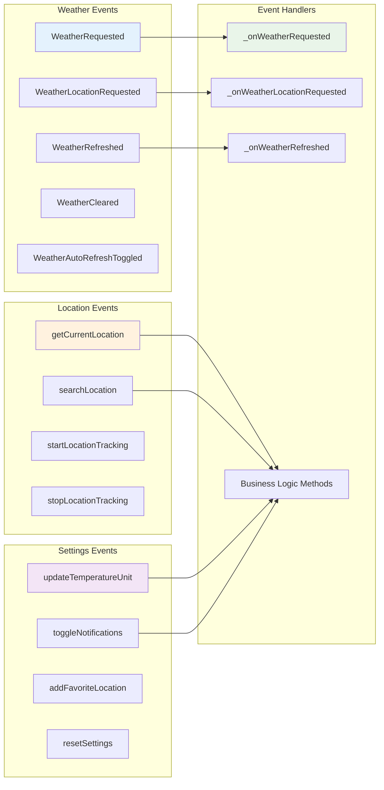

---

## **Error Handling & Recovery Patterns**

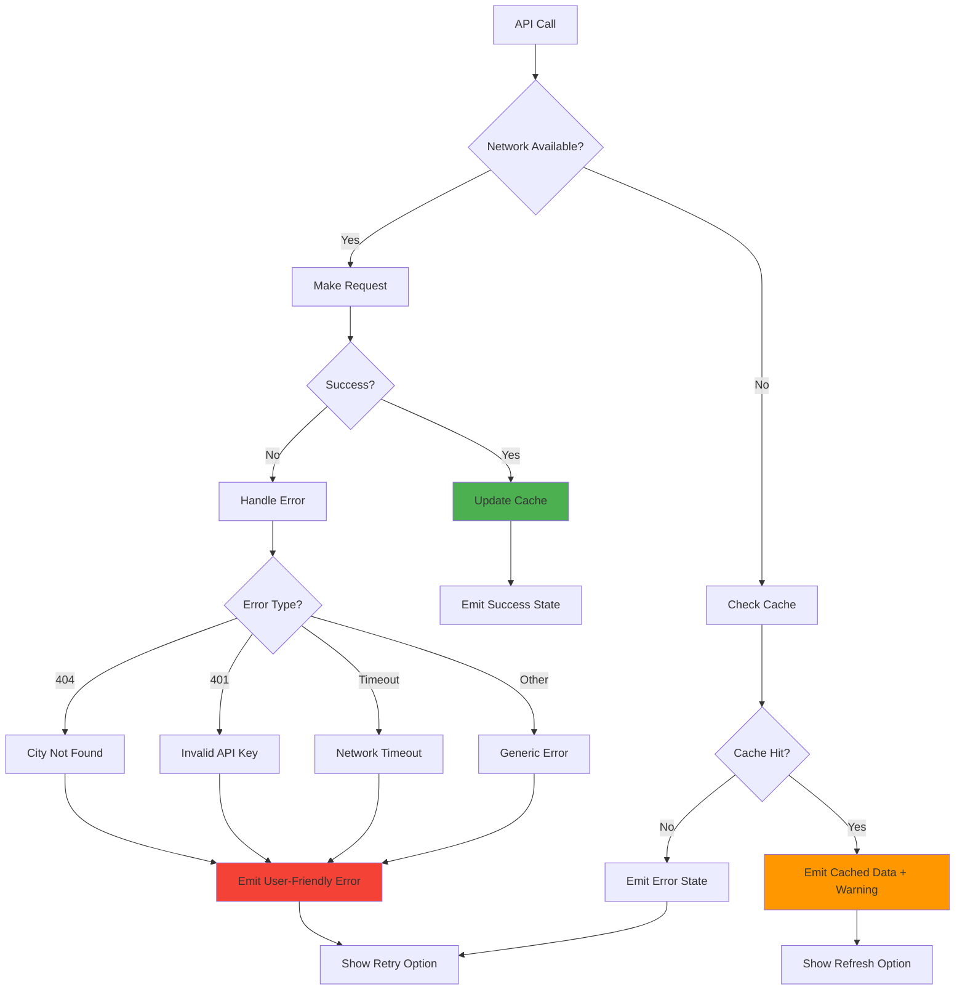

---

## **Real-time Updates & Auto-Refresh**

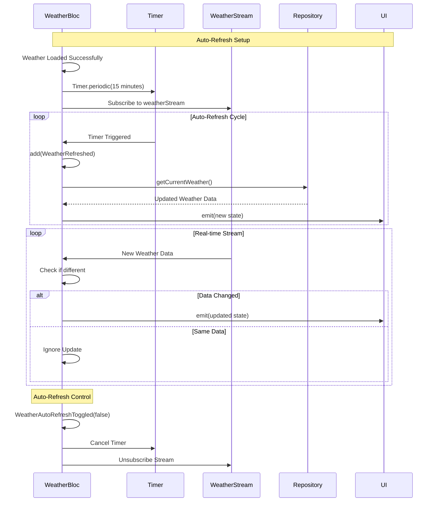

---

## **Complex State Transitions**

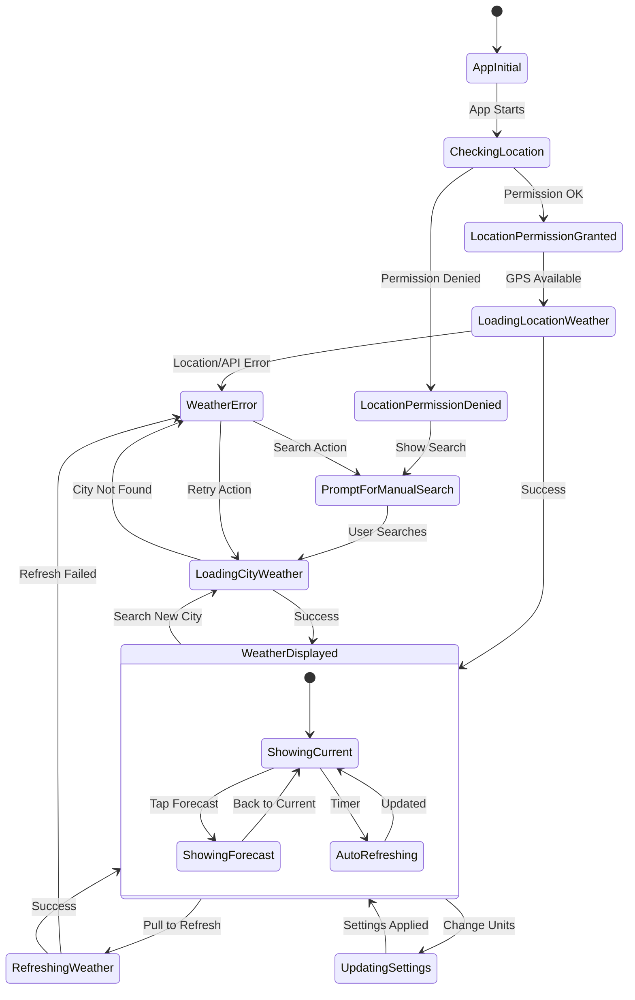

---

## **Performance Optimization Patterns**

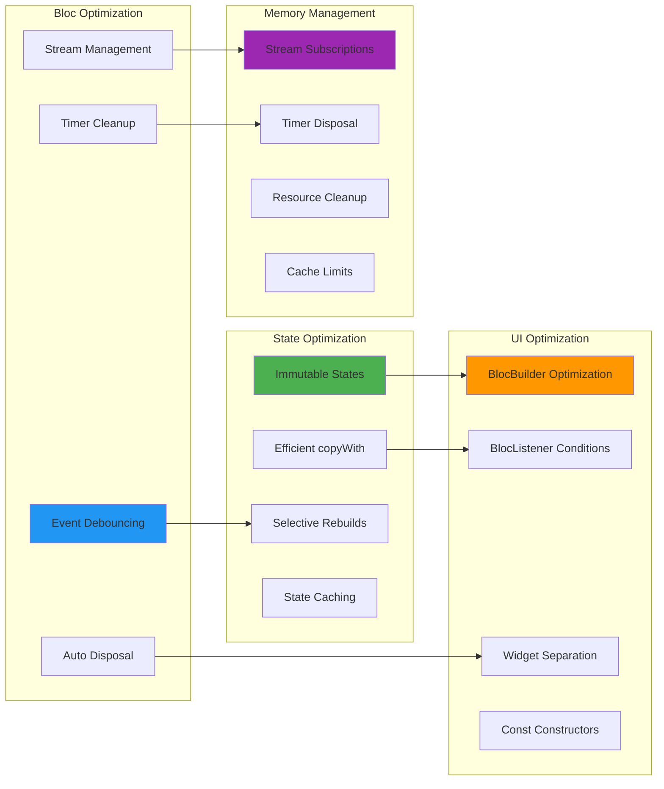

---

## **Repository Pattern Integration**

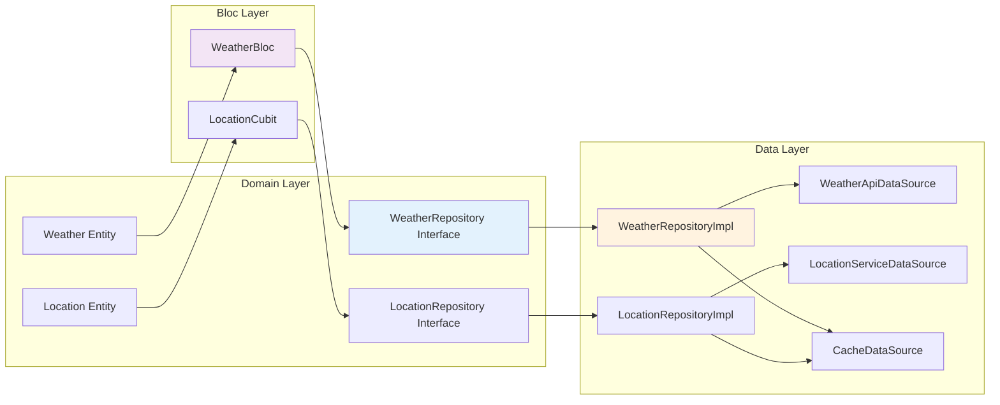

---

## **Testing Strategy Overview**

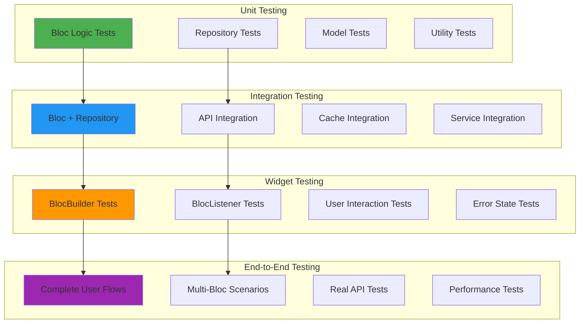

---

## **Weather App Architecture Summary**

### **🎯 Bloc Pattern Advantages**
- **Event-Driven**: Clear separation between user actions and business logic
- **Testable**: Comprehensive testing with bloc_test package and mock repositories
- **Predictable**: Same event + state always produces same result
- **Debuggable**: Event stream provides clear audit trail of state changes
- **Scalable**: Multiple Blocs can coordinate complex application features
- **Maintainable**: Business logic separated from UI for better code organization

### **🧩 Key Components**
- **Events**: Represent what happened (user interactions, API responses)
- **States**: Represent current application condition (loading, success, error)
- **Bloc/Cubit**: Transform events into states with business logic
- **Repository**: Abstract data access for clean architecture
- **BlocBuilder**: UI rebuilds based on state changes
- **BlocListener**: Side effects like navigation and snackbars

### **⚡ Advanced Patterns**
- **Event Transformations**: Debounce, throttle, and switchMap for complex user interactions
- **Bloc Communication**: StreamSubscription and BlocListener for coordinated features
- **State Composition**: Complex state objects with multiple properties and transitions
- **Auto-Refresh**: Timer-based updates with stream subscriptions for real-time data
- **Error Recovery**: Graceful fallback to cached data with user-friendly error messages
- **Testing Excellence**: Comprehensive coverage with unit, widget, and integration tests

### **🏗️ Clean Architecture Benefits**
- **Separation of Concerns**: UI, business logic, and data layers clearly separated
- **Dependency Inversion**: Blocs depend on repository interfaces, not implementations
- **Testability**: Mock repositories and data sources for comprehensive testing
- **Maintainability**: Changes in one layer don't affect others
- **Scalability**: Easy to add new features without affecting existing code
- **Team Collaboration**: Clear boundaries enable multiple developers to work efficiently

### **🎯 Production Ready Features**
- **Offline Support**: Cached data with background sync when connection restored
- **Real-time Updates**: Stream providers for live weather data
- **Error Resilience**: Comprehensive error handling with graceful degradation
- **Performance Optimization**: Efficient state updates and memory management
- **User Experience**: Loading states, pull-to-refresh, and immediate feedback
- **Testing Coverage**: All critical paths validated with automated tests

**This Bloc foundation enables building scalable, maintainable Flutter applications with sophisticated business logic and excellent user experience! 🎯✨🔥**