# 📜 Diagram for Lesson 14: State Management Comparison

## 🎯 **State Management Comparison - Architectural Decision Guide**

This lesson provides comprehensive analysis and decision-making frameworks for choosing the right state management pattern based on project requirements, team capabilities, and performance considerations through systematic comparison of setState, Provider, Riverpod, and Bloc/Cubit approaches.

---

## **State Management Decision Tree**

```mermaid
flowchart TD
    A[New Flutter Project] --> B{What's the scope of state sharing?}
    
    B -->|Single Widget| C[setState]
    B -->|Multiple Widgets| D{What's the complexity level?}
    B -->|Global State| E{What are the async requirements?}
    
    D -->|Simple Shared State| F[Provider]
    D -->|Complex Business Logic| G{Event-driven needs?}
    
    E -->|Moderate Async| H[Provider/Riverpod]
    E -->|Heavy Async + Caching| I[Riverpod]
    E -->|Enterprise Requirements| J[Bloc/Cubit]
    
    G -->|Yes, Audit Trail Needed| K[Bloc]
    G -->|No, Direct Methods OK| L[Cubit]
    
    C --> C1[Perfect for:<br/>• Form inputs<br/>• Animations<br/>• Local toggles<br/>• Component state]
    
    F --> F1[Perfect for:<br/>• Shopping cart<br/>• User auth<br/>• Theme settings<br/>• Shared models]
    
    H --> H1[Consider team<br/>experience with<br/>reactive patterns]
    
    I --> I1[Perfect for:<br/>• API caching<br/>• Real-time data<br/>• Type safety<br/>• Modern apps]
    
    K --> K1[Perfect for:<br/>• Enterprise apps<br/>• Audit trails<br/>• Complex workflows<br/>• Large teams]
    
    L --> L1[Perfect for:<br/>• Business logic<br/>• Direct operations<br/>• Simplified events<br/>• Medium complexity]
    
    style A fill:#e3f2fd
    style C fill:#c8e6c9
    style F fill:#fff3e0
    style I fill:#f3e5f5
    style K fill:#ffebee
```



---

## **Performance Comparison Matrix**

```mermaid
graph LR
    subgraph "Performance Metrics"
        A[Memory Usage]
        B[CPU Overhead]
        C[Build Efficiency]
        D[Learning Curve]
        E[Boilerplate]
    end
    
    subgraph "setState"
        A1[⭐⭐⭐⭐⭐<br/>Minimal]
        B1[⭐⭐⭐⭐⭐<br/>Optimal]
        C1[⭐⭐⭐⭐⭐<br/>Direct]
        D1[⭐⭐⭐⭐⭐<br/>None]
        E1[⭐⭐⭐⭐⭐<br/>Zero]
    end
    
    subgraph "Provider"
        A2[⭐⭐⭐⭐<br/>Low]
        B2[⭐⭐⭐⭐<br/>Good]
        C2[⭐⭐⭐⭐<br/>Optimized]
        D2[⭐⭐⭐⭐<br/>Moderate]
        E2[⭐⭐⭐<br/>Medium]
    end
    
    subgraph "Riverpod"
        A3[⭐⭐⭐<br/>Medium]
        B3[⭐⭐⭐⭐⭐<br/>Excellent]
        C3[⭐⭐⭐⭐⭐<br/>Precise]
        D3[⭐⭐<br/>Complex]
        E3[⭐⭐<br/>Higher]
    end
    
    subgraph "Bloc/Cubit"
        A4[⭐⭐⭐<br/>Medium]
        B4[⭐⭐⭐<br/>Moderate]
        C4[⭐⭐⭐⭐<br/>Good]
        D4[⭐⭐<br/>Steep]
        E4[⭐<br/>Highest]
    end
    
    A --> A1
    A --> A2
    A --> A3
    A --> A4
    
    B --> B1
    B --> B2
    B --> B3
    B --> B4
    
    C --> C1
    C --> C2
    C --> C3
    C --> C4
    
    D --> D1
    D --> D2
    D --> D3
    D --> D4
    
    E --> E1
    E --> E2
    E --> E3
    E --> E4
    
    style A1 fill:#4caf50
    style A2 fill:#8bc34a
    style A3 fill:#ff9800
    style A4 fill:#ff9800
    
    style B1 fill:#4caf50
    style B2 fill:#8bc34a
    style B3 fill:#4caf50
    style B4 fill:#ff9800
```



---

## **Complexity vs Capability Matrix**


---

## **Migration Pathways**


---

## **Use Case Distribution Map**


---

## **Pattern Comparison Architecture**

```mermaid
graph TB
    subgraph "setState Architecture"
        A1[StatefulWidget]
        A2[State Class]
        A3[setState()]
        A4[Widget.build()]
        
        A1 --> A2
        A2 --> A3
        A3 --> A4
        A4 --> A2
    end
    
    subgraph "Provider Architecture"
        B1[ChangeNotifier]
        B2[Provider Widget]
        B3[Consumer Widget]
        B4[notifyListeners()]
        
        B1 --> B4
        B4 --> B2
        B2 --> B3
        B3 --> B1
    end
    
    subgraph "Riverpod Architecture"
        C1[StateNotifier]
        C2[Provider Definition]
        C3[ConsumerWidget]
        C4[ref.watch()]
        
        C1 --> C2
        C2 --> C4
        C4 --> C3
        C3 --> C1
    end
    
    subgraph "Bloc Architecture"
        D1[Event]
        D2[Bloc/Cubit]
        D3[State]
        D4[BlocBuilder]
        
        D1 --> D2
        D2 --> D3
        D3 --> D4
        D4 --> D1
    end
    
    style A1 fill:#c8e6c9
    style B1 fill:#fff3e0
    style C1 fill:#e1bee7
    style D1 fill:#ffcdd2
```

---

## **Decision Framework SCALE Matrix**

```mermaid
graph TB
    subgraph "SCALE Decision Framework"
        S[Scope<br/>State Sharing Needs]
        C[Complexity<br/>Business Logic Level]
        A[Async<br/>Asynchronous Requirements]
        L[Learning<br/>Team Expertise]
        E[Evolution<br/>Future Scalability]
    end
    
    subgraph "Scope Assessment"
        S1[Local Component → setState]
        S2[Cross-Widget → Provider]
        S3[Global App → Riverpod/Bloc]
        S4[Complex Business → Bloc]
    end
    
    subgraph "Complexity Assessment"
        C1[Simple Toggles → setState]
        C2[Moderate Logic → Provider]
        C3[Complex Workflows → Bloc]
        C4[Event-Driven → Bloc]
    end
    
    subgraph "Async Assessment"
        A1[No Async → setState]
        A2[Simple Async → Provider]
        A3[Complex Async → Riverpod]
        A4[Event-Based → Bloc]
    end
    
    subgraph "Learning Assessment"
        L1[Beginner → setState]
        L2[Intermediate → Provider]
        L3[Advanced → Riverpod]
        L4[Enterprise → Bloc]
    end
    
    subgraph "Evolution Assessment"
        E1[Prototype → setState]
        E2[Growing → Provider]
        E3[Enterprise → Riverpod/Bloc]
        E4[Long-term → Bloc]
    end
    
    S --> S1
    S --> S2
    S --> S3
    S --> S4
    
    C --> C1
    C --> C2
    C --> C3
    C --> C4
    
    A --> A1
    A --> A2
    A --> A3
    A --> A4
    
    L --> L1
    L --> L2
    L --> L3
    L --> L4
    
    E --> E1
    E --> E2
    E --> E3
    E --> E4
```



---

## **Performance Benchmarking Results**


---

## **Team Collaboration Matrix**


---

## **Migration Strategy Flowchart**


---

## **Real-World Application Examples**


---

## **Testing Strategy Comparison**

```mermaid
graph LR
    subgraph "Testing Approaches"
        A[setState Testing]
        B[Provider Testing]
        C[Riverpod Testing]
        D[Bloc Testing]
    end
    
    subgraph "Testing Tools"
        A --> A1[Widget Tests<br/>Pump & Settle<br/>Golden Tests]
        B --> B1[Unit Tests<br/>MockProvider<br/>Widget Tests]
        C --> C2[ProviderContainer<br/>Unit Tests<br/>Integration Tests]
        D --> D1[bloc_test Package<br/>Unit Tests<br/>Mock Repository]
    end
    
    subgraph "Testing Quality"
        A1 --> A2[⭐⭐<br/>UI-coupled<br/>Hard to isolate]
        B1 --> B2[⭐⭐⭐<br/>Good separation<br/>Mock dependencies]
        C2 --> C3[⭐⭐⭐⭐<br/>Excellent isolation<br/>Type safety]
        D1 --> D2[⭐⭐⭐⭐⭐<br/>Best practices<br/>Complete coverage]
    end
    
    style A2 fill:#ffcdd2
    style B2 fill:#fff3e0
    style C3 fill:#e1bee7
    style D2 fill:#c8e6c9
```



---

## **Learning Path Recommendation**


---

## **Decision Support System**


---

## **Performance Optimization Strategies**


---

## **Enterprise Architecture Comparison**

```mermaid
C4Context
    title Enterprise State Management Architecture
    
    Enterprise Application
    
    System_Boundary(app, "Flutter Application") {
        Container(ui, "UI Layer", "Flutter Widgets", "User interface components")
        Container(state, "State Layer", "State Management", "Application state handling")
        Container(business, "Business Layer", "Domain Logic", "Business rules and validation")
        Container(data, "Data Layer", "Repository Pattern", "Data access and caching")
    }
    
    System_Ext(api, "External APIs", "REST/GraphQL APIs")
    System_Ext(db, "Local Database", "SQLite/Hive")
    System_Ext(cache, "Cache Layer", "Memory/Disk Cache")
    
    Rel(ui, state, "Subscribes to")
    Rel(state, business, "Triggers")
    Rel(business, data, "Queries")
    Rel(data, api, "Fetches")
    Rel(data, db, "Stores")
    Rel(data, cache, "Caches")
```

---

## **State Management Evolution Timeline**


---

## **Comparison Summary Dashboard**

### **🎯 Quick Decision Guide**

| Scenario | Recommended Pattern | Rationale |
|----------|-------------------|-----------|
| Form with local validation | **setState** | Simple, efficient, contained |
| Shopping cart across screens | **Provider** | Shared state, mature ecosystem |
| Real-time chat application | **Riverpod** | Async-first, auto-disposal |
| Banking transaction system | **Bloc** | Audit trail, business logic separation |
| Learning Flutter basics | **setState** | Foundation understanding |
| Team of 10+ developers | **Bloc/Cubit** | Standardized patterns, clear contracts |
| High-performance requirements | **setState/Riverpod** | Minimal overhead, precise updates |
| Type-safe architecture | **Riverpod** | Compile-time safety, dependency tracking |

### **🏗️ Architecture Benefits**

- **setState**: Zero dependencies, maximum performance, minimal learning curve
- **Provider**: Mature ecosystem, good balance, excellent documentation
- **Riverpod**: Modern patterns, type safety, automatic resource management
- **Bloc/Cubit**: Enterprise-ready, comprehensive testing, clear separation of concerns

### **⚡ Performance Rankings**

1. **setState** - Optimal for local state with minimal overhead
2. **Riverpod** - Excellent dependency tracking and efficient updates
3. **Provider** - Good performance with proper Consumer optimization
4. **Bloc/Cubit** - Moderate overhead but excellent for complex scenarios

### **🎓 Learning Investment**

- **Quick Start (1-2 weeks)**: setState → Provider
- **Comprehensive (1-2 months)**: All patterns with decision framework
- **Expert Level (3-6 months)**: Advanced patterns, testing, migration strategies
- **Enterprise Ready (6+ months)**: Complex architectures, team leadership, pattern selection

### **🚀 Future-Proofing Strategy**

The Flutter state management landscape continues evolving. The key principles remain:
- **Start simple** with setState for local state
- **Scale appropriately** to Provider/Riverpod for shared state
- **Embrace complexity** with Bloc for enterprise requirements
- **Mix patterns** strategically based on specific use cases
- **Prioritize maintainability** over premature optimization
- **Choose based on team expertise** and project timeline

**This comprehensive comparison provides the foundation for making informed architectural decisions that will serve your Flutter applications well from prototype to production! 🎯✨🔥**