# 📜 Diagram

## 🌐 **Networking with Dio & Retrofit - API Integration Mastery**

This lesson provides comprehensive coverage of professional networking patterns in Flutter, demonstrating how to build robust, scalable, and maintainable API integration using Dio with interceptors, Retrofit patterns, intelligent caching, and comprehensive error handling for production-ready applications.

---

## **HTTP Request/Response Flow**

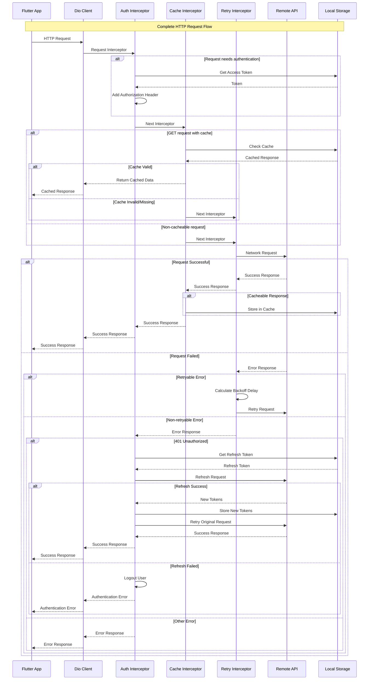

---

## **Dio Architecture with Interceptors**

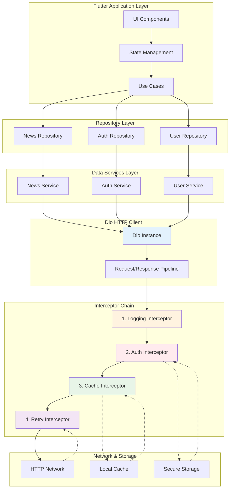

---

## **Clean Architecture for Networking**

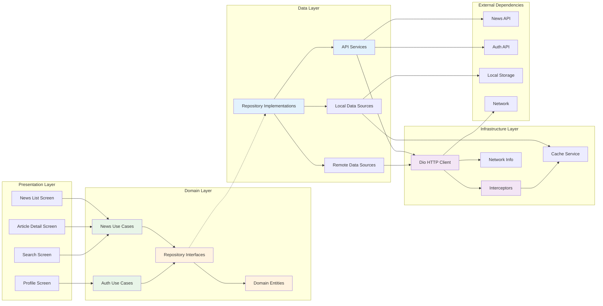

---

## **Error Handling Flow**

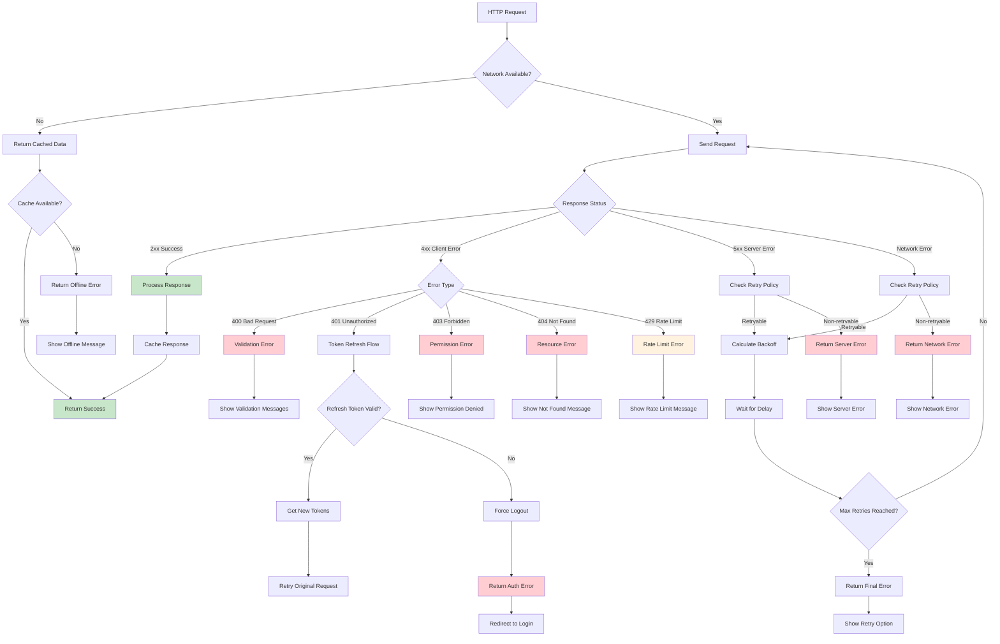

---

## **Intelligent Caching Strategy**

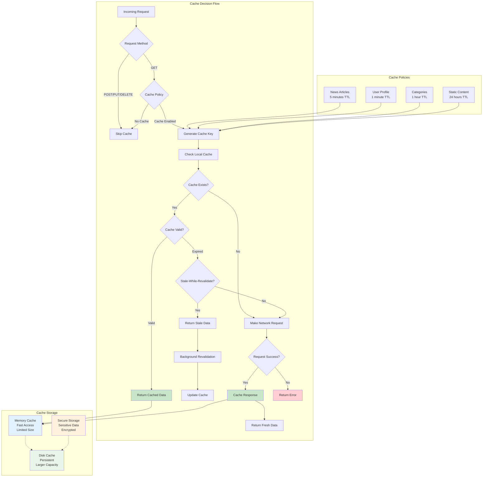

---

## **Authentication Integration Flow**

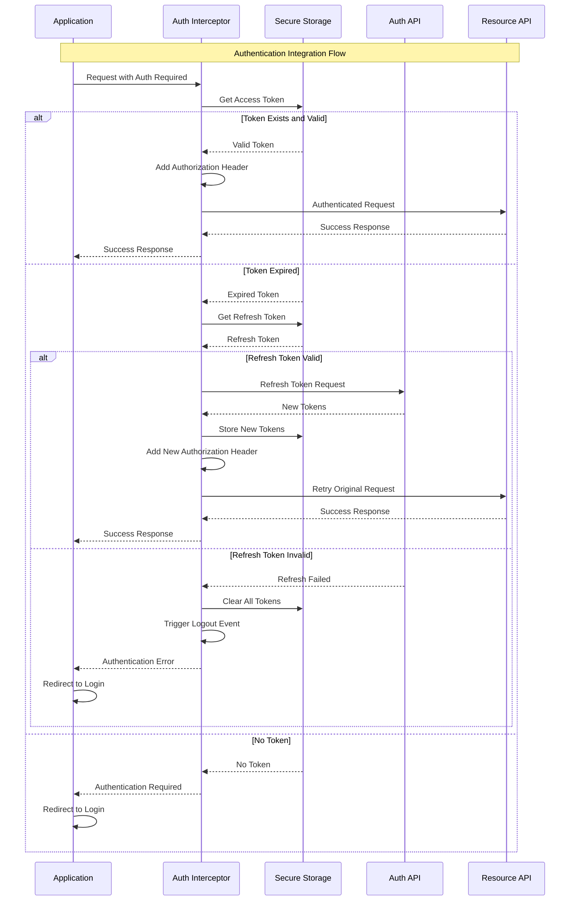

---

## **Retrofit Pattern Organization**

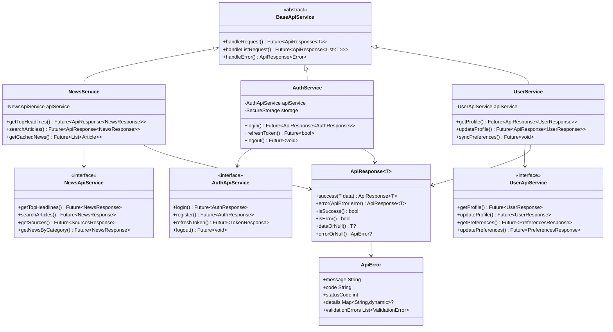

---

## **Repository Pattern with Networking**

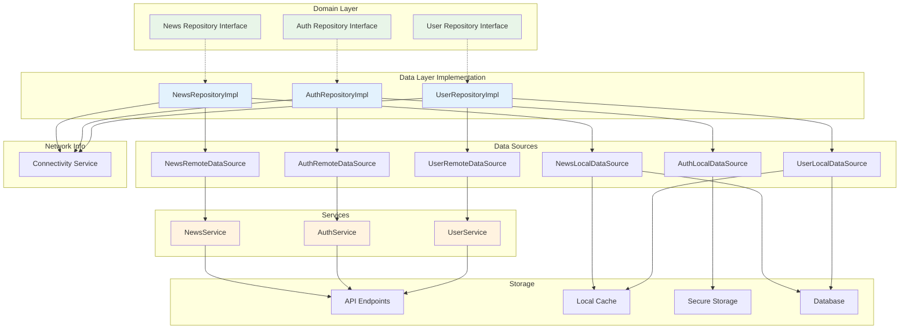

---

## **Offline Support Architecture**

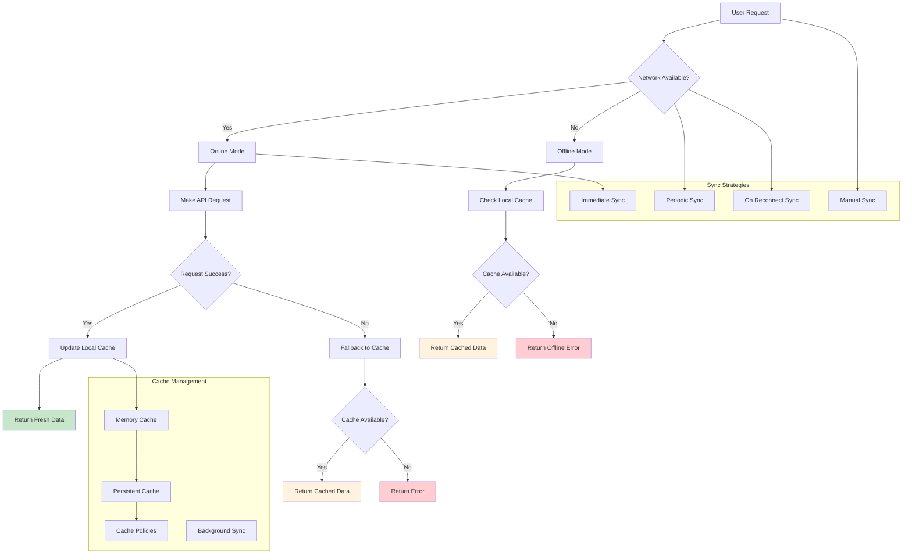

---

## **Error Handling Hierarchy**

```mermaid
classDiagram
    class ApiException {
        <<abstract>>
        +message String
        +error DioException?
        +toString() String
    }
    
    class NetworkException {
        +NetworkException(message, error)
    }
    
    class TimeoutException {
        +TimeoutException(message, error)
    }
    
    class ServerException {
        +statusCode int
        +ServerException(message, statusCode, error)
    }
    
    class BadRequestException {
        +statusCode int
        +BadRequestException(message, statusCode, error)
    }
    
    class UnauthorizedException {
        +statusCode int
        +UnauthorizedException(message, statusCode, error)
    }
    
    class ForbiddenException {
        +statusCode int
        +ForbiddenException(message, statusCode, error)
    }
    
    class NotFoundException {
        +statusCode int
        +NotFoundException(message, statusCode, error)
    }
    
    class ValidationException {
        +statusCode int
        +validationErrors List~ValidationError~
        +ValidationException(message, statusCode, errors, error)
    }
    
    class RateLimitException {
        +statusCode int
        +retryAfter Duration?
        +RateLimitException(message, statusCode, retryAfter, error)
    }
    
    class RequestCancelledException {
        +RequestCancelledException(message, error)
    }
    
    class UnknownException {
        +UnknownException(message, error)
    }
    
    ApiException <|-- NetworkException
    ApiException <|-- TimeoutException
    ApiException <|-- ServerException
    ApiException <|-- BadRequestException
    ApiException <|-- UnauthorizedException
    ApiException <|-- ForbiddenException
    ApiException <|-- NotFoundException
    ApiException <|-- ValidationException
    ApiException <|-- RateLimitException
    ApiException <|-- RequestCancelledException
    ApiException <|-- UnknownException
    
    class ValidationError {
        +field String
        +message String
        +code String?
    }
    
    ValidationException --> ValidationError
```

---

## **Testing Strategy Overview**

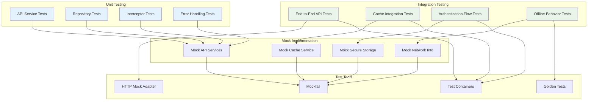

---

## **Performance Optimization Strategies**

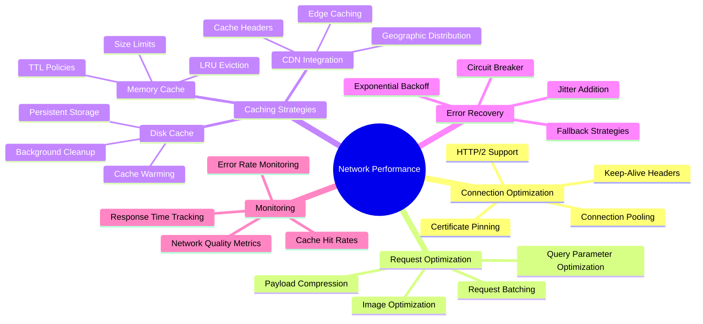

---

## **Security Considerations**

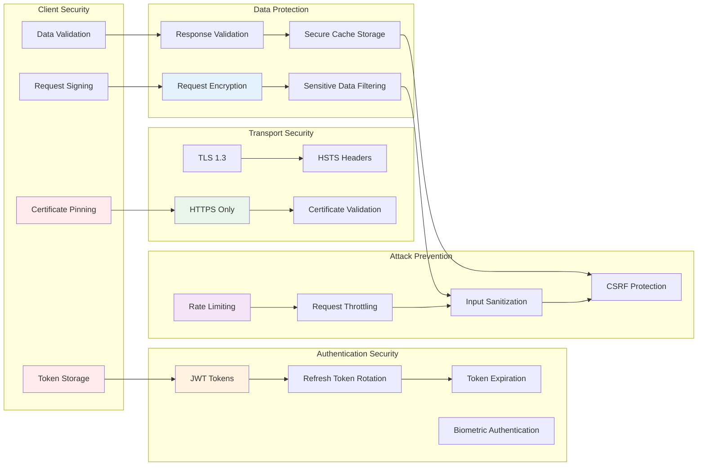

---

## **NewsFlow Pro Application Architecture**

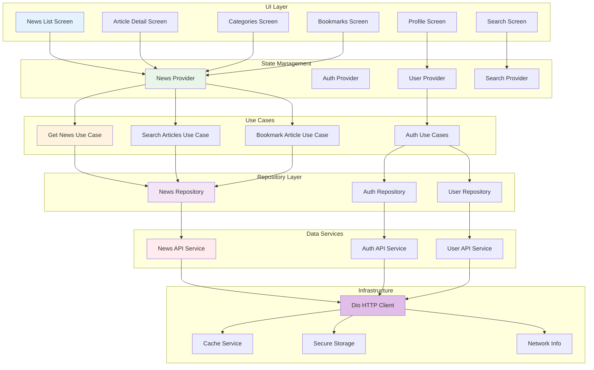

---

## **Real-World Implementation Benefits**

### **🌐 Professional Networking Excellence**
- **Dio Mastery**: Advanced HTTP client with interceptors, retry logic, and intelligent caching
- **Retrofit Patterns**: Clean API service organization with type-safe endpoints
- **Error Handling**: Comprehensive error management with user-friendly feedback
- **Performance Optimization**: Intelligent caching, connection pooling, and request optimization

### **🏗️ Clean Architecture Integration**
- **Separation of Concerns**: Clear boundaries between networking, business logic, and UI
- **Repository Pattern**: Abstract data access with offline-first capabilities
- **Dependency Injection**: Testable architecture with mock implementations
- **Scalable Design**: Patterns that support application growth and team collaboration

### **📱 Production-Ready Features**
- **Offline Support**: Intelligent caching with background synchronization
- **Authentication Integration**: Automatic token management and refresh flows
- **Security Implementation**: Certificate pinning, secure storage, and data validation
- **Performance Monitoring**: Real-time tracking of network performance and error rates

### **🧪 Testing Excellence**
- **Mock Services**: Comprehensive mock implementations for isolated testing
- **Integration Tests**: End-to-end testing of networking flows
- **Error Scenario Testing**: Validation of error handling and recovery mechanisms
- **Performance Testing**: Benchmarking of caching strategies and request optimization

### **🔒 Security and Reliability**
- **Secure Communication**: HTTPS-only with certificate pinning and TLS validation
- **Token Management**: Secure storage and automatic refresh of authentication tokens
- **Data Protection**: Encryption of sensitive data and validation of responses
- **Attack Prevention**: Rate limiting, input sanitization, and CSRF protection

### **⚡ Performance and Scalability**
- **Intelligent Caching**: Multi-level caching with stale-while-revalidate strategies
- **Request Optimization**: Connection pooling, compression, and batching
- **Background Processing**: Asynchronous operations and background synchronization
- **Resource Management**: Efficient memory usage and automatic cleanup

**This comprehensive networking foundation provides the building blocks for creating robust, scalable, and maintainable Flutter applications that handle real-world API integration challenges with professional-grade patterns and practices! 🌐✨🔥**