# 📜 Diagram

## 🔥 **Firebase Auth + Firestore - Cloud Development Mastery**

This lesson introduces Phase 5: Firebase & Cloud development, demonstrating how to build real-time, scalable applications using Firebase Authentication for user management and Firestore for NoSQL database operations with live data synchronization, comprehensive security rules, and clean architecture integration.

---

## **Complete Firebase Architecture Overview**

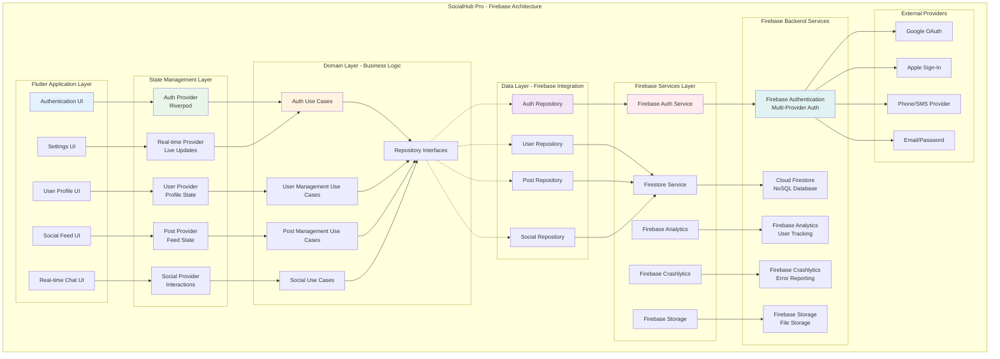

---

## **Firebase Authentication Flow**

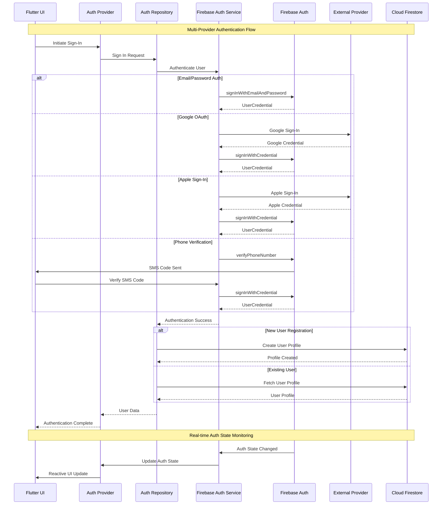

---

## **Firestore Data Architecture**

```mermaid
graph TB
    subgraph "Firestore Database Structure"
        A[Root Database] --> B[users Collection]
        A --> C[posts Collection]
        A --> D[comments Collection]
        A --> E[likes Collection]
        A --> F[follows Collection]
        A --> G[notifications Collection]
        
        B --> H[User Document<br/>/{userId}]
        H --> I[User Data<br/>Profile Info]
        H --> J[followers Subcollection]
        H --> K[following Subcollection]
        H --> L[settings Subcollection]
        
        C --> M[Post Document<br/>/{postId}]
        M --> N[Post Data<br/>Content & Metadata]
        M --> O[comments Subcollection]
        M --> P[likes Subcollection]
        
        D --> Q[Comment Document<br/>/{commentId}]
        Q --> R[Comment Data<br/>Content & References]
        Q --> S[replies Subcollection]
        
        E --> T[Like Document<br/>/{likeId}]
        T --> U[Like Data<br/>User & Target References]
        
        F --> V[Follow Document<br/>/{followId}]
        V --> W[Follow Data<br/>User Relationships]
        
        G --> X[Notification Document<br/>/{notificationId}]
        X --> Y[Notification Data<br/>Type & References]
    end
    
    subgraph "Data Relationships"
        Z[User] --> AA[1:N Posts]
        Z --> BB[M:N Follows]
        AA --> CC[1:N Comments]
        AA --> DD[1:N Likes]
        CC --> EE[1:N Replies]
        CC --> FF[1:N Likes]
    end
    
    subgraph "Index Strategy"
        GG[Compound Indexes]
        HH[Single Field Indexes]
        II[Collection Group Indexes]
        
        GG --> JJ[posts: authorId + createdAt]
        GG --> KK[comments: postId + createdAt]
        GG --> LL[likes: targetId + userId]
        GG --> MM[follows: followerId + createdAt]
        
        HH --> NN[All timestamp fields]
        HH --> OO[All user references]
        
        II --> PP[All comments across posts]
        II --> QQ[All likes across targets]
    end
    
    style A fill:#4CAF50
    style H fill:#c8e6c9
    style M fill:#c8e6c9
    style Q fill:#c8e6c9
    style GG fill:#e3f2fd
```

---

## **Real-Time Data Synchronization**

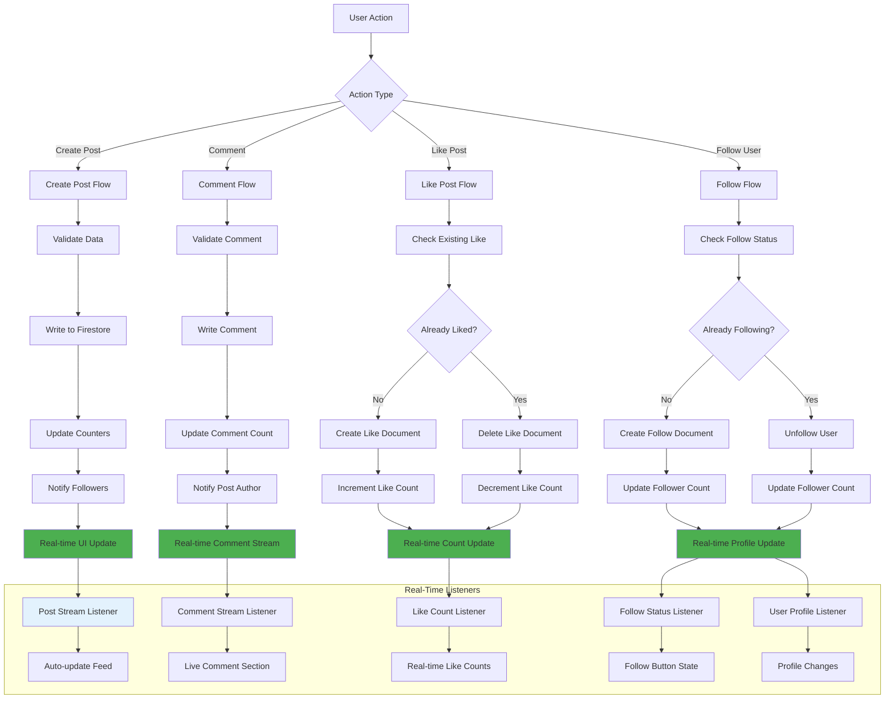

---

## **Security Rules Architecture**

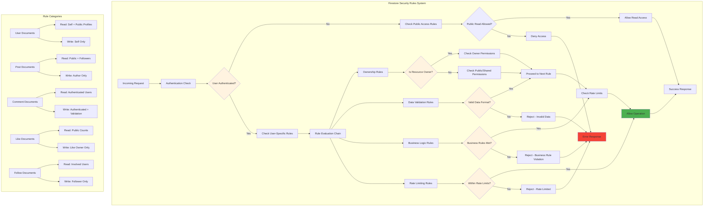

---

## **Authentication Provider Integration**

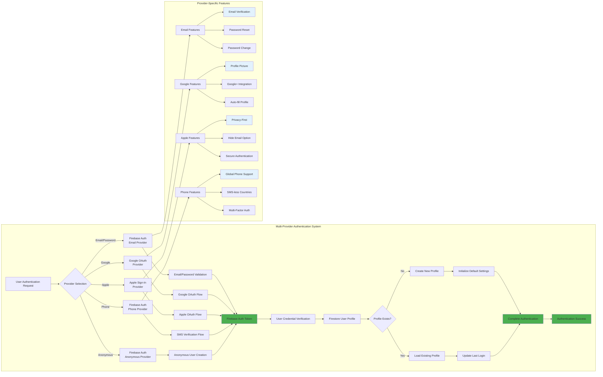

---

## **Real-Time Data Flow Pattern**

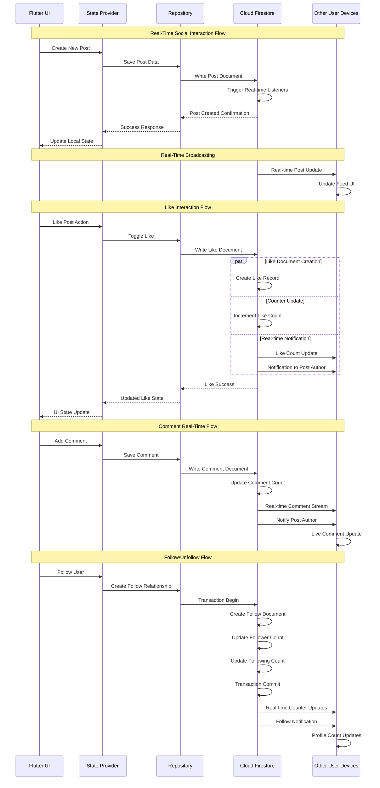

---

## **Offline Support & Caching Strategy**

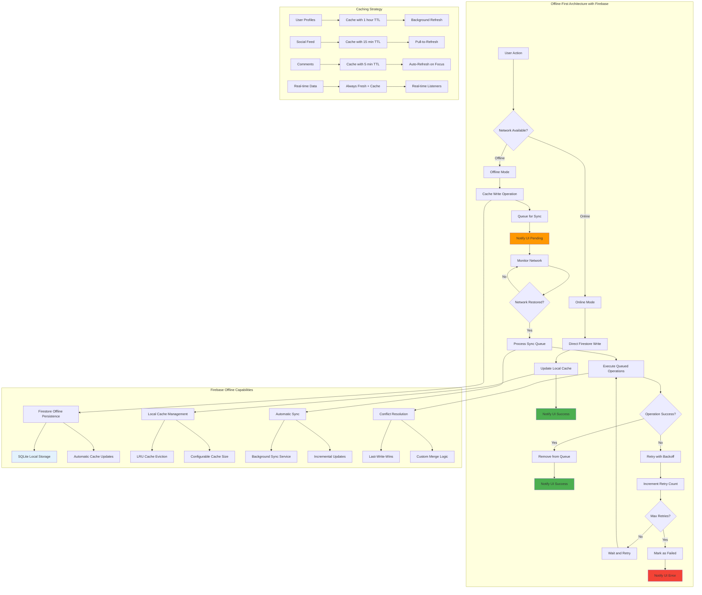

---

## **Clean Architecture Integration with Firebase**

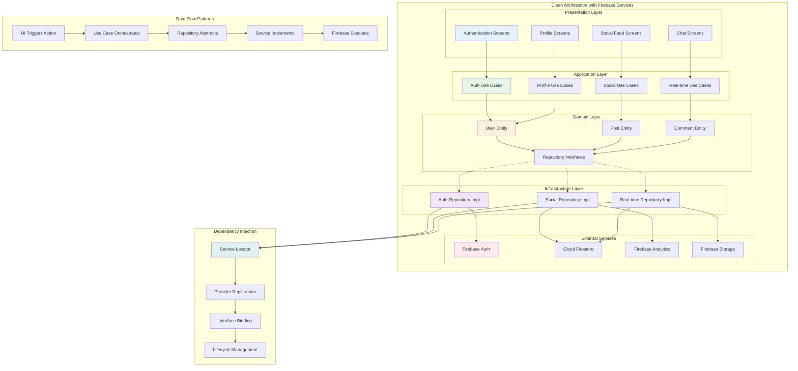

---

## **Testing Strategy for Firebase Integration**

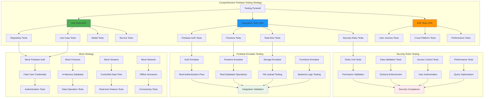

---

## **Performance Optimization Patterns**

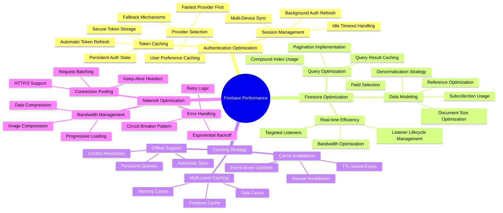

---

## **Security Implementation Overview**

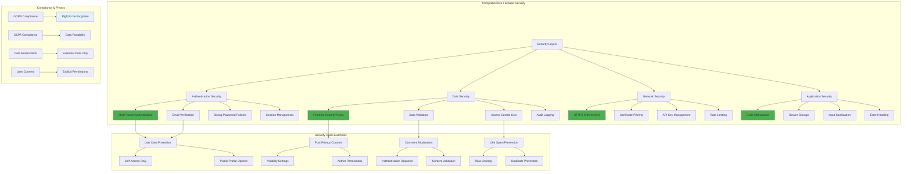

---

## **Real-World Implementation Benefits**

### **🔐 Authentication Excellence**
- **Multi-Provider Support**: Seamless integration with Google, Apple, phone, and email authentication
- **Security Best Practices**: MFA, email verification, secure session management, and fraud protection
- **User Experience**: Social login options, password reset flows, and persistent authentication
- **Enterprise Ready**: Custom authentication, SSO integration, and admin management capabilities

### **🔥 Firestore Database Mastery**
- **Real-Time Synchronization**: Live data updates across all connected clients with sub-second latency
- **Scalable Architecture**: Horizontal scaling, automatic sharding, and global distribution
- **Advanced Querying**: Complex queries, compound indexes, and collection group queries
- **Offline Support**: Automatic caching, offline mutations, and intelligent synchronization

### **🏗️ Clean Architecture Integration**
- **Repository Pattern**: Clean abstraction between business logic and Firebase services
- **Dependency Injection**: Testable architecture with proper service boundaries
- **Error Handling**: Comprehensive error management with user-friendly messaging
- **Performance Optimization**: Efficient data access patterns and caching strategies

### **🔒 Security and Compliance**
- **Granular Access Control**: Field-level security rules with role-based permissions
- **Data Validation**: Server-side validation with custom business rules
- **Privacy Protection**: GDPR/CCPA compliance with data minimization principles
- **Audit Capabilities**: Comprehensive logging and monitoring for security compliance

### **⚡ Performance and Scalability**
- **Global Infrastructure**: Google Cloud's worldwide network for low-latency access
- **Intelligent Caching**: Multi-level caching with automatic invalidation strategies
- **Real-Time Efficiency**: Optimized listeners and bandwidth management
- **Cost Optimization**: Efficient query patterns and data modeling for cost control

### **🧪 Testing and Quality Assurance**
- **Emulator Support**: Complete local development environment with Firebase emulators
- **Mock Integration**: Comprehensive mocking strategies for unit and integration testing
- **Security Testing**: Automated security rule validation and penetration testing
- **Performance Testing**: Load testing, latency monitoring, and optimization validation

### **📱 Production-Ready Features**
- **Analytics Integration**: User behavior tracking and performance monitoring
- **Crash Reporting**: Automatic error detection and debugging information
- **A/B Testing**: Feature flag management and user experience optimization
- **Monitoring**: Real-time performance metrics and alerting systems

**This comprehensive Firebase integration demonstrates how to build scalable, real-time applications with professional authentication, robust data management, and enterprise-grade security that can handle millions of users with excellent performance and reliability! 🔥✨🔥**