# 📜 Diagram for Lesson 20: Cloud Functions + Push Notifications

## ☁️ **Cloud Functions + Push Notifications - Serverless Backend Mastery**

This lesson advances Phase 5: Firebase & Cloud development, demonstrating how to build intelligent serverless backends using Cloud Functions and implement comprehensive push notification systems with Firebase Cloud Messaging (FCM). Building on Lesson 19's foundation, this lesson adds automated backend logic, real-time messaging, and event-driven architecture.

---

## **Complete Serverless Architecture Overview**

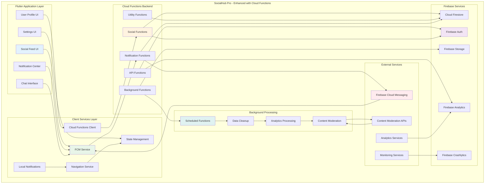

---

## **Firebase Cloud Messaging (FCM) Architecture**

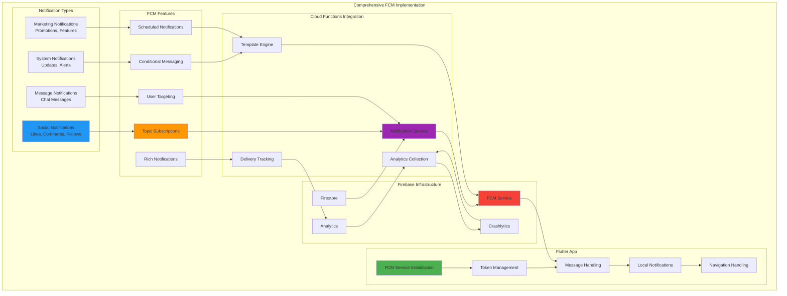

---

## **Event-Driven Cloud Functions Flow**

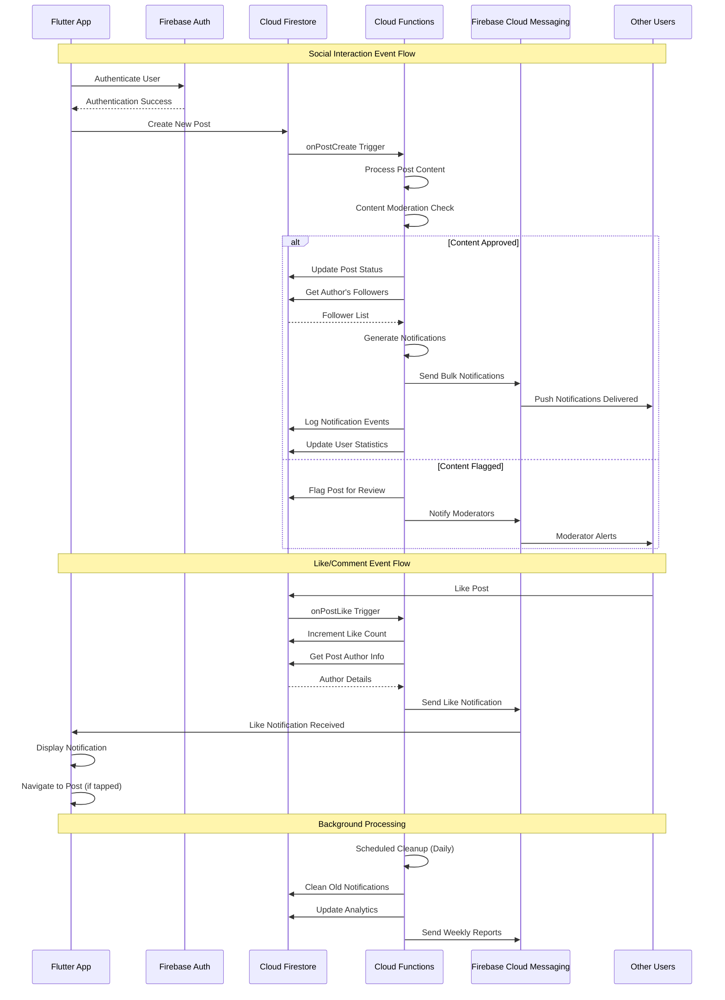

---

## **Cloud Functions Organization Pattern**

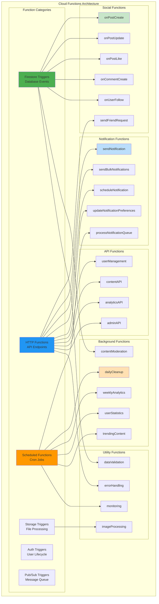

---

## **Push Notification Flow Patterns**

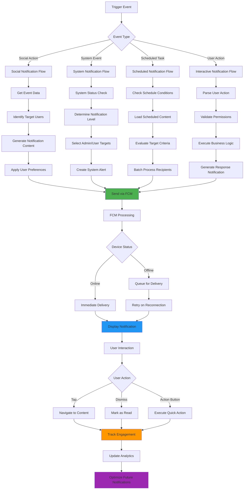

---

## **Background Processing Architecture**

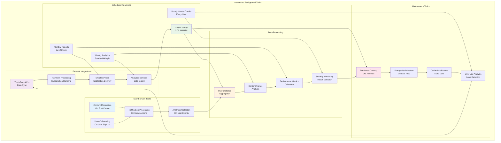

---

## **Notification Template System**

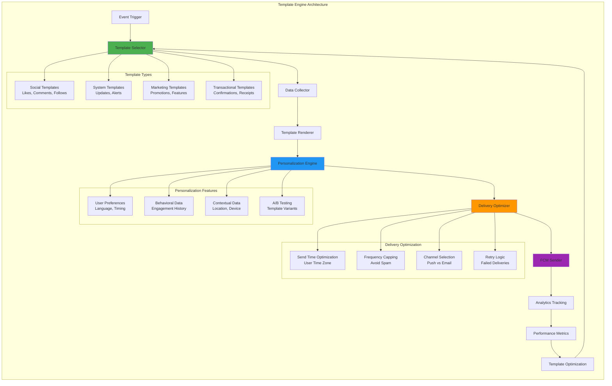

---

## **Cloud Functions Testing Strategy**

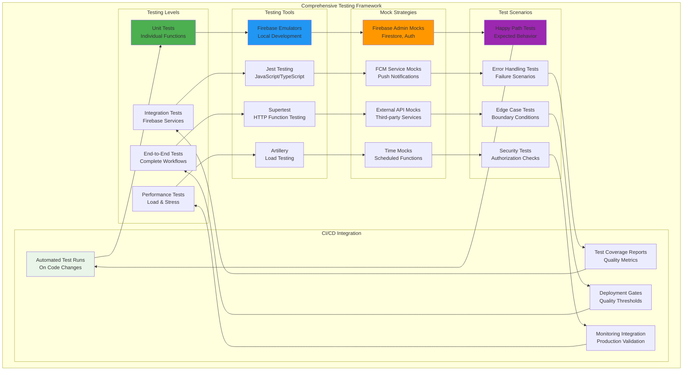

---

## **Production Deployment Pipeline**

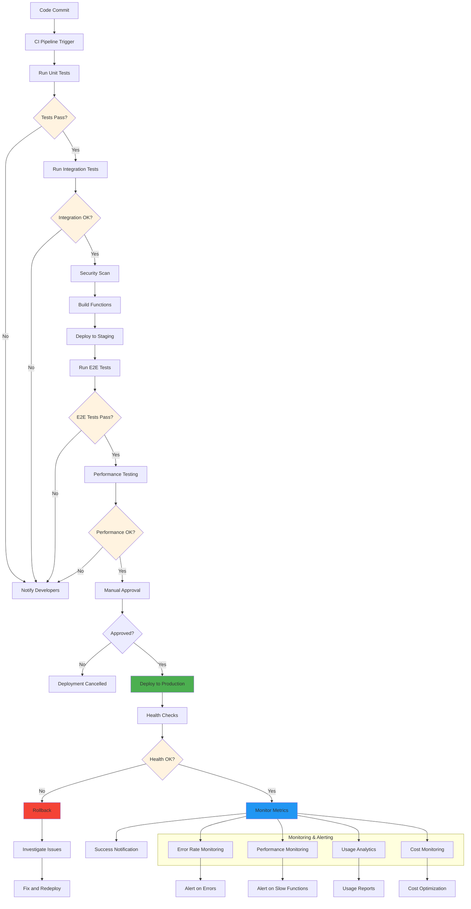

---

## **Performance Optimization Patterns**

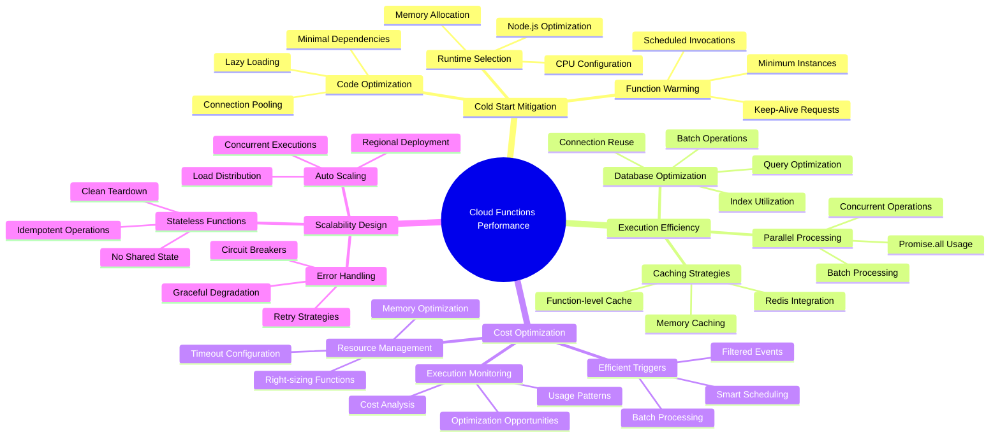

---

## **Security and Compliance Framework**

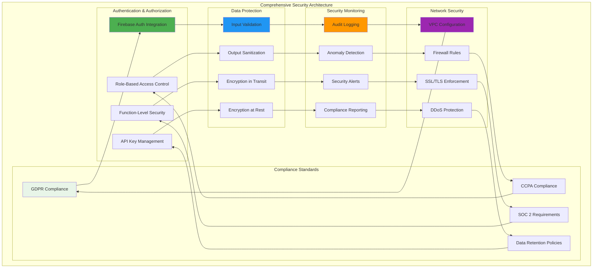

---

## **Real-World Implementation Benefits**

### **☁️ Serverless Excellence**
- **Infinite Scalability**: Automatic scaling from zero to millions of requests without infrastructure management
- **Cost Efficiency**: Pay-per-execution model eliminates idle server costs and optimizes resource usage
- **Event-Driven Architecture**: Reactive functions that respond instantly to Firebase events and user actions
- **Global Distribution**: Functions deployed across Google Cloud regions for optimal performance worldwide

### **📱 Push Notification Mastery**
- **Multi-Platform Support**: Unified FCM integration for iOS, Android, and web with consistent messaging
- **Intelligent Targeting**: Advanced user segmentation, topic subscriptions, and conditional messaging
- **Rich Notifications**: Interactive notifications with actions, images, and custom layouts
- **Performance Optimization**: Efficient delivery, retry logic, and engagement tracking

### **🤖 Background Processing Excellence**
- **Automated Operations**: Scheduled tasks for data cleanup, analytics processing, and maintenance
- **Content Moderation**: Automated content filtering, spam detection, and community safety
- **Analytics Processing**: Real-time user behavior analysis, trend detection, and reporting
- **System Maintenance**: Automatic database optimization, cache management, and performance tuning

### **🔔 Real-Time Engagement**
- **Social Interactions**: Instant notifications for likes, comments, follows, and mentions
- **Personalized Messaging**: Context-aware notifications based on user preferences and behavior
- **Engagement Optimization**: A/B testing, send time optimization, and frequency capping
- **Cross-Platform Sync**: Consistent notification experience across all user devices

### **⚡ Performance and Reliability**
- **Sub-Second Response**: Optimized function execution with minimal cold start latency
- **Fault Tolerance**: Automatic retry logic, error handling, and graceful degradation
- **Monitoring Integration**: Comprehensive logging, metrics, and alerting for production operations
- **Security First**: Built-in authentication, authorization, and data protection

### **🧪 Testing and Quality Assurance**
- **Emulator Testing**: Complete local development environment with Firebase emulator suite
- **Automated Testing**: Comprehensive unit, integration, and end-to-end testing strategies
- **Performance Testing**: Load testing, stress testing, and performance optimization validation
- **Security Testing**: Vulnerability scanning, penetration testing, and compliance validation

### **📊 Analytics and Insights**
- **User Behavior Tracking**: Detailed analytics on notification engagement and user interactions
- **Performance Monitoring**: Function execution metrics, error rates, and optimization opportunities
- **Business Intelligence**: Data-driven insights for product improvement and user experience optimization
- **Cost Analysis**: Detailed cost tracking and optimization recommendations for Cloud Functions usage

### **🔒 Security and Compliance**
- **Enterprise Security**: Role-based access control, audit logging, and data encryption
- **Privacy Protection**: GDPR/CCPA compliance with data minimization and user consent management
- **Security Monitoring**: Real-time threat detection, anomaly monitoring, and incident response
- **Compliance Reporting**: Automated compliance checks and audit trail generation

**This comprehensive Cloud Functions and FCM integration demonstrates how to build intelligent, scalable backends that handle millions of users with automated business logic, real-time messaging, and production-ready reliability! ☁️📱✨🔥**