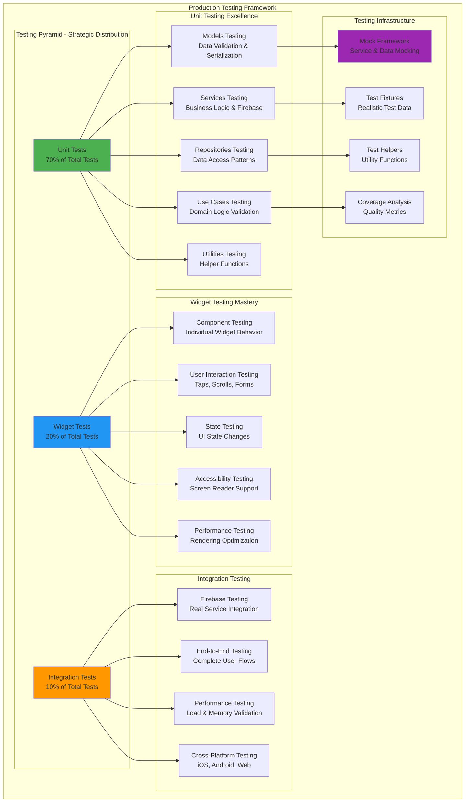
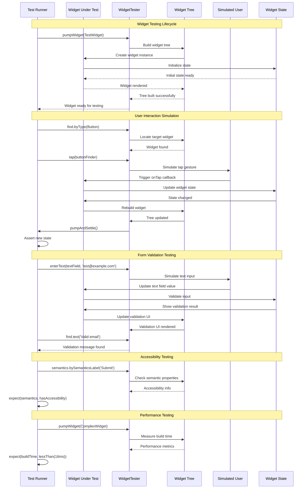
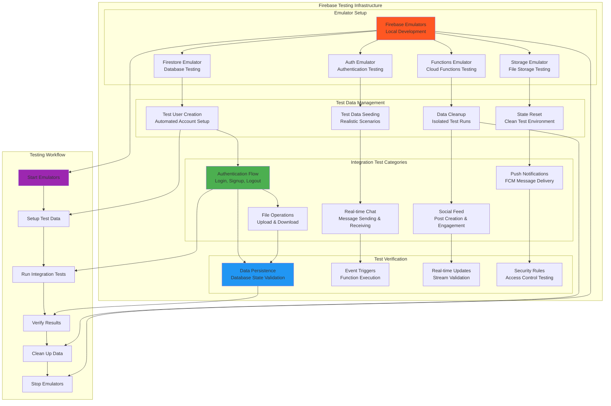
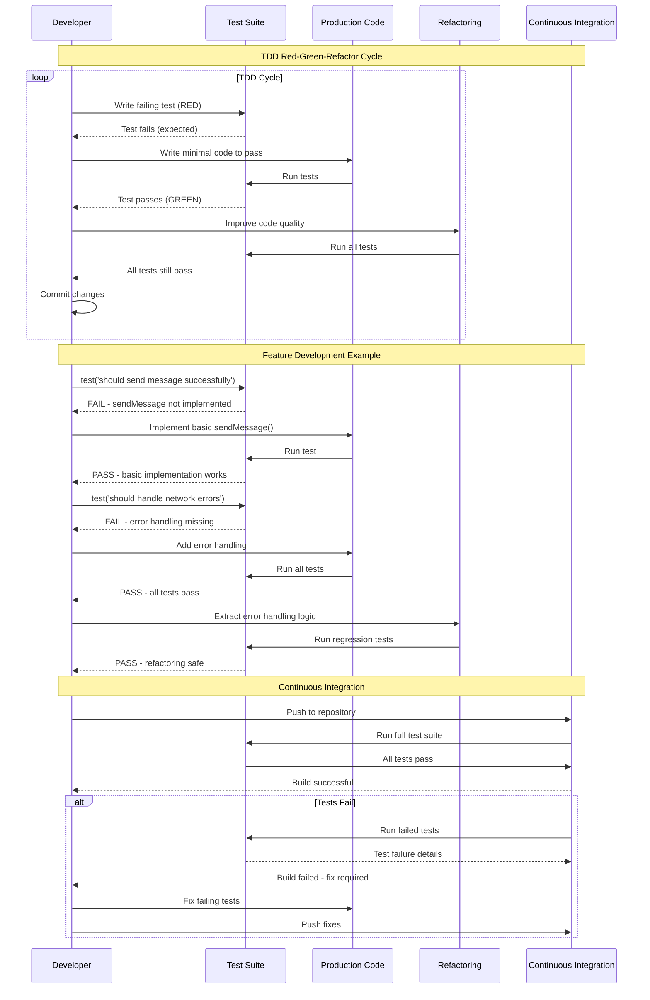
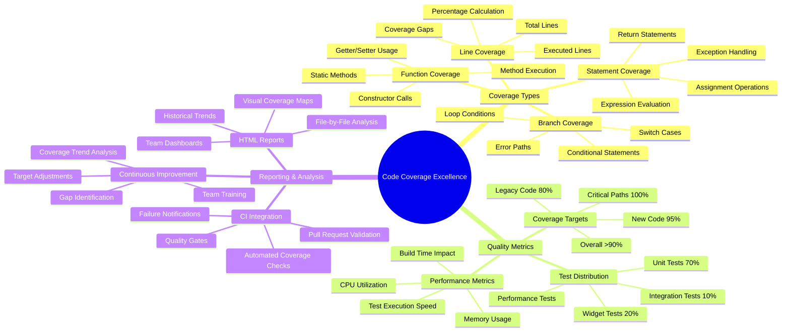
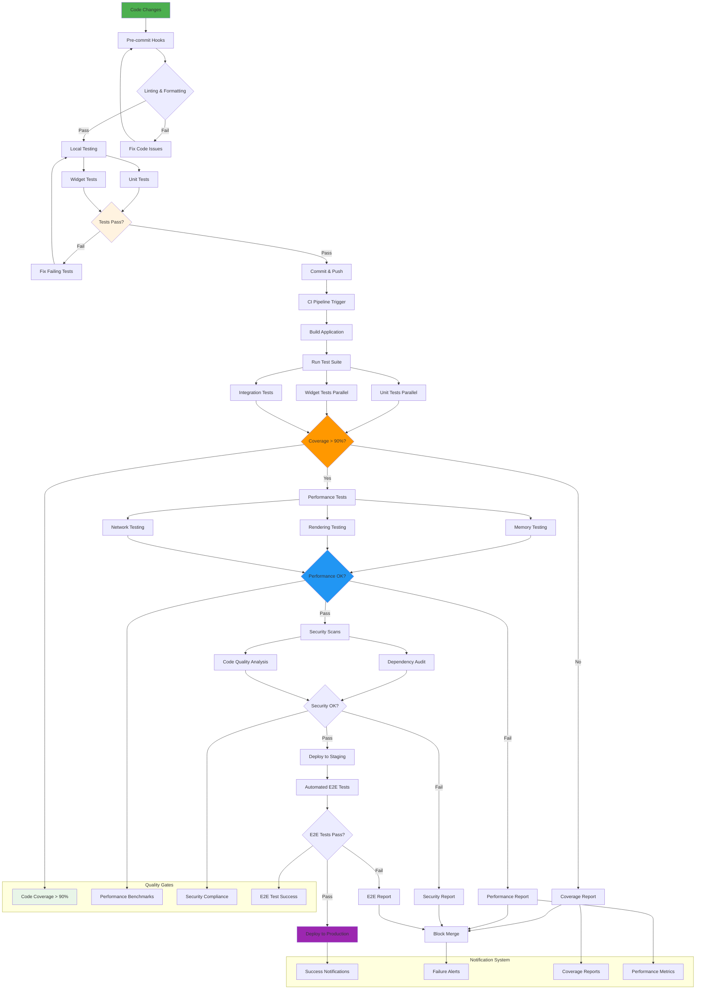

# 📜 Diagram

## 🧪 **Unit & Widget Testing - Production Quality Assurance**

This lesson establishes comprehensive testing strategies for ConnectPro Ultimate, implementing professional testing practices including unit testing, widget testing, Firebase integration testing, state management testing, performance validation, and test-driven development principles that ensure production-ready application quality.

---

## **Complete Testing Architecture Overview**

---

## **Unit Testing Strategy and Implementation**

```mermaid
flowchart TD
    A[Unit Testing Strategy] --> B[Test Organization]
    B --> C[Model Testing]
    B --> D[Service Testing]
    B --> E[Repository Testing]
    B --> F[Use Case Testing]
    
    C --> C1[Data Validation<br/>Serialization/Deserialization]
    C --> C2[Business Rules<br/>Validation Logic]
    C --> C3[Edge Cases<br/>Boundary Conditions]
    C --> C4[Helper Methods<br/>Utility Functions]
    
    D --> D1[Firebase Integration<br/>Firestore, Auth, FCM]
    D --> D2[Real-time Features<br/>Streams & Live Data]
    D --> D3[Error Handling<br/>Network & Service Errors]
    D --> D4[Security Operations<br/>Encryption & Validation]
    
    E --> E1[Data Access<br/>CRUD Operations]
    E --> E2[Caching Logic<br/>Local & Remote Sync]
    E --> E3[Offline Support<br/>Queue Management]
    E --> E4[Error Recovery<br/>Retry & Fallback]
    
    F --> F1[Business Logic<br/>Domain Rules]
    F --> F2[Input Validation<br/>Parameter Checking]
    F --> F3[Output Validation<br/>Result Verification]
    F --> F4[Error Scenarios<br/>Failure Handling]
    
    subgraph "Testing Best Practices"
        G[AAA Pattern<br/>Arrange, Act, Assert]
        H[Single Responsibility<br/>One Test, One Behavior]
        I[Descriptive Names<br/>Test as Documentation]
        J[Fast Execution<br/>< 1ms per test]
        K[Independent Tests<br/>No Side Effects]
        L[Realistic Data<br/>Production-like Scenarios]
    end
    
    C1 --> G
    D1 --> H
    E1 --> I
    F1 --> J
    C2 --> K
    D2 --> L
    
    style A fill:#4CAF50
    style G fill:#2196F3
    style C1 fill:#e8f5e8
    style D1 fill:#e3f2fd
```

---

## **Widget Testing Framework and User Interaction Testing**

---

## **Firebase Integration Testing with Emulators**

---

## **State Management Testing Patterns**

```mermaid
flowchart TD
    subgraph "State Management Testing Framework"
        A[State Testing Strategy] --> B[Provider Testing]
        A --> C[Riverpod Testing]
        A --> D[Bloc Testing]
        A --> E[State Transitions]
        
        B --> B1[ChangeNotifier Testing<br/>State Updates & Notifications]
        B --> B2[Provider Scoping<br/>Context & Dependency Injection]
        B --> B3[Consumer Testing<br/>Widget Rebuilds]
        B --> B4[Selector Testing<br/>Optimization Validation]
        
        C --> C1[Provider Types<br/>StateProvider, FutureProvider]
        C --> C2[AsyncValue Testing<br/>Loading, Data, Error States]
        C --> C3[Provider Modifiers<br/>autoDispose, family]
        C --> C4[ProviderContainer<br/>Testing Isolation]
        
        D --> D1[Event Testing<br/>Input Validation]
        D --> D2[State Transitions<br/>Event → State Changes]
        D --> D3[Bloc-to-Bloc<br/>Communication Testing]
        D --> D4[Error Handling<br/>Exception Management]
        
        E --> E1[Initial State<br/>Default Values]
        E --> E2[Loading States<br/>Async Operations]
        E --> E3[Success States<br/>Data Availability]
        E --> E4[Error States<br/>Failure Scenarios]
    end
    
    subgraph "Testing Tools & Utilities"
        F[Mock Providers<br/>Isolated Testing]
        G[Test Containers<br/>Provider Overrides]
        H[Async Testing<br/>Future & Stream Validation]
        I[Performance Testing<br/>State Change Efficiency]
    end
    
    subgraph "Test Scenarios"
        J[Happy Path<br/>Normal User Flow]
        K[Edge Cases<br/>Boundary Conditions]
        L[Error Scenarios<br/>Network Failures]
        M[Concurrent States<br/>Race Conditions]
    end
    
    B1 --> F
    C1 --> G
    D1 --> H
    E1 --> I
    
    F --> J
    G --> K
    H --> L
    I --> M
    
    style A fill:#4CAF50
    style B fill:#2196F3
    style C fill:#FF9800
    style D fill:#9C27B0
    style F fill:#e8f5e8
    style J fill:#fff3e0
```

---

## **Test-Driven Development (TDD) Workflow**

---

## **Code Coverage Analysis and Quality Metrics**

---

## **Performance Testing and Optimization Validation**

```mermaid
graph TB
    subgraph "Performance Testing Framework"
        subgraph "Rendering Performance"
            A[Frame Rate Testing<br/>60 FPS Target]
            B[Widget Build Time<br/>< 16ms per frame]
            C[Layout Performance<br/>Constraint Solving]
            D[Paint Performance<br/>Rendering Efficiency]
        end
        
        subgraph "Memory Performance"
            E[Memory Usage Monitoring<br/>Heap & Stack Analysis]
            F[Memory Leak Detection<br/>Object Lifecycle Tracking]
            G[Image Memory Management<br/>Cache Optimization]
            H[State Memory Efficiency<br/>Provider & Bloc Memory]
        end
        
        subgraph "Network Performance"
            I[API Response Time<br/>Network Latency Testing]
            J[Data Transfer Efficiency<br/>Payload Optimization]
            K[Offline Performance<br/>Cache Hit Rates]
            L[Real-time Performance<br/>WebSocket Efficiency]
        end
        
        subgraph "User Experience Metrics"
            M[App Launch Time<br/>Cold & Warm Starts]
            N[Navigation Performance<br/>Route Transition Speed]
            O[Form Input Responsiveness<br/>Keyboard & Touch]
            P[Scroll Performance<br/>List & Grid Smoothness]
        end
    end
    
    subgraph "Testing Tools & Techniques"
        Q[Flutter Driver<br/>Performance Profiling]
        R[Observatory<br/>Memory Analysis]
        S[Timeline Analysis<br/>Frame Rendering]
        T[Benchmark Tests<br/>Performance Regression]
    end
    
    subgraph "Performance Targets"
        U[Response Time<br/>< 100ms UI Updates]
        V[Memory Usage<br/>< 100MB Typical Apps]
        W[Battery Efficiency<br/>Minimal Background Usage]
        X[Network Efficiency<br/>< 5MB per session]
    end
    
    A --> Q
    E --> R
    A --> S
    M --> T
    
    Q --> U
    R --> V
    S --> W
    T --> X
    
    subgraph "Optimization Validation"
        Y[Image Optimization<br/>WebP, Compression]
        Z[Code Splitting<br/>Lazy Loading]
        AA[Caching Strategy<br/>Multi-level Cache]
        BB[Bundle Size<br/>App Size Optimization]
    end
    
    I --> Y
    M --> Z
    K --> AA
    M --> BB
    
    style A fill:#4CAF50
    style E fill:#2196F3
    style I fill:#FF9800
    style M fill:#9C27B0
    style Q fill:#e8f5e8
    style Y fill:#ffebee
```

---

## **Comprehensive Testing Pipeline Integration**

---

## **Testing Best Practices and Professional Standards**

### **🧪 Unit Testing Excellence**
- **Comprehensive Coverage**: Greater than 90% code coverage with meaningful tests that validate business logic, edge cases, and error scenarios
- **Fast Execution**: Unit tests run in less than 1ms each, enabling rapid feedback during development cycles
- **Isolated Testing**: Each test is independent with proper mocking of external dependencies and services
- **Clear Documentation**: Tests serve as living documentation with descriptive names and clear assertions

### **🎨 Widget Testing Mastery**
- **User-Centric Testing**: Validate actual user interactions including taps, scrolls, form inputs, and navigation flows
- **Accessibility Validation**: Ensure all UI components are accessible with proper semantic labels and screen reader support
- **Performance Verification**: Test widget rendering performance with frame rate monitoring and memory usage validation
- **Cross-Platform Consistency**: Verify UI behavior across different screen sizes, orientations, and platform variations

### **🔥 Firebase Integration Testing**
- **Emulator Excellence**: Use Firebase emulators for reliable, isolated testing of cloud services without external dependencies
- **Real-Time Testing**: Validate real-time features like chat messaging, live updates, and push notification delivery
- **Security Testing**: Verify Firestore security rules, authentication flows, and data access controls
- **Performance Testing**: Monitor Firebase operation performance including query efficiency and network optimization

### **⚡ State Management Testing**
- **Provider Validation**: Test all Riverpod providers with proper state transitions, async operations, and error handling
- **Complex State Scenarios**: Validate state management under concurrent operations, race conditions, and error recovery
- **Performance Monitoring**: Ensure state changes don't cause unnecessary rebuilds or memory leaks
- **Testing Isolation**: Use ProviderContainer for isolated testing with proper mock providers and overrides

### **📊 Quality Assurance Excellence**
- **Continuous Integration**: Automated testing pipeline with quality gates for coverage, performance, and security
- **Performance Benchmarks**: Regular performance testing with memory usage, rendering speed, and network efficiency validation
- **Code Quality Metrics**: Automated code analysis with linting, complexity analysis, and maintainability scoring
- **Security Validation**: Regular security scans, dependency audits, and vulnerability assessments

**Testing ConnectPro Ultimate demonstrates how to implement enterprise-grade quality assurance with comprehensive unit testing, professional widget testing, Firebase integration validation, state management verification, and production-ready performance testing that ensures application reliability and maintainability at scale! 🧪📱✨🔥**