# 📜 Diagram for Lesson 23: Integration Testing + Mocking

## 🔄 **Integration Testing + Mocking - End-to-End Quality Assurance**

This lesson advances Phase 6 Production Ready development by establishing comprehensive integration testing strategies, advanced mocking techniques, and automated quality assurance for ConnectPro Ultimate. Students master end-to-end testing, performance validation, cross-platform testing, and sophisticated mocking that ensures production-ready application reliability at enterprise scale.

---

## **Complete Integration Testing Architecture Overview**

---

## **End-to-End Testing Strategy and User Journey Validation**

```mermaid
sequenceDiagram
    participant User as Test User
    participant App as ConnectPro Ultimate
    participant Mock as Mock Services
    participant Firebase as Firebase Emulator
    participant Monitor as Performance Monitor
    participant Reporter as Test Reporter
    
    Note over User,Reporter: Complete User Journey Testing
    
    User->>App: Launch Application
    App->>Monitor: Start Performance Monitoring
    Monitor-->>App: Monitoring Active
    App->>Firebase: Initialize Services
    Firebase-->>App: Services Ready
    
    Note over User,Reporter: Authentication Flow Testing
    
    User->>App: Navigate to Registration
    App->>Mock: Validate Email Format
    Mock-->>App: Validation Result
    User->>App: Submit Registration Form
    App->>Firebase: Create User Account
    Firebase-->>App: Account Created
    App->>Mock: Send Verification Email
    Mock-->>App: Email Sent (Simulated)
    
    Note over User,Reporter: Profile Setup Testing
    
    User->>App: Complete Profile Setup
    App->>Mock: Upload Profile Photo
    Mock-->>App: Upload Success (Simulated)
    App->>Firebase: Save Profile Data
    Firebase-->>App: Profile Saved
    
    Note over User,Reporter: Social Feature Testing
    
    User->>App: Create First Post
    App->>Firebase: Save Post Data
    Firebase-->>App: Post Created
    App->>Mock: Trigger Content Moderation
    Mock-->>App: Moderation Passed
    App->>Mock: Send Notifications
    Mock-->>App: Notifications Sent
    
    Note over User,Reporter: Real-Time Chat Testing
    
    User->>App: Start Chat Conversation
    App->>Firebase: Create Chat Room
    Firebase-->>App: Chat Room Created
    User->>App: Send Message
    App->>Firebase: Store Message
    Firebase-->>App: Message Stored
    Firebase->>App: Real-Time Message Delivery
    App->>User: Display Message
    
    Note over User,Reporter: Performance Validation
    
    Monitor->>Monitor: Collect Performance Metrics
    Monitor->>Reporter: Report Memory Usage
    Monitor->>Reporter: Report Response Times
    Monitor->>Reporter: Report Error Rates
    
    Note over User,Reporter: Test Completion & Reporting
    
    App->>Monitor: Stop Performance Monitoring
    Monitor->>Reporter: Final Performance Report
    Reporter->>Reporter: Generate Test Summary
    Reporter->>Reporter: Validate Quality Gates
    
    alt All Tests Pass
        Reporter-->>User: ✅ Test Suite Passed
    else Tests Fail
        Reporter-->>User: ❌ Test Failures Detected
    end
```

---

## **Advanced Mocking Infrastructure and Service Simulation**

---

## **Performance Integration Testing Framework**

---

## **Cross-Platform Testing Strategy and Validation**

---

## **Test Automation Pipeline and CI/CD Integration**

---

## **Mock Data Generation and Test Scenario Management**

---

## **Quality Assurance Metrics and Continuous Improvement**

---

## **Integration Testing Best Practices and Professional Standards**

### **🔄 End-to-End Testing Excellence**
- **Complete User Journey Testing**: Comprehensive validation of entire user workflows from onboarding to advanced feature usage
- **Realistic Scenario Simulation**: Testing with production-like data volumes, user behaviors, and system conditions
- **Cross-Platform Consistency**: Ensuring consistent behavior and performance across iOS, Android, and web platforms
- **Performance Under Load**: Validating application behavior with concurrent users and high data volumes

### **🎭 Advanced Mocking Strategies**
- **Service Layer Mocking**: Sophisticated mocking of Firebase services, HTTP APIs, and platform channels with realistic behavior patterns
- **Network Condition Simulation**: Testing with various network conditions including offline scenarios, slow connections, and intermittent connectivity
- **Error Scenario Testing**: Comprehensive error injection and recovery testing to validate application resilience
- **State-Based Simulation**: Complex state management testing with realistic user interaction patterns and data consistency validation

### **⚡ Performance Integration Testing**
- **Load Testing Excellence**: Concurrent user simulation with 100+ simultaneous users and high message throughput validation
- **Memory Leak Detection**: Extended usage monitoring with automated memory leak detection and resource usage optimization
- **Stress Testing**: System limit testing with burst load scenarios and graceful degradation validation
- **Performance Benchmarking**: Automated performance benchmarking with SLA compliance and regression detection

### **🌍 Cross-Platform Testing Mastery**
- **Platform Feature Parity**: Ensuring 100% core feature availability across all supported platforms with consistent user experiences
- **Native Integration Testing**: Comprehensive testing of platform-specific features including permissions, notifications, and background processing
- **Responsive Design Validation**: Testing across various screen sizes, orientations, and device capabilities
- **Accessibility Compliance**: Cross-platform accessibility testing with screen reader compatibility and WCAG guideline compliance

### **🤖 Test Automation Excellence**
- **CI/CD Integration**: Automated testing pipeline with quality gates, performance thresholds, and security validation
- **Quality Metrics Tracking**: Real-time monitoring of test coverage, performance metrics, and quality trends
- **Automated Reporting**: Comprehensive test reporting with stakeholder dashboards and actionable insights
- **Continuous Improvement**: Performance trend analysis, regression detection, and testing strategy optimization

**Integration Testing + Mocking for ConnectPro Ultimate demonstrates how to implement enterprise-grade quality assurance with comprehensive end-to-end testing, sophisticated service mocking, performance validation under load, cross-platform testing excellence, and automated quality assurance pipelines that ensure production reliability and maintainability at scale! 🔄📱✨🚀**