# 📜 Diagram

## 🚀 **CI/CD with GitHub Actions - Automated Deployment Excellence**

This lesson completes Phase 6 Production Ready development by establishing comprehensive CI/CD automation with GitHub Actions. Students master enterprise-grade automated deployment pipelines including advanced workflow orchestration with parallel jobs and matrix builds, comprehensive testing automation with quality gates and performance validation, multi-platform build automation with signing and deployment, security scanning and compliance automation, staged deployment with approval workflows, and intelligent notification systems that ensure bulletproof automated deployment for production Flutter applications.

---

## **Complete CI/CD Pipeline Architecture Overview**

---

## **GitHub Actions Workflow Architecture and Job Dependencies**

---

## **Comprehensive Testing Matrix and Quality Gates**

---

## **Multi-Platform Build Automation Strategy**

---

## **Security Integration and Compliance Automation**

---

## **Deployment Strategy and Environment Management**

---

## **Performance Monitoring and Optimization Integration**

---

## **Advanced Notification and Communication System**

```mermaid
sequenceDiagram
    participant Pipeline as CI/CD Pipeline
    participant NotificationEngine as Notification Engine
    participant Slack as Slack Channels
    participant Email as Email System
    participant GitHub as GitHub Notifications
    participant Teams as Microsoft Teams
    participant Dashboard as Monitoring Dashboard
    participant OnCall as On-Call Engineer
    
    Note over Pipeline,OnCall: Intelligent Notification Flow
    
    Pipeline->>NotificationEngine: Pipeline Event Triggered
    NotificationEngine->>NotificationEngine: Analyze Event Severity & Context
    
    alt Success Events
        NotificationEngine->>Slack: Send Success Message (#deployments)
        NotificationEngine->>Dashboard: Update Status (Green)
        NotificationEngine->>GitHub: Update Status Check
    end
    
    alt Warning Events
        NotificationEngine->>Slack: Send Warning Message (#dev-alerts)
        NotificationEngine->>Email: Send Summary to Team Leads
        NotificationEngine->>Dashboard: Update Status (Yellow)
        NotificationEngine->>GitHub: Update Status with Warning
    end
    
    alt Critical Failures
        NotificationEngine->>Slack: Send Urgent Alert (@channel #critical-alerts)
        NotificationEngine->>Teams: Send High-Priority Alert
        NotificationEngine->>Email: Send Immediate Alert to Stakeholders
        NotificationEngine->>OnCall: Trigger PagerDuty/On-Call Alert
        NotificationEngine->>Dashboard: Update Status (Red)
        NotificationEngine->>GitHub: Block Merge with Failure Status
    end
    
    alt Production Deployment
        NotificationEngine->>Slack: Deployment Started (#production-alerts)
        Pipeline->>Pipeline: Execute Deployment
        alt Deployment Success
            NotificationEngine->>Slack: Deployment Successful ✅
            NotificationEngine->>Email: Send Success Summary
            NotificationEngine->>Dashboard: Update Production Status
        else Deployment Failure
            NotificationEngine->>Slack: URGENT: Deployment Failed ❌
            NotificationEngine->>OnCall: Immediate Escalation
            NotificationEngine->>Teams: Emergency Alert
            NotificationEngine->>Dashboard: Critical Status Update
        end
    end
    
    alt Performance Regression
        NotificationEngine->>Slack: Performance Alert (#performance-alerts)
        NotificationEngine->>Email: Performance Report to Engineering Leads
        NotificationEngine->>Dashboard: Performance Metrics Update
        NotificationEngine->>GitHub: Performance Warning Comment
    end
    
    alt Security Vulnerabilities
        NotificationEngine->>Slack: Security Alert (#security-alerts)
        NotificationEngine->>OnCall: Security Incident Escalation
        NotificationEngine->>Email: Security Report to Security Team
        NotificationEngine->>Dashboard: Security Status Update
        NotificationEngine->>GitHub: Security Check Failure
    end
```

---

## **CI/CD Pipeline Best Practices and Professional Standards**

### **🔄 Advanced CI/CD Pipeline Excellence**
- **Workflow Orchestration**: Comprehensive pipeline automation with parallel job execution, matrix builds, conditional logic, and intelligent job dependencies for optimal resource utilization
- **Quality Gate Integration**: Multi-layered quality validation including code quality thresholds, test coverage requirements, performance benchmarks, and security compliance checks
- **Environment Management**: Sophisticated environment strategy with development, staging, production, and app store environments using infrastructure as code and environment-specific configurations
- **Deployment Automation**: Advanced deployment strategies including blue-green deployments, canary releases, feature flags, and automated rollback mechanisms for zero-downtime deployments

### **⚡ GitHub Actions Workflow Excellence**
- **Professional Workflow Architecture**: Enterprise-grade workflow design with reusable components, template workflows, custom actions, and organization-level workflow standards
- **Advanced Triggering Strategies**: Sophisticated pipeline triggers including branch protection rules, path-based filtering, scheduled executions, and manual dispatch with input parameters
- **Resource Optimization**: Intelligent resource management with runner selection, caching strategies, artifact management, and cost optimization for efficient pipeline execution
- **Security Integration**: Comprehensive security practices including secret management, OIDC authentication, permission scoping, and secure artifact handling

### **🧪 Automated Testing Excellence**
- **Comprehensive Test Automation**: Complete testing strategy including unit testing with >90% coverage, widget testing with accessibility validation, integration testing with Firebase emulators, and performance testing with benchmarking
- **Quality Gate Validation**: Sophisticated quality validation including coverage thresholds, performance benchmarks, security scans, accessibility compliance, and regression detection
- **Test Parallelization**: Advanced test execution strategies with matrix builds, parallel test runners, test result aggregation, and intelligent test distribution for optimal execution speed
- **Continuous Quality Assurance**: Real-time quality monitoring with trend analysis, quality metrics tracking, automated quality reporting, and continuous improvement recommendations

### **📱 Multi-Platform Build Excellence**
- **Platform-Specific Optimization**: Tailored build strategies for Android (APK/AAB), iOS (IPA), web (PWA), and desktop platforms with platform-specific optimizations and configurations
- **Automated Signing and Packaging**: Complete automation of code signing, certificate management, provisioning profile handling, and secure artifact packaging for all platforms
- **Build Optimization**: Advanced build optimization including code splitting, tree shaking, asset optimization, bundle analysis, and performance profiling for optimal application performance
- **Cross-Platform Validation**: Comprehensive testing across all target platforms with feature parity validation, platform-specific testing, and consistency verification

### **🚀 Deployment Automation Excellence**
- **Staged Deployment Strategy**: Professional deployment workflow with development, staging, production, and app store environments using approval workflows and automated promotion
- **Zero-Downtime Deployment**: Advanced deployment strategies including blue-green deployments, rolling updates, canary releases, and feature toggles for seamless user experience
- **Automated Rollback Capabilities**: Intelligent rollback mechanisms with automated issue detection, emergency rollback procedures, health monitoring, and recovery validation
- **Multi-Channel Distribution**: Comprehensive distribution strategy including Firebase Hosting, App Distribution, Google Play Console, App Store Connect, and enterprise distribution channels

### **🔒 Security & Compliance Excellence**
- **Comprehensive Security Scanning**: Multi-layered security validation including SAST analysis, dependency vulnerability scanning, secret detection, and compliance checking
- **Supply Chain Security**: Advanced supply chain protection including dependency auditing, license compliance, vulnerability assessment, and automated security updates
- **Secrets Management**: Professional secret handling with GitHub Secrets, OIDC integration, least privilege access, and secure credential rotation strategies
- **Compliance Automation**: Automated compliance validation including GDPR, SOX, HIPAA, and industry-specific requirements with audit trail generation and reporting

### **📊 Performance Monitoring Excellence**
- **Real-Time Performance Tracking**: Continuous performance monitoring with frame rate analysis, memory profiling, CPU utilization tracking, and user experience metrics
- **Performance Regression Detection**: Intelligent performance analysis with baseline comparison, threshold validation, trend analysis, and automated regression alerts
- **Optimization Integration**: Automated performance optimization including bundle analysis, asset optimization, code splitting recommendations, and performance tuning suggestions
- **Performance Dashboard**: Comprehensive performance visualization with real-time metrics, historical trends, performance insights, and optimization recommendations

### **🔔 Advanced Notification Excellence**
- **Intelligent Alerting**: Smart notification system with severity-based routing, context-aware messaging, escalation procedures, and noise reduction strategies
- **Multi-Channel Communication**: Comprehensive communication strategy including Slack integration, email notifications, Microsoft Teams alerts, and mobile push notifications
- **Stakeholder Engagement**: Targeted communication with role-based notifications, executive summaries, developer alerts, and customer communication during incidents
- **Incident Management**: Professional incident response with automated escalation, on-call integration, incident tracking, and post-incident review processes

**CI/CD with GitHub Actions for ConnectPro Ultimate demonstrates how to implement enterprise-grade automated deployment pipelines with comprehensive workflow orchestration, advanced testing automation, multi-platform build processes, sophisticated security integration, staged deployment strategies, performance monitoring, and intelligent notification systems that ensure bulletproof automated deployment and quality assurance for production Flutter applications at enterprise scale! 🚀📱⚡🌟**