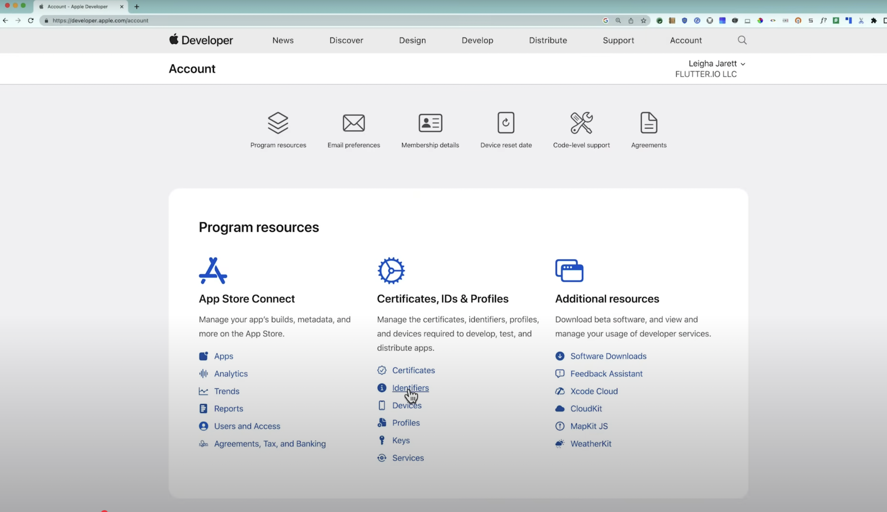
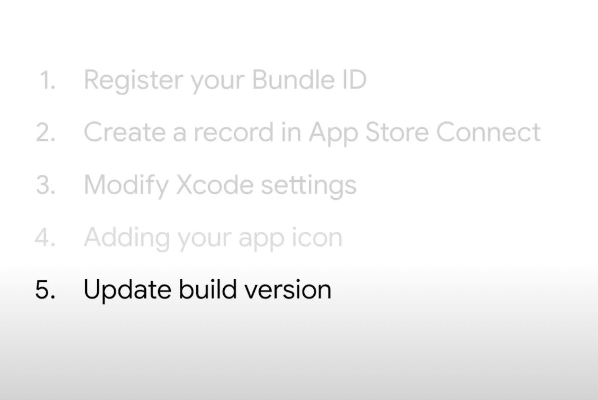

# 🚀 App Store Deployment & Publishing - Your App Goes Live!

## 🎯 **What You'll Master Today**

By the end of this lesson, you'll know how to:
1. **📋 Prepare your app** for store submission
2. **🎨 Create professional assets** (icons, screenshots)
3. **🔧 Build release versions** for iOS and Android
4. **📱 Navigate App Store Connect** and Google Play Console
5. **🚀 Submit and manage** your app successfully


---

## ✅ **Prerequisites - Before You Start**


**You'll Need:**
- ✅ **Finished Flutter app** tested and ready
- ✅ **Mac computer** with Xcode (for iOS)
  - 
- ✅ **Apple Developer Account** ($99/year)
- ✅ **Professional assets** ready (icon, screenshots)


**Quick Setup Links:**
- 🍎 [Apple Developer Program](https://developer.apple.com/programs/) 

---

## 📚 **The Complete 7-Step Deployment Process**


### **Step 1: Register Your Bundle ID**
**🎯 Goal:** Create a unique identifier for your app


**What is a Bundle ID?**
A Bundle ID is a unique identifier for your app that prevents conflicts with other apps in the App Store.

**Create Your Bundle ID:**
1. Go to [Apple Developer Console](https://developer.apple.com/) → **Certificates, IDs & Profiles**
2. Click **Identifiers** → **+** button
3. Enter your **Bundle ID** using **reverse domain notation**


**Bundle ID Examples:**
- If you own `mycompany.com` → `com.mycompany.myapp`
- If you don't have a domain → `com.yourname.appname`
- Keep it simple and memorable!

4. **Save** your identifier

**💡 Pro Tip:** This Bundle ID will be permanent for your app - choose wisely!

---

### **Step 2: Create App Store Connect Record** 
**🎯 Goal:** Set up your app listing


**What is App Store Connect?**
App Store Connect is Apple's web portal where you manage your app submissions, sales, and analytics.


**Create Your App Record:**
1. Go to [App Store Connect](https://appstoreconnect.apple.com)
2. Navigate to **Apps** page
3. Click the **+ (Plus)** button to create a new record
4. Fill in the essential details:
   - **App Name**: Your app's display name (this appears in the App Store)
   - **Target Platform**: Select iOS
   - **Bundle ID**: Choose the Bundle ID you registered in Step 1
   - **Primary Language**: Your app's main language
   - **SKU**: A unique identifier for internal tracking (can be anything)

5. Click **Create** to finalize your app record

**💡 Pro Tip:** You'll use this App Store Connect record to manage everything about your app's store presence!

---

### **Step 3: Configure Xcode Settings**
**🎯 Goal:** Prepare your app for release


**Open Your Project in Xcode:**
```bash
# From your Flutter project root
open ios/Runner.xcworkspace
```

**Configure General Settings:**
1. Select **Runner** target → **General** tab
2. Update these key fields:
   - **Display Name**: Your app's name as users will see it
   - **Bundle Identifier**: Must match the Bundle ID from Step 1
   - **Deployment Target**: Minimum iOS version (iOS 11.0+ recommended)
   - **Category**: Choose the most relevant App Store category


**Configure Code Signing:**
3. Go to **Signing & Capabilities** tab

**What is Code Signing?**
Code signing assures users that your app is from a trusted source and hasn't been tampered with. Apple requires all App Store apps to be signed with a valid certificate.


4. **Enable automatic signing:**
   - ✅ Check **Automatically manage signing**
   - Select your **Development Team** (your Apple Developer account)
   - Xcode will handle certificates and provisioning profiles automatically

**💡 Pro Tip:** If you didn't set your organization when creating the Flutter project, you might see `com.example.appname` - make sure this matches your registered Bundle ID!

---

### **Step 4: Create App Icon**
**🎯 Goal:** Replace the Flutter F with your professional app icon


**Say Goodbye to the Flutter F!**
You've probably noticed Flutter creates a placeholder icon - the infamous **Flutter F**. Time to replace it with your own professional icon!

**Add Your App Icon in Xcode:**
1. In Xcode, click **Assets.xcassets** in the Runner project
2. Click **AppIcon** to see all the different icon sizes
3. **For Xcode 14+:** Simply drag your **1024×1024px** icon into the **App Store** slot
4. Xcode will automatically generate all other required sizes

5. 
6. 
**Icon Design Requirements:**
- ✅ **1024×1024px** minimum resolution
- ✅ **PNG format** only
- ✅ **No rounded corners** (iOS adds them automatically)
- ✅ **No text overlays** or wordmarks
- ✅ **High contrast** for visibility at small sizes
- ✅ **Simple, memorable design** that represents your app

**💡 Pro Tip:** Test your icon at different sizes on actual devices to ensure it looks crisp and recognizable!

---

### **Step 5: Build Release Version**
**🎯 Goal:** Create production-ready app


**Understanding Version Numbers:**
Before building, you need to set your app's version. Apple uses a specific format: `major.minor.patch`


**Version Number Examples:**
- **Major (1.0.0 → 2.0.0)**: Major overhauls, design changes, breaking features
- **Minor (1.0.0 → 1.1.0)**: New features, significant improvements  
- **Patch (1.0.0 → 1.0.1)**: Bug fixes, small improvements

**Update Your Version:**
```yaml
# pubspec.yaml
version: 1.0.0+1  # version+build_number
#        ↑     ↑
#    user sees | Apple internal build number
```


**Debug vs Release Mode:**
- **Debug Mode** (`flutter run`): Fast compilation, optimized for development and hot reload
- **Release Mode** (`flutter build`): Optimized for fast startup, execution, and small file size

- 
**Build Your IPA:**
```bash
# This single command does everything!
flutter build ipa
```

**Optional Build Flags:**
```bash
# For extra security (obfuscates your Dart code)
flutter build ipa --obfuscate --split-debug-info=build/debug-info

# For enterprise distribution (not App Store)  
flutter build ipa --export-method=enterprise
```

**Your Build Files:**
- **Archive**: `build/ios/archive/` (Xcode archive)
- **IPA**: `build/ios/ipa/` (ready for upload)


**💡 Pro Tip:** The build number must increase with each upload to App Store Connect!

---

### **Step 6: Upload to App Store Connect**
**🎯 Goal:** Get your app ready for distribution


**Upload Methods (Choose One):**


**Method 1: Transporter App (Recommended)**
1. Download **Transporter** from the Mac App Store (free)
2. **Drag and drop** your `.ipa` file from `build/ios/ipa/` into Transporter
3. Wait for validation and processing
4. Click **Deliver** to upload to App Store Connect

**Method 2: Xcode Organizer**
1. In Xcode → **Window** → **Organizer**
2. Select your archive → **Distribute App**
3. Choose **App Store Connect** → follow prompts

**Verify Your Upload:**
1. Go to [App Store Connect](https://appstoreconnect.apple.com) 
2. Navigate to **TestFlight** → **iOS Builds**
3. Your build should appear (may take 5-10 minutes)
4. Wait for **Processing** to complete

**Choose Your Distribution Path:**


**🧪 TestFlight (Beta Testing)**
- Test with internal team members (up to 100)
- Add external testers (up to 10,000) 
- Get feedback before public release
- External testing requires beta app review
- 


**🚀 App Store (Public Release)**
- Submit directly to App Store review
- Goes live to all users once approved
- Skip TestFlight entirely

**💡 Pro Tip:** Always test with TestFlight first! It's much easier to fix issues before public release.

---


### **Step 7: Submit for Review**
**🎯 Goal:** Launch your app to the world!

**Complete All Required App Information:**

**1. App Information Section:**
- **Description**: Compelling description of what your app does
- **Keywords**: Relevant search terms (100 characters max)
- **App Category**: Primary and secondary categories
- **Age Rating**: Complete the age rating questionnaire

**2. Pricing and Availability:**
- **Price Tier**: Free or choose a pricing tier
- **Availability**: Select countries/regions
- **Release Date**: Immediate or scheduled release

**3. App Review Information:**
- **Contact Information**: Your email and phone number
- **Demo Account**: If your app requires login, provide test credentials
- **Review Notes**: Any special instructions for reviewers

**4. Version Information:**
- **What's New**: Describe new features and improvements
- **Screenshots**: Upload compelling screenshots for all device sizes
- **App Previews**: Optional video previews (15-30 seconds)

**Submit for Review:**
1. Review all sections for completeness
2. Click **Add for Review**
3. **Confirm submission** (you can't make changes after this!)

**What Happens Next:**
- **In Review**: Apple reviews your app (typically 24-48 hours)
- **Approved**: 🎉 Your app goes live automatically (or on your scheduled date)
- **Rejected**: Review feedback and resubmit with fixes

**Apple will notify you via email** when the review process is complete!

**💡 Pro Tip:** Make sure your app adheres to [App Store Review Guidelines](https://developer.apple.com/app-store/review/guidelines/) to avoid rejection.

**🎊 Congratulations! You've successfully deployed your Flutter app to the App Store!**

**📊 Official Guide:** [Flutter iOS Deployment](https://docs.flutter.dev/deployment/ios)


---

## 🤖 **Android Deployment - Google Play Store**

### **🚀 Quick Android Setup**


**Prerequisites:**
- ✅ **Google Play Developer Account** ($25 one-time fee)
- ✅ **Signed keystore** for release builds
- ✅ **App assets** ready (icon, screenshots)

- 🤖 [Google Play Console](https://play.google.com/console/)

### **Step 1: Create Keystore**
```bash
keytool -genkey -v -keystore ~/my-release-key.keystore \
-keyalg RSA -keysize 2048 -validity 10000 -alias my-key-alias
```

### **Step 2: Configure Gradle**
**Create `android/key.properties`:**
```
storePassword=your_store_password
keyPassword=your_key_password  
keyAlias=my-key-alias
storeFile=/path/to/my-release-key.keystore
```

**Update `android/app/build.gradle`:**
```gradle
android {
    signingConfigs {
        release {
            keyAlias keystoreProperties['keyAlias']
            keyPassword keystoreProperties['keyPassword']
            storeFile keystoreProperties['storeFile'] ? file(keystoreProperties['storeFile']) : null
            storePassword keystoreProperties['storePassword']
        }
    }
    buildTypes {
        release {
            signingConfig signingConfigs.release
        }
    }
}
```

### **Step 3: Build & Upload**
```bash
# Build app bundle (recommended)
flutter build appbundle

# Or build APK
flutter build apk --release
```


**Upload to Google Play Console:**
1. Go to [Google Play Console](https://play.google.com/console/)
2. **Create new app** → Fill details
3. **Upload your AAB/APK** to Internal Testing
4. **Complete store listing** (screenshots, description)
5. **Submit for review** → **Publish!** 🎉

---

## 🎯 **Common Issues & Solutions**

### **❌ iOS Rejection Reasons**

1. **Crashes or bugs** → Test thoroughly
2. **Missing metadata** → Complete all required fields
3. **Design issues** → Follow Human Interface Guidelines
4. **Privacy policy missing** → Required for data collection
5. **In-app purchases broken** → Test purchase flows

### **❌ Android Issues**

1. **APK signature problems** → Check keystore configuration
2. **Target API too old** → Update targetSdkVersion
3. **Permission issues** → Justify all permissions requested
4. **Store listing incomplete** → Fill all required metadata

---

## 🚀 **Ready to Launch?**

**Final Checklist:**
- ✅ App tested on multiple devices
- ✅ All store assets ready (icon, screenshots, descriptions)
- ✅ Privacy policy and legal documents prepared
- ✅ Developer accounts active and verified
- ✅ Release builds generated and tested
- ✅ Analytics and crash reporting implemented

**🎉 Congratulations! Your Flutter app is ready for the world!**

> **Remember:** The first publish is just the beginning. Great apps improve continuously based on user feedback and analytics. Keep iterating and your app will thrive! 📱✨

