# 📜 Diagram for Lesson 26: Publishing to App Stores

This diagram illustrates the complete app store publication process, from pre-submission preparation through post-launch monitoring and optimization.

```mermaid
flowchart TD
    A[📱 Completed Flutter App] --> B{🔍 Pre-Submission<br/>Preparation}
    
    B --> C[📋 Policy Compliance<br/>Review]
    B --> D[🧪 Comprehensive<br/>Testing]
    B --> E[📄 Legal Documentation<br/>Preparation]
    B --> F[🎨 Asset Creation]
    
    C --> G{📱 Platform<br/>Selection}
    D --> G
    E --> G
    F --> G
    
    G -->|iOS| H[🍎 iOS App Store<br/>Submission]
    G -->|Android| I[🤖 Google Play<br/>Submission]
    G -->|Both| J[🔄 Cross-Platform<br/>Strategy]
    
    H --> K[⚙️ Xcode Configuration]
    H --> L[📱 App Store Connect<br/>Setup]
    H --> M[🧪 TestFlight Beta<br/>Testing]
    
    I --> N[🔧 Android Release<br/>Build]
    I --> O[📱 Play Console<br/>Configuration]
    I --> P[🚀 Staged Rollout<br/>Strategy]
    
    J --> Q[📊 Unified Analytics<br/>Setup]
    J --> R[🎯 Cross-Platform<br/>ASO Strategy]
    
    K --> S[📤 iOS Review<br/>Submission]
    L --> S
    M --> S
    
    N --> T[📤 Android Review<br/>Submission]
    O --> T
    P --> T
    
    S --> U{✅ iOS App<br/>Approved?}
    T --> V{✅ Android App<br/>Approved?}
    
    U -->|❌ Rejected| W[🔧 Address Review<br/>Feedback]
    U -->|✅ Approved| X[🎉 iOS App Store<br/>Live]
    
    V -->|❌ Rejected| Y[🔧 Address Review<br/>Issues]
    V -->|✅ Approved| Z[🎉 Google Play<br/>Live]
    
    W --> S
    Y --> T
    
    X --> AA[📊 Post-Launch<br/>Monitoring]
    Z --> AA
    Q --> AA
    R --> AA
    
    AA --> BB[📈 Performance<br/>Analytics]
    AA --> CC[💬 User Feedback<br/>Management]
    AA --> DD[🔍 Store Performance<br/>Tracking]
    AA --> EE[🚨 Crash Reporting<br/>& Monitoring]
    
    BB --> FF{📊 Optimization<br/>Opportunities}
    CC --> FF
    DD --> FF
    EE --> FF
    
    FF --> GG[🎯 ASO Optimization]
    FF --> HH[🔄 App Updates<br/>& Versioning]
    FF --> II[📢 Marketing<br/>Campaigns]
    FF --> JJ[🛠️ Feature<br/>Development]
    
    GG --> KK[📈 Improved<br/>Visibility]
    HH --> LL[🚀 Version<br/>Releases]
    II --> MM[👥 User<br/>Acquisition]
    JJ --> NN[✨ Enhanced<br/>User Experience]
    
    KK --> OO[🎊 Long-term<br/>Success]
    LL --> OO
    MM --> OO
    NN --> OO
    
    OO --> PP[🌟 Market Leader<br/>Position]
    OO --> QQ[💰 Sustainable<br/>Revenue]
    OO --> RR[👑 Brand<br/>Recognition]
    
    style A fill:#e1f5fe
    style X fill:#c8e6c9
    style Z fill:#c8e6c9
    style OO fill:#fff3e0
    style PP fill:#f3e5f5
    style QQ fill:#e8f5e8
    style RR fill:#fce4ec
    
    classDef process fill:#e3f2fd
    classDef decision fill:#fff9c4
    classDef success fill:#e8f5e8
    classDef optimization fill:#f3e5f5
    
    class B,C,D,E,F,K,L,M,N,O,P,Q,R process
    class G,U,V,FF decision
    class X,Z,KK,LL,MM,NN success
    class GG,HH,II,JJ optimization
```

## 🎯 **Diagram Explanation**

### **Phase 1: Pre-Submission Preparation** 🔍
The process begins with a completed Flutter app that undergoes comprehensive preparation:
- **Policy Compliance Review**: Ensuring adherence to App Store and Play Store guidelines
- **Comprehensive Testing**: Functional, performance, compatibility, and security testing
- **Legal Documentation**: Privacy policy, terms of service, and compliance documents
- **Asset Creation**: App icons, screenshots, promotional materials, and metadata

### **Phase 2: Platform-Specific Submission** 📱
The submission process branches based on target platforms:

#### **iOS App Store Path** 🍎
- **Xcode Configuration**: Release build settings, code signing, and certificates
- **App Store Connect Setup**: App registration, metadata, and store listing
- **TestFlight Beta Testing**: Internal and external testing before submission
- **Review Submission**: Final submission to Apple's App Review team

#### **Android Play Store Path** 🤖
- **Android Release Build**: Signed AAB generation and optimization
- **Play Console Configuration**: App creation and store listing setup
- **Staged Rollout Strategy**: Progressive release to minimize risk
- **Review Submission**: Submission to Google Play review process

### **Phase 3: Review Process** ✅
Both platforms have review processes that may result in:
- **Approval**: App goes live on the respective store
- **Rejection**: Feedback provided for necessary corrections and resubmission

### **Phase 4: Post-Launch Monitoring** 📊
Once live, comprehensive monitoring begins:
- **Performance Analytics**: User behavior, engagement, and technical metrics
- **User Feedback Management**: Review responses and support ticket handling
- **Store Performance Tracking**: Visibility, conversion, and ranking monitoring
- **Crash Reporting & Monitoring**: Technical stability and error tracking

### **Phase 5: Optimization & Growth** 📈
Data-driven optimization creates a continuous improvement cycle:
- **ASO Optimization**: Search ranking and conversion rate improvement
- **App Updates & Versioning**: Feature additions and bug fixes
- **Marketing Campaigns**: User acquisition and retention strategies
- **Feature Development**: Product roadmap execution based on user feedback

### **Phase 6: Long-term Success** 🌟
Successful execution of the publication and optimization process leads to:
- **Market Leader Position**: Competitive advantage and industry recognition
- **Sustainable Revenue**: Profitable business model and growth
- **Brand Recognition**: Strong market presence and user loyalty

## 🔄 **Key Process Flows**

### **Submission Feedback Loop**
The diagram shows how rejections feed back into the process, allowing for iterative improvement and eventual approval.

### **Optimization Cycle**
Post-launch monitoring creates a continuous optimization cycle where insights drive improvements in visibility, user experience, and business performance.

### **Cross-Platform Coordination**
The unified analytics and ASO strategy ensure consistent brand presentation and performance tracking across both platforms.

## 📊 **Success Metrics Integration**

The diagram incorporates key performance indicators at each stage:
- **Preparation Stage**: Compliance scores and testing coverage
- **Submission Stage**: Review approval rates and submission efficiency
- **Launch Stage**: Initial download rates and user feedback
- **Optimization Stage**: Ranking improvements and revenue growth
- **Success Stage**: Market position and sustainable business metrics

This comprehensive flow ensures that every aspect of app store publication is addressed, from initial preparation through long-term success and market leadership.
