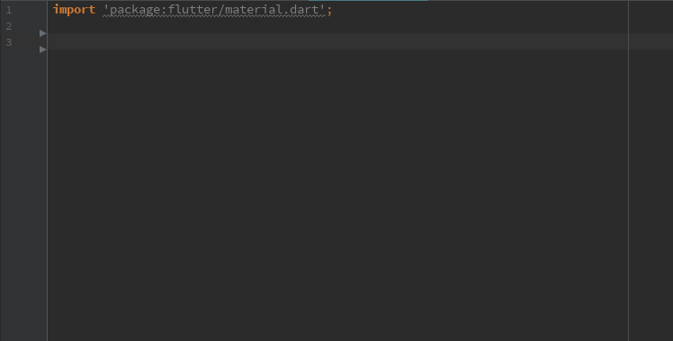

# Pokedex List Workshop

## What you will build
- A Flutter screen that downloads the first 151 Pokemon from the public PokeAPI.
- A scrolling list that shows each name together with its sprite image.
- A simple pattern for working with REST APIs in Flutter: request -> decode -> render.

> Tip: Expect to spend about 30 minutes if you are new to Flutter networking. Move through each step in order and run the app after every section.

## Before you start
- Flutter SDK installed and `flutter run` works on your machine.
- This starter app (or any Flutter project where you can add a new screen).
- Internet access to `https://pokeapi.co`.
- A text editor or IDE with Dart/Flutter plugins enabled.

If you are unsure, run `flutter --version` in a terminal. Seeing version information confirms your setup works.

---

## Step 1: Inspect the PokeAPI
1. Open a terminal inside the project folder.
2. Fetch a tiny sample so you can see the shape of the data:
   ```bash
   curl https://pokeapi.co/api/v2/pokemon?limit=3
   ```
3. Notice the `results` array. Each entry looks like:
   ```json
   {
     "name": "bulbasaur",
     "url": "https://pokeapi.co/api/v2/pokemon/1/"
   }
   ```
4. The API does not give you the sprite URL directly. You can derive it by pulling the id from the `url` and plugging it into:
   ```
   https://raw.githubusercontent.com/PokeAPI/sprites/master/sprites/pokemon/<id>.png
   ```

Keep this information handy; you will reproduce this logic in Dart shortly.

---

## Step 2: Add the `http` package
1. Open `pubspec.yaml`.
2. Under `dependencies`, make sure `http` is listed. Add it if it is missing:
   ```yaml
   dependencies:
     flutter:
       sdk: flutter
     http: ^1.5.0
   ```
3. Save the file, then run `flutter pub get` to install the package.

If the command finishes without errors, you are ready to make network calls.

---

## Step 3: Create the Pokemon list screen
Start by generating the widget class, then work through these mini-steps so you can see how each piece fits before pasting the final file.

### 3a. Make the file and imports
1. Create `lib/pokemon_list_screen.dart`.
2. Add the shared imports:
   ```dart
   import 'dart:convert';
   import 'package:flutter/material.dart';
   import 'package:http/http.dart' as http;
   ```

### 3b. Scaffold the stateful widget
Add the widget shell first and connect it to its `State` class. Later steps will fill in the methods.

```dart
class PokemonListScreen extends StatefulWidget {
  const PokemonListScreen({super.key});

  @override
  State<PokemonListScreen> createState() => _PokemonListScreenState();
}

class _PokemonListScreenState extends State<PokemonListScreen> {
  late Future<List<_Pokemon>> _pokemonFuture;

  @override
  void initState() {
    super.initState();
    // We'll wire this up in Step 3c after the fetch helper exists.
  }
}
```

> Pro tip: If you use VS Code or Android Studio, type `stful` and press Enter to expand the `StatefulWidget` template automatically.

> 

### 3c. Fetch and map the data
Inside `_PokemonListScreenState`, add the async helper that downloads the list and converts it into lightweight objects the UI can use.
```dart
  Future<List<_Pokemon>> _fetchPokemon() async {
    final uri = Uri.parse('https://pokeapi.co/api/v2/pokemon?limit=151');
    final res = await http.get(uri);
    if (res.statusCode != 200) throw Exception('Failed to load Pokemon');

    final body = jsonDecode(res.body) as Map<String, dynamic>;
    final results = body['results'] as List<dynamic>;

    return results.map((entry) {
      final name = entry['name'] as String;
      final url = entry['url'] as String;
      final id = int.parse(
        url.split('/').where((segment) => segment.isNotEmpty).last,
      );
      return _Pokemon(
        name: name,
        imageUrl:
            'https://raw.githubusercontent.com/PokeAPI/sprites/master/sprites/pokemon/$id.png',
      );
    }).toList(growable: false);
  }
```

After the method is in place, go back to `initState` and replace the comment with `_pokemonFuture = _fetchPokemon();` so the list loads when the widget mounts.

```dart
@override
  void initState() {
    super.initState();
    _pokemonFuture = _fetchPokemon();
  }
```

### 3d. Render the loading, error, and success states
Use `FutureBuilder` in `build` so the UI reacts to the future without manual state tracking.
```dart
  @override
  Widget build(BuildContext context) {
    return Scaffold(
      appBar: AppBar(title: const Text('Pokedex')),
      body: FutureBuilder<List<_Pokemon>>(
        future: _pokemonFuture,
        builder: (context, snapshot) {
          if (snapshot.connectionState == ConnectionState.waiting) {
            return const Center(child: CircularProgressIndicator());
          }
          if (snapshot.hasError) {
            return Center(child: Text('Error: ${snapshot.error}'));
          }
          final pokemon = snapshot.data!;
          return ListView.builder(
            itemCount: pokemon.length,
            itemBuilder: (context, index) {
              final poke = pokemon[index];
              return ListTile(
                leading: Image.network(
                  poke.imageUrl,
                  width: 56,
                  height: 56,
                  fit: BoxFit.cover,
                ),
                title: Text(poke.name),
              );
            },
          );
        },
      ),
    );
  }
```

### 3e. Add a tiny model object
Keep the API data tidy by storing each Pokemon's name and image URL together.
```dart
class _Pokemon {
  const _Pokemon({required this.name, required this.imageUrl});

  final String name;
  final String imageUrl;
}
```

### 3f. Put it all together
Your final file should combine the snippets above inside the same `lib/pokemon_list_screen.dart` file. Once everything compiles, run `flutter analyze` or let your editor show any missing semicolons before moving on.

> Debug idea: if you want to watch the network call, wrap `http.get` with a `try/catch` and print the response status code.

---

## Step 4: Show the screen
Open the file where your `MaterialApp` lives (for example `lib/main.dart`) and set the home to the new screen:

```dart
return MaterialApp(
  title: 'Pokedex',
  theme: ThemeData(useMaterial3: true),
  home: const PokemonListScreen(),
);
```

Run `flutter run`. The first load may take a few seconds while the app fetches all 151 entries.


---

## Step 5: Validate and polish
- Confirm you can scroll and see 151 list tiles with images.
- Temporarily disable Wi-Fi or change the URL to force an error. Make sure the error message appears.
- Tweak the UI: try `ListTile.subtitle`, add padding, or display the id number.
- Consider caching images with `cached_network_image` to smooth scrolling on slow connections.

---

## Stretch goals
Try these once the base screen works:
- Navigate to a detail screen by passing the id from `_Pokemon`.
- Add pull-to-refresh with `RefreshIndicator`.
- Implement search or filtering across the loaded list.
- Write tests that mock `http.Client` to verify JSON parsing logic.
