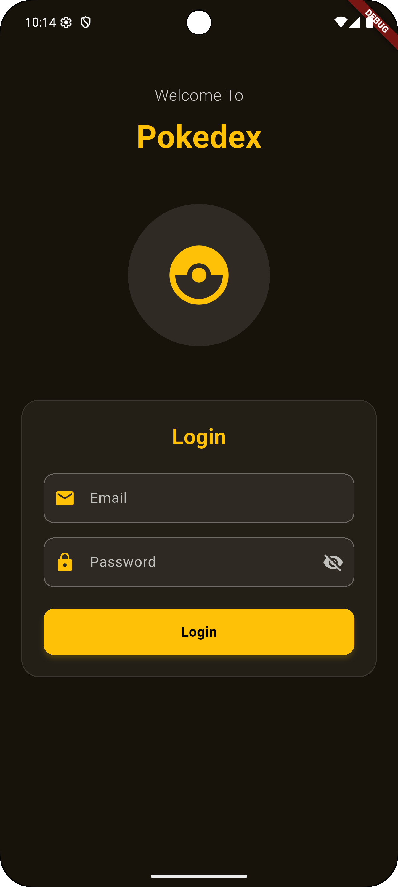

# 🎯 Workshop: Building a Pokedek Login Screen

## 📋 Workshop Overview
In this hands-on workshop, you'll learn how to create a beautiful, animated login/signup screen with a Pokemon theme. This workshop covers essential Flutter concepts including:

- **Widget composition and reusability**
- **Form validation and user input handling** 
- **Custom styling and theming**
- **Animations and transitions**
- **State management with StatefulWidget**

### 🎨 What We're Building
| Login Screen | Signup Screen |
|--------------|---------------|
|  |  |

### ⏱️ Estimated Time: 45-60 minutes

---

## 🚀 Task 1: Create the Basic LoginScreen Structure

**Learning Goal:** Understand the basic structure of a Flutter screen with proper layout foundation.

### 📝 What We're Learning:
- How to create a StatefulWidget for dynamic UI
- Using Scaffold as the main structure
- Setting up responsive layouts with SafeArea and SingleChildScrollView
- Basic padding and spacing concepts

### 💻 Code Implementation

Create a new file: `login_screen.dart`
```dart
import 'package:flutter/material.dart';

class LoginScreen extends StatefulWidget {
  const LoginScreen({super.key});

  @override
  State<LoginScreen> createState() => _LoginScreenState();
}

class _LoginScreenState extends State<LoginScreen> {
  
  @override
  Widget build(BuildContext context) {
    return Scaffold(
      body: Container(
        child: SafeArea(
          child: SingleChildScrollView(
            child: Padding(
              padding: const EdgeInsets.all(24.0),
              child: Column(
                mainAxisAlignment: MainAxisAlignment.center,
                children: [
                  // TODO: We'll add components here in the next steps
                ],
              ),
            ),
          ),
        ),
      ),
    );
  }
}
```

### 🔍 Code Explanation:
- **`StatefulWidget`**: Allows our screen to change and update (we'll need this for switching between login/signup)
- **`Scaffold`**: Provides the basic structure for our screen (like app bar, body, etc.)
- **`SafeArea`**: Ensures content doesn't overlap with system UI (notch, status bar)
- **`SingleChildScrollView`**: Makes the content scrollable if it's too tall for the screen
- **`Padding`**: Adds space around our content (24 pixels on all sides)
- **`Column`**: Arranges widgets vertically
- **`MainAxisAlignment.center`**: Centers content vertically on the screen

### ✅ Result - Basic Screen Structure


> 💡 **Tip:** At this point, you should see a blank screen. That's expected! We're building the foundation first.

---

## 🎨 Task 2: Add the Header UI

**Learning Goal:** Learn how to create reusable widgets and implement custom styling with colors and typography.

### 📝 What We're Learning:
- Creating custom widgets for better code organization
- Using `Column` for vertical layouts
- Applying custom colors and typography
- Working with opacity for visual effects
- Using `SizedBox` for spacing

### 🎯 What We're Building:


### 💻 Step 2.1: Create the LoginHeader Widget

Create a new file: `login_header.dart`

**Why separate widgets?** Breaking UI into smaller widgets makes code easier to read, reuse, and maintain!
```dart
import 'package:flutter/material.dart';

class LoginHeader extends StatelessWidget {
  const LoginHeader({super.key});

  @override
  Widget build(BuildContext context) {
    return Column(
      children: [
        const SizedBox(height: 20),
        _buildTitle(),
        const SizedBox(height: 30),
        _buildImage(),
        const SizedBox(height: 40),
      ],
    );
  }

  Widget _buildTitle() {
    return Column(
      children: [
        Text(
          'Welcome To',
          style: TextStyle(
            fontSize: 18,
            color: Colors.white.withOpacity(0.8), // Semi-transparent white
            fontWeight: FontWeight.w300, // Light font weight
          ),
        ),
        const SizedBox(height: 8),
        const Text(
          'Pokedex',
          style: TextStyle(
            fontSize: 36,
            fontWeight: FontWeight.bold,
            color: Color(0xFFFFC107), // Pokemon yellow color
          ),
        ),
      ],
    );
  }

  Widget _buildImage() {
    return SizedBox(
      height: 200,
      child: Center(
        child: Container(
          width: 160,
          height: 160,
          decoration: BoxDecoration(
            color: Colors.white.withOpacity(0.1), // Subtle background
            shape: BoxShape.circle, // Makes it circular
          ),
          child: const Center(
            child: Icon(
              Icons.catching_pokemon, // Pokemon-themed icon
              size: 80,
              color: Color(0xFFFFC107), // Same yellow as title
            ),
          ),
        ),
      ),
    );
  }
}
```

### 🔍 Code Explanation:
- **`StatelessWidget`**: Used for widgets that don't change over time
- **`_buildTitle()` & `_buildImage()`**: Private methods (starting with `_`) to organize our code
- **`Color(0xFFFFC107)`**: Hex color code for Pokemon yellow
- **`withOpacity(0.8)`**: Makes colors semi-transparent (0.0 = invisible, 1.0 = fully opaque)
- **`FontWeight.w300`**: Light font weight (w100 = thin, w900 = black)
- **`BoxDecoration`**: Adds styling like background colors, borders, and shapes
- **`BoxShape.circle`**: Makes the container perfectly round

### 💻 Step 2.2: Add LoginHeader to Login Screen

Now let's import and use our new LoginHeader widget in the main screen.

**Update your `login_screen.dart`:**

```dart
import 'package:flutter/material.dart';
import 'login_header.dart'; // Don't forget this import!

// ... rest of your LoginScreen class

@override
Widget build(BuildContext context) {
  return Scaffold(
    body: Container(
      child: SafeArea(
        child: SingleChildScrollView(
          child: Padding(
            padding: const EdgeInsets.all(24.0),
            child: Column(
              mainAxisAlignment: MainAxisAlignment.center,
              children: [
                const LoginHeader(), // Our new header widget!
              ],
            ),
          ),
        ),
      ),
    ),
  );
}
```

### 🔍 Key Points:
- **Import statement**: Always import custom widgets at the top of your file
- **`const LoginHeader()`**: Using `const` improves performance for widgets that don't change

### ✅ Result - Beautiful Header Added!


> 🎉 **Great job!** You've successfully created your first custom widget and added a beautiful header to your login screen.

---

## 📝 Task 3: Add the Login Form (Email & Password)

**Learning Goal:** Master form handling, validation, and user input in Flutter.

### 📝 What We're Learning:
- Creating forms with validation
- Handling user input with TextEditingController
- Using callback functions for communication between widgets
- Implementing password visibility toggle
- Form validation with custom error messages
- Responsive button design

### 🎯 What We're Building:


### 💻 Step 3.1: Create the LoginForm Widget

Create a new file: `login_form.dart`

**Why this approach?** We're creating a flexible form that can handle both login and signup modes!
```dart
import 'package:flutter/material.dart';

class LoginForm extends StatefulWidget {
  final bool isLoginMode;
  final TextEditingController emailController;
  final TextEditingController passwordController;
  final TextEditingController confirmPasswordController;
  final Function(String email) onLoginSuccess;
  final Function(String email) onSignUpSuccess;

  const LoginForm({
    super.key,
    required this.isLoginMode,
    required this.emailController,
    required this.passwordController,
    required this.confirmPasswordController,
    required this.onLoginSuccess,
    required this.onSignUpSuccess,
  });

  @override
  State<LoginForm> createState() => _LoginFormState();
}

class _LoginFormState extends State<LoginForm> {
  final loginFormKey = GlobalKey<FormState>();
  final signupFormKey = GlobalKey<FormState>();

  bool _isPasswordVisible = false;
  bool _isConfirmPasswordVisible = false;

  @override
  Widget build(BuildContext context) {
    return Container(
      decoration: BoxDecoration(
        color: Colors.white.withOpacity(0.05),
        borderRadius: BorderRadius.circular(20),
        border: Border.all(color: Colors.white.withOpacity(0.1), width: 1),
      ),
      padding: const EdgeInsets.all(24),
      child: Column(
        children: [
          Text(
            widget.isLoginMode ? 'Login' : 'Sign Up',
            style: const TextStyle(
              fontSize: 24,
              fontWeight: FontWeight.bold,
              color: Color(0xFFFFC107),
            ),
          ),
          const SizedBox(height: 24),
          if (widget.isLoginMode) _buildLoginForm() else _buildSignUpForm(),
        ],
      ),
    );
  }

  Widget _buildLoginForm() {
    return Form(
      key: loginFormKey,
      child: Column(
        children: [
          // Email Field
          _buildEmailField(),

          const SizedBox(height: 16),

          // Password Field
          _buildPasswordField(
            widget.passwordController,
            'Password',
            _isPasswordVisible,
            () {
              setState(() {
                _isPasswordVisible = !_isPasswordVisible;
              });
            },
          ),

          const SizedBox(height: 24),

          // Login Button
          _buildActionButton('Login', _handleLogin),
        ],
      ),
    );
  }

  Widget _buildSignUpForm() {
    return Form(
      key: signupFormKey,
      child: Column(
        children: [
          // Email Field
          _buildEmailField(),

          const SizedBox(height: 16),

          // Password Field
          _buildPasswordField(
            widget.passwordController,
            'Password',
            _isPasswordVisible,
            () {
              setState(() {
                _isPasswordVisible = !_isPasswordVisible;
              });
            },
          ),

          const SizedBox(height: 16),

          _buildPasswordField(
            widget.confirmPasswordController,
            'Confirm Password',
            _isConfirmPasswordVisible,
            () {
              setState(() {
                _isConfirmPasswordVisible = !_isConfirmPasswordVisible;
              });
            },
            isConfirmPassword: true,
          ),

          const SizedBox(height: 24),

          _buildActionButton('Sign Up', _handleSignUp),
        ],
      ),
    );
  }

  Widget _buildEmailField() {
    return TextFormField(
      controller: widget.emailController,
      keyboardType: TextInputType.emailAddress,
      style: const TextStyle(color: Colors.white),
      decoration: InputDecoration(
        labelText: 'Email',
        labelStyle: TextStyle(color: Colors.white.withOpacity(0.7)),
        prefixIcon: const Icon(Icons.email, color: Color(0xFFFFC107)),
        filled: true,
        fillColor: Colors.white.withOpacity(0.05),
        border: OutlineInputBorder(
          borderRadius: BorderRadius.circular(12),
          borderSide: BorderSide(color: Colors.white.withOpacity(0.3)),
        ),
        enabledBorder: OutlineInputBorder(
          borderRadius: BorderRadius.circular(12),
          borderSide: BorderSide(color: Colors.white.withOpacity(0.3)),
        ),
        focusedBorder: OutlineInputBorder(
          borderRadius: BorderRadius.circular(12),
          borderSide: const BorderSide(color: Color(0xFFFFC107), width: 2),
        ),
        errorBorder: OutlineInputBorder(
          borderRadius: BorderRadius.circular(12),
          borderSide: const BorderSide(color: Colors.red, width: 2),
        ),
      ),
      validator: (value) {
        if (value == null || value.isEmpty) {
          return 'Please enter your email';
        }
        if (!RegExp(r'^[\w-\.]+@([\w-]+\.)+[\w-]{2,4}$').hasMatch(value)) {
          return 'Please enter a valid email';
        }
        return null;
      },
    );
  }

  Widget _buildPasswordField(
    TextEditingController controller,
    String label,
    bool isVisible,
    VoidCallback toggleVisibility, {
    bool isConfirmPassword = false,
  }) {
    return TextFormField(
      controller: controller,
      obscureText: !isVisible,
      style: const TextStyle(color: Colors.white),
      decoration: InputDecoration(
        labelText: label,
        labelStyle: TextStyle(color: Colors.white.withOpacity(0.7)),
        prefixIcon: const Icon(Icons.lock, color: Color(0xFFFFC107)),
        suffixIcon: IconButton(
          icon: Icon(
            isVisible ? Icons.visibility : Icons.visibility_off,
            color: Colors.white.withOpacity(0.7),
          ),
          onPressed: toggleVisibility,
        ),
        filled: true,
        fillColor: Colors.white.withOpacity(0.05),
        border: OutlineInputBorder(
          borderRadius: BorderRadius.circular(12),
          borderSide: BorderSide(color: Colors.white.withOpacity(0.3)),
        ),
        enabledBorder: OutlineInputBorder(
          borderRadius: BorderRadius.circular(12),
          borderSide: BorderSide(color: Colors.white.withOpacity(0.3)),
        ),
        focusedBorder: OutlineInputBorder(
          borderRadius: BorderRadius.circular(12),
          borderSide: const BorderSide(color: Color(0xFFFFC107), width: 2),
        ),
        errorBorder: OutlineInputBorder(
          borderRadius: BorderRadius.circular(12),
          borderSide: const BorderSide(color: Colors.red, width: 2),
        ),
      ),
      validator: (value) {
        if (value == null || value.isEmpty) {
          return 'Please enter your password';
        }
        if (value.length < 6) {
          return 'Password must be at least 6 characters';
        }
        if (isConfirmPassword && value != widget.passwordController.text) {
          return 'Passwords do not match';
        }
        return null;
      },
    );
  }

  Widget _buildActionButton(String text, VoidCallback onPressed) {
    return SizedBox(
      width: double.infinity,
      height: 52,
      child: ElevatedButton(
        onPressed: onPressed,
        style: ElevatedButton.styleFrom(
          backgroundColor: const Color(0xFFFFC107),
          foregroundColor: Colors.black,
          elevation: 4,
          shadowColor: const Color(0xFFFFC107).withOpacity(0.4),
          shape: RoundedRectangleBorder(
            borderRadius: BorderRadius.circular(12),
          ),
        ),
        child: Text(
          text,
          style: const TextStyle(fontSize: 16, fontWeight: FontWeight.bold),
        ),
      ),
    );
  }

  void _handleLogin() {
    if (loginFormKey.currentState!.validate()) {
      widget.onLoginSuccess(widget.emailController.text);
    }
  }

  void _handleSignUp() {
    if (signupFormKey.currentState!.validate()) {
      widget.onSignUpSuccess(widget.emailController.text);
    }
  }
}
```

### 🔍 Key Concepts in LoginForm:

**Function Parameters:**
- `isLoginMode`: Boolean to switch between login/signup
- `TextEditingController`: Manages text input data
- `Function(String email)`: Callback functions to communicate with parent widget

**Advanced Features:**
- **Form Validation**: Checks email format and password strength
- **Password Visibility Toggle**: Eye icon to show/hide password
- **Responsive Design**: Adapts to different screen sizes
- **Custom Styling**: Glassmorphism effect with borders and shadows

### 💻 Step 3.2: Add LoginForm to Login Screen

Now let's add the form to our main screen and set up the controllers.

**Update your `login_screen.dart`:**

```dart
import 'package:flutter/material.dart';
import 'login_header.dart';
import 'login_form.dart'; // Add this import

class _LoginScreenState extends State<LoginScreen> {
  // Controllers to manage text input
  final _emailController = TextEditingController();
  final _passwordController = TextEditingController();
  final _confirmPasswordController = TextEditingController();
  
  // State variable to track current mode
  bool _isLoginMode = true;

  @override
  Widget build(BuildContext context) {
    return Scaffold(
      body: Container(
        child: SafeArea(
          child: SingleChildScrollView(
            child: Padding(
              padding: const EdgeInsets.all(24.0),
              child: Column(
                mainAxisAlignment: MainAxisAlignment.center,
                children: [
                  const LoginHeader(), // Our header from previous step
                  LoginForm(
                    isLoginMode: _isLoginMode,
                    emailController: _emailController,
                    passwordController: _passwordController,
                    confirmPasswordController: _confirmPasswordController,
                    onLoginSuccess: _handleLoginSuccess,
                    onSignUpSuccess: _handleSignUpSuccess,
                  ),
                ],
              ),
            ),
          ),
        ),
      ),
    );
  }

  // Handle successful login
  void _handleLoginSuccess(String email) {
    ScaffoldMessenger.of(context).showSnackBar(
      SnackBar(
        content: Text('Login successful: $email'),
        backgroundColor: const Color(0xFFFFC107),
        behavior: SnackBarBehavior.floating,
      ),
    );
    // TODO: Navigate to next screen
    // Navigator.pushReplacementNamed(context, '/pokemon-list');
  }

  // Handle successful signup
  void _handleSignUpSuccess(String email) {
    ScaffoldMessenger.of(context).showSnackBar(
      SnackBar(
        content: Text('Account created: $email'),
        backgroundColor: const Color(0xFFFFC107),
        behavior: SnackBarBehavior.floating,
      ),
    );
    // Automatically switch to login mode after signup
    setState(() {
      _isLoginMode = true;
    });
  }

  // Don't forget to dispose controllers to prevent memory leaks
  @override
  void dispose() {
    _emailController.dispose();
    _passwordController.dispose();
    _confirmPasswordController.dispose();
    super.dispose();
  }
}
```

### 🔍 Code Explanation:
- **TextEditingController**: Manages the text in input fields
- **Callback functions**: `onLoginSuccess` and `onSignUpSuccess` allow the form to communicate back to the parent
- **ScaffoldMessenger**: Shows temporary messages (SnackBars) to the user
- **dispose()**: Cleans up controllers when the widget is destroyed (prevents memory leaks)

### ✅ Result - Interactive Form Added!


> 🎉 **Awesome!** You now have a fully functional form with validation. Try entering invalid emails or short passwords to see the validation in action!

---

## 🔄 Task 4: Add Login/Signup Toggle

**Learning Goal:** Implement dynamic UI changes and user interaction patterns.

### 📝 What We're Learning:
- Creating toggle buttons for mode switching
- Using callbacks to communicate between widgets
- Managing state changes across multiple widgets
- User experience design patterns

### 🎯 What We're Building:
| Login Mode | Signup Mode |
|------------|-------------|
|  |  |

### 💻 Step 4.1: Create the LoginBottom Widget

Create a new file: `login_bottom.dart`

**Purpose:** This widget provides a clean way for users to switch between login and signup modes.
```dart
import 'package:flutter/material.dart';

class LoginBottom extends StatelessWidget {
  final bool isLoginMode;
  final VoidCallback onToggleMode;

  const LoginBottom({
    super.key,
    required this.isLoginMode,
    required this.onToggleMode,
  });

  @override
  Widget build(BuildContext context) {
    return Row(
      mainAxisAlignment: MainAxisAlignment.center,
      children: [
        Text(
          isLoginMode
              ? "Don't have an account? "
              : "Already have an account? ",
          style: TextStyle(color: Colors.white.withOpacity(0.7), fontSize: 14),
        ),
        TextButton(
          onPressed: onToggleMode,
          child: Text(
            isLoginMode ? 'Sign Up' : 'Login',
            style: const TextStyle(
              color: Color(0xFFFFC107),
              fontSize: 14,
              fontWeight: FontWeight.bold,
            ),
          ),
        ),
      ],
    );
  }
}
```

### 🔍 Code Explanation:
- **Conditional text**: Changes message based on current mode
- **TextButton**: Creates a clickable text link
- **Row with MainAxisAlignment.center**: Centers the toggle horizontally

### 💻 Step 4.2: Add LoginBottom to Main Screen

Now let's add the toggle functionality to our login screen.

**Update your `login_screen.dart`:**

```dart
import 'package:flutter/material.dart';
import 'login_header.dart';
import 'login_form.dart';
import 'login_bottom.dart'; // Add this import

// ... existing code ...

@override
Widget build(BuildContext context) {
  return Scaffold(
    body: Container(
      child: SafeArea(
        child: SingleChildScrollView(
          child: Padding(
            padding: const EdgeInsets.all(24.0),
            child: Column(
              mainAxisAlignment: MainAxisAlignment.center,
              children: [
                const LoginHeader(),
                LoginForm(
                  isLoginMode: _isLoginMode,
                  emailController: _emailController,
                  passwordController: _passwordController,
                  confirmPasswordController: _confirmPasswordController,
                  onLoginSuccess: _handleLoginSuccess,
                  onSignUpSuccess: _handleSignUpSuccess,
                ),
                const SizedBox(height: 30),
                LoginBottom(
                  isLoginMode: _isLoginMode,
                  onToggleMode: _toggleMode,
                ),
                const SizedBox(height: 20),
              ],
            ),
          ),
        ),
      ),
    );
  }
}

// Add this method to handle mode switching
void _toggleMode() {
  setState(() {
    _isLoginMode = !_isLoginMode; // Switch between login and signup
    
    // Clear all form fields when switching modes
    _emailController.clear();
    _passwordController.clear();
    _confirmPasswordController.clear();
  });
}
```

### 🔍 What's Happening:
- **`!_isLoginMode`**: Flips the boolean value (true becomes false, false becomes true)
- **`.clear()`**: Empties all text fields for a fresh start
- **`setState()`**: Tells Flutter to rebuild the widget with new data

### ✅ Result - Toggle Functionality Complete!


> 🎉 **Excellent!** You can now switch between login and signup modes. Notice how the form changes and clears automatically!

---

## 🎨 Task 5: Add Beautiful Background Gradient

**Learning Goal:** Apply advanced styling with gradients and visual polish.

### 💻 Step 5.1: Add Gradient Background

Let's make our login screen more visually appealing with a beautiful gradient background.

**Update the Container in your `login_screen.dart`:**

```dart
@override
Widget build(BuildContext context) {
  return Scaffold(
    body: Container(
      // Add this beautiful gradient decoration
      decoration: const BoxDecoration(
        gradient: LinearGradient(
          begin: Alignment.topCenter,
          end: Alignment.bottomCenter,
          colors: [
            Color(0xFF1A1B2E), // Dark blue
            Color(0xFF16213E), // Medium blue  
            Color(0xFF0F3460), // Deep blue
          ],
        ),
      ),
      child: SafeArea(
        child: SingleChildScrollView(
          // ... rest of your code
        ),
      ),
    ),
  );
}
```

### 🔍 Gradient Explanation:
- **LinearGradient**: Creates a smooth color transition
- **begin/end**: Direction of the gradient (top to bottom)
- **colors**: Array of colors that blend together
- **Color(0xFF...)**: Hex color codes with full opacity (FF)

### ✅ Result - Beautiful Background!


---

## ✨ Task 6: Add Smooth Animations (Advanced)

**Learning Goal:** Implement professional animations for better user experience.

### 📝 What We're Learning:
- Animation controllers and curves
- Fade transitions for smooth UI changes
- Mixin usage for animation support
- Animation lifecycle management

### 💻 Step 6.1: Set Up Animation Controller

**Update your LoginScreen class:**

```dart
class _LoginScreenState extends State<LoginScreen>
    with SingleTickerProviderStateMixin { // Add this mixin for animation support
    
  // Add these animation variables
  late AnimationController _animationController;
  late Animation<double> _fadeAnimation;
  
  // ... existing controllers and variables ...

  @override
  void initState() {
    super.initState();
    
    // Set up animation controller
    _animationController = AnimationController(
      duration: const Duration(milliseconds: 1500),
      vsync: this, // 'this' works because of SingleTickerProviderStateMixin
    );
    
    // Create fade animation
    _fadeAnimation = Tween<double>(begin: 0.0, end: 1.0).animate(
      CurvedAnimation(
        parent: _animationController,
        curve: Curves.easeInOut, // Smooth animation curve
      ),
    );
    
    // Start the animation
    _animationController.forward();
  }
```

### 💻 Step 6.2: Add Animation to Form

Wrap your LoginForm with FadeTransition:

```dart
// In your build method, replace LoginForm with:
FadeTransition(
  opacity: _fadeAnimation,
  child: LoginForm(
    isLoginMode: _isLoginMode,
    emailController: _emailController,
    passwordController: _passwordController,
    confirmPasswordController: _confirmPasswordController,
    onLoginSuccess: _handleLoginSuccess,
    onSignUpSuccess: _handleSignUpSuccess,
  ),
),
```

### 💻 Step 6.3: Update Toggle Method

Add animation to mode switching:

```dart
void _toggleMode() {
  setState(() {
    _isLoginMode = !_isLoginMode;
    _emailController.clear();
    _passwordController.clear();
    _confirmPasswordController.clear();
  });

  // Animate the form change
  _animationController.reset();
  _animationController.forward();
}
```

### 💻 Step 6.4: Clean Up Resources

**Update your dispose method:**

```dart
@override
void dispose() {
  _emailController.dispose();
  _passwordController.dispose();
  _confirmPasswordController.dispose();
  _animationController.dispose(); // Don't forget this!
  super.dispose();
}
```

### 🔍 Animation Concepts:
- **AnimationController**: Controls animation timing and state
- **Tween**: Defines start and end values for animation
- **CurvedAnimation**: Adds easing curves for natural movement
- **FadeTransition**: Animates opacity changes
- **SingleTickerProviderStateMixin**: Provides animation frame updates

---

### 🎉 Workshop Complete! -> 🏆 What You've Accomplished:
- ✅ Built a complete login/signup screen from scratch
- ✅ Mastered widget composition and reusability
- ✅ Implemented form validation and user input handling
- ✅ Created beautiful custom styling with gradients
- ✅ Added professional animations and transitions
- ✅ Learned state management with StatefulWidget
- ✅ Applied proper resource management (dispose methods)

> 💡 **Pro Tip:** This login screen can be easily adapted for any app by changing colors, text, and adding your own branding!

**Great job completing this workshop! You're now ready to build beautiful, functional login screens for any Flutter app! 🎊**