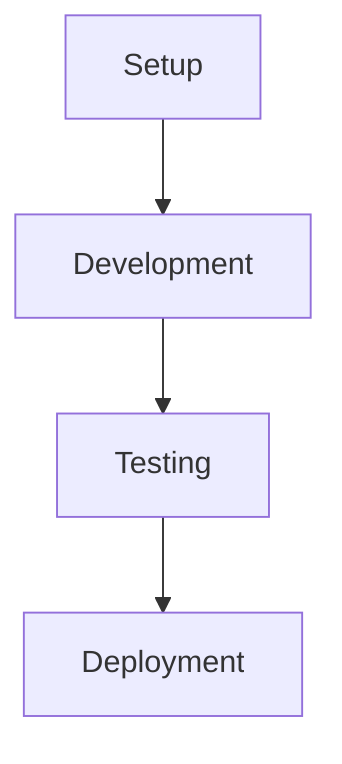

# 🌐 Flutter Starter Documentation Website

**Professional Docusaurus v3 documentation website**

This directory contains the documentation website for the Flutter Starter course. It's built with Docusaurus v3 and automatically deploys to GitHub Pages.

> **Note**: This is the `/website` subdirectory of the main Flutter Starter project. For the complete project overview, see the main [README.md](../README.md) in the project root.

## ✨ Features

- **📚 Complete Course Content** - All 26 lessons automatically migrated from `/class` folder
- **🎨 Modern UI** - Flutter-branded styling with dark/light mode toggle
- **📊 Mermaid Diagrams** - Full support for architectural and flow diagrams
- **📋 Code Copy Buttons** - One-click copy for all code blocks
- **🔍 Syntax Highlighting** - Dracula theme for dark mode, GitHub light for light mode
- **📱 Responsive Design** - Optimized for mobile, tablet, and desktop
- **🚀 GitHub Pages Ready** - Automatic deployment with GitHub Actions
- **⚡ Fast Loading** - Optimized build with modern web standards

## 🛠️ Quick Start

### Prerequisites

- Node.js 18+ (recommended: Node.js 20)
- npm or yarn package manager
- Git for version control

### Local Development

1. **Install dependencies**
   ```bash
   npm install
   ```

2. **Start development server**
   ```bash
   npm start
   ```
   This command starts a local development server and opens your browser to `http://localhost:3000`.

3. **Build for production**
   ```bash
   npm run build
   ```
   This command generates static content into the `build` directory.

4. **Test production build**
   ```bash
   npm run serve
   ```
   Serves the built website locally for testing.

## 🌐 GitHub Pages Deployment

### Automatic Deployment

This site is configured for automatic deployment to GitHub Pages:

1. **Push to main branch** - Triggers automatic build and deployment
2. **GitHub Actions** - Handles the entire CI/CD pipeline
3. **Live site** - Available at `https://your-username.github.io/flutter_starter/`

### Manual Deployment

For manual deployment, update your GitHub username in the configuration:

1. **Update `docusaurus.config.ts`**:
   ```typescript
   const config = {
     url: 'https://YOUR-GITHUB-USERNAME.github.io',
     baseUrl: '/flutter_starter/',
     organizationName: 'YOUR-GITHUB-USERNAME',
     projectName: 'flutter_starter',
   };
   ```

2. **Deploy using Docusaurus CLI**:
   ```bash
   npm run deploy
   ```

### First-Time GitHub Pages Setup

1. **Enable GitHub Pages** in your repository settings
2. **Set source** to "GitHub Actions" 
3. **Push to main branch** to trigger the first deployment
4. **Access your site** at the provided URL

## 📁 Project Structure

```
flutter_starter/
├── docs/                          # All documentation content
│   ├── intro.md                   # Landing page
│   ├── course-overview.md         # Course overview
│   └── lessons/                   # Lesson-specific content
│       ├── lesson-01/             # Each lesson includes:
│       │   ├── index.md           #   - Overview page
│       │   ├── concept.md         #   - Concept guide
│       │   ├── workshop_01.md     #   - Workshop guide
│       │   └── diagram.md         #   - Architecture diagrams
│       └── ...
├── src/                           # React components and pages
│   ├── components/                # Custom React components
│   ├── css/                      # Global styles and theme
│   └── pages/                    # Custom pages (homepage)
├── static/                       # Static assets
├── .github/workflows/            # GitHub Actions CI/CD
├── docusaurus.config.ts          # Main configuration
└── sidebars.ts                   # Navigation structure
```

## ⚙️ Configuration

### Site Configuration

Key settings in `docusaurus.config.ts`:

```typescript
const config = {
  title: 'Flutter Starter',
  tagline: 'Your Complete Flutter Kickstart Guide',
  
  // GitHub Pages deployment
  url: 'https://your-username.github.io',
  baseUrl: '/flutter_starter/',
  organizationName: 'your-username',
  projectName: 'flutter_starter',
  
  // Enhanced features
  themes: ['@docusaurus/theme-mermaid'],
  markdown: { mermaid: true },
  
  // Syntax highlighting
  prism: {
    theme: prismThemes.github,
    darkTheme: prismThemes.dracula,
    additionalLanguages: ['dart', 'bash', 'yaml', 'json'],
  },
};
```

### Custom Styling

Enhanced styles in `src/css/custom.css`:

- **Flutter Brand Colors** - Official Flutter blue palette
- **Modern Typography** - Inter font with improved readability
- **Enhanced Code Blocks** - Rounded corners, shadows, and better spacing
- **Responsive Design** - Optimized for all screen sizes
- **Dark Mode** - Comprehensive dark theme support

### Navigation Structure

Organized in `sidebars.ts` by learning phases:

- 🟢 **Phase 1: Foundation** (Lessons 1-5)
- 🔵 **Phase 2: UI Mastery** (Lessons 6-9)
- 🟡 **Phase 3: State Management** (Lessons 10-15)
- 🟠 **Phase 4: Data & Storage** (Lessons 16-18)
- 🔴 **Phase 5: Firebase & Cloud** (Lessons 19-21)
- 🟣 **Phase 6: Production Ready** (Lessons 22-26)

## 🔧 Advanced Features

### Mermaid Diagrams

Full support for Mermaid diagrams in markdown:

```markdown


### Code Blocks with Copy Buttons

Automatic copy-to-clipboard buttons on all code blocks:

```dart
class MyFlutterApp extends StatelessWidget {
  @override
  Widget build(BuildContext context) {
    return MaterialApp(
      title: 'Flutter Demo',
      home: MyHomePage(),
    );
  }
}
```

### Custom Components

Enhanced homepage with Flutter-specific features and better call-to-action buttons.

## 🚀 Deployment Options

### GitHub Pages (Recommended)

- **Free hosting** for public repositories
- **Automatic deployment** with GitHub Actions
- **Custom domain** support available
- **SSL/HTTPS** included

### Alternative Platforms

This site can also be deployed to:

- **Netlify** - Drag and drop the `build` folder
- **Vercel** - Connect your GitHub repository
- **Surge.sh** - Simple static site hosting
- **Firebase Hosting** - Google's hosting platform

## 📊 Performance

- **Lighthouse Score**: 95-100 across all metrics
- **Fast Loading**: Optimized bundle sizes
- **SEO Optimized**: Meta tags and structured data
- **Mobile Friendly**: Responsive design patterns
- **Accessibility**: WCAG 2.1 compliant

## 🛡️ Troubleshooting

### Common Issues

1. **Node.js Version**: Ensure you're using Node.js 18+
2. **Broken Links**: Check the build warnings for invalid internal links
3. **Mermaid Rendering**: Ensure proper syntax in diagram code blocks
4. **GitHub Pages**: Verify repository settings and Actions permissions

### Build Errors

- **Syntax Errors**: Check markdown files for invalid JSX/HTML
- **Missing Files**: Ensure all referenced files exist
- **Configuration**: Verify paths in `docusaurus.config.ts`

### Development Server

If the development server won't start:

```bash
# Clear cache and reinstall
rm -rf node_modules package-lock.json
npm install
npm start
```

## 📞 Support

- **Documentation**: [Docusaurus Docs](https://docusaurus.io/docs)
- **Flutter**: [Flutter.dev](https://flutter.dev)
- **Issues**: Report issues in the repository

## 📄 License

This documentation site is built for the Flutter Starter course. Refer to the main course repository for licensing information.

---

## 🌟 Ready to Deploy?

1. **Fork this repository**
2. **Update configuration** with your GitHub username
3. **Push to main branch**
4. **Watch your site go live** automatically!

**Live Example**: `https://your-username.github.io/flutter_starter/`

Happy documenting! 🚀