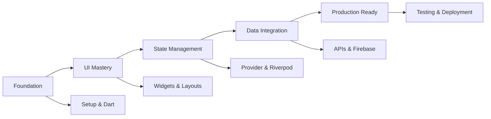

# 🎓 Flutter Masterclass: Complete Course Overview

## 🌟 Course Vision

**Transform absolute beginners into production-ready Flutter engineers through hands-on, real-world projects and modern development practices.**

This isn't just another tutorial series—it's a comprehensive builder's guide designed to create confident, competent Flutter developers who can build, test, and deploy professional mobile applications.

## 📊 Course Statistics

- **Duration**: 8-12 weeks (40+ hours of content)
- **Projects**: 6 major applications + 1 capstone project
- **Platforms**: iOS, Android, Web, Desktop
- **Technologies**: Flutter, Dart, Firebase, CI/CD, Testing
- **Skill Level**: Beginner to Expert
- **Industry Alignment**: 100% modern practices

## 🎯 Learning Outcomes

### **By Completion, Students Will:**

#### **Technical Mastery**
- ✅ Build production-quality Flutter applications
- ✅ Implement professional state management patterns
- ✅ Integrate with REST APIs and Firebase services
- ✅ Write comprehensive test suites (unit, widget, integration)
- ✅ Deploy apps to iOS App Store and Google Play Store
- ✅ Set up CI/CD pipelines for automated deployment

#### **Professional Skills**
- ✅ Follow industry best practices and coding standards
- ✅ Use professional development tools and workflows
- ✅ Debug complex issues efficiently
- ✅ Collaborate effectively using Git and code reviews
- ✅ Plan and architect scalable mobile applications
- ✅ Optimize apps for performance and user experience

#### **Career Readiness**
- ✅ Portfolio of 6+ complete applications
- ✅ Understanding of mobile development lifecycle
- ✅ Experience with modern development methodologies
- ✅ Confidence to tackle real-world development challenges
- ✅ Knowledge of Flutter ecosystem and community resources

## 🏗️ Course Architecture

### **Modular Design Philosophy**

Each lesson follows a consistent, proven structure:

```
lesson_x/
├── workshop_x.md       # Hands-on coding guide
├── concept.md          # Deep theoretical understanding
├── diagram.md          # Visual learning aids
└── README.md           # Quick navigation and overview
```

### **Progressive Skill Building**



### **Practical Application Focus**

Every concept is immediately applied in working applications:

| Phase | Project | Skills Learned |
|-------|---------|----------------|
| Foundation | Hello Flutter App | Environment, widgets, hot reload |
| UI Mastery | Profile Dashboard | Layouts, navigation, theming |
| State Management | Todo App | Provider, Riverpod, state patterns |
| Data Integration | News Reader | HTTP APIs, local storage, caching |
| Firebase | Chat Application | Authentication, Firestore, real-time |
| Production | E-commerce App | Testing, CI/CD, deployment |

## 🎯 Target Audiences

### **Primary Learners**
- **Complete Beginners** - No mobile development experience required
- **Career Changers** - Moving into mobile development
- **Bootcamp Students** - Structured learning environment
- **Self-taught Developers** - Looking for comprehensive curriculum

### **Secondary Learners**
- **Native Developers** - Android/iOS devs learning cross-platform
- **Web Developers** - Expanding to mobile platforms
- **Backend Developers** - Adding frontend mobile skills
- **Computer Science Students** - Academic supplement

### **Professional Use Cases**
- **Corporate Training** - Team onboarding and upskilling
- **University Courses** - Semester-long mobile development course
- **Coding Bootcamps** - Complete mobile development track
- **Self-Paced Learning** - Individual skill development

## 🏆 Success Metrics

### **Student Progress Indicators**

#### **Phase Completion Rates**
- **Phase 1**: 95% completion (foundation is critical)
- **Phase 2**: 90% completion (UI skills build confidence)
- **Phase 3**: 85% completion (state management complexity)
- **Phase 4**: 80% completion (integration challenges)
- **Phase 5**: 75% completion (cloud complexity)
- **Phase 6**: 70% completion (production readiness)

#### **Skill Assessment Checkpoints**
```
Week 2: ✅ Can build basic Flutter UIs
Week 4: ✅ Can implement navigation and theming
Week 6: ✅ Can manage complex application state
Week 8: ✅ Can integrate with APIs and databases
Week 10: ✅ Can deploy production applications
Week 12: ✅ Can architect and build complete mobile solutions
```

### **Project Portfolio Development**

Students will have a complete portfolio demonstrating:

1. **Technical Range** - Multiple app types and complexity levels
2. **Platform Coverage** - iOS, Android, Web deployment experience
3. **Modern Practices** - Testing, CI/CD, performance optimization
4. **Real-world Skills** - API integration, authentication, data persistence

## 🛠️ Implementation Guidelines

### **For Instructors**

#### **Preparation Requirements**
- **Technical Setup**: Complete development environment (all platforms)
- **Content Familiarity**: Pre-run all workshops and projects
- **Time Allocation**: 2 hours prep per 1 hour instruction
- **Platform Access**: Firebase project, GitHub organization, CI/CD tools

#### **Teaching Methodology**
1. **Live Coding** - Demonstrate concepts in real-time
2. **Guided Practice** - Students follow along with workshops
3. **Independent Practice** - Students complete challenges alone
4. **Code Review** - Regular feedback on student implementations
5. **Project Showcase** - Students present completed applications

#### **Common Student Challenges**
- **Environment Setup** - Dedicate extra time to Lesson 2
- **Null Safety** - Requires practice and repetition
- **State Management** - Abstract concepts need concrete examples
- **Async Programming** - Visual aids and debugging help understanding
- **Testing** - Often undervalued, emphasize real-world importance

### **For Self-Learners**

#### **Study Schedule Recommendations**
```
Part-Time (10 hours/week):
├── Week 1-2: Foundation (Lessons 1-5)
├── Week 3-4: UI Mastery (Lessons 6-9)
├── Week 5-6: State Management (Lessons 10-15)
├── Week 7-8: Data Integration (Lessons 16-18)
├── Week 9-10: Firebase & Cloud (Lessons 19-21)
└── Week 11-12: Production Ready (Lessons 22-26)

Full-Time (40 hours/week):
├── Week 1: Foundation + UI Mastery
├── Week 2: State Management + Data
└── Week 3: Cloud + Production
```

#### **Success Strategies**
1. **Consistent Practice** - Code daily, even if just 30 minutes
2. **Project-First Learning** - Focus on building working applications
3. **Community Engagement** - Join Flutter Discord, attend meetups
4. **Portfolio Development** - Document and showcase your projects
5. **Continuous Learning** - Flutter ecosystem evolves rapidly

## 🎉 Course Completion Recognition

### **Digital Credentials**
Students receive:
- **Completion Certificate** - Official course completion recognition
- **Skill Badges** - Individual competency recognition
- **Portfolio Showcase** - Curated project demonstrations
- **LinkedIn Endorsement** - Professional platform recognition

### **Career Support**
- **Interview Preparation** - Technical interview guidance
- **Resume Enhancement** - Flutter skill presentation
- **Job Board Access** - Flutter-specific opportunities
- **Mentorship Network** - Connection with Flutter professionals

---

## 🚀 Ready to Transform Careers?

This Flutter Masterclass represents **the gold standard** for mobile development education. It combines:

- ✅ **Proven pedagogy** with hands-on learning
- ✅ **Industry relevance** with modern practices  
- ✅ **Complete coverage** from basics to production
- ✅ **Real projects** that demonstrate capability
- ✅ **Career preparation** for professional success

Whether you're an **individual learner** seeking to change careers, an **instructor** looking for comprehensive curriculum, or a **company** training your development team, this course provides the **complete pathway** from Flutter novice to expert mobile engineer.

**Start building the future of mobile development today! 🎯**
