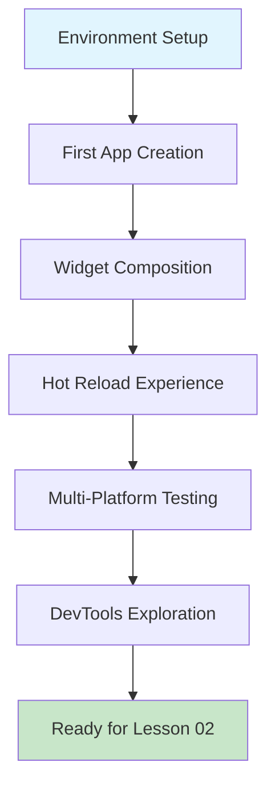

# 🚀 Lesson 01: Introduction to Flutter

**What is Flutter & Why Use It?**

> **Duration**: 30 minutes | **Difficulty**: Beginner | **Phase**: Foundation

## 🎯 Learning Objectives

By the end of this lesson, you will understand:
- **🌟 What Flutter is** and why it's revolutionary for mobile development
- **🏗️ Flutter Architecture** and how it differs from other frameworks
- **🎨 Widget-Based UI** and the composition over inheritance approach
- **⚡ Hot Reload** and how it transforms the development experience
- **📱 Cross-Platform Development** and code reuse strategies
- **🔧 Development Workflow** from setup to app store deployment

## 📚 What You'll Build

Your first Flutter application - an interactive environment overview that demonstrates:
- Basic widget composition
- Hot reload functionality  
- Multi-platform deployment
- Development tool integration

## 🗂️ Lesson Materials

### 📖 [Concept Guide](./concept.md)
Deep dive into Flutter's architecture, philosophy, and ecosystem. Understand the "why" behind Flutter's design decisions and how it compares to other frameworks.

**Key Topics:**
- Flutter vs other frameworks (React Native, Xamarin, Native)
- Widget tree and composition patterns
- Dart language advantages
- Platform channels and native integration
- Performance characteristics

### 🛠️ [Workshop Guide](./workshop_01.md)
Hands-on coding session where you'll build your first Flutter app from scratch.

**Workshop Modules:**
1. Environment Verification (15 min)
2. First Flutter App Creation (20 min)
3. Widget Exploration (25 min)
4. Multi-Platform Testing (15 min)
5. DevTools Introduction (10 min)

### 📊 [Architecture Diagram](./diagram.md)
Visual representation of Flutter's architecture and widget lifecycle.

## 🎯 Learning Path

## ✅ Prerequisites

- **Development Environment**: Basic computer setup
- **Programming Experience**: Any language (helpful but not required)
- **Motivation**: Ready to learn something amazing!

## 🎯 Success Criteria

After completing this lesson, you should be able to:
- [ ] Explain what Flutter is and its key advantages
- [ ] Create a new Flutter project
- [ ] Run a Flutter app on multiple platforms
- [ ] Use Hot Reload effectively
- [ ] Navigate the widget tree concept
- [ ] Use Flutter DevTools for basic inspection

## 🚀 Next Steps

Ready to dive in? Start with the [Concept Guide](./concept.md) to build your theoretical foundation, then jump into the [Workshop](./workshop_01.md) for hands-on practice!

**Estimated Time**: 1-2 hours total
**Next Lesson**: [Lesson 02: Development Environment Setup](/docs/lessons/lesson-02)

---

*💡 **Pro Tip**: Take your time with this foundational lesson. Understanding Flutter's core concepts will make everything else much easier!*
