# 📜 Diagram for Lesson 15: Mini Project - Auth + Theme App

## 🎯 **Mini Project - AuthFlow Pro: Hybrid State Management Architecture**

This lesson demonstrates the strategic integration of all four state management patterns in a single, production-ready application, showcasing how to choose the right pattern for each concern while maintaining clean architecture principles and comprehensive testing coverage.

---

## **Hybrid State Management Strategy**

---

## **Clean Architecture with Multiple Patterns**

```mermaid
graph LR
    subgraph "Presentation Layer"
        A[Authentication UI<br/>🎯 Bloc]
        B[Theme UI<br/>⚡ Riverpod]
        C[Settings UI<br/>🔄 Provider]
        D[Forms & Animations<br/>📱 setState]
    end
    
    subgraph "Business Logic Layer"
        E[AuthBloc<br/>Event Handlers]
        F[ThemeNotifiers<br/>State Management]
        G[SettingsProvider<br/>Change Notifiers]
        H[Local State<br/>Widget State]
    end
    
    subgraph "Domain Layer"
        I[Use Cases]
        J[Entities]
        K[Repository Interfaces]
        L[Domain Services]
    end
    
    subgraph "Data Layer"
        M[Repository Implementations]
        N[Data Sources]
        O[Local Storage]
        P[Remote APIs]
    end
    
    A --> E
    B --> F
    C --> G
    D --> H
    
    E --> I
    F --> I
    G --> I
    H --> I
    
    I --> J
    I --> K
    I --> L
    
    K --> M
    M --> N
    N --> O
    N --> P
    
    style A fill:#ffcdd2
    style B fill:#e1bee7
    style C fill:#fff3e0
    style D fill:#c8e6c9
```

---

## **Authentication System Architecture (Bloc)**

---

## **Theme System Architecture (Riverpod)**

---

## **User Settings Management (Provider)**

---

## **Local UI State Management (setState)**

---

## **Cross-Pattern Communication**

---

## **Data Flow Architecture**

---

## **Testing Strategy Overview**

---

## **Authentication Flow Diagram**

---

## **Theme System Integration**

---

## **Settings Synchronization Flow**

---

## **Performance Monitoring Architecture**

---

## **Security Architecture Integration**

---

## **Deployment and Scaling Considerations**

---

## **Architecture Benefits Summary**

### **🎯 Strategic Pattern Usage**
- **Authentication (Bloc)**: Complex business logic, audit trails, event-driven flows
- **Theme Management (Riverpod)**: Reactive updates, type safety, auto-disposal
- **User Settings (Provider)**: Shared state, simple updates, mature ecosystem
- **Local UI State (setState)**: Performance optimization, direct updates, minimal overhead

### **🏗️ Clean Architecture Benefits**
- **Separation of Concerns**: Each pattern handles its optimal use case
- **Testability**: Clear boundaries enable comprehensive testing strategies
- **Maintainability**: Pattern-specific optimizations without affecting others
- **Scalability**: Each pattern can be optimized and scaled independently

### **⚡ Performance Excellence**
- **Memory Efficiency**: Each pattern optimized for its specific use case
- **CPU Usage**: Minimal overhead through strategic pattern selection
- **Build Efficiency**: Precise rebuilds with pattern-specific optimizations
- **Battery Life**: Optimized state updates and reduced unnecessary processing

### **🧪 Testing Excellence**
- **Unit Testing**: Pattern-specific testing strategies and tools
- **Integration Testing**: Cross-pattern communication validation
- **Widget Testing**: UI integration across multiple patterns
- **End-to-End Testing**: Complete user journey validation

### **🔒 Security & Production Readiness**
- **Authentication Security**: Comprehensive auth flows with audit trails
- **Data Protection**: Encrypted storage and secure transmission
- **Privacy Controls**: User consent and data management
- **Performance Monitoring**: Real-time monitoring and optimization

### **🚀 Real-World Application**
- **Enterprise Ready**: Patterns proven in production environments
- **Team Collaboration**: Clear boundaries enable effective teamwork
- **Maintenance Excellence**: Long-term maintainability through proper architecture
- **Future Evolution**: Architecture supports adding new features and patterns

**This hybrid architecture demonstrates that modern Flutter applications can strategically combine multiple state management patterns to achieve optimal performance, maintainability, and user experience! 🎯✨🔥**