# 📜 Diagram for Lesson 17: Local Storage (Hive/SQLite)

## 💾 **Local Storage (Hive/SQLite) - Data Persistence Mastery**

This lesson provides comprehensive coverage of local storage patterns in Flutter, demonstrating how to build robust, offline-first applications using both Hive (NoSQL) and SQLite (SQL) databases with clean architecture, data synchronization, performance optimization, and comprehensive testing strategies.

---

## **Storage Options Comparison Matrix**

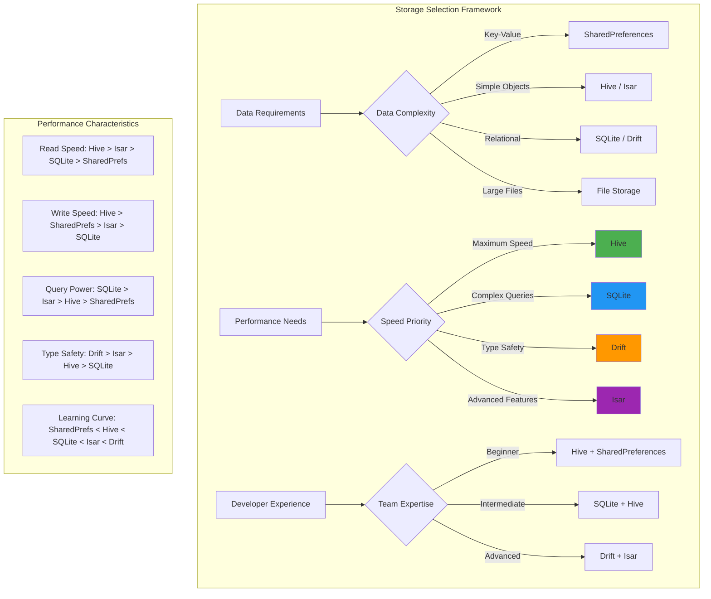

---

## **Hive vs SQLite Architecture Comparison**

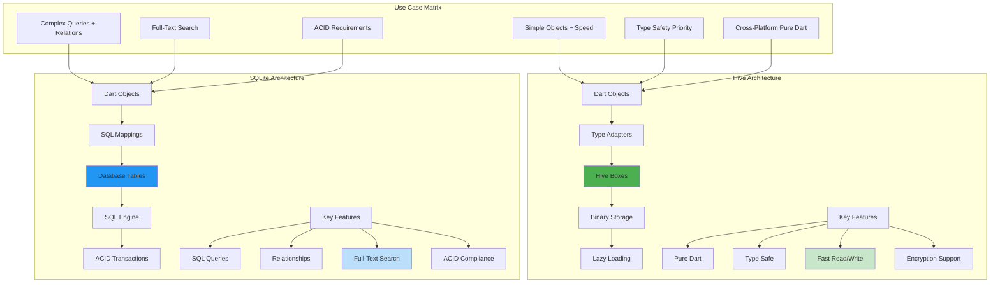

---

## **Clean Architecture with Local Storage**

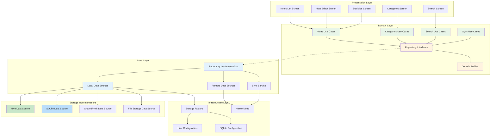

---

## **Data Flow Architecture**

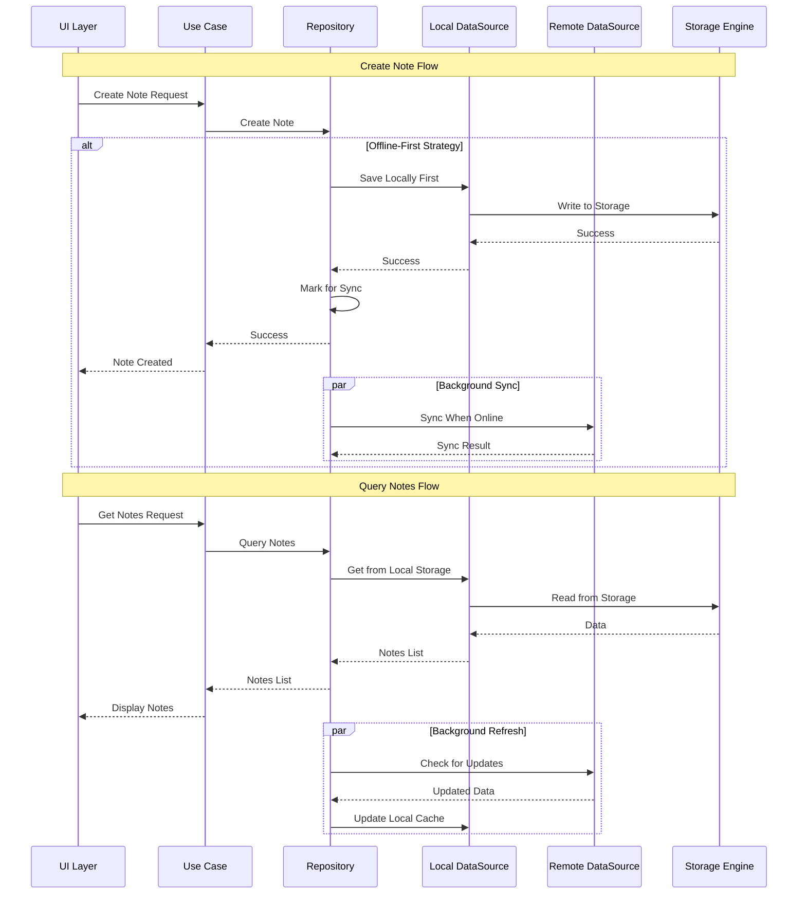

---

## **Hive Implementation Architecture**

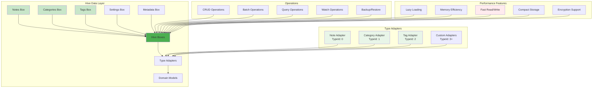

---

## **SQLite Implementation Architecture**

```mermaid
graph TB
    subgraph "SQLite Database Schema"
        A[Database] --> B[Tables]
        B --> C[notes]
        B --> D[categories]
        B --> E[tags]
        B --> F[note_tags]
        B --> G[notes_search<br/>FTS5]
        
        H[Indexes] --> I[Performance Indexes]
        H --> J[Foreign Key Indexes]
        H --> K[Search Indexes]
        
        L[Triggers] --> M[Search Sync Triggers]
        L --> N[Audit Triggers]
        L --> O[Validation Triggers]
    end
    
    subgraph "Query Operations"
        P[Simple Queries]
        Q[Complex Joins]
        R[Aggregations]
        S[Full-Text Search]
        T[Transactions]
        U[Batch Operations]
        
        P --> A
        Q --> A
        R --> A
        S --> G
        T --> A
        U --> A
    end
    
    subgraph "Data Access Layer"
        V[SQL Queries]
        W[Parameter Binding]
        X[Result Mapping]
        Y[Connection Pooling]
        Z[Error Handling]
        
        V --> A
        W --> A
        X --> A
        Y --> A
        Z --> A
    end
    
    subgraph "Advanced Features"
        AA[ACID Compliance]
        BB[Foreign Keys]
        CC[Constraints]
        DD[Views]
        EE[Stored Procedures]
        FF[WAL Mode]
        
        AA --> A
        BB --> A
        CC --> A
        DD --> A
        EE --> A
        FF --> A
    end
    
    style A fill:#2196F3
    style C fill:#bbdefb
    style D fill:#bbdefb
    style E fill:#bbdefb
    style G fill:#e3f2fd
    style S fill:#ffebee
    style AA fill:#c8e6c9
```

---

## **Data Synchronization Patterns**

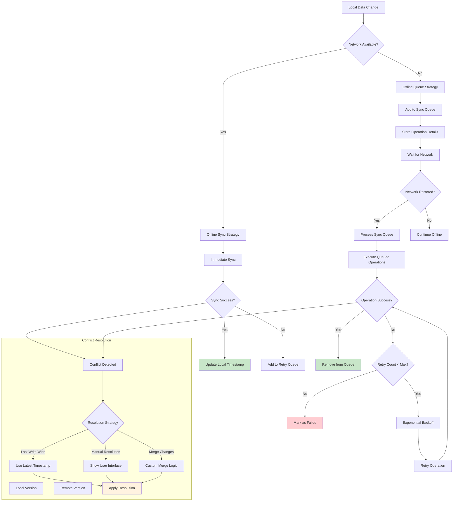

---

## **Performance Optimization Strategies**

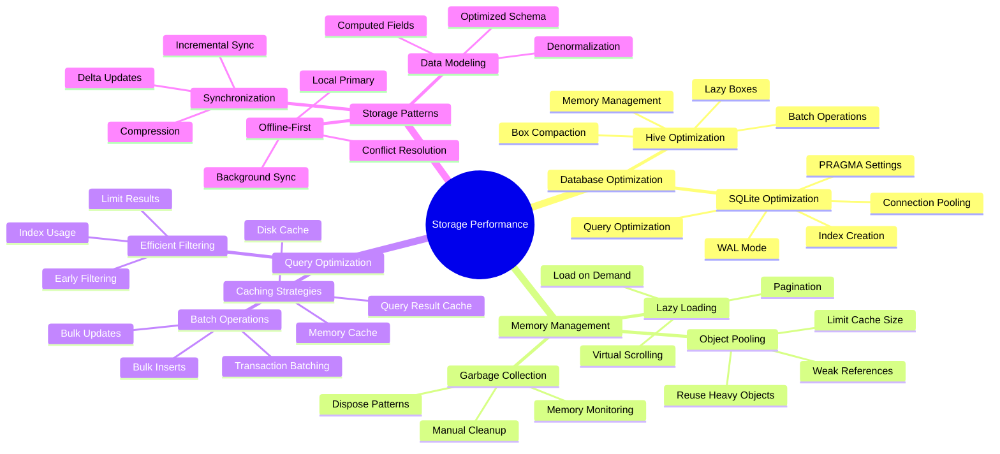

---

## **Offline-First Architecture**

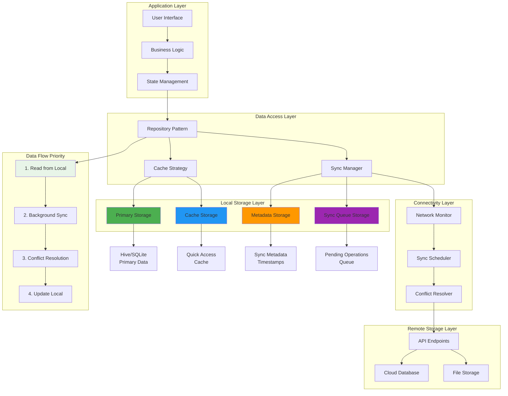

---

## **Data Models and Relationships**

```mermaid
erDiagram
    NOTE {
        string id PK
        string title
        string content
        datetime created_at
        datetime updated_at
        string category_id FK
        boolean is_archived
        boolean is_favorite
        int priority
        int color
        string attachment_path
        int read_time
    }
    
    CATEGORY {
        string id PK
        string name
        string description
        int color
        string icon
        datetime created_at
        int sort_order
    }
    
    TAG {
        string id PK
        string name
        int color
        datetime created_at
    }
    
    NOTE_TAG {
        string note_id FK
        string tag_id FK
    }
    
    SYNC_OPERATION {
        string id PK
        string item_id
        string action
        datetime timestamp
        int retry_count
        string status
    }
    
    NOTE ||--|| CATEGORY : belongs_to
    NOTE ||--o{ NOTE_TAG : has_many
    TAG ||--o{ NOTE_TAG : has_many
    NOTE ||--o{ SYNC_OPERATION : tracks_changes
    
    NOTE {
        Methods:
        matchesQuery()
        estimateReadTime()
        copyWithUpdatedTime()
        toSQLiteMap()
        fromSQLiteMap()
    }
```

---

## **Testing Architecture**

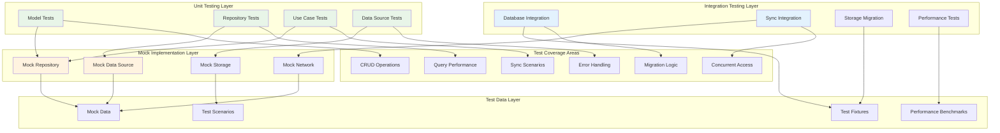

---

## **Storage Performance Comparison**

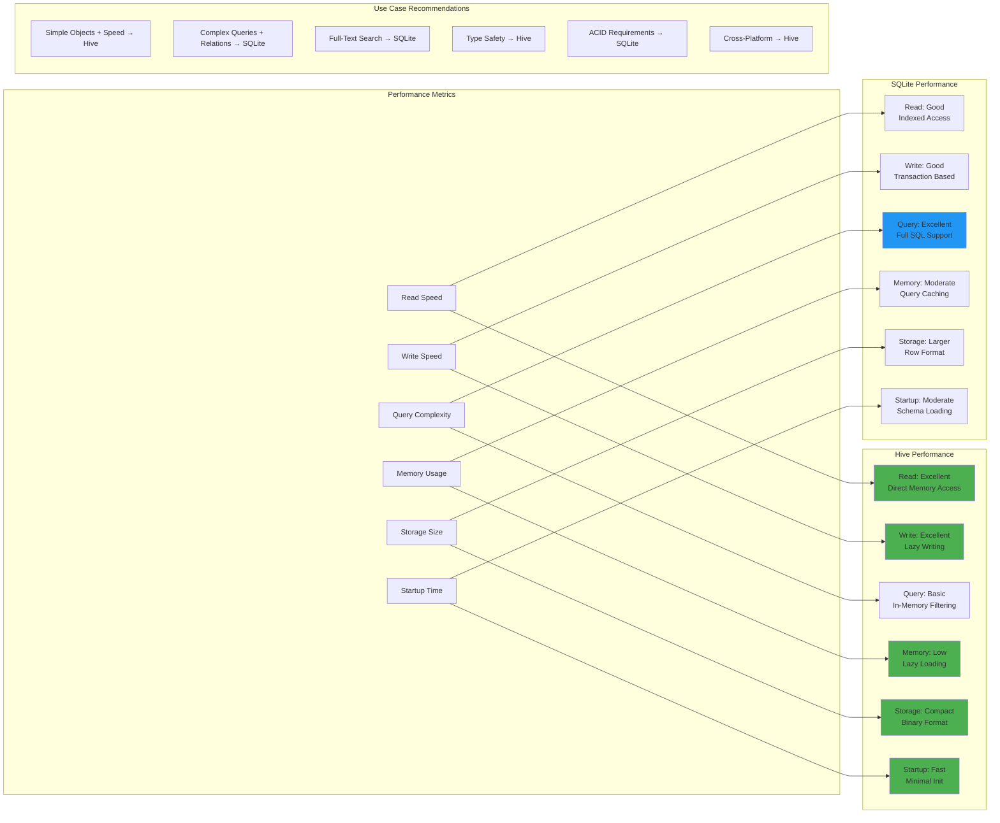

---

## **NoteMaster Pro Application Flow**

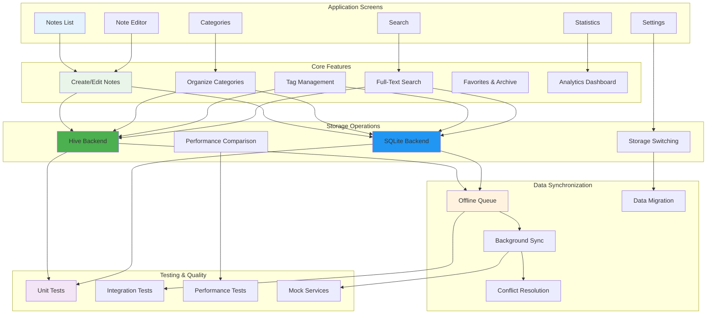

---

## **Data Migration and Versioning**

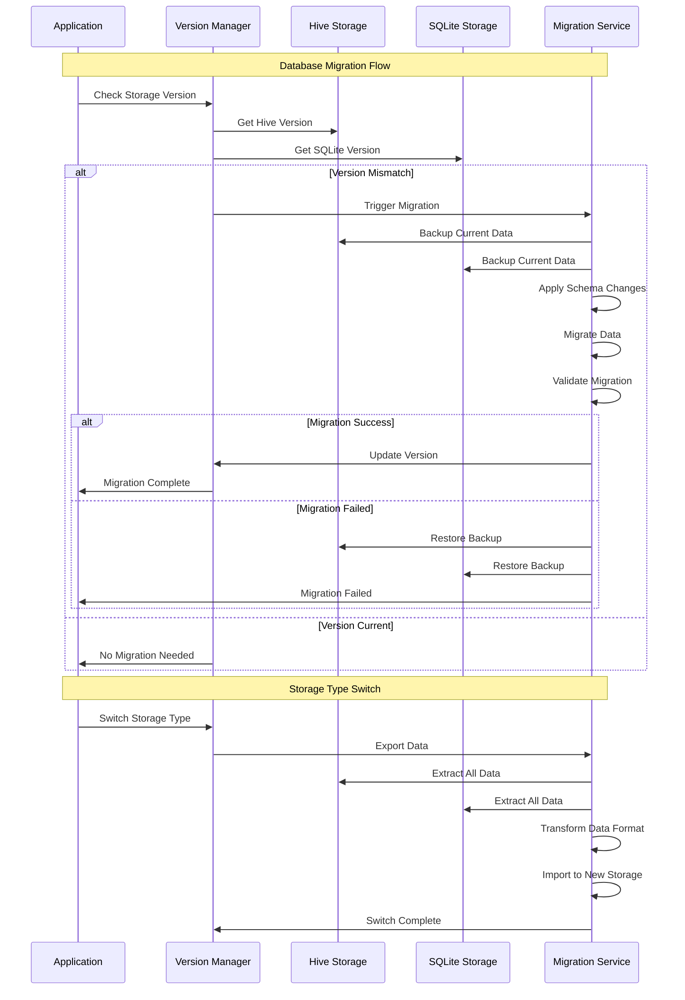

---

## **Error Handling and Recovery**

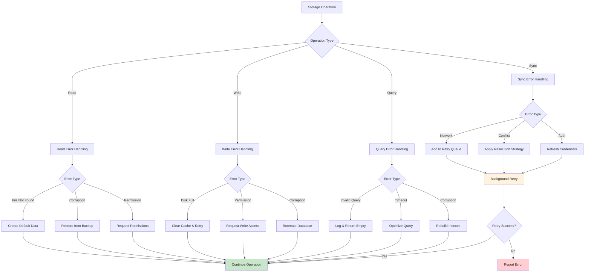

---

## **Real-World Implementation Benefits**

### **💾 Local Storage Excellence**
- **Dual Backend Mastery**: Expert-level implementation of both Hive (NoSQL) and SQLite (SQL) with performance comparison
- **Storage Strategy Decision Making**: Comprehensive framework for choosing optimal storage solutions based on use case requirements
- **Advanced Data Operations**: Complex querying, full-text search, batch operations, and performance optimization
- **Clean Architecture Integration**: Proper separation of concerns with repository pattern and dependency injection

### **🔄 Offline-First Architecture**
- **Seamless Offline Operation**: Applications that work perfectly without internet connectivity
- **Intelligent Synchronization**: Background sync with conflict resolution and retry mechanisms
- **Data Integrity**: ACID compliance and transaction management for data consistency
- **Performance Optimization**: Lazy loading, caching strategies, and memory management

### **🏗️ Architecture Excellence**
- **Repository Pattern**: Clean abstraction layer for data access with testable architecture
- **Domain-Driven Design**: Clear separation between business logic and data persistence
- **Dependency Injection**: Flexible architecture supporting multiple storage backends
- **Migration Strategies**: Seamless upgrades and storage type switching

### **🧪 Testing and Quality Assurance**
- **Comprehensive Test Coverage**: Unit tests, integration tests, and performance benchmarks
- **Mock Implementations**: Isolated testing with comprehensive mock data sources
- **Error Scenario Testing**: Validation of error handling and recovery mechanisms
- **Performance Testing**: Benchmarking and optimization of storage operations

### **⚡ Performance and Scalability**
- **Optimized Operations**: Efficient CRUD operations with batch processing and caching
- **Memory Management**: Lazy loading, object pooling, and automatic cleanup
- **Query Optimization**: Proper indexing, query planning, and result caching
- **Scalable Architecture**: Patterns that support application growth and team collaboration

### **🔒 Data Security and Reliability**
- **Data Encryption**: Support for encrypted storage and secure data handling
- **Backup and Recovery**: Comprehensive backup strategies and disaster recovery
- **Data Validation**: Input validation and data integrity checks
- **Error Recovery**: Robust error handling with automatic recovery mechanisms

### **📱 Production-Ready Features**
- **Cross-Platform Compatibility**: Works seamlessly across all Flutter platforms
- **Storage Migration**: Smooth transitions between storage types and schema versions
- **Analytics and Monitoring**: Comprehensive statistics and performance monitoring
- **User Experience**: Fast, responsive UI with efficient data loading and caching

**This comprehensive local storage foundation provides the essential building blocks for creating robust, scalable, and maintainable Flutter applications that deliver excellent performance and user experience regardless of connectivity status! 💾✨🔥**