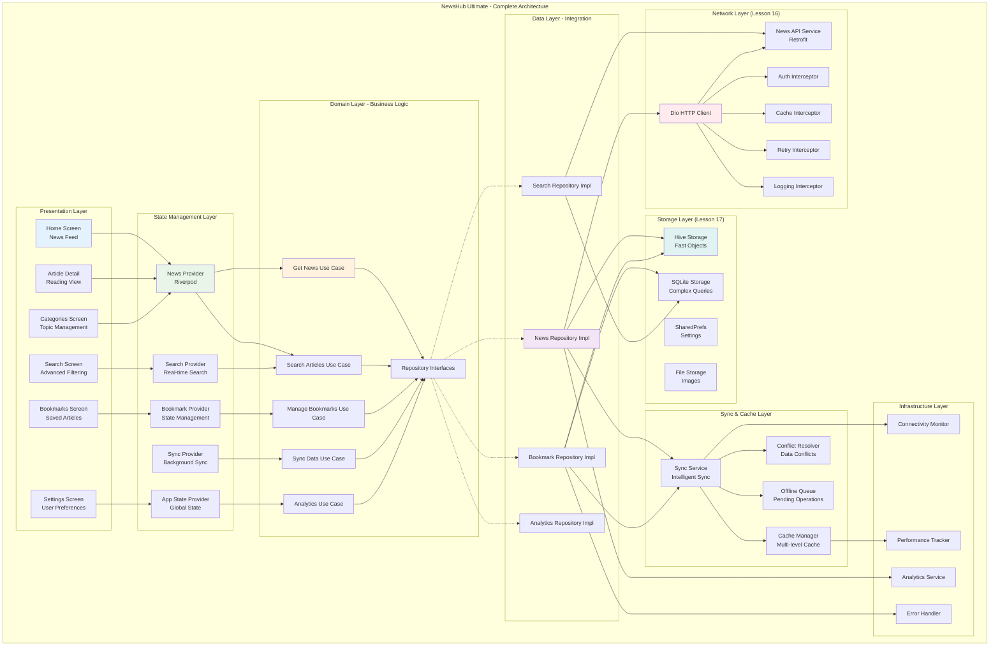
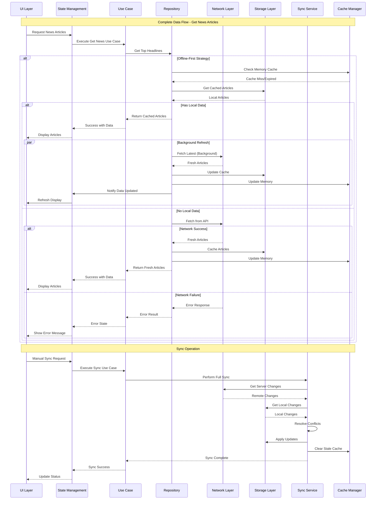
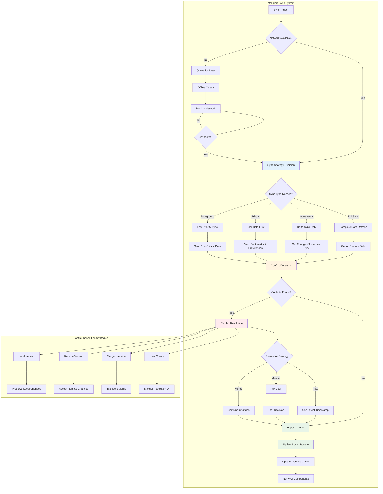
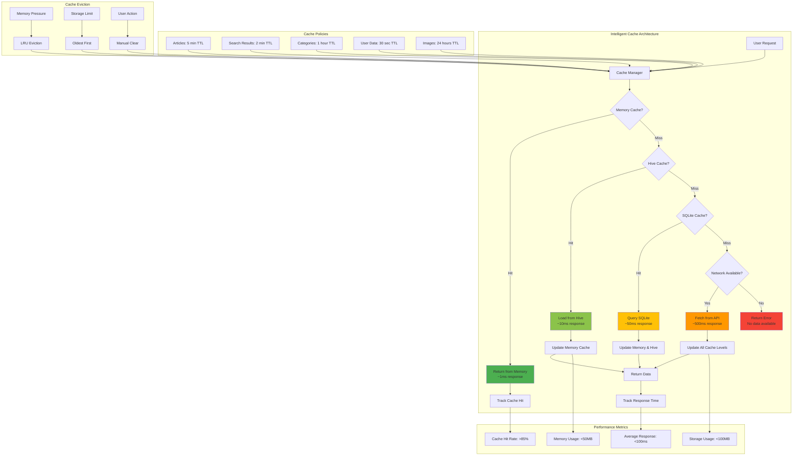
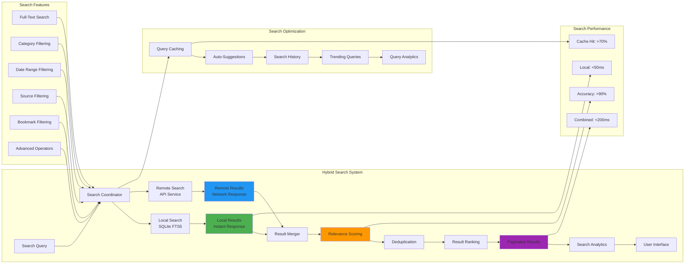
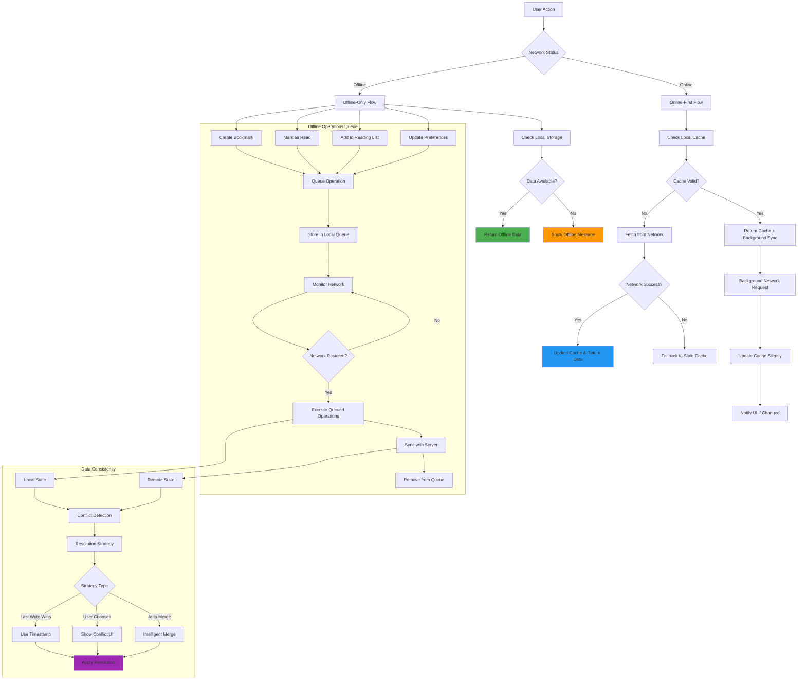
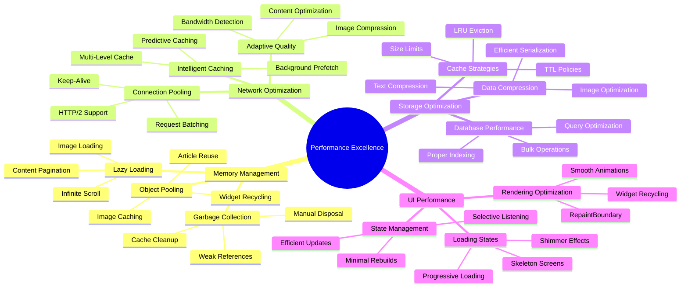
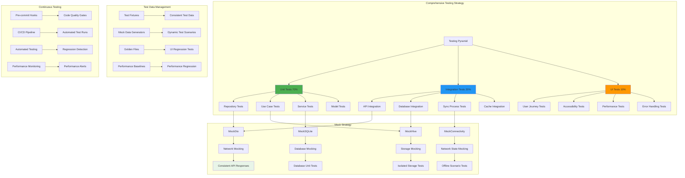
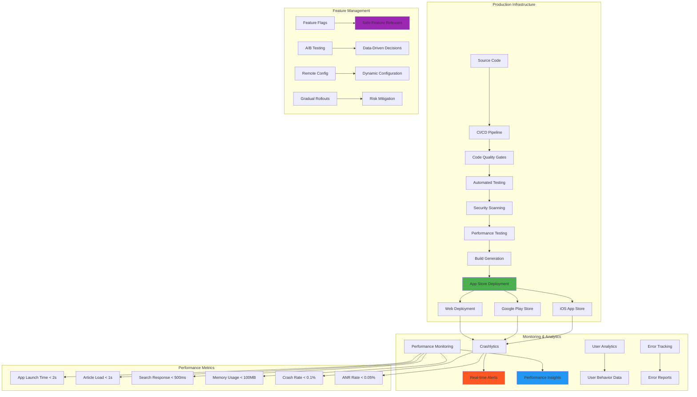
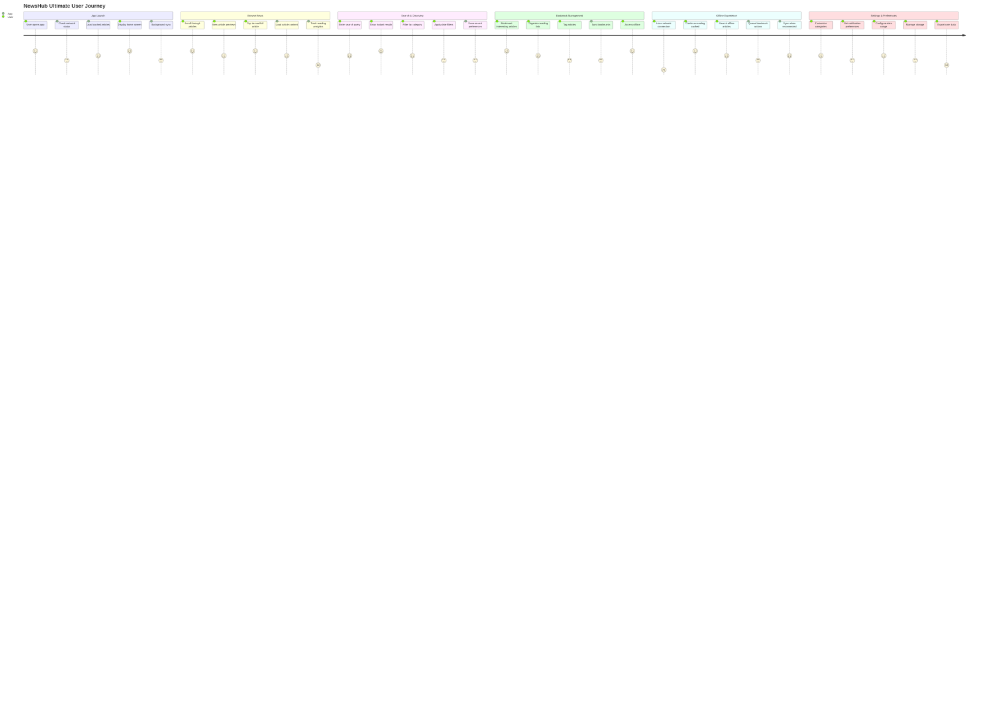

# 📜 Diagram for Lesson 18: Complete News App Project

## 📰 **Complete News App Project - Full-Stack Data Integration**

This lesson represents the culmination of Phase 4: Data & Storage, demonstrating how to build a production-ready news application that seamlessly integrates networking (Lesson 16) and local storage (Lesson 17) into a comprehensive, offline-first application with advanced features, intelligent synchronization, and professional architecture.

---

## **Complete Application Architecture**

---

## **Data Flow Integration Pattern**

---

## **Advanced Synchronization Architecture**

---

## **Multi-Level Caching Strategy**

---

## **Search Integration Architecture**

---

## **Offline-First Implementation**

---

## **Performance Optimization Framework**

---

## **Testing Architecture Overview**

---

## **Production Deployment Architecture**

---

## **NewsHub Ultimate User Experience Flow**

---

## **Real-World Implementation Benefits**

### **🌐 Complete Data Integration Excellence**
- **Seamless Layer Integration**: Perfect combination of networking (Dio/Retrofit) and storage (Hive/SQLite) systems
- **Offline-First Architecture**: Applications that work flawlessly without internet connectivity
- **Intelligent Synchronization**: Advanced conflict resolution and background sync strategies
- **Performance Optimization**: Sub-second response times with multi-level caching

### **🏗️ Production-Ready Architecture**
- **Clean Architecture**: Complete separation of concerns across all application layers
- **Scalable Design**: Patterns that support application growth and team collaboration
- **Error Resilience**: Comprehensive error handling with graceful degradation
- **Security Implementation**: Production-grade security features and data protection

### **📱 Advanced Feature Implementation**
- **Comprehensive Search**: Full-text search with highlighting and advanced filtering
- **Smart Bookmarks**: Intelligent organization with tags, reading lists, and analytics
- **Personalization**: User preferences, recommendations, and customization
- **Analytics Integration**: Usage tracking, performance monitoring, and insights

### **🧪 Testing and Quality Excellence**
- **Comprehensive Test Coverage**: Unit, integration, and UI tests across all layers
- **Mock Implementation**: Complete mock services for isolated testing
- **Performance Testing**: Benchmarking and optimization validation
- **Continuous Integration**: Automated testing and quality gates

### **⚡ Performance and Scalability**
- **Optimized Data Operations**: Efficient CRUD operations with intelligent caching
- **Memory Management**: Lazy loading, object pooling, and automatic cleanup
- **Network Optimization**: Adaptive quality, connection pooling, and request batching
- **Storage Efficiency**: Proper indexing, query optimization, and data compression

### **🔒 Security and Reliability**
- **Data Protection**: Encrypted storage, secure API communication, and privacy compliance
- **Error Recovery**: Robust error handling with automatic recovery mechanisms
- **Offline Resilience**: Graceful handling of connectivity issues with queue management
- **Data Integrity**: Conflict resolution and consistency guarantees

### **📊 Professional Development Practices**
- **Clean Code**: Well-organized, maintainable, and documented codebase
- **Architectural Patterns**: Industry-standard patterns and best practices
- **Performance Monitoring**: Real-time tracking and optimization
- **Deployment Ready**: Production-ready configuration and monitoring

**This comprehensive news application represents the pinnacle of Flutter data integration, demonstrating how professional applications handle complex data requirements with sophisticated architecture, intelligent caching, seamless offline capabilities, and exceptional user experience! 📰✨🔥**