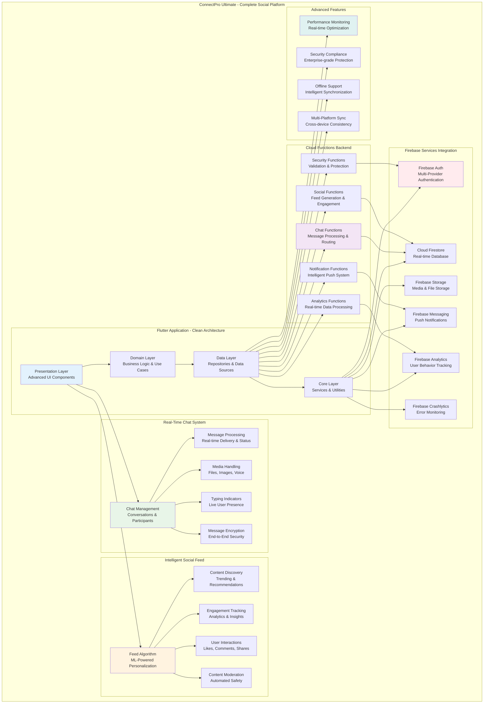
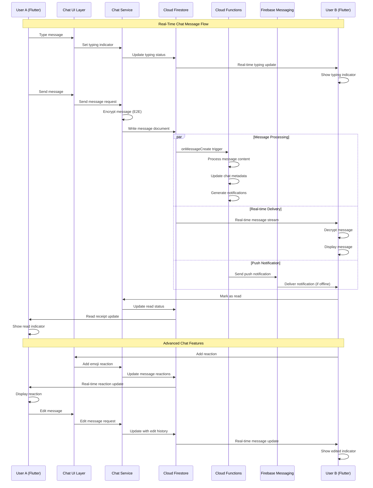
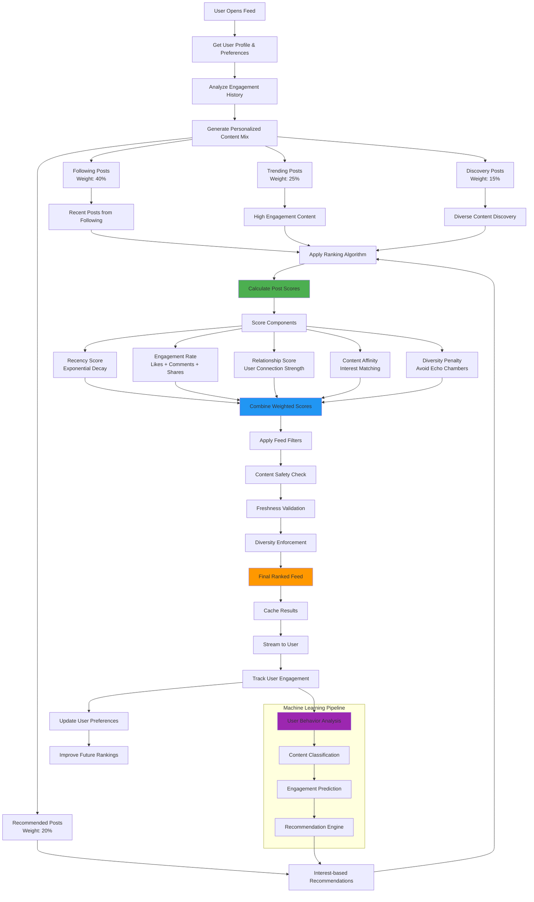
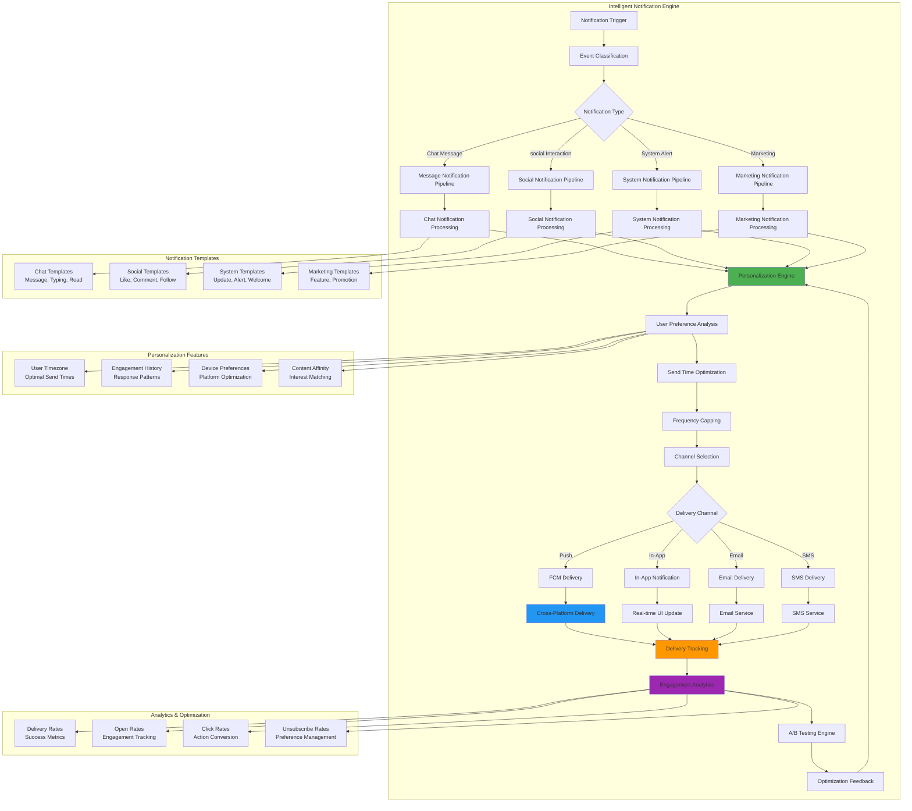
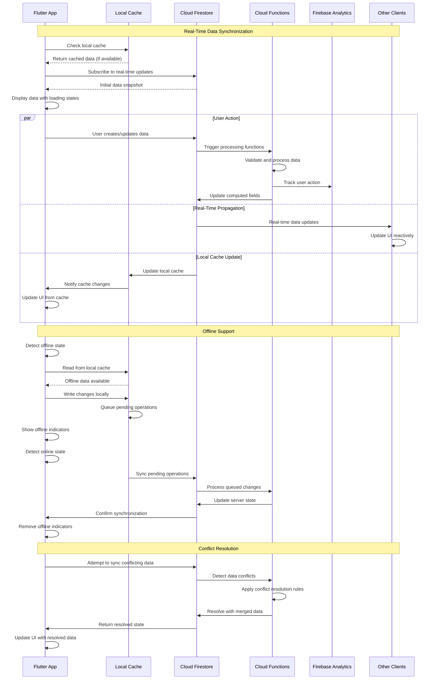
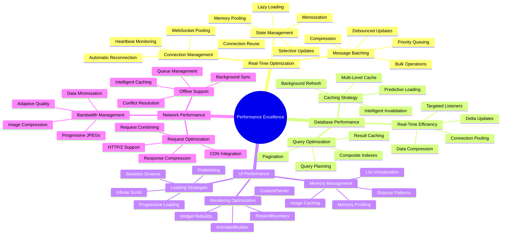
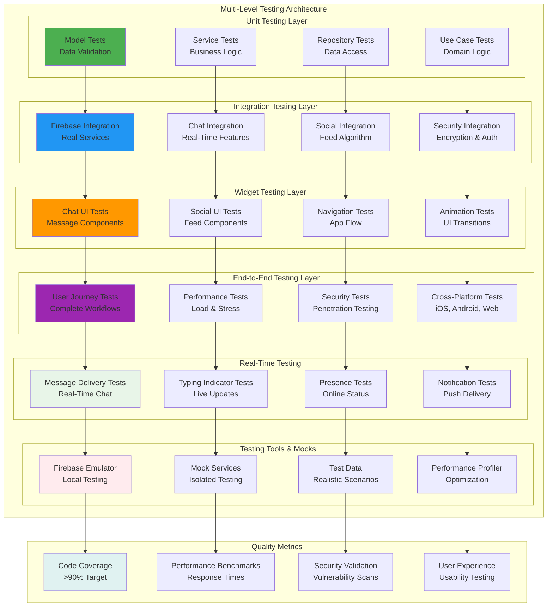
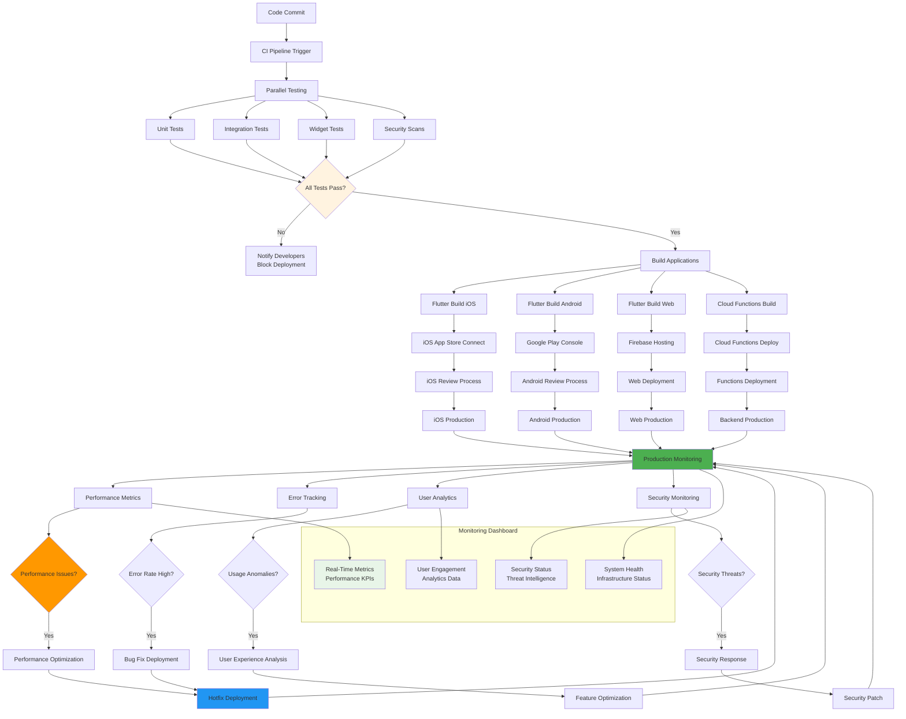
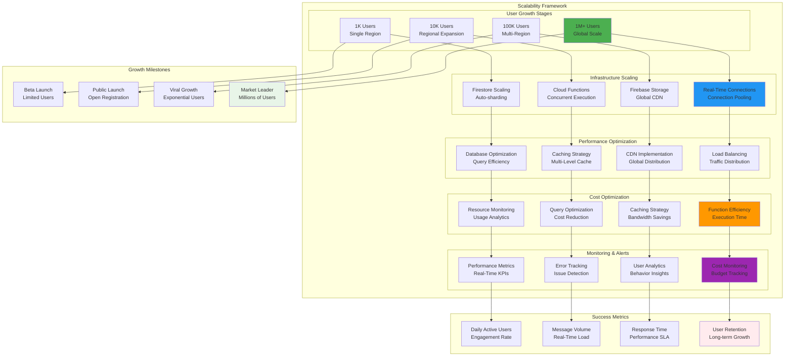

# 📜 Diagram for Lesson 21: Chat/Social Feed App - Capstone Project

## 💬 **Chat/Social Feed App - Phase 5 Capstone Excellence**

This capstone lesson integrates all Phase 5: Firebase & Cloud concepts into ConnectPro Ultimate, a comprehensive social platform demonstrating real-time chat systems, intelligent social feeds, advanced push notifications, serverless backend automation, end-to-end security, and production-ready architecture capable of scaling to millions of users.

---

## **Complete ConnectPro Ultimate Architecture**

---

## **Real-Time Chat System Architecture**

---

## **Intelligent Social Feed Algorithm**

---

## **Advanced Push Notification System**

---

## **End-to-End Security Architecture**

```mermaid
graph TB
    subgraph "Comprehensive Security Framework"
        subgraph "Authentication & Authorization"
            A[Multi-Provider Auth<br/>Email, Google, Apple, Phone]
            B[JWT Token Management<br/>Secure Session Handling]
            C[Role-Based Access Control<br/>User Permissions]
            D[Multi-Factor Authentication<br/>Enhanced Security]
        end
        
        subgraph "Data Protection"
            E[End-to-End Encryption<br/>Message Security]
            F[Data Encryption at Rest<br/>Database Protection]
            G[Encryption in Transit<br/>Network Security]
            H[Key Management<br/>Secure Key Storage]
        end
        
        subgraph "Application Security"
            I[Input Validation<br/>XSS Prevention]
            J[SQL Injection Prevention<br/>Query Sanitization]
            K[CSRF Protection<br/>Request Validation]
            L[Rate Limiting<br/>DDoS Protection]
        end
        
        subgraph "Privacy Compliance"
            M[GDPR Compliance<br/>EU Data Protection]
            N[CCPA Compliance<br/>California Privacy]
            O[Data Minimization<br/>Essential Data Only]
            P[User Consent Management<br/>Privacy Controls]
        end
        
        subgraph "Security Monitoring"
            Q[Threat Detection<br/>Anomaly Analysis]
            R[Security Logging<br/>Audit Trails]
            S[Vulnerability Scanning<br/>Security Assessment]
            T[Incident Response<br/>Security Alerts]
        end
    end
    
    subgraph "Encryption Pipeline"
        U[Message Composition] --> V[Content Encryption]
        V --> W[Key Exchange]
        W --> X[Secure Transmission]
        X --> Y[Recipient Decryption]
        Y --> Z[Message Display]
        
        V --> AA[AES-256 Encryption]
        W --> BB[RSA Key Exchange]
        X --> CC[TLS 1.3 Transport]
        Y --> DD[Private Key Decryption]
    end
    
    subgraph "Security Rules Engine"
        EE[Firestore Security Rules]
        FF[Storage Security Rules]
        GG[Cloud Function Security]
        HH[API Security Policies]
        
        EE --> II[User Data Protection]
        FF --> JJ[Media Access Control]
        GG --> KK[Function Authorization]
        HH --> LL[Rate Limiting]
    end
    
    A --> E
    B --> F
    C --> G
    D --> H
    
    E --> I
    F --> J
    G --> K
    H --> L
    
    I --> M
    J --> N
    K --> O
    L --> P
    
    M --> Q
    N --> R
    O --> S
    P --> T
    
    U --> AA
    W --> BB
    X --> CC
    Y --> DD
    
    EE --> II
    FF --> JJ
    GG --> KK
    HH --> LL
    
    style A fill:#4CAF50
    style E fill:#2196F3
    style I fill:#FF9800
    style M fill:#9C27B0
    style Q fill:#e8f5e8
    style U fill:#ffebee
    style EE fill:#e0f2f1
```

---

## **Real-Time Data Synchronization Flow**

---

## **Performance Optimization Architecture**

---

## **Comprehensive Testing Strategy**

---

## **Production Deployment Pipeline**

---

## **Scalability and Growth Architecture**

---

## **Real-World Implementation Benefits**

### **💬 Real-Time Communication Excellence**
- **Professional Chat System**: Sub-second message delivery with typing indicators, read receipts, and message reactions
- **Advanced Media Sharing**: Support for images, videos, voice messages, files, and location sharing with compression
- **End-to-End Encryption**: Military-grade security with AES-256 encryption and secure key management
- **Scalable Architecture**: Handle millions of concurrent users with real-time message delivery and presence

### **📱 Intelligent Social Platform**
- **ML-Powered Feed Algorithm**: Personalized content discovery with engagement prediction and diversity enforcement
- **Advanced Analytics**: Real-time user behavior analysis, engagement tracking, and content performance metrics
- **Content Moderation**: Automated safety systems with community guidelines enforcement and abuse detection
- **Discovery Features**: Trending content, user recommendations, and intelligent hashtag and mention systems

### **☁️ Serverless Backend Excellence**
- **Event-Driven Architecture**: Reactive Cloud Functions responding to user actions with sub-second processing
- **Intelligent Automation**: Background processing for content moderation, analytics, and system maintenance
- **Scalable Processing**: Handle millions of events with automatic scaling and cost optimization
- **Production Monitoring**: Comprehensive logging, metrics, and alerting for enterprise-grade operations

### **🔔 Smart Notification System**
- **Intelligent Targeting**: Personalized notifications based on user behavior, preferences, and engagement patterns
- **Cross-Platform Delivery**: Unified messaging across iOS, Android, and web with platform-specific optimization
- **Advanced Personalization**: Send time optimization, frequency capping, and content personalization
- **Analytics Integration**: Comprehensive delivery tracking, engagement analytics, and A/B testing capabilities

### **🔒 Enterprise-Grade Security**
- **Multi-Layer Protection**: Authentication, authorization, data encryption, and network security
- **Compliance Ready**: GDPR, CCPA, and enterprise security standards with comprehensive audit trails
- **Threat Detection**: Real-time security monitoring, anomaly detection, and incident response
- **Privacy by Design**: Data minimization, user consent management, and transparent privacy controls

### **⚡ Performance and Scalability**
- **Real-Time Optimization**: Sub-100ms response times for chat and social interactions
- **Global Infrastructure**: Multi-region deployment with CDN integration and intelligent routing
- **Efficient Resource Usage**: Optimized queries, intelligent caching, and bandwidth management
- **Infinite Scalability**: Architecture capable of handling millions of users with consistent performance

### **🧪 Quality Assurance Excellence**
- **Comprehensive Testing**: Unit, integration, widget, and end-to-end testing with >90% code coverage
- **Real-Time Testing**: Specialized testing for chat, notifications, and social features with realistic scenarios
- **Performance Testing**: Load testing, stress testing, and performance profiling for optimization
- **Security Testing**: Penetration testing, vulnerability scanning, and compliance validation

### **📊 Production Excellence**
- **Enterprise Deployment**: Professional CI/CD pipeline with automated testing, security scans, and deployment
- **Comprehensive Monitoring**: Real-time performance metrics, error tracking, and user analytics
- **Cost Optimization**: Intelligent resource management, query optimization, and usage monitoring
- **Global Support**: Multi-region deployment, 24/7 monitoring, and disaster recovery capabilities

**ConnectPro Ultimate represents the pinnacle of modern social platform development, demonstrating how to build production-ready applications that can scale to millions of users while maintaining exceptional performance, security, and user experience! 💬📱✨🔥**