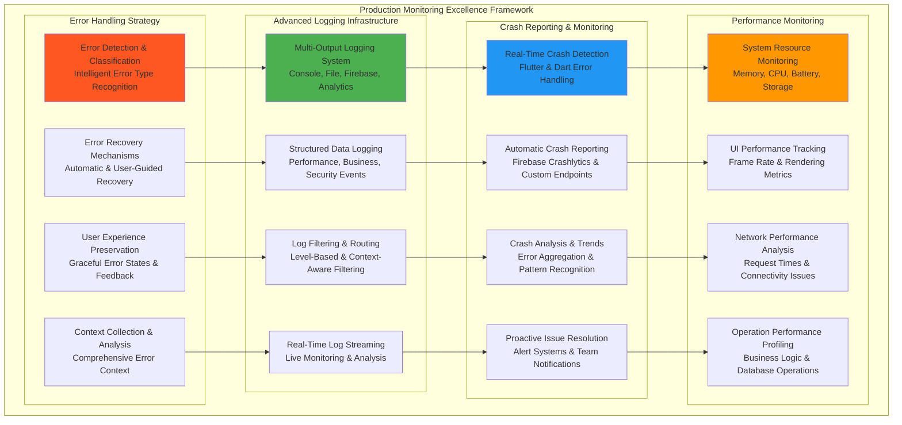
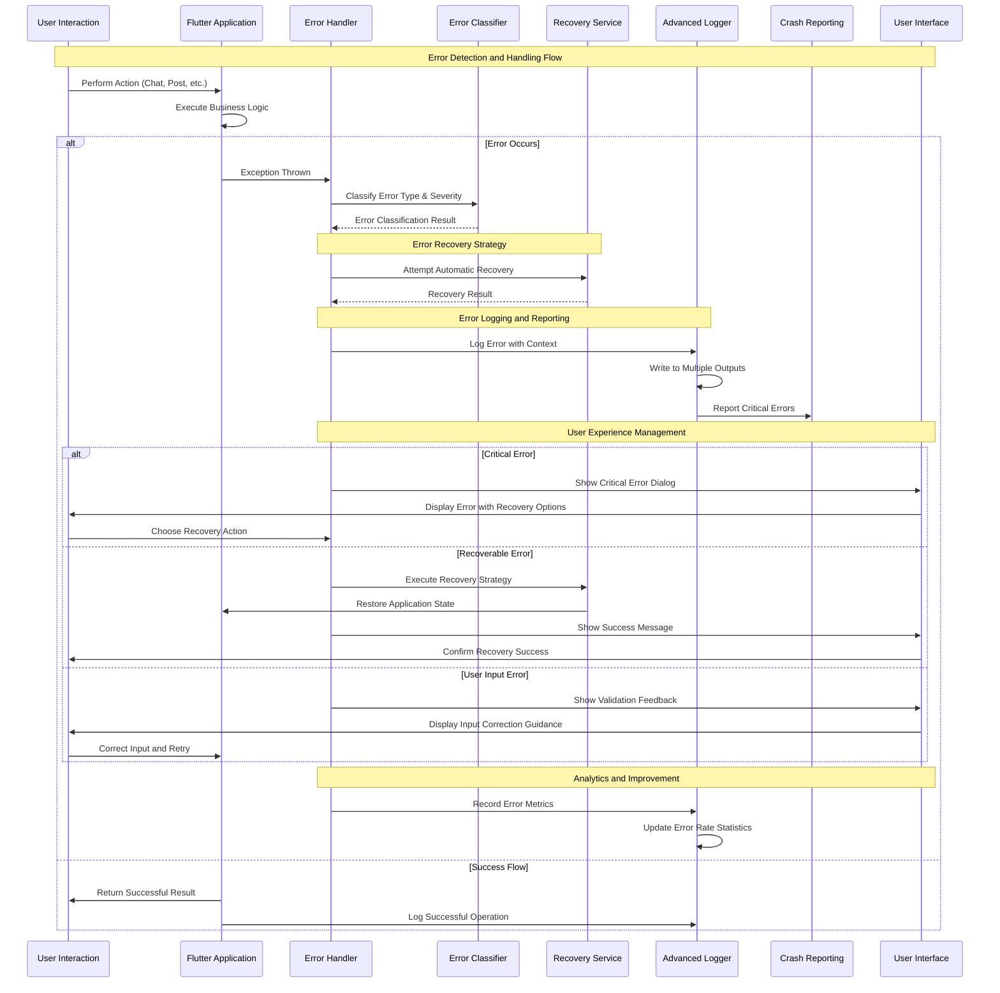
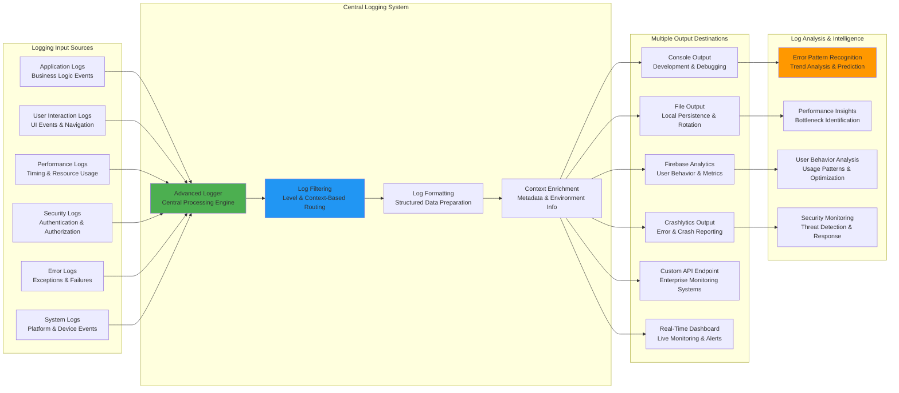
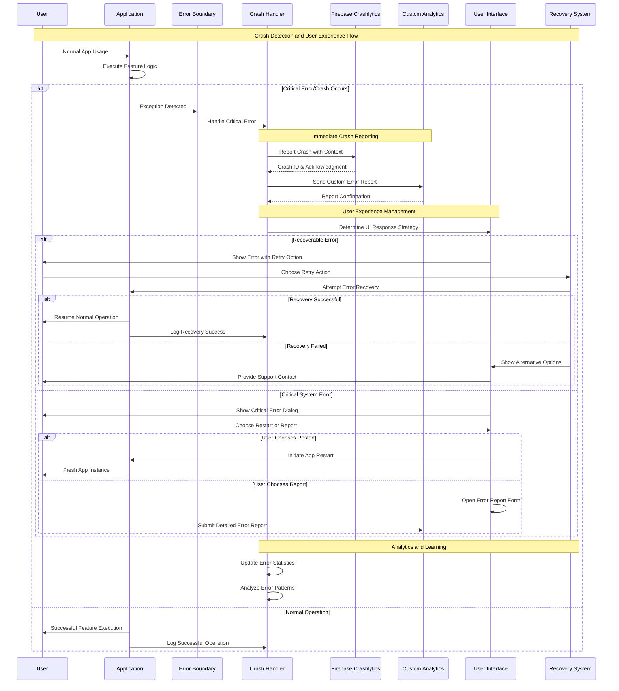
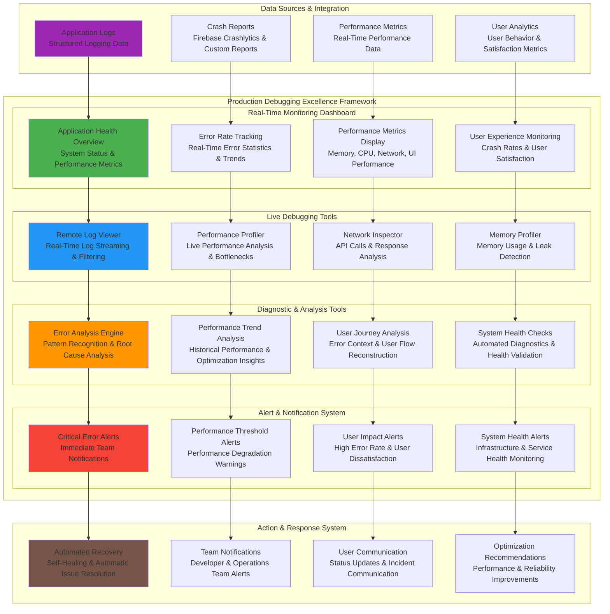
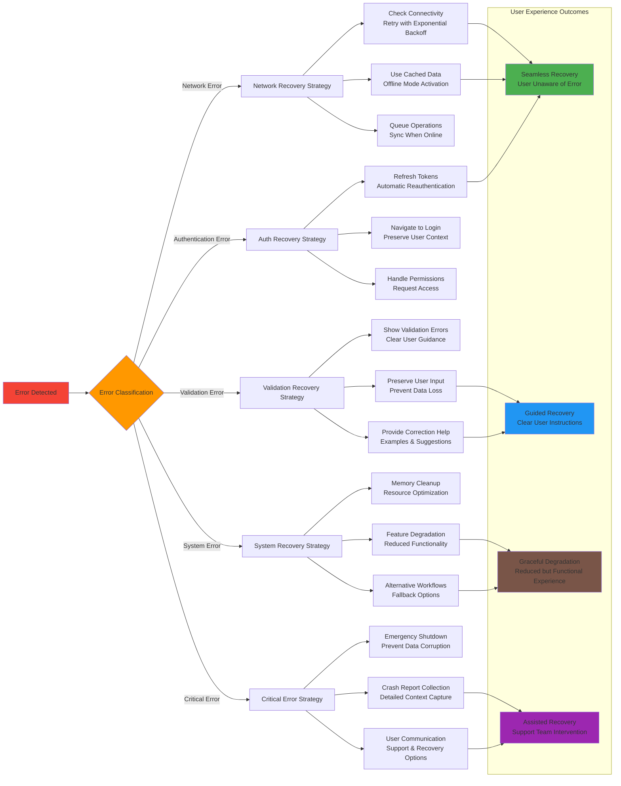
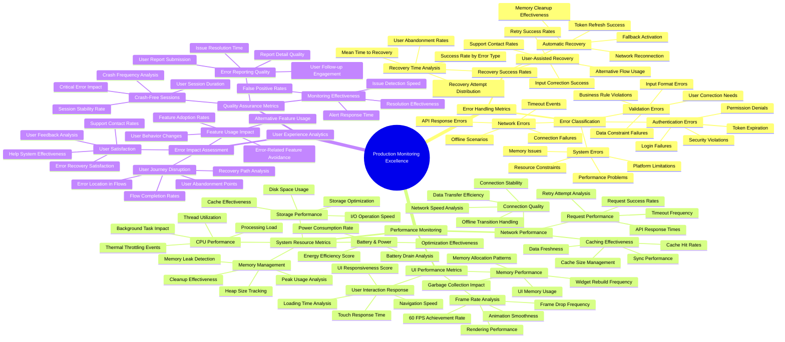

# 📜 Diagram for Lesson 24: Error Handling & Logging

## 📊 **Error Handling & Logging - Production Monitoring Excellence**

This lesson advances Phase 6 Production Ready development by establishing comprehensive production monitoring, error handling excellence, and reliability engineering for ConnectPro Ultimate. Students master enterprise-grade error handling strategies, advanced logging frameworks, crash reporting systems, performance monitoring, and production debugging techniques that ensure bulletproof application reliability at scale.

---

## **Complete Production Monitoring Architecture Overview**

---

## **Error Handling Flow and Recovery Strategy**

---

## **Advanced Logging Infrastructure and Output Strategy**

---

## **Performance Monitoring and Resource Tracking**

```mermaid
flowchart TD
    A[Performance Monitoring System] --> B[UI Performance Tracking]
    A --> C[System Resource Monitoring]
    A --> D[Network Performance Analysis]
    A --> E[Operation Performance Profiling]
    
    B --> B1[Frame Rate Monitoring<br/>60 FPS Target Validation]
    B --> B2[Rendering Performance<br/>Build & Raster Time Tracking]
    B --> B3[Animation Smoothness<br/>Physics & Transition Analysis]
    B --> B4[UI Responsiveness<br/>Touch Response & Lag Detection]
    
    C --> C1[Memory Usage Tracking<br/>Heap Size & Leak Detection]
    C --> C2[CPU Usage Monitoring<br/>Process Load & Thread Analysis]
    C --> C3[Battery Consumption<br/>Power Usage & Optimization]
    C --> C4[Storage Utilization<br/>Disk Space & I/O Performance]
    
    D --> D1[Request Performance<br/>API Response Time Analysis]
    D --> D2[Connection Quality<br/>Network Speed & Stability]
    D --> D3[Data Transfer Efficiency<br/>Bandwidth Usage & Compression]
    D --> D4[Offline Capability<br/>Sync Performance & Queue Management]
    
    E --> E1[Database Operations<br/>Query Performance & Optimization]
    E --> E2[Business Logic Timing<br/>Algorithm Efficiency & Bottlenecks]
    E --> E3[File Operations<br/>Read/Write Performance & Caching]
    E --> E4[Background Tasks<br/>Concurrent Processing & Scheduling]
    
    subgraph "Performance Thresholds & Alerts"
        F[Frame Rate Alerts<br/>< 60 FPS Warning]
        G[Memory Alerts<br/>> 200MB Usage Warning]
        H[Response Time Alerts<br/>> 2s Request Warning]
        I[Battery Alerts<br/>High Consumption Warning]
    end
    
    subgraph "Performance Optimization Recommendations"
        J[UI Optimization<br/>Widget Rebuild Reduction]
        K[Memory Optimization<br/>Garbage Collection & Cleanup]
        L[Network Optimization<br/>Caching & Request Batching]
        M[Algorithm Optimization<br/>Complexity Reduction & Parallelization]
    end
    
    B1 --> F
    C1 --> G
    D1 --> H
    C3 --> I
    
    F --> J
    G --> K
    H --> L
    I --> M
    
    style A fill:#FF9800
    style B fill:#4CAF50
    style C fill:#2196F3
    style D fill:#9C27B0
    style E fill:#795548
    style F fill:#f44336
    style J fill:#8BC34A
```

---

## **Crash Reporting and User Experience Management**

---

## **Production Debugging and Monitoring Dashboard Architecture**

---

## **Error Recovery and User Experience Flow**

---

## **Comprehensive Monitoring Metrics and Analytics**

---

## **Error Handling Best Practices and Professional Standards**

### **🚨 Production Error Handling Excellence**
- **Intelligent Error Classification**: Comprehensive error type recognition with severity assessment, recovery possibility analysis, and user impact evaluation
- **Automatic Recovery Mechanisms**: Smart recovery strategies including network retry with exponential backoff, authentication token refresh, resource optimization, and fallback activation
- **User Experience Preservation**: Graceful error states with clear user guidance, context preservation during errors, and seamless recovery transitions
- **Comprehensive Context Collection**: Detailed error context including user actions, system state, performance metrics, and environmental factors

### **📋 Advanced Logging Excellence**
- **Multi-Output Logging Infrastructure**: Simultaneous logging to console (development), files (persistence), Firebase Analytics (user behavior), and Crashlytics (error reporting)
- **Structured Data Logging**: Organized logging with consistent formats, metadata enrichment, contextual information, and searchable data structures
- **Performance-Aware Logging**: Optimized logging performance with intelligent filtering, batching strategies, and minimal application impact
- **Real-Time Log Analysis**: Live log streaming, pattern recognition, trend analysis, and proactive issue identification

### **💥 Crash Reporting Excellence**
- **Comprehensive Crash Detection**: Complete Flutter and Dart error handling with automatic crash detection, context capture, and immediate reporting
- **Multi-Platform Reporting**: Integration with Firebase Crashlytics, custom analytics endpoints, and enterprise monitoring systems
- **Crash Analysis and Trends**: Error pattern recognition, trend analysis, root cause identification, and prevention strategies
- **Proactive Issue Resolution**: Real-time alerting, team notifications, automated recovery, and user communication systems

### **📊 Performance Monitoring Excellence**
- **Real-Time Performance Tracking**: Continuous monitoring of frame rates, memory usage, CPU performance, network speed, and user interaction responsiveness
- **Resource Optimization**: Intelligent resource management with memory cleanup, performance optimization, feature degradation, and efficiency improvements
- **Performance Threshold Management**: Automated alerts for performance degradation, resource limits, user experience impact, and system health issues
- **Optimization Recommendations**: Data-driven performance insights, bottleneck identification, improvement strategies, and optimization guidance

### **🔧 Production Debugging Excellence**
- **Remote Debugging Capabilities**: Live application monitoring, real-time log viewing, performance profiling, and system diagnostics without device access
- **Comprehensive Monitoring Dashboard**: Real-time system health, error rates, performance metrics, user experience tracking, and team collaboration tools
- **Intelligent Issue Detection**: Automated pattern recognition, anomaly detection, trend analysis, and predictive issue identification
- **Actionable Insights**: Performance optimization recommendations, error prevention strategies, user experience improvements, and system health enhancements

**Error Handling & Logging for ConnectPro Ultimate demonstrates how to implement enterprise-grade production monitoring with intelligent error handling, advanced logging infrastructure, comprehensive crash reporting, real-time performance monitoring, and professional debugging capabilities that ensure bulletproof application reliability and exceptional user experience at production scale! 📊📱✨🚀**